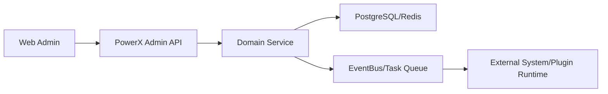
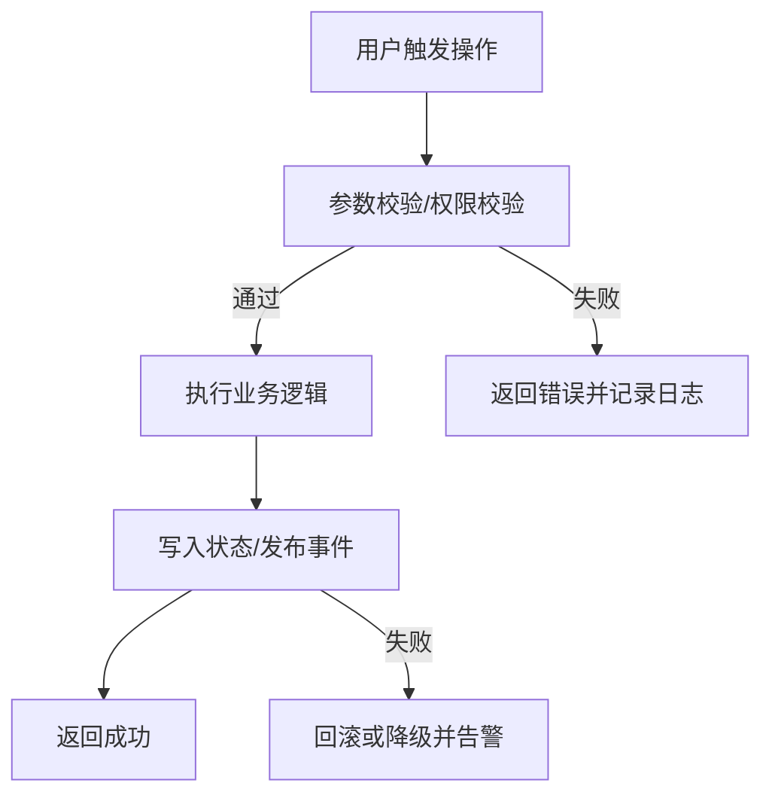
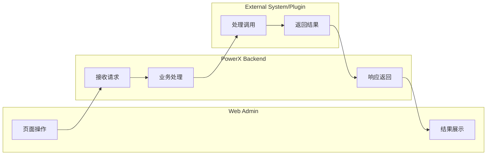

# <功能名称> 使用指导（版本：<vX.Y>）

## 1. 功能背景与目标

### 1.1 为什么要做
- 业务背景：
- 当前痛点：
- 目标收益：

### 1.2 本文解决什么问题
- 面向角色：平台管理员 / 运维 / 研发 / QA / 项目负责人
- 本文范围：
- 非本文范围：

## 2. 模块关系（全局视角）



- 前端模块：
- 后端模块：
- 外部依赖：
- 与其他功能关系：

## 3. 主流程（含失败分支）



## 4. 跨角色泳道图（页面↔后端↔外部系统）



## 5. 前置条件与依赖

### 5.1 配置
- 关键配置项（`.env` / 配置文件）：
- Feature Flag：
- 配置优先级说明：

### 5.2 权限与数据
- 角色与 RBAC 要求：
- 初始数据准备：
- 外部依赖可用性：

## 6. 操作步骤（可执行）

### 场景 A：页面操作（Web Admin）
1. 动作：
   - 入口：
   - 预期结果：
   - 失败处理：

### 场景 B：接口调用（Admin/Tenant API）
1. 调用命令：
```bash
curl -X POST http://127.0.0.1:8080/api/v1/admin/<path> \
  -H 'Authorization: Bearer <token>' \
  -H 'Content-Type: application/json' \
  -d '{}'
```
2. 预期响应：
3. 失败处理：

### 场景 C：本地联调（backend/web-admin）
1. 启动命令：
```bash
make dev
```
2. 验证命令：
```bash
curl -s http://127.0.0.1:2112/metrics | rg '<metric_name>'
```
3. 日志定位：
```bash
rg '<trace_id|keyword>' backend -n
```

## 7. 预期结果与验收标准

- [ ] 主链路成功。
- [ ] 至少 1 条失败分支验证通过。
- [ ] 日志/指标/trace 可观测。
- [ ] 页面行为与接口结果一致。

## 8. 代码实现映射（必须）

| 文档步骤 | 代码位置 | 说明 |
|---|---|---|
| 路由入口 | `backend/internal/transport/http/...` | 路由注册与中间件 |
| Handler | `backend/internal/transport/http/.../handler.go` | 参数校验与响应 |
| Service | `backend/internal/service/...` | 核心业务逻辑 |
| 配置 | `backend/internal/config/...` | 开关/默认值/优先级 |
| 测试 | `backend/tests/...` | 单测/集成验证 |

## 9. 常见问题与排障

### Q1：<问题>
- 现象：
- 排查命令：
- 修复建议：

### Q2：<问题>
- 现象：
- 排查命令：
- 修复建议：

## 10. 回滚与风险控制

- 回滚开关：
- 回滚步骤：
- 风险提示：

## 11. 变更记录

- 日期：
- 修改人：
- 变更内容：
