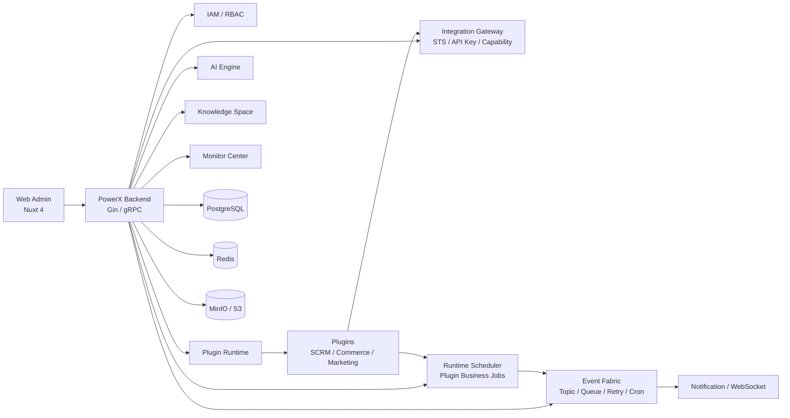

# PowerX

[](./README.md)
[](https://powerx-doc.artisan-cloud.com)
[](https://go.dev/)
[](https://nuxt.com/)

PowerX is an **AgentOS foundation for enterprise AI applications and plugin ecosystems**. It brings IAM, plugin runtime, integration gateway, event fabric, runtime scheduler, AI engine, knowledge space, notifications, and operational monitoring into one extensible core, so SCRM, e-commerce, marketing automation, and other business modules can be connected as plugins and assisted by agents.

> In short: PowerX is not a single business application. It is the runtime foundation for enterprise plugins and AI agents.

---

## Product Preview

### Admin Console

PowerX Admin Console provides a unified surface for system overview, plugin operations, AI settings, event monitoring, and platform capabilities.


### Plugin Marketplace

Plugins can be packaged, installed, enabled, disabled, and upgraded independently. The core platform manages runtime, health checks, proxy routing, permissions, and operational records.


### Agent Workspace

The agent workspace is designed for scenario-based consultation, planning, configuration assistance, and conversation history. It connects gradually with model settings, notifications, permissions, and plugin capabilities.


### Platform Capabilities

PowerX centralizes model configuration, event monitoring, and plugin capability registration in the same admin surface for plugin development, operations, and permission governance.

| AI Settings | Event Monitoring |
| --- | --- |
|  |  |

| Plugin Capability Registry |
| --- |
|  |

---

## What PowerX Solves

Enterprise teams often run CRM/SCRM, commerce, marketing, customer service, workflow, analytics, and AI assistant systems side by side. Common problems include fragmented identity, duplicated permissions, ungoverned plugins, scattered AI capabilities, and unobservable async tasks or events.

PowerX consolidates these shared capabilities into the core platform:

- **Unified identity and tenant context**: plugins share IAM, member, tenant, and permission context.
- **Unified plugin runtime**: plugins can be developed, installed, enabled, health-checked, upgraded, and disabled independently.
- **Unified gateway and authentication**: STS, API Key, and Capability Registry define the call boundary between plugins and the host.
- **Unified events and scheduling**: Event Fabric handles platform events and queues; Runtime Scheduler handles plugin business jobs.
- **Unified AI entry point**: model providers, AI Engine, Knowledge Space, and agent workspace are managed in one admin console.
- **Unified observability**: logs, traces, jobs, notifications, backups, and runtime records are available from Monitor Center.

PowerX is suitable when you need to:

- Split existing CRM/SCRM, commerce, marketing, content, crawler, or automation systems into governed plugins.
- Share login, tenants, members, permissions, menus, and audit records across business plugins.
- Let plugins call host capabilities through a gateway instead of reading host databases directly.
- Connect plugins through events, notifications, scheduled jobs, and traceable runtime records.
- Manage model providers, agent sessions, capability registry, and runtime monitoring from one console.

---

## Default Plugin Ecosystem

PowerX starts from enterprise growth and transaction scenarios:

| Plugin Area | Positioning | Availability |
| --- | --- | --- |
| **SCRM Plugin** | Customers, conversations, social touchpoints, follow-up, and collaboration | Open-source repository version |
| **E-commerce Plugin** | Products, orders, transactions, fulfillment, and after-sales foundation | Open-source repository version |
| **Marketing Tools Plugin** | Marketing automation, campaign orchestration, outreach, and conversion tools | Commercial version; licensing and pricing are subject to release notes |

Business plugins should not reimplement IAM, permissions, scheduling, notifications, gateway access, or audit. They should use PowerXPlugin Framework to call host capabilities and keep business logic inside their own domain.

Recommended boundaries:

- **PowerX Core owns** IAM, RBAC, plugin runtime, Gateway, Event Fabric, Runtime Scheduler, notifications, audit, and monitoring.
- **Plugins own** domain models, business rules, page experience, external integrations, and plugin-owned database tables.
- **PowerXPlugin Framework owns** authentication, gateway, scheduler, event, and frontend bridge abstractions across local, host, and proxy modes.

---

## Capability Map

| Capability | Status | Notes |
| --- | --- | --- |
| IAM and multi-tenant context | Ready | Users, members, tenants, Root/Admin context shared by core and plugins |
| RBAC and menu permissions | Ready | Admin permissions, menu permissions, plugin resource/action authorization |
| Plugin runtime | Ready | Install, enable, health check, proxy routing, dynamic pages, runtime logs |
| Plugin release governance | Beta | Offline packages, version switching, release guards, compatibility and security baseline |
| Integration Gateway | Ready | API Key / STS auth, Capability Registry, invocation trace, plugin capability routing |
| Event Fabric | Ready | Topics, subscriptions, queues, cron operations jobs, retry/DLQ, authorization challenge |
| Runtime Scheduler | Ready | Persistent runtime/plugin jobs with once / interval / cron, pause/resume/trigger, run records |
| Notification and WebSocket | Ready | System notifications, WS topic subscription, realtime push, debug notification flow |
| AI Engine | Beta | Model providers, connection tests, LLM invocation entry point, AI settings |
| Knowledge Space | Beta | Document ingestion, OCR, embedding, retrieval, feedback, and validation guides |
| Agent Workspace | Beta | Agent conversations, session history, model parameters, dual-channel connection, workspace UI |
| Agent lifecycle and observability | Beta | Agent registry, health score, trends, alerts, and retention policy |
| Monitor Center | Ready | Event Fabric cron, Runtime Scheduler, backups, logs/traces, and runtime records |
| Docker / systemd deployment | Beta | Docker, systemd, Nginx, Loki/Grafana, backup and migration guides |

---

## Architecture Overview



---

## Tech Stack

| Layer | Technology |
| --- | --- |
| Backend | Go 1.24, Gin, gRPC, GORM |
| Frontend | Nuxt 4, Vue 3, Pinia, Nuxt UI |
| Storage | PostgreSQL, Redis, MinIO/S3 |
| Protocols | REST, gRPC, WebSocket, MCP |
| Observability | Structured logs, audit, trace, Loki/Grafana guides |
| Plugin Framework | PowerXPlugin Framework, STS, API Key, Gateway Contract |

---

## Quick Start

> This repository contains PowerX Core. Full installation, deployment, and plugin integration should follow the official docs and the guides under `docs/`.

### Requirements

- Go 1.24+
- Node.js 20+
- PostgreSQL
- Redis
- Optional: MinIO/S3, Loki/Grafana

### Start Backend

```bash
make db-migrate
make db-seed
make dev
```

Default backend address:

```text
http://localhost:8077
```

### Start Web Admin

```bash
cd web-admin
npm install
npm run dev
```

Nuxt prints the actual admin URL in the terminal. A common local URL is:

```text
http://localhost:3000
```

### Common Checks

```bash
cd backend
go test ./internal/service/runtime_scheduler ./internal/transport/http/admin/scheduler

cd ../web-admin
npm run build
```

---

## Plugin Development

PowerX plugins should be developed with **PowerXPlugin Framework**. Key boundaries:

- Plugin frontend runs inside the host admin console and uses PowerX Bridge for theme, locale, and session context.
- Plugin backend receives short-lived STS tokens through the host proxy instead of consuming host user JWT directly.
- Plugin-to-host calls use Gateway Contract and choose STS or API Key according to the scenario.
- Plugin business scheduling goes through Framework Scheduler Facade and then Runtime Scheduler.
- Event Fabric Cron is for host operational jobs; plugin business schedules should use Runtime Scheduler.
- Plugins must not directly read or write PowerX IAM tables, and host mode should not rely on local in-memory timers.

Related docs:

- [Plugin Auth Token Model](docs/guides/auth/plugin_auth_token_model.md)
- [Gateway Contract](docs/guides/develop/gateway_contract.md)
- [API Key / Token Playbook](docs/guides/develop/api_key_token_playbook.md)
- [Plugin Release Runbook](docs/guides/plugin_release/application_runbook.md)
- [Runtime Scheduler Spec](specs/028-runtime-scheduler/spec.md)
- [Runtime Scheduler Quickstart](specs/028-runtime-scheduler/quickstart.md)

---

## Documentation

PowerX documentation is organized in three layers:

- **Official docs**: product, deployment, user guides, and complete explanations.
- **`docs/`**: development, operations, plugin integration, and troubleshooting.
- **`specs/`**: feature specifications, implementation plans, data models, and acceptance cases.

Common entry points:

- [PowerX Official Docs](https://powerx-doc.artisan-cloud.com)
- [Gateway Contract](docs/guides/develop/gateway_contract.md)
- [Plugin Auth Model](docs/guides/auth/plugin_auth_token_model.md)
- [Plugin Release and Installation](docs/guides/plugin_release/application_runbook.md)
- [Knowledge Space UI Guide](docs/guides/knowledge_space/ui_guide.md)
- [Knowledge Space Runbook](docs/guides/knowledge_space/runbook.md)
- [Deployment Plan](docs/plan/deploy/README.md)
- [Test Strategy](docs/guides/test/strategy.md)
- [Specs Index](specs/README.md)

---

## Repository Layout

```text
.
├── backend/        # Go backend, HTTP/gRPC, services, migrations, plugin runtime
├── web-admin/      # Nuxt 4 admin console
├── docs/           # Development, operations, plugin, and deployment guides
├── specs/          # Feature specs, plans, data models, task breakdowns
├── scripts/        # Validation, operations, and generation scripts
├── deploy/         # Deployment-related configs
├── config/         # Config examples and platform configs
└── make_files/     # Makefile subtasks
```

---

## Development Notes

- Backend features should follow service/repository/transport layering; handlers should not perform direct DB IO.
- New plugin capabilities must explicitly declare the auth mode: STS, API Key, or host session proxy.
- Plugin business schedules should use Runtime Scheduler, not Event Fabric Cron.
- Detailed feature docs belong in `docs/`; specs and acceptance cases belong in `specs/`; README stays at the entry level.
- Deprecated or incorrect paths should not be preserved for compatibility; required missing context should fail fast.

---

## Roadmap

### Available Now

- IAM / RBAC / menu permissions
- Plugin install, enable, health check, and proxy routing
- Integration Gateway and Capability Registry
- Event Fabric core flow
- Runtime Scheduler persistent jobs and run records
- WebSocket notifications and system notifications
- Monitor Center task and scheduler views

### In Progress

- Plugin release governance and Marketplace review flow
- Knowledge Space production hardening
- AI Engine provider coverage and observability
- Runtime Scheduler multi-instance claiming, delay metrics, and alerts
- Docker / systemd deployment package

---

## Contact

For business cooperation or community support, please scan the QR code below and add the official WeChat account.

When sending the friend request, include the product name, for example: "I am interested in PowerX".


---

## License

Licensing for PowerX Core and each plugin follows the corresponding repository license file or release notes. Different plugins may use different licensing models. SCRM and e-commerce plugins provide open-source repository versions; the marketing tools plugin is commercial, and its license/pricing model is subject to its plugin release notes.
