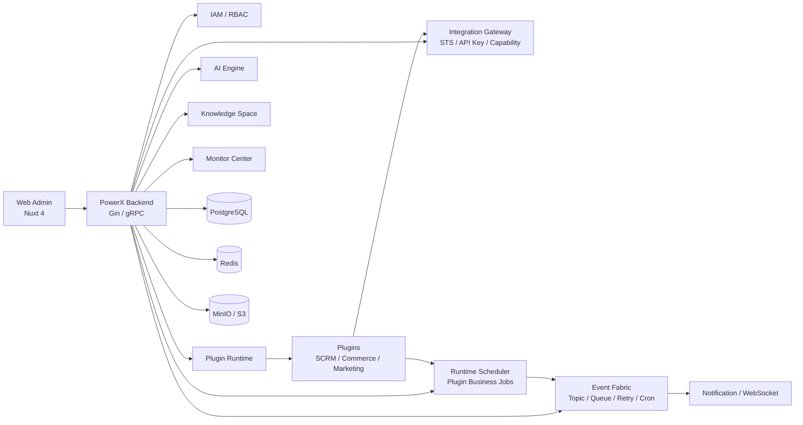

# PowerX

[](./README-en.md)
[](https://powerx-doc.artisan-cloud.com)
[](https://go.dev/)
[](https://nuxt.com/)

PowerX 是面向企业 AI 应用与插件生态的 **AgentOS 底座**。它把 IAM、插件运行时、集成网关、事件骨干、Runtime Scheduler、AI Engine、Knowledge Space、通知与运维监控放在同一个可扩展内核里，让 SCRM、电商、营销自动化等业务能力以插件和智能体的方式接入、运行和协作。

> 简单说：PowerX 不是单一业务系统，而是企业插件与 AI Agent 的运行底座。

---

## 产品预览

### 管理后台

PowerX 管理后台提供统一入口，用于查看系统概览、插件状态、AI 配置、事件运行情况与平台能力。


### 插件市场

插件可以独立打包、安装、启用、停用和升级。底座负责插件运行时、健康检查、代理路由、权限与运行记录。


### 智能体工作台

智能体工作台用于面向业务场景进行咨询、规划、配置辅助和会话沉淀。它与模型设置、通知、权限和插件能力逐步形成统一工作面。


### 平台能力

PowerX 将模型配置、事件监控、插件能力注册等底座能力集中到同一个管理端，方便插件开发、运维联调和权限治理。

| AI 设置 | 事件监控 |
| --- | --- |
|  |  |

| 插件能力注册 |
| --- |
|  |

---

## PowerX 解决什么问题

企业内部通常会同时存在 CRM/SCRM、电商、营销、客服、审批流、数据分析、AI 助手等系统。它们常见的问题是身份割裂、权限重复、插件无法统一治理、AI 能力难以沉淀、任务和事件链路不可观测。

PowerX 把这些共性能力收敛到底座：

- **统一身份与租户上下文**：插件共享 IAM、成员、租户、权限上下文。
- **统一插件运行时**：插件可以独立开发、安装、启用、健康检查、升级和下线。
- **统一网关与鉴权**：通过 STS、API Key、Capability Registry 管理插件与底座之间的调用边界。
- **统一事件与调度**：Event Fabric 负责底座事件和队列，Runtime Scheduler 负责插件业务调度任务。
- **统一 AI 能力入口**：模型 Provider、AI Engine、Knowledge Space、Agent 编排统一纳入管理后台。
- **统一运维观测**：日志、Trace、任务、通知、备份、运行记录集中在 Monitor Center。

PowerX 适合这些场景：

- 将已有 CRM/SCRM、电商、营销、内容、采集、自动化等系统拆成可治理插件。
- 为多个业务插件提供统一登录、租户、成员、权限、菜单和审计。
- 让插件通过网关调用底座能力，而不是直接读写底座数据库。
- 用事件、通知、调度任务和运行记录把插件之间的异步协作串起来。
- 在同一控制台管理模型供应商、智能体会话、能力注册和运行监控。

---

## 默认插件生态

PowerX 默认围绕企业增长与交易场景建设插件生态：

| 插件方向 | 定位 | 当前开放策略 |
| --- | --- | --- |
| **SCRM 插件** | 客户、会话、企微/社媒触点、跟进与运营协同 | 提供开源仓库版本 |
| **电商插件** | 商品、订单、交易、履约与售后业务基础能力 | 提供开源仓库版本 |
| **营销工具插件** | 营销自动化、触达编排、活动与转化工具 | 商用版本，授权与收费模式以正式发布说明为准 |

这些业务插件不应该重复实现 IAM、权限、调度、通知、网关和审计。它们通过 PowerXPlugin Framework 调用底座能力，把业务逻辑聚焦在自身领域。

插件边界建议保持清晰：

- **底座负责**：IAM、RBAC、插件运行时、Gateway、Event Fabric、Runtime Scheduler、通知、审计、监控。
- **插件负责**：领域模型、业务规则、页面体验、外部服务对接和插件自身数据表。
- **Framework 负责**：封装 local / host / proxy 场景下的鉴权、网关、调度、事件与前端桥接。

---

## 核心能力地图

| 能力 | 状态 | 说明 |
| --- | --- | --- |
| IAM 与多租户上下文 | Ready | 用户、成员、租户、Root/Admin 上下文，供底座与插件共享 |
| RBAC 与菜单权限 | Ready | 管理端权限、菜单、插件资源动作授权 |
| 插件运行时 | Ready | 插件安装、启用、健康检查、代理路由、动态页面、运行日志 |
| 插件发布与治理 | Beta | 离线包入库、版本切换、发布守卫、兼容性与安全基线 |
| Integration Gateway | Ready | API Key / STS 鉴权、Capability Registry、调用 Trace、插件能力路由 |
| Event Fabric | Ready | Topic、订阅、任务队列、Cron 运维任务、Retry/DLQ、授权挑战 |
| Runtime Scheduler | Ready | 插件/运行时持久化 job，支持 once / interval / cron、pause/resume/trigger、运行记录 |
| Notification & WebSocket | Ready | 系统通知、WS Topic 订阅、实时推送、调试通知链路 |
| AI Engine | Beta | 模型 Provider、连接测试、LLM 调用入口、AI 设置管理 |
| Knowledge Space | Beta | 文档入库、OCR、Embedding、检索、反馈与压测指南 |
| Agent Workspace | Beta | 智能体会话、会话历史、模型参数、双通道连接与基础工作台 |
| Agent Lifecycle & Observability | Beta | Agent 注册、健康评分、趋势、告警与保留策略 |
| Monitor Center | Ready | Event Fabric Cron、Runtime Scheduler、备份、日志/Trace 与运行记录入口 |
| Docker / systemd 部署 | Beta | Docker、systemd、Nginx、Loki/Grafana、备份与迁移方案 |

---

## 架构概览



## 技术栈

| 层 | 技术 |
| --- | --- |
| Backend | Go 1.24, Gin, gRPC, GORM |
| Frontend | Nuxt 4, Vue 3, Pinia, Nuxt UI |
| Storage | PostgreSQL, Redis, MinIO/S3 |
| Protocols | REST, gRPC, WebSocket, MCP |
| Observability | structured logs, audit, trace, Loki/Grafana 方案 |
| Plugin Framework | PowerXPlugin Framework, STS, API Key, Gateway Contract |

---

## 快速开始

> 当前仓库是 PowerX Core。完整安装、部署和插件联调仍以官方文档和 `docs/` 下的指南为准。

### 环境要求

- Go 1.24+
- Node.js 20+
- PostgreSQL
- Redis
- 可选：MinIO/S3、Loki/Grafana

### 启动后端

```bash
make db-migrate
make db-seed
make dev
```

默认后端地址：

```text
http://localhost:8077
```

### 启动管理后台

```bash
cd web-admin
npm install
npm run dev
```

管理后台默认由 Nuxt 启动，端口以终端输出为准，常见为：

```text
http://localhost:3000
```

### 常用验证

```bash
cd backend
go test ./internal/service/runtime_scheduler ./internal/transport/http/admin/scheduler

cd ../web-admin
npm run build
```

---

## 插件开发入口

PowerX 插件建议通过 **PowerXPlugin Framework** 开发。插件与底座之间的关键边界如下：

- 插件前端嵌入宿主管理后台，通过 PowerX Bridge 同步主题、语言和登录态。
- 插件后端通过宿主代理接收短期 STS token，不直接消费宿主用户 JWT。
- 插件调用底座能力时使用 Gateway Contract，按场景选择 STS 或 API Key。
- 插件业务调度通过 Framework Scheduler Facade 进入 Runtime Scheduler。
- Event Fabric Cron 只用于底座内部运维任务；插件业务 schedule 不使用 Event Fabric Cron。
- 插件不直接读写 PowerX 的 IAM 表，也不在 host 模式维护本地内存 timer。

相关文档：

- [插件鉴权与 Token 模型](docs/guides/auth/plugin_auth_token_model.md)
- [Gateway Contract](docs/guides/develop/gateway_contract.md)
- [API Key / Token Playbook](docs/guides/develop/api_key_token_playbook.md)
- [插件发布运行手册](docs/guides/plugin_release/application_runbook.md)
- [Runtime Scheduler 规格](specs/028-runtime-scheduler/spec.md)
- [Runtime Scheduler Quickstart](specs/028-runtime-scheduler/quickstart.md)

---

## 文档入口

PowerX 文档分三层：

- **官网文档**：面向产品、部署、用户指南和完整说明。
- **`docs/`**：面向开发、运维、插件联调和故障处理。
- **`specs/`**：面向功能规格、实现计划、数据模型和验收用例。

常用入口：

- [PowerX 官方文档](https://powerx-doc.artisan-cloud.com)
- [开发与网关契约](docs/guides/develop/gateway_contract.md)
- [插件鉴权模型](docs/guides/auth/plugin_auth_token_model.md)
- [插件发布与安装](docs/guides/plugin_release/application_runbook.md)
- [Knowledge Space UI 指南](docs/guides/knowledge_space/ui_guide.md)
- [Knowledge Space Runbook](docs/guides/knowledge_space/runbook.md)
- [部署计划](docs/plan/deploy/README.md)
- [测试策略](docs/guides/test/strategy.md)
- [功能规格索引](specs/README.md)

---

## 仓库结构

```text
.
├── backend/        # Go 后端、HTTP/gRPC、服务层、迁移、插件运行时
├── web-admin/      # Nuxt 4 管理后台
├── docs/           # 开发、运维、插件、部署指南
├── specs/          # 功能规格、计划、数据模型、任务拆解
├── scripts/        # 校验、运维、生成脚本
├── deploy/         # 部署相关配置
├── config/         # 配置样例与平台配置
└── make_files/     # Makefile 子任务
```

---

## 开发约定

- 新增后端能力优先落在 service/repository/transport 分层，避免 handler 直接做 DB IO。
- 新增插件能力必须明确鉴权模式：STS、API Key 或宿主登录态代理。
- 插件业务 schedule 使用 Runtime Scheduler，不使用 Event Fabric Cron。
- 详细功能说明写入 `docs/`，规格与验收写入 `specs/`，README 只保留入口级说明。
- 默认不保留错误或废弃链路的兼容分支，关键上下文缺失时应 fail-fast。

---

## 当前路线图

### 已完成或可用

- IAM / RBAC / 菜单权限
- 插件安装、启用、健康检查、代理路由
- Integration Gateway 与 Capability Registry
- Event Fabric 基础链路
- Runtime Scheduler 持久化任务与运行记录
- WebSocket 通知与系统通知
- Monitor Center 任务与调度视图

### 持续完善

- 插件发布治理与 Marketplace 审核流
- Knowledge Space 生产级稳定性
- AI Engine Provider 覆盖与观测
- Runtime Scheduler 多实例抢占、延迟观测与告警
- Docker / systemd 标准部署包

---

## 联系我们

如需商务合作或社区支持，请扫描下方二维码添加官方微信。

申请添加好友时，请备注产品名称，例如：“我关注 PowerX”。


---

## 许可证

PowerX 底座 Core 采用 [Apache License 2.0](./LICENSE) 开源协议。

插件可以采用不同授权模式：

- SCRM 插件：开源仓库版本采用 Apache License 2.0。
- 电商插件：开源仓库版本采用 Apache License 2.0。
- 营销工具插件：采用单独商业许可协议（PowerX Commercial Plugin License）。该商业许可默认仅允许在合同或订单约定的实例、租户、期限与用途范围内使用，不授予源码再分发、转售、转授权、反编译、绕过授权校验或作为竞品服务二次包装销售的权利；具体授权范围、计费方式、SLA、源码访问与交付条款以正式合同或插件发布说明为准。
