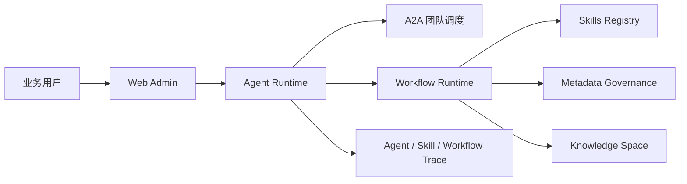
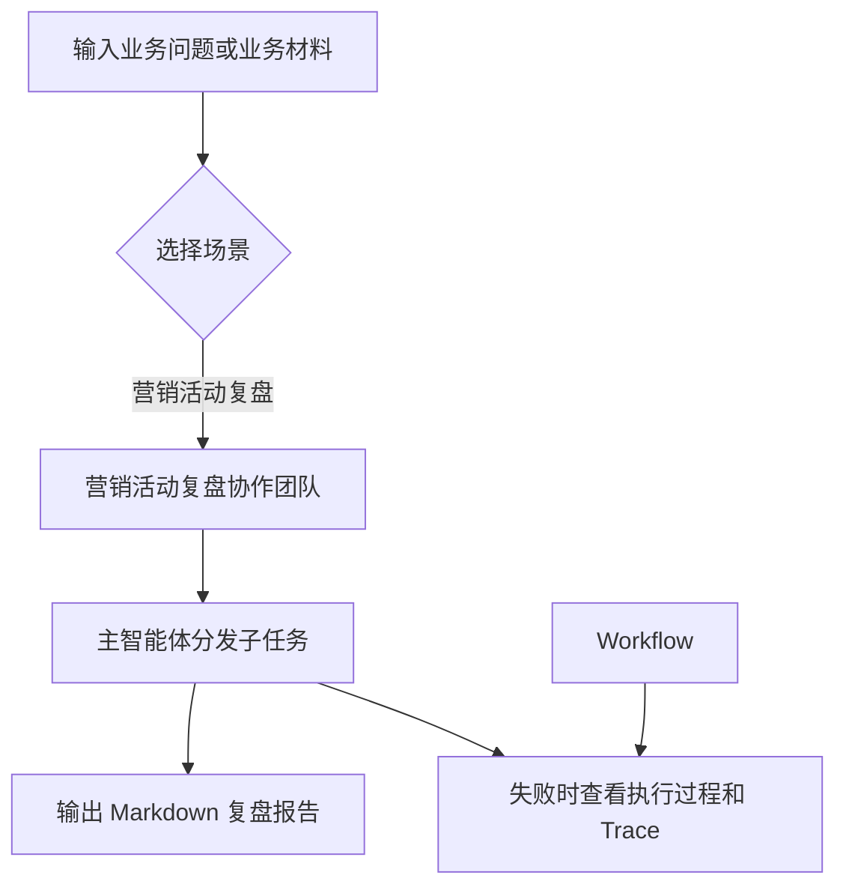
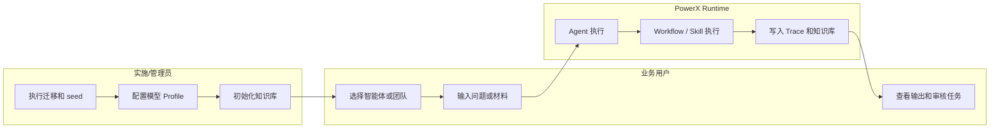

# PowerX 固有智能体业务场景使用指南

## 功能背景与目标

PowerX 安装后会通过 seed 初始化一组平台固有智能体。它们不是给开发者看的测试桩，而是给企业用户、实施顾问和 QA 直接验证业务场景的入口。

当前默认业务场景：

| 场景 | 使用入口 | 目标 |
| --- | --- | --- |
| 营销活动复盘协作 | 营销活动复盘协作团队 | 由营销负责人协调内容营销、活动复盘分析和知识策展三个子智能体，生成带事实、假设、行动和验收标准的复盘报告。 |

本目录文档面向最终使用方。`docs/plan/ai_engineering/*` 只作为研发设计资料，不作为操作手册。

## 角色与适用范围

| 角色 | 适用内容 |
| --- | --- |
| 企业业务用户 | 按页面操作输入业务材料，查看智能体输出和知识库增量。 |
| 实施顾问 | 初始化 seed、配置模型 Profile、准备知识库和演示数据。 |
| QA | 按验收标准确认输出、Trace、Workflow 记录和知识库写入。 |
| 研发 | 根据代码映射定位接口、服务和 seed 行为。 |

## 整体架构与模块关系



## 核心流程



## 跨角色协作流程



## 前置条件与依赖

| 类型 | 要求 | 验证方式 |
| --- | --- | --- |
| Seed | 固有 Agent、Skills、团队、分类字典已落库 | `/settings/ai/agents` 可看到中文分组和中文智能体名称。 |
| 模型 | AI 设置里至少有可用模型 Profile | `/settings/ai` 或节点配置不再提示“当前没有可选择的模型 Profile”。 |
| 知识库 | 至少有一个 active Knowledge Space | `/knowledge-spaces` 可选择目标知识库。 |
| Workflow | 营销知识采集、活动复盘沉淀已发布 | `/workflow` 可看到对应内置工作流。 |
| 权限 | 当前用户可运行 Agent、Workflow 和审核任务 | 页面按钮可见且接口不返回 403。 |

本地初始化命令：

```bash
make db-migrate
make db-seed
```

## 操作步骤（按场景拆分）

| 文档 | 适用角色 | 验收口径 |
| --- | --- | --- |
| [marketing-knowledge-demo/](./marketing-knowledge-demo/README.md) | 营销负责人、内容团队、知识库管理员、QA | 默认团队 Demo 为活动复盘协作；知识审核与发布在独立 Workflow 指南验收。 |

页面入口：

1. 固有智能体清单：`/settings/ai/agents`
2. Agent 会话：`/agent/sessions`
3. 多智能体团队任务：`/agent/team-tasks`
4. Workflow 清单：`/workflow`
5. Workflow 审核任务：`/workflow/review-tasks`
6. Agent Trace：`/agent/traces`
7. Skills Trace：`/settings/ai/skills`
8. 知识库：`/knowledge-spaces`

接口入口：

```bash
export POWERX_HTTP_BASE=http://localhost:8080/api/v1
export ADMIN_TOKEN=<admin_jwt>
export TENANT_TOKEN=<tenant_jwt>
```

```bash
curl -sS "$POWERX_HTTP_BASE/admin/agents?limit=50" \
  -H "Authorization: Bearer $ADMIN_TOKEN"
```

预期：返回列表中包含营销负责人、内容营销、活动复盘分析和专家知识策展等固有智能体。

## 预期结果与验收标准

1. 固有智能体显示中文业务名称，不以 key 或 UUID 作为主标签。
2. 固有智能体按数据字典分类分组展示。
3. 固有智能体不可编辑、不可删除、不可启停、不可修改能力授权。
4. 营销活动复盘场景能从团队窗口发起，并看到主 Agent 与子 Agent 的执行过程。
5. 最终结果以统一 Markdown 格式显示事实、假设、行动和验收标准。
6. 失败时页面可看到失败节点，后端 Trace 可定位 `trace_id/run_id/node_id`。

## 代码实现映射

| 能力 | 代码路径 |
| --- | --- |
| 营销固有 Agent seed | `backend/cmd/database/seed/seed_native_marketing_agents.go` |
| Agent 分类数据字典 seed | `backend/config/metadata_governance/seed.yaml` |
| 固有 Agent 保护 | `backend/internal/service/agent/agent_service.go` |
| 固有 Agent 授权保护 | `backend/internal/service/agent_authz/service.go` |
| Agent 管理页 | `web-admin/app/pages/settings/ai/agents.vue` |
| Agent 团队页 | `web-admin/app/pages/settings/ai/agent-teams.vue` |
| Agent 会话/团队工作区 | `web-admin/app/components/agent/AgentWorkspace.vue` |
| Workflow 页面 | `web-admin/app/pages/workflow/index.vue`、`web-admin/app/components/workflow/WorkflowEditor.vue` |

## 常见问题与排障

| 问题 | 原因 | 处理 |
| --- | --- | --- |
| 看不到中文分类 | `corex.agent.category` 字典未 seed | 执行 `make db-seed`，刷新 `/settings/ai/agents`。 |
| 固有智能体无法编辑 | 这是预期行为 | 固有智能体是平台内置模板，只允许使用或后续按产品规则克隆。 |
| 节点提示没有模型 Profile | AI 设置未保存模型 | 到 AI 设置保存可用模型 Profile 后重试。 |
| Workflow 发布失败 | 审核节点没有传递草稿引用或知识库不可写 | 查看 Workflow 运行详情的节点输入输出和 `/workflow/review-tasks`。 |
| Agent 只普通回复，没有拆分任务 | 未选择团队任务入口或团队配置未命中 | 使用 `/agent/team-tasks` 并选择营销活动复盘协作团队。 |

## 回滚与风险控制

1. 不建议删除固有 Agent seed 数据；固有 Agent 已受保护，页面和接口会阻止删除。
2. 如果 seed 配置错误，修正 seed 后重新执行 `make db-seed`，按 upsert 更新。
3. 如果营销 Workflow 产生错误草稿，应在审核任务中拒绝，不要发布到知识库。
4. 如果已经发布错误知识，应在知识库侧按版本、审计和知识治理流程处理，不通过直接改库绕过审计。

## 变更记录

| 日期 | 版本 | 说明 | 责任人 |
| --- | --- | --- | --- |
| 2026-08-31 | v2 | 默认示例收敛为营销活动复盘协作，运行时改为声明式 Skill Revision。 | PowerX Core |
