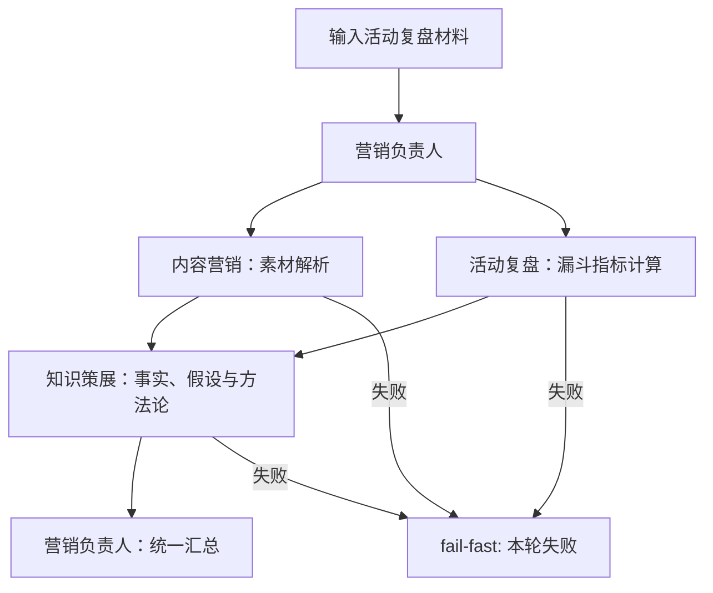
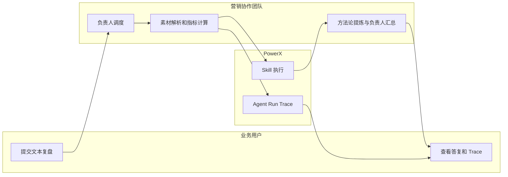

# 团队 Demo：营销活动复盘

## 目标与通过口径

验证“活动复盘材料 → 并行素材解析与指标计算 → 方法论提炼 → 负责人类型化报告 → 单消息 Trace”。团队名为 **营销活动复盘协作团队**。

## 前置条件

1. 执行 `make db-migrate` 和 `make db-seed`。
2. 在“团队任务”可选择营销活动复盘协作团队。
3. 智能体清单显示营销负责人为团队负责人，另外三名显示为团队成员。

## 执行流程

## 页面操作

1. 打开 `/agent/team-tasks`，选择“营销活动复盘协作团队”。
2. 按[团队对话手册](team-conversation-playbook.md)中的首轮模板粘贴一份文本活动复盘；首轮不要使用链接或附件。
3. 发送后等待最终答复，点击该消息的“查看调试”。

对话、补充数据、纠错和追问的具体话术见[团队对话手册](team-conversation-playbook.md)。本页只定义该团队的执行链路与验收标准。

通过标准：

- 运行时间轴出现素材解析、指标计算、知识草稿和最终汇总；
- 三个 handoff 均完成，或任一失败时整轮失败；
- 最终答复是 `powerx.agent.response/v3` 类型化报告，Skill 提供事实、指标、假设、缺口和行动，PowerX 渲染“已确认事实、指标计算、核心结论、待验证假设、下一轮优先行动、验收项”；
- 报告能读出本轮输入中的目标完成率、漏斗转化率或明确的数据缺口，不能原样回显用户输入；
- 最终汇总的 Trace 输入包含 `upstream_source_analysis`、`upstream_campaign_analysis` 和 `upstream_knowledge_curation`；
- Trace 与该条消息的 `session_id/message_id/run_id` 对应。

## 排障

| 现象 | 检查 |
| --- | --- |
| 团队不在下拉项 | 确认 `make db-seed` 已成功、团队状态为 active。 |
| 没有 handoff 节点 | 确认选择的是团队任务，不是单智能体会话。 |
| 某子任务失败 | 在该条消息 Trace 查看节点输入、技能 ID 和错误；`fail-fast` 下不应出现虚假的最终成功。 |
| 最终答复原样回显输入 | 检查最终节点是否收到三个 `upstream_*`；它们缺失时最终汇总必须失败，不能回退到原文摘要。 |
| 最终答复格式未统一 | 检查最终节点是否返回 `response_envelope` v3，并确认 Web Admin 已根据 `presentation` 渲染指标表和各业务章节。 |

## 实现映射

| 行为 | 路径 |
| --- | --- |
| 团队与成员 seed | `backend/cmd/database/seed/seed_native_marketing_agents.go` |
| 团队任务图 | `backend/internal/server/agent/runtime/engine.go` |
| 通用声明式 Skill dispatcher | `backend/internal/service/skills/executor_manifest.go` |
| 已发布 Revision 执行入口 | `backend/internal/service/skills/definition_invoke_service.go` |
| 本地运行报告写回 | `backend/internal/service/agent_trace/local_sink.go` |
| 运行报告界面 | `web-admin/app/components/agent/trace/AgentTraceReportModal.vue` |
