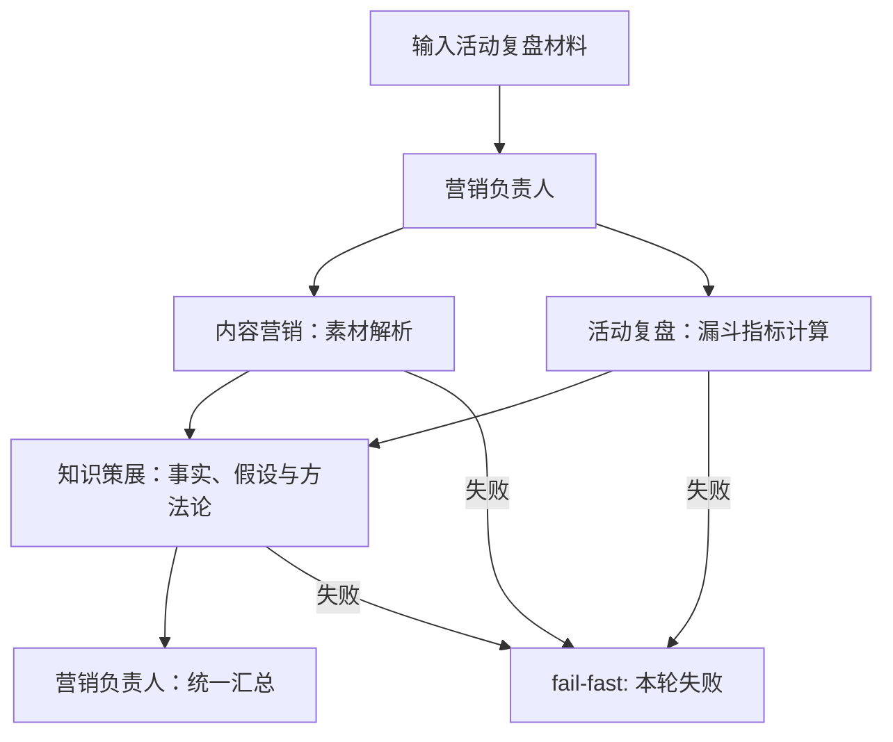
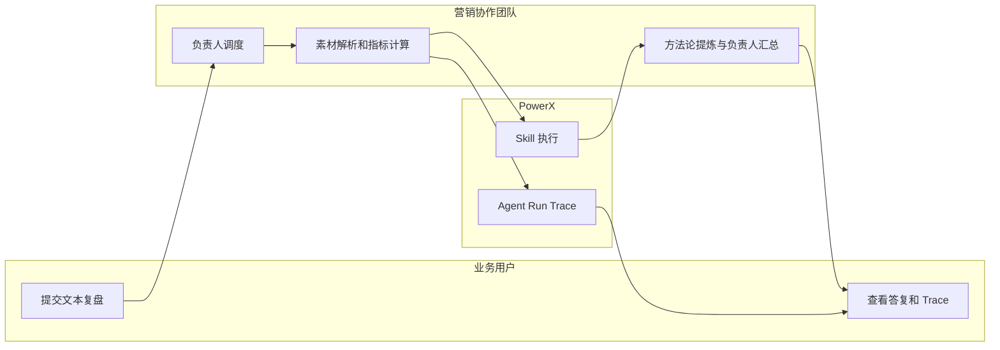

# 团队 Demo：营销活动复盘

## 目标与通过口径

验证“活动复盘材料 → 并行素材解析与指标计算 → 方法论提炼 → 负责人类型化报告 → 单消息 Trace”。团队名为 **营销活动复盘协作团队**。

## 前置条件

1. 执行 `make db-migrate` 和 `make db-seed`。
2. 在“团队任务”可选择营销活动复盘协作团队。
3. 智能体清单显示营销负责人为团队负责人，另外三名显示为团队成员。

## 执行流程

```mermaid
flowchart TD
  U[输入活动复盘材料] --> P[营销负责人]
  P --> S[内容营销：素材解析]
  P --> A[活动复盘：漏斗指标计算]
  S --> K[知识策展：事实、假设与方法论]
  A --> K
  K --> F[营销负责人：统一汇总]
  S -->|失败| X[fail-fast: 本轮失败]
  A -->|失败| X
  K -->|失败| X
```

```mermaid
flowchart LR
  subgraph User[业务用户]
    U1[提交文本复盘]
    U2[查看答复和 Trace]
  end
  subgraph Team[营销协作团队]
    T1[负责人调度]
    T2[素材解析和指标计算]
    T3[方法论提炼与负责人汇总]
  end
  subgraph Platform[PowerX]
    P1[Skill 执行]
    P2[Agent Run Trace]
  end
  U1 --> T1 --> T2 --> P1 --> T3 --> U2
  T2 --> P2 --> U2
```

## 页面操作

1. 打开 `/agent/team-tasks`，选择“营销活动复盘协作团队”。
2. 按[团队对话手册](team-conversation-playbook.md)中的首轮模板粘贴一份文本活动复盘；首轮不要使用链接或附件。
3. 发送后等待最终答复，点击该消息的“查看调试”。

对话、补充数据、纠错和追问的具体话术见[团队对话手册](team-conversation-playbook.md)。本页只定义该团队的执行链路与验收标准。

通过标准：

- 运行时间轴出现素材解析、指标计算、知识草稿和最终汇总；
- 三个 handoff 均完成，或任一失败时整轮失败；
- 最终答复采用 V4，PowerX 统一展示原文提取、工具计算、冲突、假设、缺口和行动；原文值与业务结论仍需核实；
- 数值的 source.pointer 指向定义允许的实际输入，quote/literal 与原文一致；computed 中的工具 UUID、版本和结果必须由本轮平台执行产生；
- 报告能读出本轮输入中的目标完成率、漏斗转化率或明确的数据缺口，不能原样回显用户输入；
- 已由输入分子和分母计算出的指标不得同时被列为“仍需补充的数据”或“下一轮行动”；可以要求补充该指标的行业基准或归因证据；
- 只能把原始输入明确给出的目标作为目标达成判断；只有有效线索目标时，成交数只能作为事实或漏斗指标，不能被表述为“未达到成交目标”；
- 总体曝光、点击等聚合数据只能生成总体指标，不能被改写为短视频、直播或其他渠道指标。原始输入没有行业基准时，不得声称“高于/低于行业基准”；
- 团队内置营销复盘公式词典：活动产投比为 `活动标记GMV ÷ 活动投入`；严格 ROI 为 `(收益 - 成本) ÷ 成本`，两者不得混称。增量产投比为 `可归因增量GMV ÷ 活动投入`；原文声明的增量 ROI 若与该式矛盾，必须作为口径冲突而非确认指标。点击率、落地页转化率、点击到下单转化率、线索转化率、成交转化率、复购率、留存率均必须使用各自定义的原始分子/分母；没有操作数、归因模型或口径定义时必须进入数据缺口；
- 最终汇总的 Trace 输入包含 `upstream_source_analysis`、`upstream_campaign_analysis` 和 `upstream_knowledge_curation`；
- Trace 与该条消息的 `session_id/message_id/run_id` 对应。

## 排障

| 现象 | 检查 |
| --- | --- |
| 团队不在下拉项 | 确认 `make db-seed` 已成功、团队状态为 active。 |
| 没有 handoff 节点 | 确认选择的是团队任务，不是单智能体会话。 |
| 某子任务失败 | 在该条消息 Trace 查看节点输入、技能 ID 和错误；`fail-fast` 下不应出现虚假的最终成功。 |
| 最终答复原样回显输入 | 检查最终节点是否收到三个 `upstream_*`；它们缺失时最终汇总必须失败，不能回退到原文摘要。 |
| 最终答复格式未统一 | 检查最终节点是否返回 response_envelope v4，确认前后端已同步更新，旧定义已重新发布。 |
| 计算或证据失败 | 查看 evidence.* 错误字段，检查显式输入引用、原文词面值、变量绑定、单位与口径；不让模型补造计数或 display_value。 |
| 使用模型自造来源 | 改为声明的 evidence_sources 输入路径和精确原文引用；上游分析不是新事实来源。 |
| 把可计算指标列为待补数据 | 汇总 Skill 混淆“指标值”和“比较基准” | 保留已计算指标，仅补充基准、渠道拆分或归因证据。 |

## 实现映射

| 行为 | 路径 |
| --- | --- |
| 团队与成员 seed | `backend/cmd/database/seed/seed_native_marketing_agents.go` |
| 团队任务图 | `backend/internal/server/agent/runtime/engine.go` |
| 通用声明式 Skill dispatcher | `backend/internal/service/skills/executor_manifest.go` |
| 已发布 Revision 执行入口 | `backend/internal/service/skills/definition_invoke_service.go` |
| 本地运行报告写回 | `backend/internal/service/agent_trace/local_sink.go` |
| 运行报告界面 | `web-admin/app/components/agent/trace/AgentTraceReportModal.vue` |
