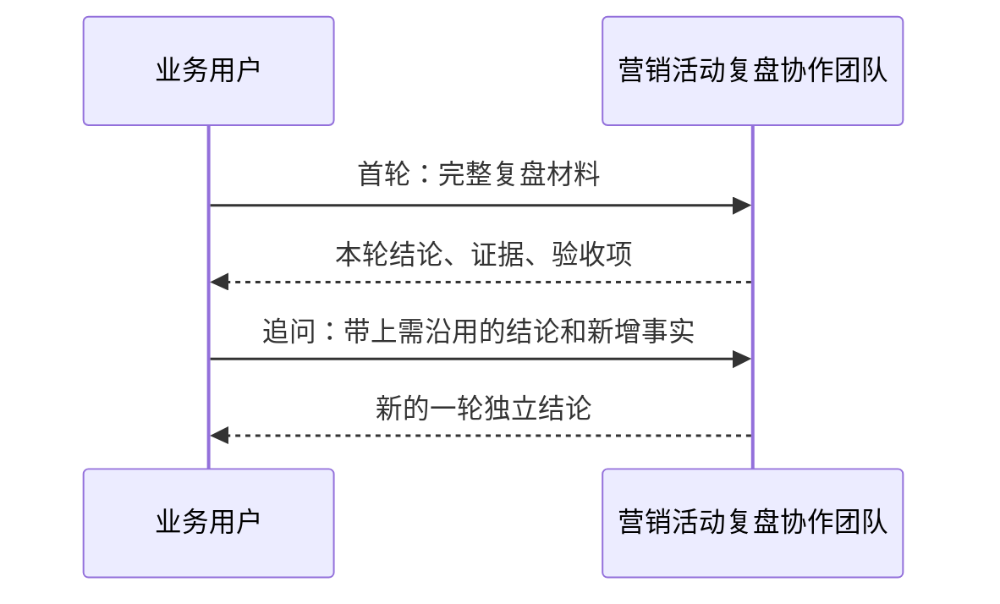

# 营销活动复盘协作团队：对话手册

这份手册用于实际和**营销活动复盘协作团队**对话。团队负责人会调度内容营销、活动复盘和知识策展三个成员，最后给出一份由 PowerX 统一渲染的结构化复盘报告。报告不是输入回显：必须计算可得指标，并区分事实、假设与行动。

它适合处理已发生营销活动的复盘、经验沉淀和下一轮优化建议；不用于直接投放、修改预算、发布内容或执行外部系统操作。

## 先理解本轮对话的边界

当前实现以“**一条消息 = 一次独立的团队运行**”执行：每次发送都会创建新的 `message_id` 和 `run_id`，并重新运行素材解析、活动复盘、知识草稿和最终汇总。

因此可以连续追问，但追问不会自动把上一次答复当作可靠业务事实重新带入。若后续问题依赖前一轮的数字、结论或纠错，请在新消息中重新贴出必要材料。这样可保证每一轮的输入、输出和 Trace 可以独立审计。



## 首轮怎么问

一次提交尽量包含活动背景、目标、数据、素材/渠道、已知问题和希望团队产出的内容。数字没有也可以写“暂无”，但不要把猜测写成事实。

可直接复制并填写：

```markdown
请复盘以下营销活动，并输出：1）核心结论；2）可复用的方法论草稿；3）下一轮优先级行动；4）仍需补充的数据。

活动名称：夏季新品首发
活动周期：2026-08-01 至 2026-08-14
目标：获得 1,000 条有效线索，验证短视频素材和直播转化效率。

渠道与素材：
- 抖音短视频：3 条产品演示素材
- 小红书图文：2 篇场景种草内容
- 直播：4 场，每场 2 小时

结果数据：
- 总预算：80,000 元
- 曝光：1,200,000；点击：36,000；落地页访问：28,000
- 表单提交：1,120；有效线索：860；成交：74
- 已知情况：短视频点击率高，但直播间停留时长偏低。

约束：下轮预算不增加；不得把尚未验证的归因结论写成事实。
```

## 常见来回话术

### 补充数据后重跑

适合首轮缺少分渠道数据、销售归因或成本数据。

```markdown
请基于以下完整材料重新复盘。以这条消息的数据为准；不要沿用此前未在本条消息出现的数字。

【首轮关键事实】
- 总预算 80,000 元；有效线索 860；成交 74。

【新增分渠道数据】
- 短视频：预算 30,000 元，表单提交 620，有效线索 510。
- 小红书：预算 20,000 元，表单提交 180，有效线索 140。
- 直播：预算 30,000 元，表单提交 320，有效线索 210。

请重点比较各渠道效率，并更新下一轮行动优先级。
```

### 纠正错误事实

适合发现先前输入的日期、预算、口径或结论不对。

```markdown
请重新输出复盘结论。以下为已确认的纠正事实，必须覆盖此前相冲突的说法：

- 有效线索不是 860，而是 760；其中直播渠道有 100 条重复线索。
- 成交 74 单属于活动后 30 天归因，不代表活动期内直接成交。
- 下轮预算上限为 70,000 元。

请区分“已确认事实”“推断”“待验证假设”，并给出需要补充的证据。
```

### 只要下一轮行动方案

适合已经认可部分结论，希望形成执行清单。因为这是新的一轮，仍要附上结论依据。

```markdown
以下事实已确认：短视频带来最多有效线索；直播停留时长偏低；下轮预算不超过 70,000 元。

请仅输出下一轮 14 天行动方案：
- 按优先级列出不超过 5 项动作；
- 每项写负责人角色、验收指标、截止时间和风险；
- 明确哪些动作不能执行，直到补齐什么数据。
```

### 追问某项结论的证据

```markdown
请解释“短视频优先”的依据。只使用下面事实，并把每条结论关联到对应数据；没有数据支撑的部分请标注为待验证。

- 短视频预算 30,000 元，有效线索 510。
- 小红书预算 20,000 元，有效线索 140。
- 直播预算 30,000 元，有效线索 210，且存在 100 条重复线索。
```

## 应该期待什么答复

最终答复必须由最终汇总 Skill 输出平台契约 `powerx.agent.response/v3`。Skill 只返回五类业务数据：`facts`、`metrics`、`hypotheses`、`gaps`、`actions`；PowerX 从这些数据统一派生结论与验收项，并决定标题、表格和清单的展示，而不是要求每一个智能体自行发明格式。指标表会以统一边框样式显示，窄屏时可横向滚动。正常情况下会看到：

1. **已确认事实**：目标完成率、可计算的漏斗转化率和原始数据缺口；
2. **核心结论**：只依据已确认数据得出的判断；
3. **待验证假设**：渠道归因、素材原因等尚无证据的推断；
4. **下一轮优先行动**：不超过当前输入约束的行动及验证方式；
5. **验收项**：由缺口和下一步自动生成的数据补充与动作验证口径；
6. **仍需补充的数据**：缺失时必须明确列出，而非由团队补造。

若最终汇总没有输出合法的 `schema`、`outcome` 和包含五个数组的 `presentation`，或仍携带旧的 `summary`、`summary_refs`、`acceptance` 字段，本轮会明确失败而不是显示半成品。 “完成”只表示本轮编排与 Skill 已成功运行，不代表活动效果已经被证明，也不代表外部投放、预算或发布操作已执行。

PowerX 会复算所有百分比指标。比如点击率必须满足 `点击 / 曝光 × 100`；若模型把 `36,000 / 1,200,000` 写成 `2.5%` 而非 `3%`，本轮将明确失败。只要报告仍有数据缺口、待验证假设或未完成验收项，结果状态必须是“需行动”，不能标为“完成”。

## 重试与失败处理

在团队任务页面点击“重试”或“重新编辑”时，PowerX 必须重新携带当前 URL 中显式的 `team_id`；它不会从会话历史或当前智能体猜测团队身份。若团队不存在、未启用或配置未加载，页面会拒绝发起重试并提示重新选择团队。

模型服务超时、子任务失败或运行协议异常时，本轮状态为失败，不能把已收到的半截文本当作最终报告。点击“追踪本轮”查看具体失败节点、错误码与可重试标识。

## 不建议这样提问

| 不清晰的提问 | 为什么不合适 | 建议改写 |
| --- | --- | --- |
| `看看这次活动怎么样` | 没有事实材料，团队只能给泛化建议。 | 粘贴周期、目标、渠道、预算和至少一组结果数据。 |
| `按上次结论继续优化` | 每条消息独立运行，上次结论不会可靠地自动注入。 | 贴出需沿用的结论和新数据，再说明要优化的目标。 |
| `帮我把预算调到 10 万` | 该团队只分析与产出建议，不执行外部变更。 | `在预算上限 10 万的约束下给出分配建议和验收指标`。 |
| `结果一定要证明直播无效` | 预设结论会混淆事实和推断。 | 给出直播数据，并要求区分事实、推断和待验证假设。 |

## 本轮是否可验收

发送后检查以下内容：

- 最终答复能够读出目标完成率或数据缺口、结论、假设、行动和验收项；
- 答复不是对原始提问的复述；输入中的数字至少被用于一个明确计算或明确标注为不可计算；
- 没有把缺失数据或推断伪装成已确认事实；
- 点击该条消息的“追踪本轮”，可看到三个子智能体 handoff 与最终汇总；
- Trace 的 `message_id`、`run_id` 对应当前这一条消息，而不是整个会话。

若要验证团队成员、任务图或失败处理，转到[团队 Demo：营销活动复盘](team-campaign-review.md)；若要把已审核内容写入知识库，转到[Workflow：知识采集与发布](workflow-knowledge-capture.md)。
