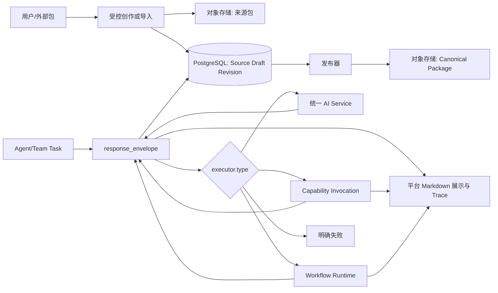
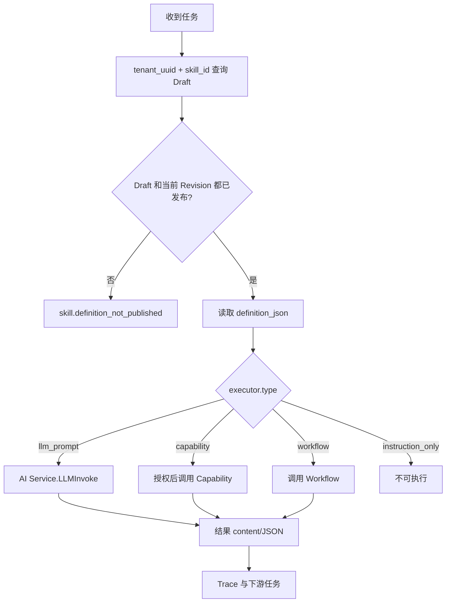
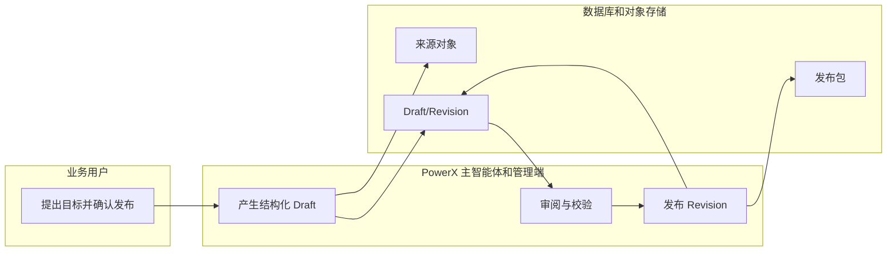

# 声明式 Skill Runtime

## 1. 功能背景与目标

PowerX Core 不理解“营销复盘”“发布准备”或客户业务。它只运行租户已发布的 Skill Revision：校验、调度通用 executor、调用统一 LLM/Capability/Workflow、记录 Trace，并将结构化业务结果渲染为平台拥有的展示。固有示例和客户自建 Skill/Team 走同一链路，新增业务不修改 Core 代码。

## 2. 角色与适用范围

| 角色 | 责任 |
| --- | --- |
| 业务用户 | 在团队会话中提出任务，审核结果。 |
| PowerX 主智能体 | 生成结构化 Draft；不能直接写库或覆盖已发布版本。 |
| 管理员 | 审阅、发布 Revision、绑定 Agent/Team。 |
| 外部开发者 | 导入标准 `SKILL.md` 包并补充 PowerX 扩展。 |

## 3. 整体架构与模块关系



## 4. 核心流程



分派只依据 `executor.type`；`skill_id`、Team Key、Agent 名称及业务场景绝不参与 Core 路由。

## 5. 跨角色协作流程



## 6. 前置条件与依赖

- 先执行 `make migrate`；`make seed` 不执行迁移。
- 已配置的 Media Storage driver 必须可写。默认 `storage.default_driver: local` 时，包写入 `storage.local.base_path` 并使用 `local://` URI；明确配置 `s3` 时才连接 S3/MinIO 并使用 `s3://` URI。`local://` 是 Media Storage 的逻辑引用，不是 OS 的 `file://` 路径；生产部署应为其配置持久卷。所有包必须有 `sha256:` checksum。
- Agent 必须有模型配置。`llm_prompt` 只经 `internal/service/ai.Service.LLMInvoke` 调用，使用平台统一超时；定义中的 `prompt_template_i18n` 必须包含本轮 `locale`，不允许静默切换语言。
- Team 成员、Skill binding 和任务图必须同租户且已发布。有效 `powerx.agent.team-orchestration/v1` 图由 Runtime 直接编译，通用意图/任务规划器不会再参与或覆盖该图；图缺失、成员/绑定不一致时明确失败。
- 计划型最终答复必须显式提供 `powerx.agent.response/v3`。它的权威 Schema 是 `backend/config/agent/response_envelope.v3.schema.json`，`presentation` 必须包含 `facts`、`metrics`、`hypotheses`、`gaps`、`actions` 五个数组；事实与指标必须使用 `{type: input|task, ref: ...}` 来源对象。结论和验收项由平台派生，Skill 不能返回 `summary`、`summary_refs`、`acceptance` 或任意展示模板。Runtime 不会把原始 Markdown 自动包装为成功结果。
- `presentation.metrics` 的百分比值由 Runtime 复算：带 `%` 的 `display_value` 必须等于 `numerator / denominator × 100`；模型写错算术会明确失败，而不是展示错误指标。
- `outcome=completed` 不得同时出现假设或数据缺口；只要 `hypotheses` 或 `gaps` 非空，结果必须是 `needs_action` 且至少包含一个行动。旧的 ID 引用图不再是协议的一部分，运行时会明确拒绝旧字段。
- `outcome=completed` 不得同时出现假设、数据缺口或未完成验收项；这种结果必须标记为 `needs_action`。

## 7. 操作步骤

### 7.1 对话式创建

1. **动作**：用户授权主智能体创建/修改业务 Skill。  
   **入口**：PowerX Agent 会话。  
   **预期结果**：生成 `powerx.skill-definition/v2` Draft。  
   **失败处理**：缺 executor、输入/输出或权限时停在 Draft 并给出校验错误。
2. **动作**：审核并发布当前 Revision。  
   **入口**：Skill 管理流程。  
   **预期结果**：生成 Canonical Package，Revision 为 `published`。  
   **失败处理**：当前配置的 Media Storage driver 不可写或 checksum 缺失时发布失败。

### 7.2 导入外部包

1. **动作**：解析 `SKILL.md`，把原始包冻结到对象存储。  
   **入口**：受控导入任务。  
   **预期结果**：创建 `skill_package_sources`。  
   **失败处理**：不合规包或 checksum 无效时拒绝导入。
2. **动作**：补齐 `powerx/` executor 扩展并发布。  
   **预期结果**：可执行 Revision 被绑定到 Agent/Team。  
   **失败处理**：只有标准 `SKILL.md` 的包为 `instruction_only`，不能执行。

### 7.3 本地联调

```bash
make migrate
make seed
cd backend && go test ./internal/service/skills ./internal/server/agent ./internal/server/agent/bootstrap
```

预期：迁移创建 Skill 定义表；seed 把固有营销示例作为声明式 Revision 和对象存储包发布；测试证明执行入口无业务 Skill ID 分支。

## 8. 预期结果与验收标准

- 自建 `skill_id` 可发布并运行，无需修改 Core。
- 未发布、无冻结对象、未知 executor、未授权 capability 均显式失败。
- 调用方指定 `revision_uuid` 时必须等于当前已发布 Revision；指定旧 Revision 或缺 locale 都显式失败。
- 替换 Team 中的示例 Skill ID 不改变调度路径。
- 最终执行型答复必须带有合法 `response_envelope`；Web Admin 根据 `presentation.metrics` 统一生成表格，根据其他数组生成章节、清单和验收项，表格带边框并可横向滚动。Skill 不控制核心页面版式，Trace 显示实际 executor 结果。

## 9. 代码实现映射

| 责任 | 路径 |
| --- | --- |
| 数据模型 | `backend/pkg/corex/db/persistence/model/skills/skill_definition.go` |
| 迁移 | `backend/pkg/corex/db/database/migration.go` |
| 生命周期仓储 | `backend/pkg/corex/db/persistence/repository/skills/skill_definition_repository.go` |
| 校验/发布 | `backend/internal/service/skills/definition_service.go` |
| Package 发布 | `backend/internal/service/skills/package_publisher.go` |
| 通用 executor | `backend/internal/service/skills/executor_manifest.go` |
| Runtime | `backend/internal/service/skills/definition_invoke_service.go` |
| Agent/Team 接线 | `backend/internal/server/agent/bootstrap/init.go`、`handoff.go` |

## 10. 常见问题与排障

| 现象 | 处理 |
| --- | --- |
| `skill.definition_not_published` | 审核并发布当前 Revision。 |
| `skill.definition_published_artifact_missing` | 修复发布流程；不能从本地目录加载。 |
| `skill.executor_instruction_only_not_runnable` | 补齐 `powerx/` 扩展，产生新 Revision。 |
| `agent.response_contract_invalid` | 最终执行 Skill 没有输出合法 `powerx.agent.response/v3`，或事实/指标没有类型化来源、摘要/验收引用未声明的 ID；修正 Definition 的输出契约并发布新 Revision。 |
| LLM 超时 | 检查 AI 设置、Provider 健康和统一 timeout 配置。 |

## 11. 回滚与风险控制

已发布 Revision 和对象不可覆盖；修订时在同一 Skill 身份下追加 Draft Revision，审核并发布后旧 Revision 变为 `superseded`。回滚是选择另一受审发布 Revision。错误 seed/demo 数据必须走迁移或人工数据修复，seed 不删除既有租户记录。

## 12. 变更记录

| 日期 | 变更 |
| --- | --- |
| 2026-08-31 | 建立声明式 Definition Runtime、对象存储 Package 和统一执行边界；团队编排图直编译，执行型答复强制结构化信封。 |
