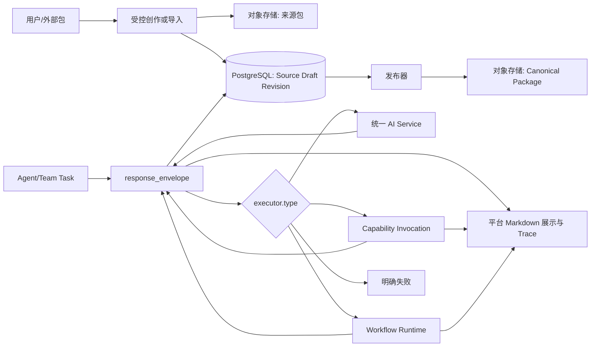
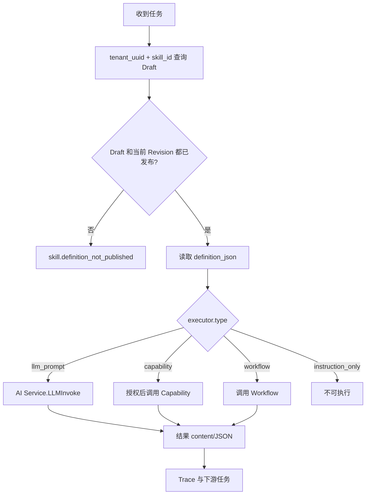
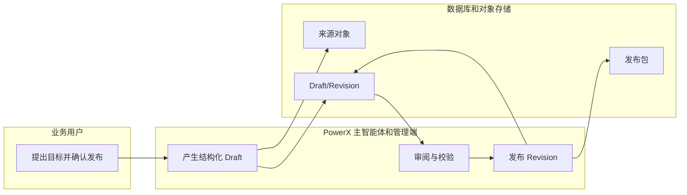

# 声明式 Skill Runtime

开发约束见 [Agent、Skill、工具与 Runtime 分层开发规范](../../develop/agent-skill-tool-boundaries.md)。业务公式归属 Skill；Runtime 治理工具依赖和执行，计算工具执行确定性运算。工具缺失、版本不符或未授权时显式阻断，不得通过模型心算或业务标识分支兜底。当前计算报告采用 V4；外部工具生产接线仍按 024 Phase 23 跟踪，旧 V3 不再作为可执行契约。

计算报告的 Skill 必须声明 calculation_policy（字段、unit_tokens、公式和口径）。平台从声明来源生成数值 token，模型只映射 key/scope/token_ref；数字、单位、表达式和显示值不由模型自由填写。最终由 PowerX 执行计算并统一渲染，具体实现与验收边界见 [V4 实现说明](../../develop/agent-response-evidence-v4.md)。

## 1. 功能背景与目标

PowerX Core 不理解“营销复盘”“发布准备”或客户业务。它只运行租户已发布的 Skill Revision：校验、调度通用 executor、调用统一 LLM/Capability/Workflow、记录 Trace，并将结构化业务结果渲染为平台拥有的展示。固有示例和客户自建 Skill/Team 走同一链路，新增业务不修改 Core 代码。

## 2. 角色与适用范围

| 角色 | 责任 |
| --- | --- |
| 业务用户 | 在团队会话中提出任务，审核结果。 |
| PowerX 主智能体 | 生成结构化 Draft；不能直接写库或覆盖已发布版本。 |
| 管理员 | 审阅、发布 Revision、绑定 Agent/Team。 |
| 外部开发者 | 导入标准 `SKILL.md` 包并补充 PowerX 扩展。 |

## 3. 整体架构与模块关系


```mermaid
flowchart LR
  U[用户/外部包] --> A[受控创作或导入]
  A --> O[对象存储: 来源包]
  A --> D[(PostgreSQL: Source Draft Revision)]
  D --> P[发布器]
  P --> O2[对象存储: Canonical Package]
  T[Agent/Team Task] --> R[Definition Runtime]
  R --> D
  R --> E{executor.type}
  E --> L[统一 AI Service]
  E --> C[Capability Invocation]
  E --> W[Workflow Runtime]
E --> F[明确失败]
L --> R[response_envelope]
C --> R
W --> R
R --> M[平台 Markdown 展示与 Trace]
  C --> M
  W --> M
```

## 4. 核心流程


```mermaid
flowchart TD
  S[收到任务] --> Q[tenant_uuid + skill_id 查询 Draft]
  Q --> P{Draft 和当前 Revision 都已发布?}
  P -- 否 --> X[skill.definition_not_published]
  P -- 是 --> D[读取 definition_json]
  D --> E{executor.type}
  E -- llm_prompt --> L[AI Service.LLMInvoke]
  E -- capability --> C[授权后调用 Capability]
  E -- workflow --> W[调用 Workflow]
  E -- instruction_only --> I[不可执行]
  L --> O[结果 content/JSON]
  C --> O
  W --> O
  O --> T[Trace 与下游任务]
```

分派只依据 `executor.type`；`skill_id`、Team Key、Agent 名称及业务场景绝不参与 Core 路由。

## 5. 跨角色协作流程


```mermaid
flowchart LR
  subgraph User[业务用户]
    U1[提出目标并确认发布]
  end
  subgraph Platform[PowerX 主智能体和管理端]
    P1[产生结构化 Draft]
    P2[审阅与校验]
    P3[发布 Revision]
  end
  subgraph Data[数据库和对象存储]
    D1[来源对象]
    D2[Draft/Revision]
    D3[发布包]
  end
  U1 --> P1 --> D1
  P1 --> D2 --> P2 --> P3 --> D3
  P3 --> D2
```

## 6. 前置条件与依赖

- 先执行 `make migrate`；`make seed` 不执行迁移。
- 已配置的 Media Storage driver 必须可写。默认 `storage.default_driver: local` 时，包写入 `storage.local.base_path` 并使用 `local://` URI；明确配置 `s3` 时才连接 S3/MinIO 并使用 `s3://` URI。`local://` 是 Media Storage 的逻辑引用，不是 OS 的 `file://` 路径；生产部署应为其配置持久卷。所有包必须有 `sha256:` checksum。
- Agent 必须有模型配置。`llm_prompt` 只经 `internal/service/ai.Service.LLMInvoke` 调用，使用平台统一超时；定义中的 `prompt_template_i18n` 必须包含本轮 `locale`，不允许静默切换语言。
- Team 成员、Skill binding 和任务图必须同租户且已发布。有效 `powerx.agent.team-orchestration/v1` 图由 Runtime 直接编译，通用意图/任务规划器不会再参与或覆盖该图；图缺失、成员/绑定不一致时明确失败。
- 计划型最终答复采用 `powerx.agent.response/v4`；模型提交 `powerx.agent.response-draft/v1`，平台校验来源并实际计算后产生报告。字段、限制和迁移见 [V4 实现说明](../../develop/agent-response-evidence-v4.md)。
- 当 Definition 的 `output_mode=response_envelope` 时，声明式 executor 会从本次计划的 `depends_on` 图计算允许的上游 `task_id`，再将 V3 JSON Schema 和该动态枚举传给模型 Provider（Ollama `format`、OpenAI `response_format.json_schema`）。Schema 同时要求 `formula` 为数值分子/分母表达式、`display_value` 为纯数值或数值百分比，先阻止“约为”“待核验”等自由文本进入数值字段；Runtime 仍负责复算语义。该机制不是某个固有团队的特殊分支；客户自建 Team/Skill 也使用同一机制。Provider 不支持 JSON Schema 时会以 `ai.response_schema_provider_unsupported` 明确失败，绝不静默降级为自由文本。
- `presentation.metrics` 的 `numerator`、`denominator` 必须是无单位 JSON 数字，且分母大于零；`formula` 必须与两个数字严格对应为 `numerator/denominator`。Runtime 会复算 `display_value`：带 `%` 时必须等于 `numerator / denominator × 100`，否则必须等于 `numerator / denominator`；仅允许正常展示四舍五入（非百分比误差最多 0.005，百分比误差最多 0.06 个百分点）。只有原始材料明确给出同一指标的原始分子和分母时，Skill 才能创建指标；不能把多个已给百分比、ROI、CTR、转化率、归因结论或四舍五入结果互相相除、换算或反推为新指标。无法由同一来源分子、分母复算的主张必须输出为口径缺口与澄清行动；模型写错算术会明确失败，而不是展示错误指标。
- 在最终 Runtime 校验前，所有 `output_mode=response_envelope` 的 LLM Skill 都会获得一次通用的“契约纠正重试”：PowerX 将精确的指标校验错误和上一份 JSON 返回给同一 Skill，要求只提交完整的修正信封。该机制不会替模型改写数值，也不会将错误结果降级为成功；第二次仍不合格时明确失败。最终校验失败还会作为独立的 `final_response / response_envelope_validation` 错误节点写入 Trace。
- `outcome=completed` 不得同时出现假设或数据缺口；只要 `hypotheses` 或 `gaps` 非空，结果必须是 `needs_action` 且至少包含一个行动。旧的 ID 引用图不再是协议的一部分，运行时会明确拒绝旧字段。
- `facts` 只能陈述原始输入或可验证上游产物已经给出的内容；没有原始证据的行业基准、外部比较、渠道级数值、目标、归因与因果不得因某个子智能体声称过而升级为事实。可计算的比率进入 `metrics`；未提供的比较依据进入 `gaps` 或 `hypotheses`。
- `outcome=completed` 不得同时出现假设、数据缺口或未完成验收项；这种结果必须标记为 `needs_action`。

## 7. 操作步骤

### 7.1 对话式创建

1. **动作**：用户授权主智能体创建/修改业务 Skill。  
   **入口**：PowerX Agent 会话。  
   **预期结果**：生成 `powerx.skill-definition/v2` Draft。  
   **失败处理**：缺 executor、输入/输出或权限时停在 Draft 并给出校验错误。
2. **动作**：审核并发布当前 Revision。  
   **入口**：Skill 管理流程。  
   **预期结果**：生成 Canonical Package，Revision 为 `published`。  
   **失败处理**：当前配置的 Media Storage driver 不可写或 checksum 缺失时发布失败。

### 7.2 导入外部包

1. **动作**：解析 `SKILL.md`，把原始包冻结到对象存储。  
   **入口**：受控导入任务。  
   **预期结果**：创建 `skill_package_sources`。  
   **失败处理**：不合规包或 checksum 无效时拒绝导入。
2. **动作**：补齐 `powerx/` executor 扩展并发布。  
   **预期结果**：可执行 Revision 被绑定到 Agent/Team。  
   **失败处理**：只有标准 `SKILL.md` 的包为 `instruction_only`，不能执行。

### 7.3 本地联调

```bash
make migrate
make seed
cd backend && go test ./internal/service/skills ./internal/server/agent ./internal/server/agent/bootstrap
```

预期：迁移创建 Skill 定义表；seed 把固有营销示例作为声明式 Revision 和对象存储包发布；测试证明执行入口无业务 Skill ID 分支。

## 8. 预期结果与验收标准

- 自建 `skill_id` 可发布并运行，无需修改 Core。
- 未发布、无冻结对象、未知 executor、未授权 capability 均显式失败。
- 调用方指定 `revision_uuid` 时必须等于当前已发布 Revision；指定旧 Revision 或缺 locale 都显式失败。
- 替换 Team 中的示例 Skill ID 不改变调度路径。
- 最终执行型答复必须带有合法 `response_envelope`；Web Admin 根据 `presentation.metrics` 统一生成表格，根据其他数组生成章节、清单和验收项，表格带边框并可横向滚动。Skill 不控制核心页面版式，Trace 显示实际 executor 结果。

## 9. 代码实现映射

| 责任 | 路径 |
| --- | --- |
| 数据模型 | `backend/pkg/corex/db/persistence/model/skills/skill_definition.go` |
| 迁移 | `backend/pkg/corex/db/database/migration.go` |
| 生命周期仓储 | `backend/pkg/corex/db/persistence/repository/skills/skill_definition_repository.go` |
| 校验/发布 | `backend/internal/service/skills/definition_service.go` |
| Package 发布 | `backend/internal/service/skills/package_publisher.go` |
| 通用 executor | `backend/internal/service/skills/executor_manifest.go` |
| Runtime | `backend/internal/service/skills/definition_invoke_service.go` |
| Agent/Team 接线 | `backend/internal/server/agent/bootstrap/init.go`、`handoff.go` |

## 10. 常见问题与排障

| 现象 | 处理 |
| --- | --- |
| `skill.definition_not_published` | 审核并发布当前 Revision。 |
| `skill.definition_published_artifact_missing` | 修复发布流程；不能从本地目录加载。 |
| `skill.executor_instruction_only_not_runnable` | 补齐 `powerx/` 扩展，产生新 Revision。 |
| `agent.response_contract_invalid` | V4 结构不合法；检查最终节点字段错误。旧 V3 须重新发布并新建运行，不做兼容解析。 |
| LLM 超时 | 检查 AI 设置、Provider 健康和统一 timeout 配置。 |

## 11. 回滚与风险控制

已发布 Revision 和对象不可覆盖；修订时在同一 Skill 身份下追加 Draft Revision，审核并发布后旧 Revision 变为 `superseded`。回滚是选择另一受审发布 Revision。错误 seed/demo 数据必须走迁移或人工数据修复，seed 不删除既有租户记录。

## 12. 变更记录

| 日期 | 变更 |
| --- | --- |
| 2026-08-31 | 建立声明式 Definition Runtime、对象存储 Package 和统一执行边界；团队编排图直编译，执行型答复强制结构化信封。 |
| 2026-09-02 | `response_envelope` executor 将 V3 JSON Schema 与计划派生的上游任务引用枚举传给 Provider；不支持结构化响应的 Provider 明确失败。 |
