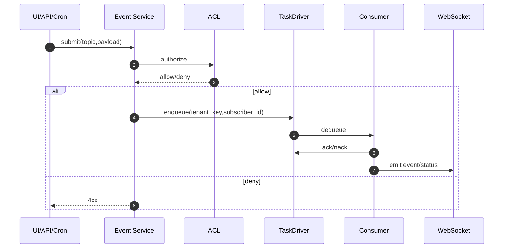

# Task 机制说明（Event Fabric 实现）

> 平台级入口：`docs/guides/async_runtime/README.md`  
> 实操入口：`docs/guides/async_runtime/event_fabric/integration_playbook.md`

## 1. 核心模型

1. `topic`：事件语义（发生了什么）
2. `subscriber_id`：消费逻辑（谁来处理）
3. `tenant_key`：队列分片（在哪条队列）
4. 队列分片键：`tenant_key + subscriber_id`

## 2. 生命周期（统一主链路）

## 3. Replay / Retry / Pipeline 区别

1. Replay：人工发起的历史重放（补偿/联调）
2. Retry：失败后系统自动重试
3. Pipeline：业务正常处理链路

三者共用同一 TaskDriver 生命周期，只是触发来源不同。

## 4. 存储边界

1. Redis：运行态队列（pending/deferred/processing/inflight）
2. PostgreSQL：治理与审计（topic/acl/task_history/replay_request）

## 5. 为什么会看到 `global`

`global` 是系统级 `tenant_key` 值，不是 topic 字段。  
用于系统公共分片队列（例如通知分发）。

## 6. 当前建议阅读顺序

1. `docs/guides/async_runtime/event_fabric/naming_convention.md`
2. 当前文档（Task 机制）
3. `docs/guides/async_runtime/event_fabric/integration_playbook.md`
