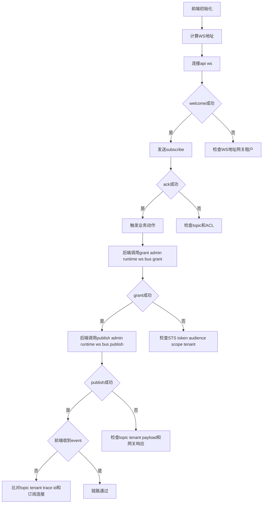

# WebSocket 子系统说明（async_runtime）

> 状态：已实现（按 Host Contract v2 对齐）  
> 平台入口：`docs/guides/async_runtime/README.md`
> Token 边界：以 `docs/guides/auth/plugin_auth_token_model.md` 为准。

## 1. 文档定位

1. 本文：机制与契约（宿主、插件、Framework 各自职责）
2. 联调排障：`docs/guides/async_runtime/websocket/debug_playbook.md`
3. 前端实现：`docs/standards/powerx/web-admin/realtime/websocket-implementation-guide.md`

## 2. 当前机制（真实实现）

1. 统一 WS 入口：`/api/ws`
2. 客户端协议：`subscribe` / `unsubscribe` / `ping`
3. 服务端消息：`welcome` / `ack` / `error` / `event`
4. 单连接复用多 topic（同一页面只保留 1 条 WS）
5. topic 鉴权由 ws-bus ACL + tenant 约束决定

## 3. Host / 插件 / Framework 职责边界

1. 宿主 PowerX
- 提供 `/api/ws` 与 `/api/v1/admin/runtime/ws-bus/{grant,publish}`。
- 在插件启用时注入运行时契约（环境变量）：
  - `NUXT_PUBLIC_WS_ORIGIN`
  - `NUXT_PUBLIC_WS_PATH`（默认 `/api/ws`）
  - `NUXT_PUBLIC_POWERX_CORE_BASE`
  - `NUXT_PUBLIC_API_BASE`（默认 `/api/v1`）
- 负责插件网关鉴权与代理，不允许插件猜宿主端口。

2. 插件（含 Framework/Skeleton）
- 前端只读契约构造 WS URL，不自行推导 `localhost:8077/8080/3030`。
- 后端调用宿主 ws-bus 接口属于插件主动调用 PowerX 底座业务接口，必须使用 STS access token（`aud=powerx:api`）。不得使用 `PX_PLUGIN_TOOL_TOKEN`。
- 禁止透传 PowerX 代理到插件时下发的 delegated/plugin request token 调宿主 ws-bus；该 token 的 `aud=plugin:<plugin_id>`，不是 PowerX 底座业务接口凭证。
- UI 只按 `type=event` 消费业务事件。

3. Framework
- 提供统一 WS 客户端与诊断状态机（`welcome/sub_sent/ack_ok/event_ok`）。
- 任何模板页不得绕开契约自行拼接宿主地址。

## 4. 调试链路图（标准工序）

## 5. 地址契约（强约束）

1. 禁止把前端端口当后端地址
- 错误示例：`ws://127.0.0.1:3030/...`
- 正确做法：由 `NUXT_PUBLIC_WS_ORIGIN + NUXT_PUBLIC_WS_PATH` 计算最终 WS 地址。

2. 推荐优先级（插件前端）
1. `NUXT_PUBLIC_WS_ORIGIN + NUXT_PUBLIC_WS_PATH`
2. `NUXT_PUBLIC_POWERX_CORE_BASE + NUXT_PUBLIC_WS_PATH`
3. 最后才允许本地 fallback（仅 standalone dev）

## 6. 协议最小契约（插件必须满足）

1. 连接成功后应收到 `welcome`（允许极短延迟）。
2. 发送 `subscribe` 后必须有 `ack`（成功或失败都要回）。
3. 业务消息统一 `type=event`，`topic` 与 `payload` 必填。
4. `grant` 仅是授权准备，不等于自动订阅。
5. `publish` 成功不代表前端一定收到，需同时满足：
- topic 已授权
- WS 连接存活
- 已订阅该 topic

## 7. 常见误区（本次联调踩坑总结）

1. 把 3030 当宿主后端：会导致连接/鉴权混乱。
2. 插件用 delegated/plugin request token 调宿主 ws-bus grant：会触发 `invalid audience`。宿主 ws-bus 业务调用应使用 STS access token。
3. 只看 grant/publish 200，不看 `welcome/ack/event`：会误判“已通”。
