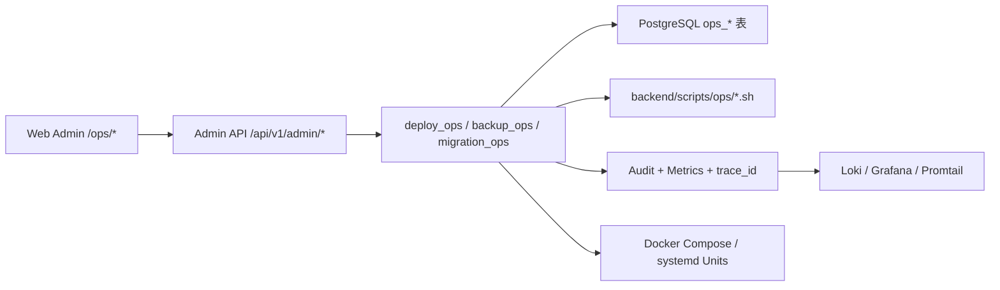
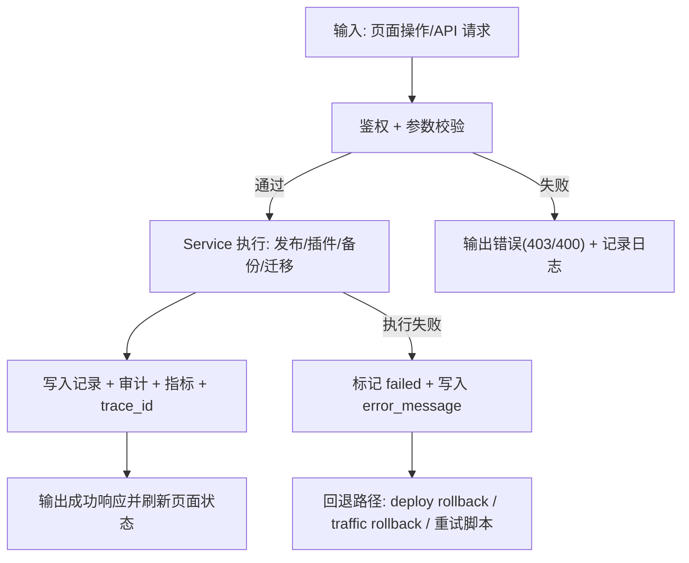
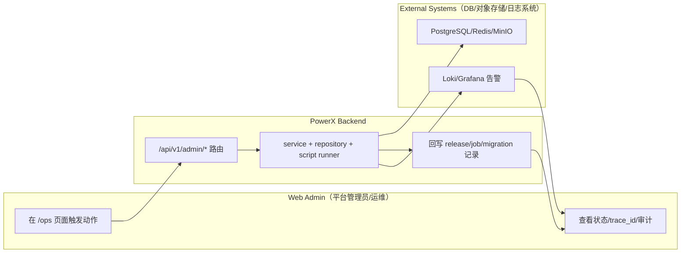

# PowerX 部署与运维治理基线 使用指导（版本：v0.1）

## 1. 功能背景与目标

### 1.1 为什么要做
- 业务背景：PowerX 首版生产落地需要统一 Docker/systemd 部署规范，并把发布、插件升级、备份恢复、迁移演练纳入同一运维闭环。
- 当前痛点：历史上运行方式、回滚流程、日志定位和审计记录分散，跨角色协作成本高。
- 目标收益：在单节点首发前提下，建立可扩展到 K8s/多节点的标准化流程，满足回滚、追踪、备份恢复和迁移可演练要求。

### 1.2 本文解决什么问题
- 面向角色：平台管理员、运维工程师、运维负责人、项目负责人、QA、研发。
- 本文范围：`025-powerx-docker-systemd` 的 P0 运维域（deploy/plugin/backup/migration）端到端操作。
- 非本文范围：K8s 编排细节、跨机房网络架构细节、插件市场能力建设。

## 2. 角色与适用范围

- 适用环境：dev/staging/prod（默认示例以 `prod` 为主）。
- 权限要求：页面执行动作需 `root` 或“当前租户管理员”（前端 `useOpsAccess` 校验）。
- 高风险动作：发布回滚、迁移切换、恢复演练建议在审批模式开启时执行。
- 审批策略：通过 `POWERX_APPROVAL_DEFAULT_MODE` 和 `POWERX_APPROVAL_ENV_OVERRIDES` 按环境控制（`none`/`dual_approval`）。

## 3. 整体架构与模块关系



- 前端模块：`web-admin/app/pages/ops/{deploy,plugins,backup,migration}.vue`
- 后端模块：`backend/internal/transport/http/admin/{deploy,backup,migration}` + 对应 service。
- 外部依赖：PostgreSQL、Redis、MinIO/S3、Loki/Grafana/Promtail。
- 资产文件：`deploy/powerx/docker/compose.prod.yaml`、`deploy/powerx/systemd/*.service`、`deploy/observability/*`。

## 4. 核心流程



## 5. 跨角色协作流程



## 6. 前置条件与依赖

### 6.1 配置
- 服务启动与路由前缀：建议统一以 `/api/v1` 暴露 Admin API。
- 审批策略：
  - `POWERX_APPROVAL_DEFAULT_MODE`（默认审批模式）
  - `POWERX_APPROVAL_ENV_OVERRIDES`（例：`prod:dual_approval,staging:none`）
- 脚本目录：`POWERX_OPS_SCRIPT_DIR`（未设置时默认 `backend/scripts/ops`）。
- 健康检查路径：`/api/v1/health`。

### 6.2 权限与数据
- RBAC 模块：`platform_ops`，资源与动作覆盖 deploy/plugin/backup/migration。
- 最小角色建议：
  - 查看：运维只读角色
  - 执行：运维执行角色（或 root/租户管理员）
  - 审批：高风险审批角色（生产建议独立）
- 数据准备：确保 `ops` 相关模型迁移已执行。

### 6.3 观测依赖
- Loki 保留：`720h`（30 天）。
- Promtail 标签：`job/app/env`。
- Ops 指标：`powerx_ops_deploy_total`、`powerx_ops_backup_total`、`powerx_ops_migration_total` 及 error/latency 指标。

## 7. 操作步骤（按场景拆分）

### 7.0 Use Case 索引

| Use Case | 文档 | 适用角色 | 验收口径 |
|---|---|---|---|
| Docker 部署快速开始 | `docker/README.md` | 平台管理员、运维 | 按“打镜像 -> 拉镜像部署 -> 启动验收/回滚”执行 |
| systemd 部署快速开始 | `systemd/README.md` | 平台管理员、运维 | 按“制品准备 -> 安装配置启动 -> 验收与回滚”执行 |
| US1 双模式部署与回滚 | `usecase-us1-deploy-release.md` | 平台管理员、QA | 发布成功且 15 分钟内可回滚 |
| US2 插件平滑升级 | `usecase-us2-plugin-lifecycle.md` | 运维工程师、QA | 完成切换与回退并保留审计 |
| US3 备份恢复与日志观测 | `usecase-us3-backup-observability.md` | 运维负责人、QA | 备份/清理/演练闭环可追踪 |
| US4 A->B 迁移演练 | `usecase-us4-instance-migration.md` | 项目负责人、运维、QA | 导入验收切换回切全链路通过 |

### 7.1 页面操作步骤（Web Admin）
- 动作：访问运维页并确认入口可用。
- 入口/命令：`/ops/deploy`、`/ops/plugins`、`/ops/backup`、`/ops/migration`。
- 预期结果：页面分别显示“部署发布中心/插件生命周期中心/备份恢复中心/实例迁移中心”。
- 失败处理：若出现“当前账号缺少 Ops 执行权限”，先核查当前账号角色与租户上下文。

### 7.2 接口调用步骤（Admin API）
- 动作：查询发布历史（最小可用探活）。
- 入口/命令：

```bash
curl -sS -X GET "http://127.0.0.1:8077/api/v1/admin/deploy/releases?page=1&page_size=20&environment=prod" \
  -H "Authorization: Bearer <ADMIN_TOKEN>"
```

- 预期结果：返回 `items` 列表，记录中可见 `status/operator/trace_id`。
- 失败处理：
  - `401/403`：检查 Token 与 RBAC。
  - `500`：查看 backend 日志并按 `trace_id` 检索。

### 7.3 本地联调步骤（backend/web-admin/脚本）
- 动作：执行运维域核心回归。
- 入口/命令：

```bash
cd backend && GOCACHE=$PWD/.gocache GOMODCACHE=$PWD/.gomodcache \
go test ./tests/contract/ops ./tests/integration/ops -count=1
```

- 预期结果：合同与集成测试全部通过。
- 失败处理：
  - 合同失败：优先核对 `specs/025-powerx-docker-systemd/contracts/http-openapi.yaml` 与路由实现。
  - 集成失败：按失败用例对应域（deploy/plugin/backup/migration）逐项排查。

### 7.4 部署方式与快速开始（Docker / systemd）
- 部署已拆分为独立文档：`deploy-quickstart.md`。
- 阅读路径：
  - 快速执行：`deploy-quickstart.md`（Docker/systemd 全流程）
  - 规划背景：`docs/plan/deploy/{docker.md,systemd.md}`
  - 运维功能操作：本目录 `usecase-us1 ~ usecase-us4`

## 8. 预期结果与验收标准

- [ ] 管理员可在 Docker/systemd 任一模式完成上线并执行回滚。
- [ ] 插件切换与回滚有完整审计记录（含 `trace_id`）。
- [ ] 可触发备份、清理、恢复演练并查询结果。
- [ ] 可完成 A->B 迁移演练，支持流量切换与回切。
- [ ] Loki/Grafana 可在 3 分钟内定位关键异常线索。
- [ ] 至少 1 条成功路径与 1 条失败路径被 QA 复现。

## 9. 代码实现映射

| 文档步骤 | 代码位置 | 说明 |
|---|---|---|
| Admin 路由总挂载 | `backend/internal/transport/http/admin/routes.go` | 注册 deploy/backup/migration API |
| Deploy 路由 | `backend/internal/transport/http/admin/deploy/routes.go` | 发布/回滚/健康接口 |
| Plugin 生命周期路由 | `backend/internal/transport/http/admin/deploy/plugin_lifecycle_routes.go` | 审计与动作接口 |
| Backup 路由 | `backend/internal/transport/http/admin/backup/routes.go` | 策略、任务、清理、演练 |
| Migration 路由 | `backend/internal/transport/http/admin/migration/routes.go` | 迁移、验收、流量切换 |
| Deploy Service | `backend/internal/service/deploy_ops/service.go` | 发布/回滚核心逻辑 |
| Backup Service | `backend/internal/service/backup_ops/{policy_service.go,job_service.go,restore_drill_service.go}` | 备份与演练状态机 |
| Migration Service | `backend/internal/service/migration_ops/service.go` | 迁移编排与切换回切 |
| 审批策略 | `backend/internal/service/deploy_ops/approval_policy_service.go` | 环境级审批模式 |
| 页面入口 | `web-admin/app/pages/ops/{deploy,plugins,backup,migration}.vue` | P0 控制台页面 |
| 前端 API 封装 | `web-admin/app/composables/api/services/*OpsService.ts` | 页面到 API 的调用层 |
| 部署与回滚脚本 | `backend/scripts/ops/{deploy-check.sh,rollback-release.sh}` | 健康检查与回滚命令 |
| 观测配置 | `deploy/observability/{loki,promtail,grafana}/...` | 日志采集与告警 |
| 测试 | `backend/tests/contract/ops/*`、`backend/tests/integration/ops/*`、`web-admin/tests/e2e/ops/*` | 合同/集成/E2E 验证 |

## 10. 常见问题与排障

### Q1：页面按钮不可点击
- 现象：按钮置灰，出现“缺少 Ops 执行权限”提示。
- 排查命令：

```bash
curl -sS "http://127.0.0.1:8077/api/v1/admin/user/auth/me/context" -H "Authorization: Bearer <ADMIN_TOKEN>"
```

- 修复建议：补齐 `platform_ops` 模块对应权限，或切换 root/租户管理员账号。

### Q2：发布或回滚返回审批不足
- 现象：发布/回滚接口提示 approval required。
- 排查命令：检查环境变量 `POWERX_APPROVAL_DEFAULT_MODE` 与 `POWERX_APPROVAL_ENV_OVERRIDES`。
- 修复建议：
  - 生产环境保留 `dual_approval`，并传入 `approval_tickets>=2`。
  - 非生产可按策略设为 `none`。

### Q3：备份任务失败
- 现象：`backup_jobs.status=failed`，并出现 `error_message`。
- 排查命令：

```bash
bash backend/scripts/ops/pre-release-gate.sh
curl -sS http://127.0.0.1:2112/metrics | rg "powerx_ops_backup_(total|error_total|latency_ms)"
```

- 修复建议：检查 `POWERX_OPS_SCRIPT_DIR`、对象存储凭证、脚本执行权限。

### Q4：迁移切换被阻断
- 现象：流量切换接口报“迁移未就绪”。
- 排查命令：先查 `GET /api/v1/admin/migration/runbooks/{id}`，确认 `db_migration_status` 与 `instance_acceptance_status`。
- 修复建议：先提交验收通过，再执行切换；失败时改走 `rollback=true` 回切。

## 11. 回滚与风险控制

- 回滚开关：
  - 发布回滚：`POST /api/v1/admin/deploy/rollback`
  - 迁移回切：`POST /api/v1/admin/migration/traffic/switch`（`rollback=true`）
- 回滚步骤：
  - 部署回滚可直接用脚本：`bash backend/scripts/ops/rollback-release.sh <env> <target_version> [mode]`
  - 若观测异常，先冻结新发布，再按最近稳定版本回退。
- 风险提示：
  - 生产建议启用双人审批并保留操作审计。
  - 回滚后至少观察 10~30 分钟关键链路。
  - 迁移切换前必须确认“DB 迁移完成”与“实例验收通过”。

## 12. 变更记录

| 版本 | 日期 | 责任人 | 变更内容 |
|---|---|---|---|
| v0.1 | 2026-03-25 | Codex | 初版功能指导文档（含 4 个 Use Case） |
