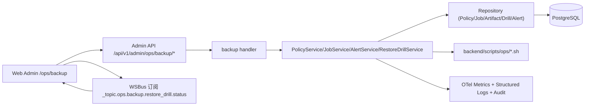
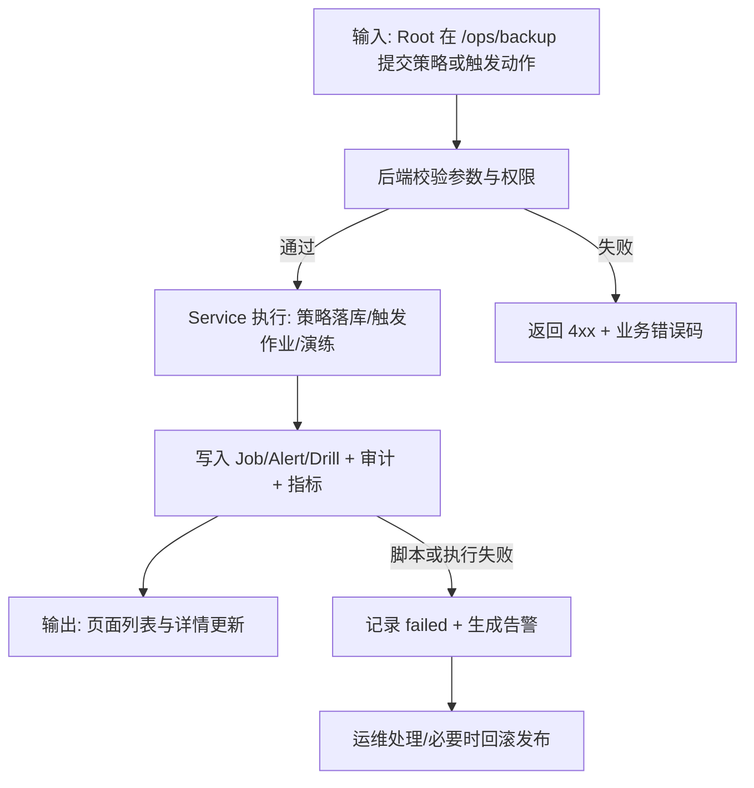
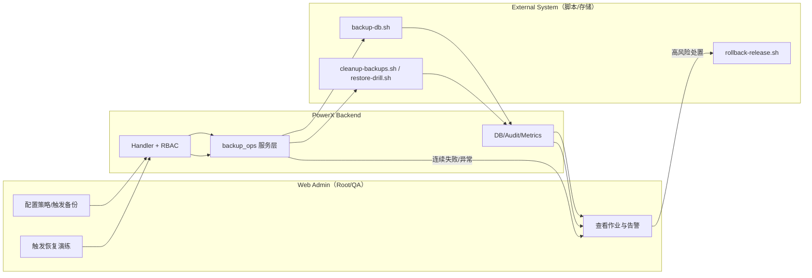

# 自动备份闭环（027-monitor-center）使用指导（版本：v0.3）

## 1. 功能背景与目标

### 1.1 为什么要做
- 业务背景：生产环境需要稳定的数据库备份与可恢复能力，且需要在监控中心可观察。
- 当前痛点：仅“有备份脚本”无法保证可持续执行与可追踪，失败后定位成本高。
- 目标收益：形成“策略 -> 作业 -> 告警 -> 演练”闭环，降低数据风险与值班成本。

### 1.2 本文解决什么问题
- 面向角色：Root 管理员、运维、QA、后端研发、前端研发。
- 本文范围：自动备份策略管理、任务监控、告警确认、恢复演练、观测与回滚。
- 非本文范围：gRPC 合同与实现（本期仅 Admin HTTP）。

## 2. 角色与适用范围

- 适用环境：dev/staging/prod（建议先在 staging 验证）。
- 权限要求：Root 管理员，且具备 `ops.backup` 读写能力（后端通过 `RequireOpsPermission` 校验）。
- 入口页面：`/ops/backup`（备份恢复中心）、`/monitor`（监控中心，含备份入口跳转）。

## 3. 整体架构与模块关系



- 前端模块：
  - `web-admin/app/pages/ops/backup.vue`
  - `web-admin/app/components/ops/backup/RestoreDrillPanel.vue`
  - `web-admin/app/composables/api/services/backupOpsService.ts`
- 后端模块：
  - `backend/internal/transport/http/admin/backup/routes.go`
  - `backend/internal/transport/http/admin/backup/handler.go`
  - `backend/internal/service/backup_ops/*.go`
- 外部依赖：PostgreSQL、脚本执行环境、OTel/Prometheus。

## 4. 核心流程



## 5. 跨角色协作流程



## 6. 前置条件与依赖

### 6.1 配置
- 必要：`TOKEN`（Root 登录态）。
- 推荐：
  - `OTEL_EXPORTER_OTLP_ENDPOINT`
  - `OTEL_SERVICE_NAME=powerx-backend`
- 可选：`POWERX_OPS_SCRIPT_DIR`（覆盖默认脚本目录 `backend/scripts/ops`）。

### 6.2 权限与数据
- 角色：Root 管理员。
- 初始数据：目标备份标识（默认 `powerx_bak`）。
- 数据库：已执行包含 `backup_policy/job/artifact/drill/alert` 的迁移。

### 6.3 运行依赖
- backend 与 web-admin 可启动。
- 脚本可执行：`backup-db.sh`、`cleanup-backups.sh`、`restore-drill.sh`、`rollback-release.sh`。

## 7. 操作步骤（按场景拆分）

### 7.1 Use Case 索引

| Use Case | 文档 | 适用角色 | 验收口径 |
|---|---|---|---|
| US1 自动备份策略配置与启停 | [usecase-us1-policy-automation.md](./usecase-us1-policy-automation.md) | Root/QA | 策略可创建、可编辑、可启停，默认值正确 |
| US2 任务与告警监控 | [usecase-us2-monitor-and-alert.md](./usecase-us2-monitor-and-alert.md) | Root/运维/QA | 作业历史可见，失败可见，告警可确认 |
| US3 恢复演练可用性验证 | [usecase-us3-restore-drill.md](./usecase-us3-restore-drill.md) | Root/运维/QA | 演练可发起、状态可追踪、结论可判定 |

### 7.2 页面操作步骤（Web Admin）
1. 动作：进入备份中心页面。
   - 入口：`/ops/backup`
   - 预期结果：看到“备份恢复中心”标题和“策略管理/执行动作/告警列表/恢复演练”。
   - 失败处理：检查是否 Root 权限，查看页面提示与 `permissionHint`。
2. 动作：创建策略并启用。
   - 入口：策略管理表单 + 策略列表“启用”按钮。
   - 预期结果：列表出现策略，状态为“启用中”。
   - 失败处理：按表单错误提示修正（如时区非法）。

### 7.3 接口调用步骤（Admin API）
1. 动作：创建策略。
   - 命令：
```bash
curl -sS -X POST "http://127.0.0.1:8080/api/v1/admin/ops/backup/policies" \
  -H "Authorization: Bearer $TOKEN" \
  -H "Content-Type: application/json" \
  -d '{"name":"prod-default-policy","interval_hours":6,"retention_count":14,"timezone":"Asia/Shanghai","drill_enabled":true,"drill_interval_days":7,"target_ref":"powerx_bak"}' | jq
```
   - 预期结果：`data.policy.id` 非空。
   - 失败处理：查看 `message/error/details.code`（如 `backup.invalid_policy`）。
2. 动作：触发作业并查看历史。
   - 命令：
```bash
curl -sS -X POST "http://127.0.0.1:8080/api/v1/admin/ops/backup/jobs/run" \
  -H "Authorization: Bearer $TOKEN" -H "Content-Type: application/json" \
  -d '{"policy_id":"<POLICY_ID>"}' | jq

curl -sS "http://127.0.0.1:8080/api/v1/admin/ops/backup/jobs?page=1&page_size=20" \
  -H "Authorization: Bearer $TOKEN" | jq
```
   - 预期结果：`data.job` 与 `data.items` 返回有效。
   - 失败处理：如 `backup.policy_busy`，等待运行中任务结束后重试。

### 7.4 本地联调步骤（backend/web-admin/脚本）
1. 动作：启动服务。
   - 命令：
```bash
cd backend && make dev
cd web-admin && npm run dev
```
   - 预期结果：`/ops/backup` 可访问。
   - 失败处理：检查端口占用、环境变量、日志权限。
2. 动作：校验指标与日志。
   - 命令：
```bash
curl -sS http://127.0.0.1:2112/metrics | grep -E "powerx_ops_backup_total|powerx_ops_backup_error_total|powerx_ops_backup_latency_ms"
journalctl -u powerx-backend -n 300 --no-pager | grep -E "backup\.api|backup\.job\.execute|backup\.restore_drill\.execute"
```
   - 预期结果：指标有数据，日志含结构化字段（`policy_id/job_id/drill_id/status/trace_id`）。
   - 失败处理：确认 OTel/Prometheus 暴露与 backend 日志级别。

## 8. 预期结果与验收标准

- [ ] Root 可在 3 分钟内完成策略创建与启用。
- [ ] 自动备份按策略触发，作业历史可检索。
- [ ] 连续失败会升级高优先级告警，且可在页面确认。
- [ ] 恢复演练有明确状态与结果摘要。
- [ ] 指标、日志、trace_id 可用于端到端排障。

## 9. 代码实现映射

| 文档步骤 | 代码位置 | 说明 |
|---|---|---|
| 路由注册 | `backend/internal/transport/http/admin/backup/routes.go` | `/admin/ops/backup/*` 与兼容 `/admin/backup/*` |
| Handler | `backend/internal/transport/http/admin/backup/handler.go` | 参数校验、统一回包、结构化日志 |
| 策略服务 | `backend/internal/service/backup_ops/policy_service.go` | 默认值注入、时区校验、启停 |
| 作业/调度服务 | `backend/internal/service/backup_ops/job_service.go` | 触发、调度、防重入、清理、周演练触发 |
| 演练服务 | `backend/internal/service/backup_ops/restore_drill_service.go` | queued/running/success/failed 状态机 |
| 告警服务 | `backend/internal/service/backup_ops/alert_service.go` | 连续失败升级 high、告警确认 |
| 可观测性 | `backend/internal/service/backup_ops/instrumentation/metrics.go` | `operation/result` 标签指标 |
| 前端页面 | `web-admin/app/pages/ops/backup.vue` | 策略/作业/告警/演练一体化页面 |
| 前端 API 客户端 | `web-admin/app/composables/api/services/backupOpsService.ts` | 备份域 API 封装 |
| E2E Smoke | `web-admin/tests/e2e/ops/backup-center.spec.ts` | 主链路回归样例 |

## 10. 常见问题与排障

### Q1：接口返回 `backup.policy_busy`
- 现象：触发备份返回冲突。
- 排查命令：
```bash
curl -sS "http://127.0.0.1:8080/api/v1/admin/ops/backup/jobs?status=running&page=1&page_size=20" -H "Authorization: Bearer $TOKEN" | jq
```
- 修复建议：等待运行中的同策略任务结束，避免并发触发。

### Q2：恢复演练状态不更新
- 现象：页面显示“实时推送未连接”或状态停留。
- 排查命令：
```bash
journalctl -u powerx-backend -n 300 --no-pager | grep -E "restore_drill|_topic.ops.backup.restore_drill.status"
```
- 修复建议：确认 WS 链路可用，确认后端是否发布 `_topic.ops.backup.restore_drill.status` 事件。

### Q3：日志出现脚本执行失败
- 现象：`trigger cleanup failed` 或作业 `failed`。
- 排查命令：
```bash
ls -l backend/scripts/ops/*.sh
journalctl -u powerx-backend -n 500 --no-pager | grep -E "backup-db|cleanup-backups|restore-drill"
```
- 修复建议：检查脚本可执行权限、脚本目录配置（`POWERX_OPS_SCRIPT_DIR`）与目标环境连通性。

## 11. 回滚与风险控制

- 回滚开关：停用策略 `POST /admin/ops/backup/policies/{policy_id}/disable`。
- 回滚步骤：
  1. 停用策略，防止继续触发失败任务。
  2. 确认高优先级告警并记录处置。
  3. 如与发布变更相关，执行 `backend/scripts/ops/rollback-release.sh` 回滚版本。
- 风险提示：清理与演练失败不应阻塞新备份写入；但必须确保告警可见并及时处理。

## 12. 变更记录

- 版本：v0.3
- 日期：2026-04-11
- 修改人：Codex
- 变更内容：基于 `027-monitor-center` 当前实现生成总览手册与分场景用例文档索引。
