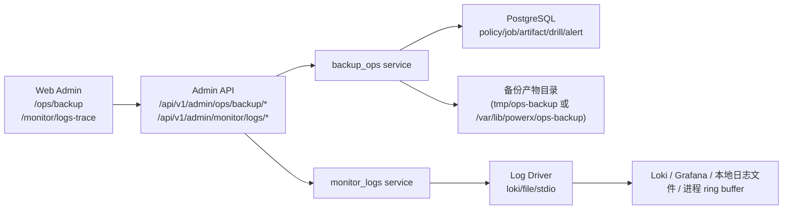
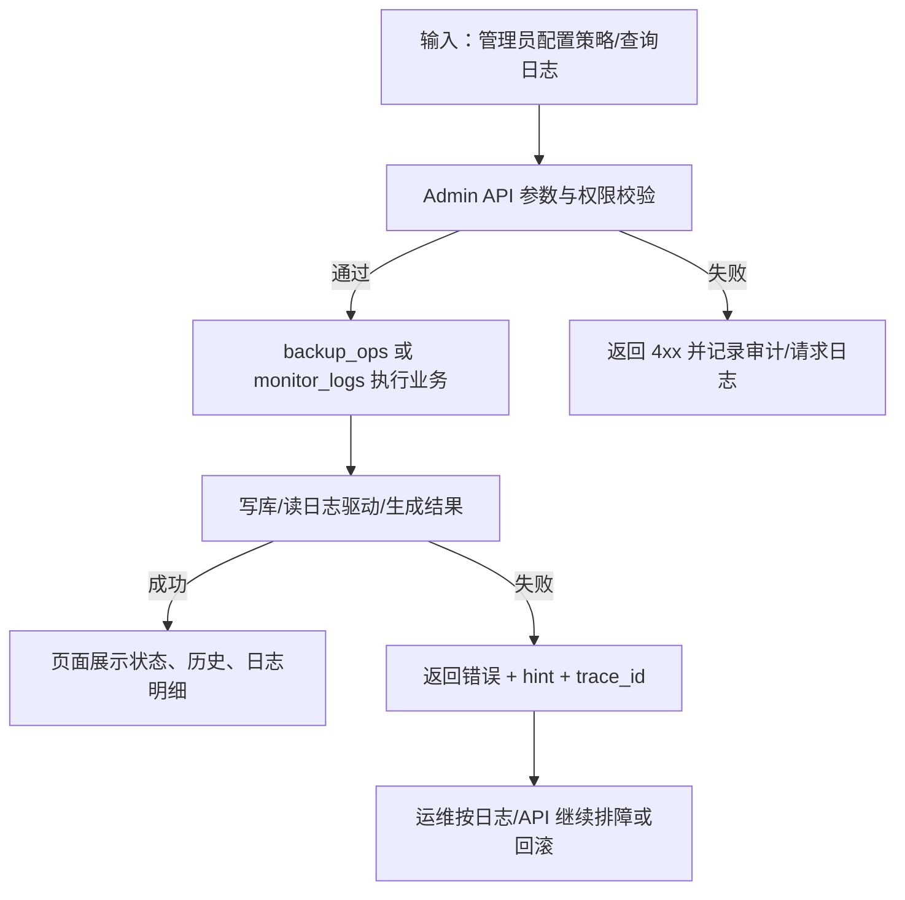
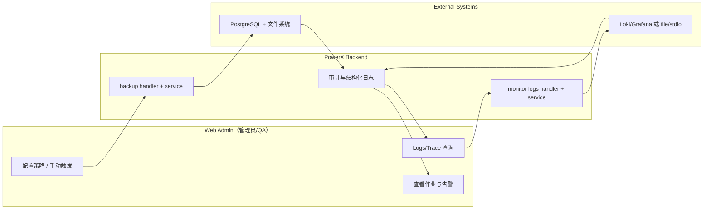

# 监控中心闭环（Backup + Logs）使用指导（版本：v0.2）

## 1. 功能背景与目标

### 1.1 为什么要做
- 业务背景：PowerX 需要把“备份可执行、恢复可验证、日志可定位”沉淀为统一运维能力。
- 当前痛点：历史上存在“有备份任务但不可观测”、“失败只能查服务器日志”、“驱动差异导致页面行为不一致”。
- 目标收益：在监控中心形成端到端闭环，Root 管理员可在一个入口完成策略配置、任务观测、恢复验证、日志排障。

### 1.2 本文解决什么问题
- 面向角色：平台管理员（Root）、运维、QA、研发。
- 本文范围：`027-monitor-center` 的 Backup + Logs 功能（Admin HTTP、Web Admin）。
- 非本文范围：gRPC 对外合同、多集群备份编排、对象存储生命周期治理。

## 2. 角色与适用范围

| 角色 | 主要职责 | 环境 |
|---|---|---|
| Root 管理员 | 策略配置、手动触发、恢复任务、日志查询 | dev / staging / prod |
| 运维 | 调度巡检、故障排查、回滚操作 | staging / prod |
| QA | 主链路与失败分支验收 | dev / staging |
| 研发 | 本地联调与问题定位 | local dev |

权限边界：
- 本特性所有入口默认按 Root 或 `platform_ops.backup` 权限控制。
- Logs API 当前复用 Ops Backup 读权限中间件。

## 3. 整体架构与模块关系



- 前端模块：`web-admin/app/components/monitor/MonitorCenterWorkspace.vue`、`/ops/backup` 页面。
- 后端模块：`backup` handler + `backup_ops` service，`monitor` handler + `monitor_logs` service。
- 外部依赖：PostgreSQL、可选 Loki/Grafana、系统文件系统、systemd 日志。
- 与其他功能关系：与事件总线监控、审计日志、OTel 指标共同组成运维观测面。

## 4. 核心流程



## 5. 跨角色协作流程（泳道图）



## 6. 前置条件与依赖

### 6.1 配置
- 基础配置：`backend/etc/config.yaml` 或 `POWERX_CONFIG` 指定路径。
- 关键项：
  - 备份：`POWERX_OPS_SCRIPT_DIR`、`POWERX_OPS_BACKUP_ARTIFACT_DIR`、`POWERX_OPS_BACKUP_SOURCE_DSN`（可选）
  - 日志驱动：`log.loki.enable/url`、`log.file.enable/info_file_path/error_file_path`
  - 回退项：`POWERX_LOG_DRIVER`（`loki|file`，未命中时默认 `stdio`）
  - 插件采集：`POWERX_SUPERVISOR_FORWARD_STDIO=true`（建议开启，保证宿主模式插件日志进入统一采集链路）
- 配置优先级（日志驱动）：
  1. `log.loki.enable=true` -> `loki`
  2. `log.file.enable=true` -> `file`
  3. `POWERX_LOG_DRIVER` -> `loki/file`
  4. 默认 `stdio`

### 6.2 权限与数据
- 需要 Root 登录态（或具备 Ops Backup 对应 RBAC 权限）。
- 至少存在 1 条可用备份策略用于观测。
- 若验证恢复链路，需可访问源库与目标探测库。

### 6.3 依赖可用性
- `pg_dump`/`psql` 可执行（备份/恢复脚本依赖）。
- 若使用 Loki：`log.loki.url` 网络可达。

## 7. 操作步骤（按场景拆分）

本特性按可独立验收链路拆分为 4 个 Use Case：

| Use Case | 文档 | 适用角色 | 验收口径 |
|---|---|---|---|
| US1 配置并启用自动备份策略 | [usecase-us1-policy-automation.md](/private/var/www/html/ArtisanCloud/X/PowerX/Core/PowerX/docs/guides/deploy/027-monitor-center/usecase-us1-policy-automation.md) | 管理员/QA | 策略保存成功且能启停 |
| US2 监控备份任务状态与历史 | [usecase-us2-monitor-and-alert.md](/private/var/www/html/ArtisanCloud/X/PowerX/Core/PowerX/docs/guides/deploy/027-monitor-center/usecase-us2-monitor-and-alert.md) | 运维/QA | 可观察作业、告警、摘要 |
| US3 触发恢复任务验证可用性 | [usecase-us3-restore-drill.md](/private/var/www/html/ArtisanCloud/X/PowerX/Core/PowerX/docs/guides/deploy/027-monitor-center/usecase-us3-restore-drill.md) | 运维/QA | 恢复任务有明确成功/失败结论 |
| US4 日志与链路追踪监控 | [usecase-us4-logs-trace.md](/private/var/www/html/ArtisanCloud/X/PowerX/Core/PowerX/docs/guides/deploy/027-monitor-center/usecase-us4-logs-trace.md) | 运维/研发/QA | 三驱动能力一致、可查询可排障 |

## 8. 预期结果与验收标准

- [ ] 策略创建、启停、设为当前策略可用。
- [ ] 自动/手动作业记录可分页查询，失败摘要清晰。
- [ ] 恢复任务可执行，状态机可见（queued/running/success/failed）。
- [ ] Logs/Trace 页根据 `loki/file/stdio` 正确降级。
- [ ] 至少完成 1 条失败分支验收（如脚本缺失、驱动不可达）。
- [ ] 审计/日志可检索到 `monitor.logs.config`、`monitor.logs.query`。

## 9. 代码实现映射

| 文档步骤 | 代码位置 | 说明 |
|---|---|---|
| 备份路由入口 | `backend/internal/transport/http/admin/backup/routes.go` | `/admin/ops/backup/*` 注册与权限中间件 |
| 备份 Handler | `backend/internal/transport/http/admin/backup/handler.go` | 策略/作业/恢复/告警 API |
| 备份核心逻辑 | `backend/internal/service/backup_ops/*.go` | 调度、执行、清理、恢复、告警 |
| 监控日志路由入口 | `backend/internal/transport/http/admin/monitor/routes.go` | `/admin/monitor/logs/config|query` |
| 监控日志 Handler | `backend/internal/transport/http/admin/monitor/log_config_handler.go`、`log_query_handler.go` | 配置查询、日志查询、审计日志 |
| 日志驱动适配 | `backend/internal/service/monitor_logs/*.go` | loki/file/stdio provider dispatch |
| stdio ring buffer | `backend/pkg/utils/logger/runtimebuffer/buffer.go`、`backend/pkg/utils/logger/manager.go` | stdout 同步写入 ring buffer |
| 前端监控页面 | `web-admin/app/components/monitor/MonitorCenterWorkspace.vue` | Logs/Trace 能力感知 UI |
| 前端 API 客户端 | `web-admin/app/composables/api/services/monitorService.ts` | `logs/config` + `logs/query` |
| 前端状态存储 | `web-admin/app/stores/monitorLogs.ts` | 配置、列表、分页、query_meta |

## 10. 常见问题与排障

### Q1：Logs 页没有 provider/model 或日志能力空白
- 现象：Logs/Trace 页面无数据或 driver 与预期不一致。
- 排查命令：
```bash
curl -sS -H "Authorization: Bearer $TOKEN" \
  "http://127.0.0.1:8080/api/v1/admin/monitor/logs/config" | jq
```
- 修复建议：检查 `config.yaml` 的 `log.loki`/`log.file` 与 backend 重启状态。

### Q2：备份任务成功但产物太小或不可恢复
- 现象：`size_bytes` 异常小或恢复失败。
- 排查命令：
```bash
curl -sS -H "Authorization: Bearer $TOKEN" \
  "http://127.0.0.1:8080/api/v1/admin/ops/backup/jobs?page=1&page_size=20" | jq
journalctl -u powerx-backend -n 300 --no-pager | grep -E "backup.job.execute|error"
```
- 修复建议：检查 `pg_dump` 可执行性、源库 DSN、脚本路径与执行权限。

### Q3：stdio 模式查不到历史日志
- 现象：查询结果仅少量或为空。
- 排查命令：
```bash
curl -sS -H "Authorization: Bearer $TOKEN" \
  "http://127.0.0.1:8080/api/v1/admin/monitor/logs/query?page=1&page_size=20" | jq '.data.query_meta'
```
- 修复建议：stdio 仅保证最近窗口；需要历史检索时切换到 `file` 或 `loki`。

### Q4：插件日志在 Runtime Logs 可见，但监控日志页检索不到
- 现象：插件进程有输出，`/admin/plugins/:id/logs` 能看到，但 `/admin/monitor/logs/query` 命中率低。
- 排查命令：
```bash
grep POWERX_SUPERVISOR_FORWARD_STDIO /etc/powerx/powerx.env
```
- 修复建议：将 `POWERX_SUPERVISOR_FORWARD_STDIO=true` 并重启 `powerx-backend`，确保插件 stdout/stderr 进入 journald/promtail 采集链路。

## 11. 回滚与风险控制

- 回滚开关：
  - 临时停用自动备份策略：`POST /api/v1/admin/ops/backup/policies/{id}/disable`
  - 临时停止日志深链依赖：关闭 `log.loki.enable` 并重启 backend
- 回滚步骤：
  1. 先停策略，避免持续失败告警扩大。
  2. 若发布导致异常，执行 `backend/scripts/ops/rollback-release.sh`。
  3. 使用作业历史与日志查询确认系统恢复。
- 风险提示：
  - 在 prod 切换日志驱动时，需确认可观测能力降级影响（Grafana 深链是否可用）。
  - 恢复任务需确保目标库隔离，避免误覆盖业务库。

## 12. 变更记录

- 2026-04-13 / Codex：新增监控中心闭环总览文档，拆分 4 条 Use Case 指导。
- 2026-04-24 / Codex：补充插件日志采集对齐说明（`POWERX_SUPERVISOR_FORWARD_STDIO`）与常见排障场景。
