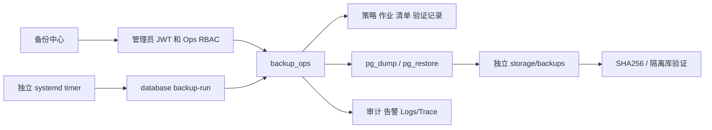
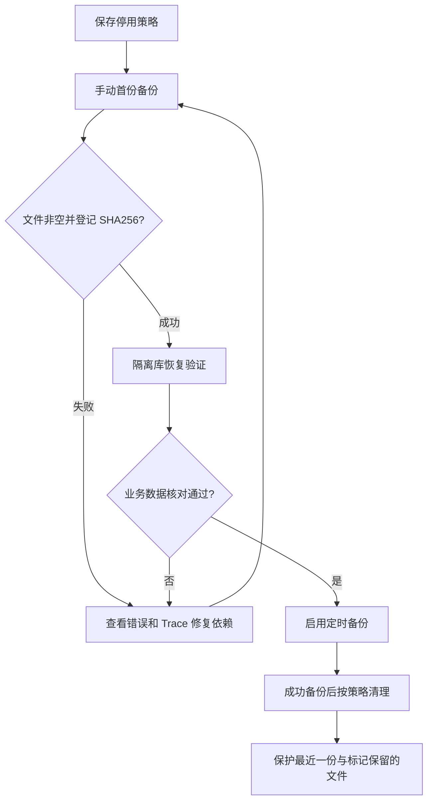
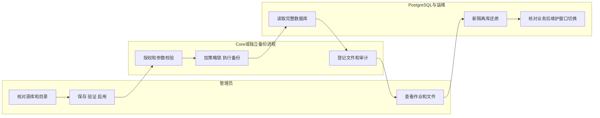

# 备份恢复中心与日志观测操作手册

## 1. 功能背景与目标

备份中心入口：**监控中心 → 备份中心**，页面 `/ops/backup`。管理员能够确认备份的源库、实际文件、保留规则，并验证归档能否还原。页面存在不会自动开启备份，必须创建并启用策略。

当前实现为 PostgreSQL 完整数据库的逻辑备份，包含 Core 和插件 schema；不备份媒体文件、配置、密钥或 PostgreSQL 集群角色。异机副本和 WAL/PITR 尚需独立运维配置。当前空库的备份不能找回事故前已缺失的数据。

## 2. 角色与适用范围

| 角色 | 可以做什么 | 前提 |
|---|---|---|
| 平台管理员 | 配置、执行、保留备份、恢复验证 | Root 或 `platform_ops:backup:read` / `platform_ops:backup:execute` |
| 运维 | 部署、目录权限、独立 timer、正式库切换 | 服务器权限、PostgreSQL 管理权限 |
| QA | 检查成功和失败链路 | 测试数据库；不覆盖生产数据 |

这是管理员运维接口，不能用插件 API Key / STS 或普通租户成员绕过授权读取完整数据库。生产还原需要维护窗口。

## 3. 整体架构与模块关系


```mermaid
flowchart LR
 UI[备份中心] --> HTTP[管理员 JWT 和 Ops RBAC]
 HTTP --> SVC[backup_ops]
 TIMER[独立 systemd timer] --> CLI[database backup-run]
 CLI --> SVC
 SVC --> DB[策略 作业 清单 验证记录]
 SVC --> PG[pg_dump / pg_restore]
 PG --> FILE[独立 storage/backups]
 FILE --> CHECK[SHA256 / 隔离库验证]
 SVC --> AUDIT[审计 告警 Logs/Trace]
```

Core 自带调度器；独立 timer 可在 Core HTTP 进程停止时继续运行。二者使用 PostgreSQL 策略锁，防止重复执行。数据库本身不可用时无法生成有效备份，既有文件仍应保存在独立目录和异机副本中。

## 4. 核心流程


```mermaid
flowchart TD
 A[保存停用策略] --> B[手动首份备份]
 B --> C{文件非空并登记 SHA256?}
 C -->|失败| E[查看错误和 Trace 修复依赖]
 E --> B
 C -->|成功| D[隔离库恢复验证]
 D --> F{业务数据核对通过?}
 F -->|否| E
 F -->|是| G[启用定时备份]
 G --> H[成功备份后按策略清理]
 H --> I[保护最近一份与标记保留的文件]
```

## 5. 跨角色协作流程


```mermaid
flowchart LR
 subgraph 管理员
  A[核对源库和目录] --> B[保存 验证 启用]
  C[查看作业和文件]
 end
 subgraph Core或独立备份进程
  D[授权和参数校验] --> E[加策略锁 执行备份]
  F[登记文件和审计]
 end
 subgraph PostgreSQL与运维
  G[读取完整数据库]
  H[新隔离库还原]
  I[核对业务后维护窗口切换]
 end
 B --> D
 E --> G --> F --> C
 C --> H --> I
```

## 6. 前置条件与依赖

- PostgreSQL 客户端：`pg_dump`、`pg_restore`、`psql`、`createdb`、`dropdb`。版本应与服务器匹配；缺失时明确失败。
- Core 服务用户能读取完整源数据库、写入备份目录。恢复验证还需创建/删除本次隔离库和安装归档所需扩展的权限。
- 执行正式 Core `database migrate`，新增 `retention_mode` 和 `protected` 字段走集中模型迁移。**禁止使用 refresh 升级**；生产/预发布环境已禁止 refresh，开发/测试需显式确认数据库和 schema。
- 源库来自 Core 当前数据库连接，包含实际环境覆盖后的配置，页面不要求填写另一个“备份目标库”。

### 保存位置、格式与权限

| 配置/产物 | 实际规则 |
|---|---|
| 优先目录 | `POWERX_OPS_BACKUP_ARTIFACT_DIR`，必须为绝对路径 |
| 未指定目录 | `POWERX_LINKS_ROOT/storage/backups` |
| 本地无 links root | 当前系统用户 `~/.powerx/storage/backups` |
| 正式站 | `/opt/powerx/storage/backups` |
| 开发站 | `/opt/powerx-dev/storage/backups` |
| 文件目录 | `<tenant>/policy_<id>/<YYYY>/<MM>/<DD>/`，UTC 日期 |
| 数据归档 | `job_<id>_<YYYYMMDDTHHMMSSZ>.dump`，PostgreSQL custom archive；用 `pg_restore`，不能当 SQL 或 tar 包 |
| 校验文件 | 同名 `.dump.sha256`，可用 `sha256sum -c` |
| 清单文件 | 同名 `.dump.json`，含合同版本、源数据库、任务/策略、时间、大小、SHA256、格式；不含密码 |
| 权限 | 新文件及清单 `0600`；新目录 `0750`，由 Core 服务用户拥有 |

例：`/opt/powerx/storage/backups/<tenant>/policy_1/2026/10/08/job_5_20261008T150000Z.dump`，旁边有 `.dump.sha256` 和 `.dump.json`。新归档保留对象 owner/ACL，隔离验证使用 `--no-owner --no-privileges`；同集群正式恢复可恢复原 owner/ACL，目标必须已有相应角色。旧归档若没有 ACL 或清单，需单独确认授权并从已登记元数据取得校验值。

目录不随 release 版本切换或清理。文件不在浏览器机器上。目录中的 tenant 标记不表示租户数据子集；此备份包含完整数据库，权限只应授予平台运维。没有租户上下文时目录名为 tenant_unknown。`target_ref=local_dump` 只是策略标识，不决定源库或写入另一个数据库。改变目录后，已有文件应由运维保留并核对迁移；清理拒绝访问当前根目录之外的文件。

### 保留与删除

- 新策略默认：**1 小时 / 7 天 / 最多 168 份**，停用，自动恢复验证关闭。
- `age_and_count`：超过天数 **或** 超过份数就过期。天数范围 1–3650，份数 1–10000。
- `count`：只按份数，时间不构成上限。旧策略迁移后保留此模式；编辑时新天数输入默认 7，不把历史误存的份数当成保留天数。选择“天数及份数”后才按天数执行过期。
- 最近一份已登记成功备份、标记“保留此备份”的文件不清理，可能超过天数或份数上限；保护文件仍计入份数排序。
- 删除发生在新备份成功后或点击“清理过期文件”时；修改策略本身不立即删除文件，策略停用且没有手动清理时不会按墙钟准点删除。
- 清理删除已登记的实际 `.dump` 和同名清单，再软删产物记录。任务和审计保留。校验失败、越界或符号链接会阻止清理并告警；不扫描删除未登记文件或事故快照目录。
- 最长“按时间过期”的配置是 3650 天；保护备份和最近一份没有自动删除时限。

## 7. 操作步骤（按场景拆分）

| 场景 | 手册 | 成功信号 |
|---|---|---|
| 配置目录、策略和独立 timer | [US1 配置自动备份](usecase-us1-policy-automation.md) | 首份文件及 SHA256，验证成功，策略启用 |
| 还原验证、正式切换及回滚 | [US3 恢复流程](usecase-us3-restore-drill.md) | 隔离验证 + 业务核对 + 明确的维护窗口切换 |
| 告警巡检 | [US2 监控](usecase-us2-monitor-and-alert.md) | 作业、错误和告警可定位 |
| Loki / Trace | [US4 日志](usecase-us4-logs-trace.md) | 关联 request/trace 和错误 |

接口例（先在服务器终端设置自己的 `TOKEN`，不要上传到聊天）：

```bash
curl -fsS -H "Authorization: Bearer $TOKEN" http://127.0.0.1:8080/api/v1/admin/monitor/backup/overview
```

预期 `data.runtime` 给出 `source_database`、`artifact_directory`、`path_template`、`ready`、`problems`，没有 DSN 或密码。404 表示旧 Core 或路由不匹配；403 检查 Ops 权限；`ready=false` 检查所列客户端、脚本和目录问题。

本地验证：在 backend 运行 `go test ./internal/service/backup_ops ./cmd/database`；在 web-admin 运行 `npx vitest run tests/unit/backup/backup-ui.spec.ts`。真实 PG 验证通过 `POWERX_BACKUP_TEST_ADMIN_DSN` 显式启用，只创建并删除测试自己生成的数据库。

## 8. 预期结果与验收标准

- 页面显示实际源库、稳定目录、UTC 文件名、格式、保留方式，缺配置时不显示虚构默认源库。
- 成功备份有非空 dump、独立清单、大小和 SHA256；可以在新库读取 Core 与插件测试记录。
- 并发调度不重复，Core 重启后的到期任务不会重新等待一个完整周期。
- 清理删除真实过期文件及清单，保护最新和保留文件，不删除任务审计。
- 还原拒绝任何自定义目标数据库；缺脚本、坏校验、pg_restore 失败不能报告成功。
- 正式站部署、创建策略、启用 timer、真实业务恢复验收需运维按本手册执行，构建通过不能代替。

## 9. 代码实现映射

| 功能 | 文件 |
|---|---|
| 页面 / typed 客户端 | `web-admin/app/pages/ops/backup.vue` / `backupOpsService.ts` |
| 路由及 RBAC | `backend/internal/transport/http/admin/backup/routes.go` / `authorization.go` |
| 策略、保留 | `policy_service.go` / `retention.go` |
| 稳定路径、调度及跨进程锁 | `job_service.go` / `policy_lock.go` |
| 清理、安全路径、清单 | `artifact_cleanup_service.go` / `artifact_file.go` / `artifact_manifest.go` |
| 恢复 | `restore_drill_service.go` / `backend/scripts/ops/restore-drill.sh` |
| CLI 和破坏操作保护 | `backend/cmd/database/main.go` / `refresh_guard.go` |
| 独立 timer | `deploy/powerx/systemd/powerx*-backup.*` / `install-backup-timer.sh` |
| 回归 | `backup_ops/safety_test.go` / `integration_test.go` / `artifact_directory_test.go` |

## 10. 常见问题与排障

- 无策略/无作业：尚未开启备份；不能从空记录推断历史曾备份。
- 无文件但成功任务仍存在：文件可能已按策略清理；历史任务保留。人工删除文件也会导致恢复失败。
- `backup.policy_busy`：同策略有备份/验证/清理执行中；等待完成。崩溃遗留 running 记录超过脚本超时加 10 分钟后，下一次执行会标记中断再重新执行。
- 切换 release 后脚本缺失：检查完整 dist 的 `backend/scripts/ops`；独立 timer 从稳定 links root 读取当前 release 的脚本。
- HTTP 执行长备份超时：用同环境 `database backup-run -policy-id <id>` 或独立 timer；检查失败作业和文件，不能只看 HTTP 200。
- 整机或磁盘损坏：同机 dump 无法覆盖此故障；需另做加密异机副本、云磁盘快照和恢复演练。不要把本地保留天数误当远端桶生命周期。

## 11. 回滚与风险控制

停用策略可停止后续自动备份，停用 timer 只停止独立调度（Core 调度仍会运行）。恢复失败时保留现有库和候选库进行检查；正式切换后的回滚见 US3。

自动验证不覆盖现有库，只删除本次成功创建的隔离库。进程被强杀可能留下隔离库，运维核对验证记录里的实际库名后才能清理。不要按通配符批量 DROP 数据库。

备份不替代最小数据库权限、DDL 审计和业务删除审计。现有应用或插件角色的 superuser/schema owner 权限需要单独拆分迁移角色和运行角色，不能直接移除而使安装迁移失效。本次没有自动修改线上角色权限，也没有把历史缺失数据的原因认定为已查清。

验收记录：[2026-10-08 备份验证](../../../contracts/evidence/backup-runtime-validation-20261008.json)。真实备份、还原、删除、锁、重启调度及名称切换均在新建测试库验证；线上页面尚未部署验收。本地 `make capability-seed` 因现有配置使用示例 JWT 密钥在连接数据库前失败，未修改密钥或绕过校验。

## 12. 变更记录

- 2026-10-08：修复稳定目录、真实文件清理、保留天数、保护标记、隔离恢复、重启调度、独立 timer 和 refresh 保护；重写页面说明及恢复流程。
