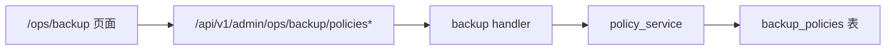
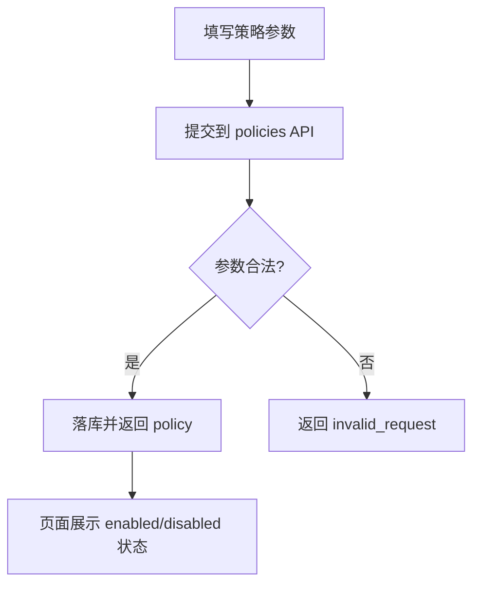
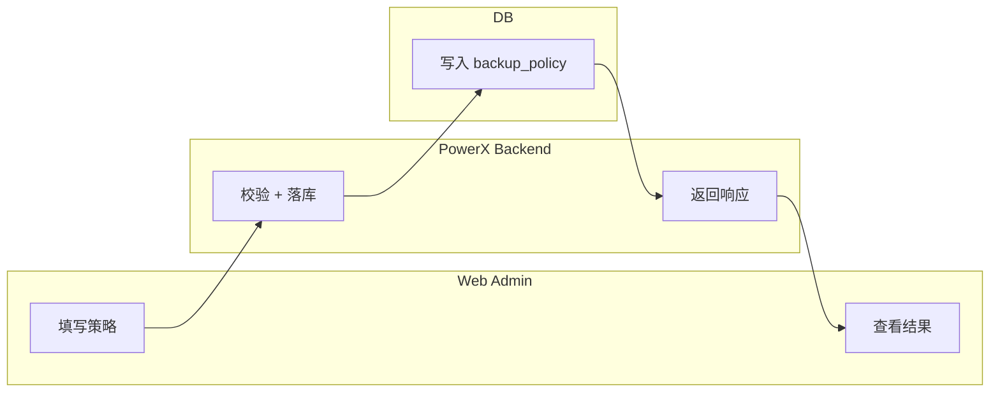

# Use Case US1：配置并启用自动备份策略

## 1. 功能背景与目标

### 1.1 为什么要做
- 业务背景：备份策略是后续作业、告警、恢复链路的入口。
- 当前痛点：策略不统一会导致调度频率与保留窗口不可控。
- 目标收益：在页面和 API 两侧统一策略输入，保障调度基线（6h/14份/Asia/Shanghai）。

### 1.2 本文解决什么问题
- 面向角色：Root 管理员、QA。
- 本文范围：策略创建、编辑、启停、设为当前策略。
- 非本文范围：恢复执行与日志排障。

## 2. 角色与适用范围

- 管理员：负责策略维护。
- QA：验证输入校验与状态变化。
- 环境：local/staging/prod 均适用。

## 3. 整体架构与模块关系



## 4. 核心流程



## 5. 跨角色协作流程



## 6. 前置条件与依赖

- 已登录 Root 账号。
- backend 可用。
- `POST /admin/ops/backup/policies` 路由可访问。

## 7. 操作步骤（可执行）

### 场景 A：页面操作（Web Admin）
1. 动作：进入备份中心并创建策略。  
入口：`/ops/backup`。  
预期结果：策略出现在列表，状态可切换。  
失败处理：若提示校验失败，检查 interval/retention/timezone 必填。

2. 动作：启用策略并设为当前策略。  
入口：列表操作按钮“启用/设为当前”。  
预期结果：`enabled=true`，`is_current=true`。  
失败处理：查看页面报错并在后端日志检索 `backup_policy` 关键字。

### 场景 B：接口调用（Admin API）
1. 调用命令：
```bash
curl -sS -X POST "http://127.0.0.1:8080/api/v1/admin/ops/backup/policies" \
  -H "Authorization: Bearer $TOKEN" \
  -H "Content-Type: application/json" \
  -d '{"name":"prod-default","interval_hours":6,"retention_count":14,"timezone":"Asia/Shanghai","drill_enabled":true,"drill_interval_days":7,"target_ref":"powerx_bak"}' | jq
```
2. 预期响应：`code=200` 且返回 `data.policy`。
3. 失败处理：
```bash
journalctl -u powerx-backend -n 200 --no-pager | grep -E "backup_policy|invalid"
```

### 场景 C：本地联调
1. 启动命令：
```bash
cd backend && make dev
cd web-admin && npm run dev
```
2. 验证命令：
```bash
curl -sS -H "Authorization: Bearer $TOKEN" \
  "http://127.0.0.1:8080/api/v1/admin/ops/backup/policies?page=1&page_size=20" | jq
```
3. 日志定位：
```bash
journalctl -u powerx-backend -n 200 --no-pager | grep -E "backup.policy|http_request"
```

## 8. 预期结果与验收标准

- [ ] 策略可创建、编辑、启停。
- [ ] 默认值基线可见（6h/14份/Asia/Shanghai）。
- [ ] 非法输入会返回明确错误。

## 9. 代码实现映射

| 文档步骤 | 代码位置 | 说明 |
|---|---|---|
| 策略路由 | `backend/internal/transport/http/admin/backup/routes.go` | `/policies` 相关路由 |
| 策略处理 | `backend/internal/transport/http/admin/backup/handler.go` | Create/Update/Enable/Disable |
| 策略服务 | `backend/internal/service/backup_ops/policy_service.go` | 校验与默认值注入 |

## 10. 常见问题与排障

### Q1：策略保存后未启用
- 现象：列表显示 `enabled=false`。
- 排查命令：
```bash
curl -sS -H "Authorization: Bearer $TOKEN" "http://127.0.0.1:8080/api/v1/admin/ops/backup/policies" | jq
```
- 修复建议：显式调用 enable 接口或页面点击启用。

## 11. 回滚与风险控制

- 回滚开关：停用该策略。
- 回滚步骤：`POST /policies/{id}/disable`。
- 风险提示：停用后不会再触发自动备份。

## 12. 变更记录

- 2026-04-13 / Codex：首版 US1 指导文档。
