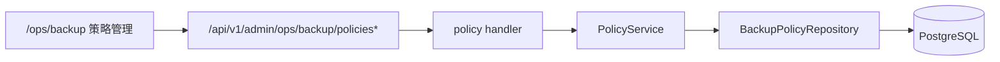
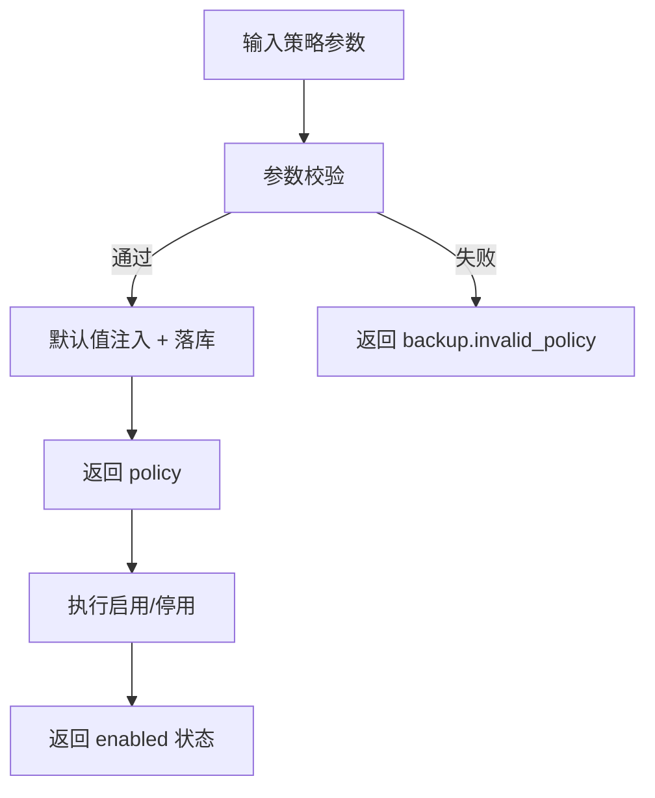
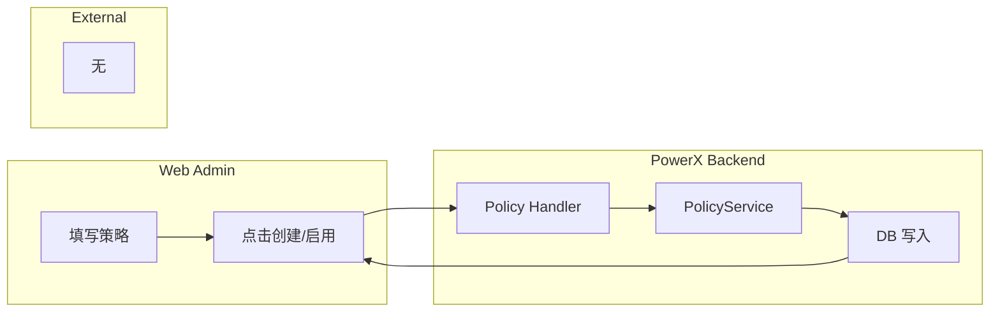

# Use Case：US1 自动备份策略配置与启停

## 1. 功能背景与目标
- 背景：需要把备份从“人工触发”升级为“策略化自动执行”。
- 目标：Root 可配置并启停策略，默认值为 `6h/14份/Asia-Shanghai/周演练`。

## 2. 角色与适用范围
- 角色：Root 管理员、QA。
- 范围：策略创建、编辑、启停、列表筛选。

## 3. 整体架构与模块关系



## 4. 核心流程



## 5. 跨角色协作流程



## 6. 前置条件与依赖
- 已获取 Root `TOKEN`。
- backend/web-admin 正常运行。

## 7. 操作步骤（按场景拆分）

### 7.1 页面操作步骤
1. 动作：打开策略管理页面。
   - 入口：`/ops/backup`
   - 预期结果：看到“策略管理”卡片。
   - 失败处理：确认账号是否 Root。
2. 动作：填写并创建策略。
   - 入口：策略表单。
   - 预期结果：列表出现策略，显示 `6h/14份/Asia/Shanghai`。
   - 失败处理：查看红色表单提示（如时区非法）。
3. 动作：启用/停用策略。
   - 入口：策略行按钮“启用/停用”。
   - 预期结果：状态在“启用中/已停用”切换。
   - 失败处理：看接口返回错误码。

### 7.2 接口调用步骤
```bash
# 创建策略
curl -sS -X POST "http://127.0.0.1:8080/api/v1/admin/ops/backup/policies" \
  -H "Authorization: Bearer $TOKEN" -H "Content-Type: application/json" \
  -d '{"name":"policy-us1","interval_hours":6,"retention_count":14,"timezone":"Asia/Shanghai","drill_enabled":true,"drill_interval_days":7,"target_ref":"powerx_bak"}' | jq

# 启用策略
curl -sS -X POST "http://127.0.0.1:8080/api/v1/admin/ops/backup/policies/<POLICY_ID>/enable" \
  -H "Authorization: Bearer $TOKEN" | jq
```
- 预期结果：分别返回 `data.policy` 与 `data.enabled=true`。
- 失败处理：重点查看 `details.code`。

### 7.3 本地联调步骤
```bash
cd backend && make dev
cd web-admin && npm run dev
```
- 预期结果：页面创建策略后，后端日志可见 `backup.policy.create`。
- 失败处理：`journalctl -u powerx-backend -n 200 --no-pager | grep backup.policy`

## 8. 预期结果与验收标准
- [ ] 策略可创建。
- [ ] 默认值正确。
- [ ] 启停可用。
- [ ] 非法参数被拒绝并有可读错误。

## 9. 代码实现映射

| 步骤 | 代码路径 | 说明 |
|---|---|---|
| 路由 | `backend/internal/transport/http/admin/backup/routes.go` | policies 相关路由 |
| Handler | `backend/internal/transport/http/admin/backup/handler.go` | Create/Update/Enable/Disable |
| Service | `backend/internal/service/backup_ops/policy_service.go` | 默认值 + 校验 + 审计 |
| 前端 | `web-admin/app/pages/ops/backup.vue` | 策略表单与列表 |

## 10. 常见问题与排障
- Q：时区保存失败。
  - 现象：返回 `backup.invalid_policy`。
  - 排查：确认 `timezone` 为 IANA 格式，例如 `Asia/Shanghai`。
  - 修复：使用合法时区并重试。

## 11. 回滚与风险控制
- 若策略误配置：立刻调用 `.../policies/{id}/disable` 停用。
- 风险：高频策略可能造成资源压力，建议先 staging 压测。

## 12. 变更记录
- 版本：v0.3
- 日期：2026-04-11
- 修改人：Codex
- 变更：首次生成 US1 指导文档。
