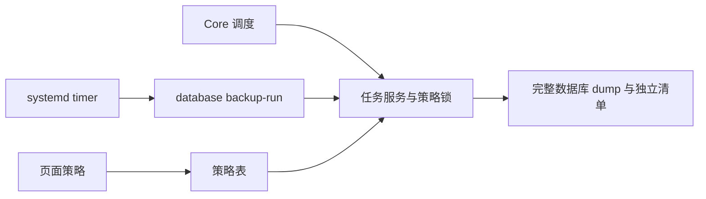
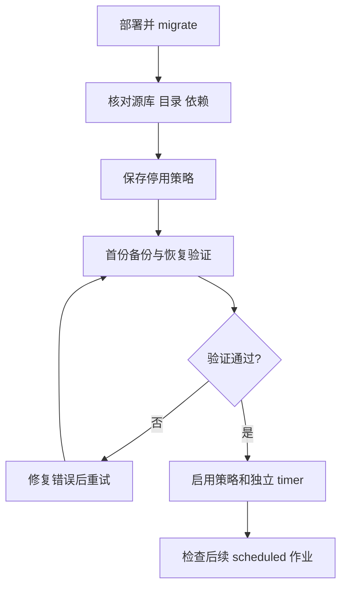
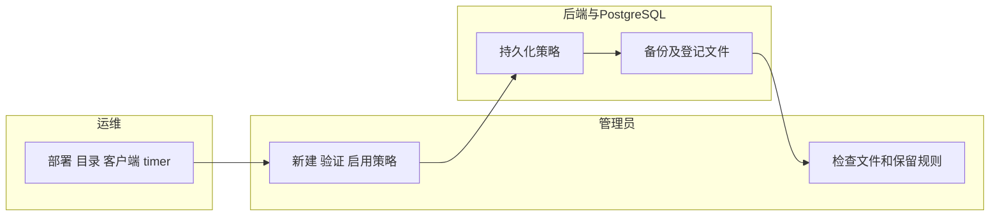

# US1：配置目录、保留策略和自动备份

## 1. 功能背景与目标

开启可验证的数据库备份，并确认文件不会随 release 清理。建议起始策略：**每 1 小时，保留 7 天，最多 168 份**；磁盘容量不足时先调整容量或异机归档。

## 2. 角色与适用范围

平台管理员配置策略，运维安装服务和检查目录。正式环境与开发环境使用各自的 config、env、数据库及目录。权限为 Root 或 `platform_ops:backup:read/execute`。

## 3. 整体架构与模块关系


```mermaid
flowchart LR
 UI[页面策略] --> POLICY[策略表]
 CORE[Core 调度] --> JOB[任务服务与策略锁]
 TIMER[systemd timer] --> CLI[database backup-run] --> JOB
 POLICY --> JOB --> DUMP[完整数据库 dump 与独立清单]
```

## 4. 核心流程


```mermaid
flowchart TD
 A[部署并 migrate] --> B[核对源库 目录 依赖]
 B --> C[保存停用策略]
 C --> D[首份备份与恢复验证]
 D --> E{验证通过?}
 E -->|否| F[修复错误后重试] --> D
 E -->|是| G[启用策略和独立 timer]
 G --> H[检查后续 scheduled 作业]
```

## 5. 跨角色协作流程


```mermaid
flowchart LR
 subgraph 运维
  A[部署 目录 客户端 timer]
 end
 subgraph 管理员
  B[新建 验证 启用策略]
  C[检查文件和保留规则]
 end
 subgraph 后端与PostgreSQL
  D[持久化策略]
  E[备份及登记文件]
 end
 A --> B --> D --> E --> C
```

## 6. 前置条件与依赖

1. **编译和发布**：使用当前代码 `make dist DIST_VERSION="$POWERX_VERSION" NPM_INSTALL=0`，切换后 `/opt/powerx/backend/database --version` 应包含 `backup-run` 和 `backup-restore-verify`。复制 release 目录不等于切换软链接。
2. **迁移**：服务停止窗口先保存当前快照；使用与正式 Core 一样的运行身份和 env 执行 migrate。以下是一行命令：

```bash
sudo systemd-run --wait --pipe --collect --property=User="$(systemctl show powerx-backend -p User --value)" --property=Group="$(systemctl show powerx-backend -p Group --value)" --property=WorkingDirectory=/opt/powerx/backend --property=EnvironmentFile=/etc/powerx/powerx.env /opt/powerx/backend/database migrate -config /etc/powerx/config.yaml
```

预期 `migrate ok`、退出码 0。`refresh` 不用于升级。失败先检查配置验证、实际数据库和 PostgreSQL 日志，不能忽略退出码继续安装。

3. **目录**：正式 env `/etc/powerx/powerx.env` 使用 `POWERX_OPS_BACKUP_ARTIFACT_DIR=/opt/powerx/storage/backups`；开发 `/etc/powerx-dev/powerx.env` 使用 `/opt/powerx-dev/storage/backups`。也可不写这一项，使用各自 `POWERX_LINKS_ROOT/storage/backups`。目录必须为绝对路径。创建正式目录命令：

```bash
sudo install -d -m 0750 -o "$(systemctl show powerx-backend -p User --value)" -g "$(systemctl show powerx-backend -p Group --value)" /opt/powerx/storage/backups
```

预期服务用户有写权限。环境或二进制更新后由运维执行 `sudo systemctl restart powerx-backend`；页面“当前实例”显示新目录才算加载成功。

4. **客户端**：Ubuntu 同版本 PostgreSQL 客户端包含所需命令，例如 PG16 安装 `sudo apt-get install postgresql-client-16`。不要用较旧 pg_dump 备份较新服务器。页面会列出缺失依赖。

## 7. 操作步骤

### 页面配置

1. 打开“监控中心 → 备份中心”，核对上方**实际源数据库**。本服务器正式库应为 `powerx_pro`，开发库为 `powerx_dev`；名称来自运行连接，不能根据页面域名推断。
2. 核对目录和格式：`.dump` 是 PostgreSQL custom archive；同名 `.sha256` 和 `.json` 保存校验与清单。媒体文件、配置、密钥另行保存。
3. “新建策略”：名称填“正式库每小时备份”；间隔 1 小时；保留方式“天数及份数”；天数 7；份数 168；时区 Asia/Shanghai；自动恢复验证先关闭。点击“保存策略”。预期列表显示**已停用**，这是正常状态。
4. 点击“立即备份”。预期作业 `success`，显示服务器路径、大小及 SHA256。失败看错误和 Trace；HTTP 200 不能代替作业 success。
5. 点击该作业“恢复验证”，确认提示后执行。预期 success、新隔离库及表数量报告。具体业务验证见 US3。
6. 点击策略“启用”。预期启用中。每个启用策略都自动执行，不需要设为“当前策略”。
7. 重要事故前快照点击“保留此备份”，预期作业显示“已保留，排除自动清理”。取消保留后可在下一次清理中过期；最新一份仍保护。
8. 修改策略时核对新天数和份数。超过任一限制就过期；清理最近一份和保护文件以外的副本。按份数更早达到上限时，实际可恢复时间窗会短于配置天数。

### 独立调度（正式环境建议启用）

完整 dist 包含 timer 与安装脚本。安装命令读取 Core 的实际 User/Group，生成对应覆盖配置，使用与 Core 相同的 config/env，**不会重启 Core**：

```bash
sudo /opt/powerx/backend/scripts/ops/install-backup-timer.sh powerx-backend
```

开发环境：

```bash
sudo /opt/powerx-dev/backend/scripts/ops/install-backup-timer.sh powerx-dev-backend
```

预期 `powerx-backup.timer` / `powerx-dev-backup.timer` 显示下一次触发。timer 每分钟检查到期策略，而不是每分钟生成一份 dump。Core 调度和 timer 共用数据库策略锁，并在锁内复查到期时间。

验证一行命令：

```bash
sudo systemctl start powerx-backup.service && sudo journalctl -u powerx-backup.service -n 60 --no-pager
```

预期命令退出 0；只有到期策略会生成作业，未到期可返回 `mode=due_policies,status=ok` 而没有新 dump。缺包、客户端、权限或脚本会失败。检查 timer：

```bash
systemctl list-timers powerx-backup.timer --no-pager
```

### API 与 CLI

设置管理员 `TOKEN` 后创建：

```bash
curl -fsS -X POST http://127.0.0.1:8080/api/v1/admin/ops/backup/policies -H "Authorization: Bearer $TOKEN" -H 'Content-Type: application/json' -d '{"name":"正式库每小时备份","interval_value":1,"interval_unit":"hour","retention_count":168,"retention_days":7,"retention_mode":"age_and_count","timezone":"Asia/Shanghai","drill_enabled":false,"target_ref":"local_dump"}'
```

预期 `data.policy.id`、`enabled=false`、`retention_days=7`、`retention_mode=age_and_count`。记录真实 `id`，设置 `POLICY_ID` 为返回值；执行：

```bash
curl -fsS -X POST http://127.0.0.1:8080/api/v1/admin/ops/backup/jobs/run -H "Authorization: Bearer $TOKEN" -H 'Content-Type: application/json' -d "{\"policy_id\":\"$POLICY_ID\"}"
```

检查 `data.job.status`；成功后查询 `/jobs/{job_id}` 得到路径和校验，再显式启用：

```bash
curl -fsS -X POST "http://127.0.0.1:8080/api/v1/admin/ops/backup/policies/$POLICY_ID/enable" -H "Authorization: Bearer $TOKEN" -H 'Content-Type: application/json' -d '{}'
```

长备份使用 CLI，`POLICY_ID` 必须填真实已保存策略：

```bash
sudo systemd-run --wait --pipe --collect --property=User="$(systemctl show powerx-backend -p User --value)" --property=Group="$(systemctl show powerx-backend -p Group --value)" --property=WorkingDirectory=/opt/powerx/backend --property=EnvironmentFile=/etc/powerx/powerx.env /opt/powerx/backend/database backup-run -config /etc/powerx/config.yaml -policy-id "$POLICY_ID"
```

预期任务 success、进程退出 0；失败任务会令 CLI 非零退出。省略 `-policy-id` 仅运行到期策略。

本地联调：根目录 `make dev`，另一终端 `cd web-admin && npm run dev`；默认使用当前用户 `~/.powerx/storage/backups`，不要把本地路径填写进线上 env。

## 8. 预期结果与验收标准

保存、首份备份、隔离验证、启用、后续 scheduled 作业五项都完成才算自动备份启用。测试副本缩短保留规则后清理，应删除真实文件及清单，保留最新、保护文件和任务审计。不能用生产重要备份验证删除。

## 9. 代码实现映射

`policy_service.go` 定义 1h/7天/168份默认值；`RuntimeSettings` 返回运行源库；`job_service.go` 从持久化时间计算到期；`policy_lock.go` 跨进程锁；`artifact_cleanup_service.go` 物理清理；`database main.go` 提供独立入口。模型迁移集中在 `pkg/corex/db/database/migration.go`。

## 10. 常见问题与排障

- `auth.jwt_secret` 校验失败：迁移需同服务 env；不删除安全校验，也不重新使用公开占位密钥。
- `retention_mode/protected` 列缺失：新二进制已运行但未 migrate。
- 目录是旧 release：旧代码或 env 没加载；核对 `/proc/PID/exe`、`database --version` 和页面运行配置。
- timer 不产生文件：检查是否已启用策略以及是否到期；重启 timer 不会重置上次持久化执行时间。
- 清理拒绝文件：根目录/校验/符号链接不合法；不要为了通过清理而删除安全检查。

## 11. 回滚与风险控制

停止独立 timer：`sudo systemctl disable --now powerx-backup.timer`。页面停用策略会停止 Core 与 timer 的未来自动执行；已经执行的备份会继续完成。保留目录和文件，不随程序回滚删除。不要通过 `refresh` 修复列或授权问题。

## 12. 变更记录

2026-10-08：独立存储、清单、时间及份数保留、保护、真实清理、独立调度和部署步骤。
