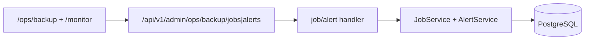
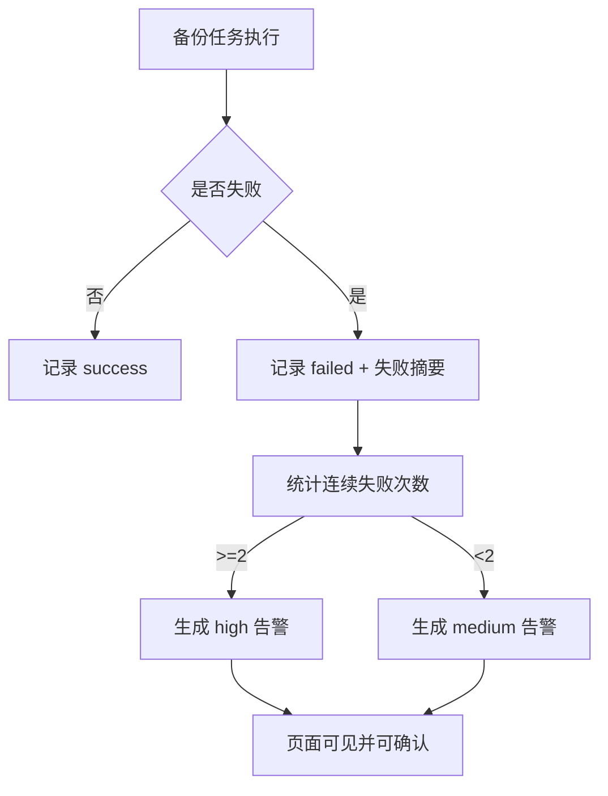
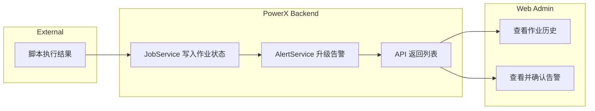

# Use Case：US2 监控备份任务状态与告警

## 1. 功能背景与目标
- 背景：自动执行后，必须保证可观察与可干预。
- 目标：管理员能看到作业历史、失败摘要、告警并完成确认。

## 2. 角色与适用范围
- 角色：Root 管理员、运维、QA。
- 范围：作业列表/详情、告警列表/确认、监控概览。

## 3. 整体架构与模块关系



## 4. 核心流程



## 5. 跨角色协作流程



## 6. 前置条件与依赖
- 至少已有一个策略并可触发作业。
- Root `TOKEN` 可用。

## 7. 操作步骤（按场景拆分）

### 7.1 页面操作步骤
1. 动作：查看作业历史。
   - 入口：`/ops/backup` 的作业表格区域。
   - 预期结果：看到状态、触发类型、耗时、trace。
   - 失败处理：刷新并检查后端作业查询接口。
2. 动作：筛选并确认告警。
   - 入口：告警列表筛选项（级别、确认状态）+ “确认”按钮。
   - 预期结果：告警状态变为已确认。
   - 失败处理：查看 `alert_id` 是否存在、权限是否充足。

### 7.2 接口调用步骤
```bash
# 作业列表
curl -sS "http://127.0.0.1:8080/api/v1/admin/ops/backup/jobs?page=1&page_size=20&status=failed" \
  -H "Authorization: Bearer <TOKEN>" | jq

# 告警列表
curl -sS "http://127.0.0.1:8080/api/v1/admin/ops/backup/alerts?level=high&acked=false&page=1&page_size=20" \
  -H "Authorization: Bearer <TOKEN>" | jq

# 确认告警
curl -sS -X POST "http://127.0.0.1:8080/api/v1/admin/ops/backup/alerts/<ALERT_ID>/ack" \
  -H "Authorization: Bearer <TOKEN>" | jq
```
- 预期结果：列表返回 `data.items`，确认返回 `data.acked=true`。
- 失败处理：若 `backup.alert_not_found`，检查告警 ID。

### 7.3 本地联调步骤
```bash
cd backend && GOCACHE=$PWD/../tmp/gocache GOMODCACHE=$PWD/../tmp/gomodcache go test ./internal/service/backup_ops -run TestAlertLevelForConsecutiveFailures -count=1
```
- 预期结果：测试通过，证明连续失败升级规则有效。
- 失败处理：检查 `alert_service.go` 规则函数。

## 8. 预期结果与验收标准
- [ ] 失败作业可见且包含失败摘要。
- [ ] 连续 2 次失败出现 high 告警。
- [ ] 告警可确认且状态持久化。

## 9. 代码实现映射

| 步骤 | 代码路径 | 说明 |
|---|---|---|
| 作业查询 | `backend/internal/transport/http/admin/backup/handler.go` | `ListBackupJobs/GetBackupJob` |
| 告警查询确认 | `backend/internal/transport/http/admin/backup/handler.go` | `ListAlerts/AckAlert` |
| 失败升级规则 | `backend/internal/service/backup_ops/alert_service.go` | 连续失败到告警级别映射 |
| 监控入口提示 | `web-admin/app/components/monitor/MonitorCenterWorkspace.vue` | 跳转备份中心 |

## 10. 常见问题与排障
- Q：high 告警没有出现。
  - 现象：失败后仍是 medium 或无告警。
  - 排查：检查连续失败是否属于同一策略，查看最近作业状态序列。
  - 修复：确保同策略连续失败达到阈值 2。

## 11. 回滚与风险控制
- 若告警风暴：先停用对应策略，防止持续失败刷屏。
- 风险：忽略 high 告警可能导致“有策略无可用备份”。

## 12. 变更记录
- 版本：v0.3
- 日期：2026-04-11
- 修改人：Codex
- 变更：首次生成 US2 指导文档。
