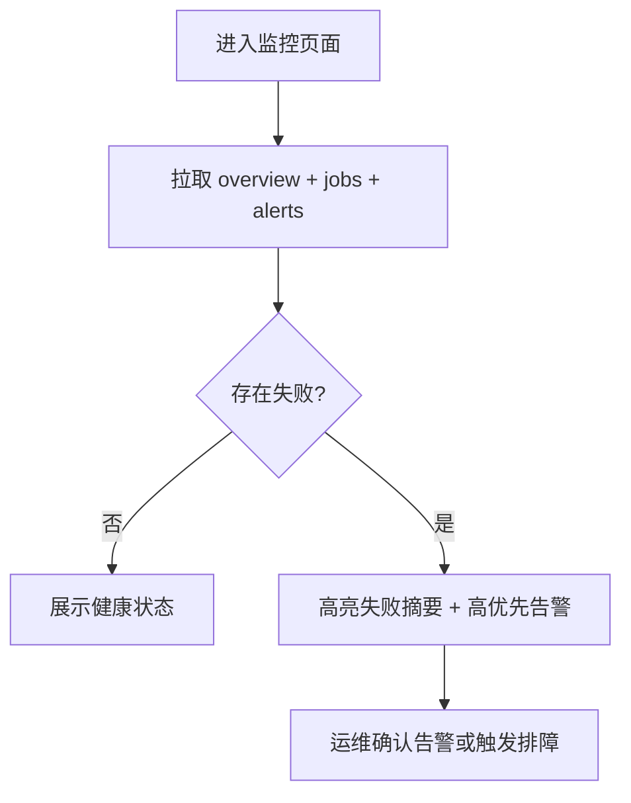
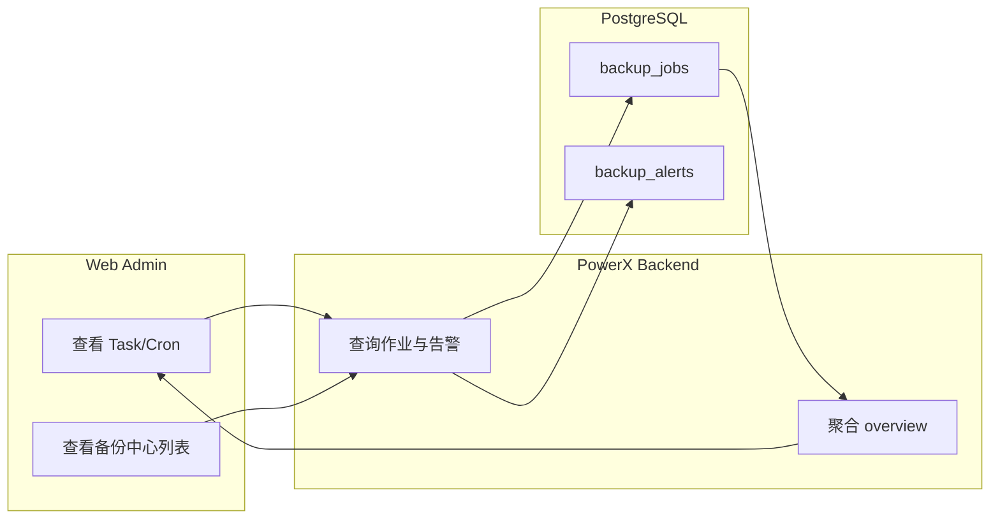

# Use Case US2：监控备份任务状态与历史

## 1. 功能背景与目标

### 1.1 为什么要做
- 业务背景：自动备份必须可观测，才能支撑值班与故障响应。
- 当前痛点：任务失败后若无统一视图，定位时间长。
- 目标收益：在监控中心与备份中心快速看到作业状态、失败摘要、告警。

### 1.2 本文解决什么问题
- 面向角色：运维、QA、管理员。
- 本文范围：作业列表、告警列表、监控概览。
- 非本文范围：恢复执行细节。

## 2. 角色与适用范围

- 运维：日常巡检和告警确认。
- QA：验证状态统计与分页过滤。
- 环境：staging/prod 优先。

## 3. 整体架构与模块关系


## 4. 核心流程



## 5. 跨角色协作流程



## 6. 前置条件与依赖

- 至少存在 1 条已启用策略。
- 已有作业记录（手动或定时触发）。
- Root 权限可读取监控页面。

## 7. 操作步骤（可执行）

### 场景 A：页面操作（Web Admin）
1. 动作：打开 `监控中心 -> Task / Cron`。  
入口：`/monitor/task-cron`。  
预期结果：显示启用策略数、运行中任务数、24h 失败数。  
失败处理：点击“刷新备份监控”，若仍失败查看 API 返回。

2. 动作：打开 `运维中心 -> 备份中心` 查看作业与告警。  
入口：`/ops/backup`。  
预期结果：作业列表可按状态分页；失败作业有 `error_summary`。  
失败处理：检查后端日志 `backup.api.*`。

### 场景 B：接口调用（Admin API）
1. 调用命令：
```bash
curl -sS -H "Authorization: Bearer $TOKEN" \
  "http://127.0.0.1:8080/api/v1/admin/ops/backup/jobs?page=1&page_size=20" | jq

curl -sS -H "Authorization: Bearer $TOKEN" \
  "http://127.0.0.1:8080/api/v1/admin/ops/backup/alerts?page=1&page_size=20&level=high" | jq

curl -sS -H "Authorization: Bearer $TOKEN" \
  "http://127.0.0.1:8080/api/v1/admin/monitor/backup/overview" | jq
```
2. 预期响应：返回 `items + pagination`，overview 返回聚合字段。
3. 失败处理：
```bash
journalctl -u powerx-backend -n 300 --no-pager | grep -E "backup.api|backup.job.execute|backup.alert"
```

### 场景 C：本地联调
1. 启动命令：
```bash
cd backend && make dev
cd web-admin && npm run dev
```
2. 制造样本：
```bash
curl -sS -X POST -H "Authorization: Bearer $TOKEN" -H "Content-Type: application/json" \
  -d '{"policy_id":"1"}' "http://127.0.0.1:8080/api/v1/admin/ops/backup/jobs/run" | jq
```
3. 验证命令：
```bash
curl -sS -H "Authorization: Bearer $TOKEN" \
  "http://127.0.0.1:8080/api/v1/admin/ops/backup/jobs?policy_id=1&page=1&page_size=20" | jq
```

## 8. 预期结果与验收标准

- [ ] 监控页可看到最新备份健康摘要。
- [ ] 作业分页筛选有效。
- [ ] 高优先告警可识别并确认。

## 9. 代码实现映射

| 文档步骤 | 代码位置 | 说明 |
|---|---|---|
| 监控概览接口 | `backend/internal/transport/http/admin/backup/routes.go` | `/admin/monitor/backup/overview` |
| 作业查询 | `backend/internal/transport/http/admin/backup/handler.go` | ListBackupJobs/GetBackupJob |
| 告警查询/确认 | `backend/internal/transport/http/admin/backup/handler.go` | ListAlerts/AckAlert |
| 告警升级规则 | `backend/internal/service/backup_ops/alert_service.go` | 连续失败升级 |

## 10. 常见问题与排障

### Q1：页面显示只有少量任务
- 现象：UI 中仅展示最近 N 条。
- 排查命令：
```bash
curl -sS -H "Authorization: Bearer $TOKEN" \
  "http://127.0.0.1:8080/api/v1/admin/ops/backup/jobs?page=1&page_size=100" | jq '.data.pagination'
```
- 修复建议：调整页面分页参数或切换过滤条件。

## 11. 回滚与风险控制

- 回滚开关：暂停当前策略，防止继续产生失败任务。
- 回滚步骤：停策略 -> 处理告警 -> 验证恢复。
- 风险提示：不要删除任务历史，仅清理产物。

## 12. 变更记录

- 2026-04-13 / Codex：首版 US2 指导文档。
