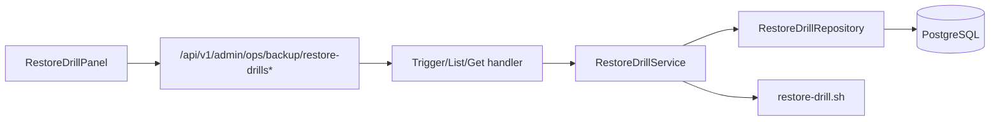
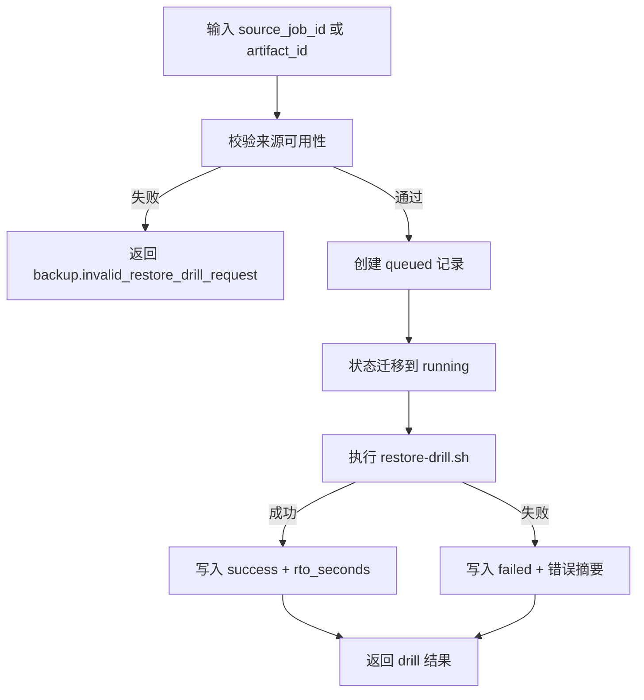
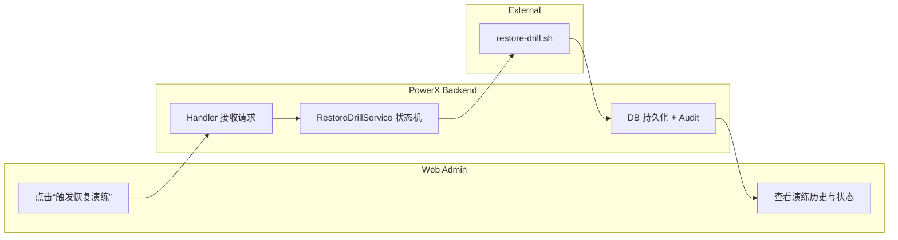

# Use Case：US3 快速演练恢复可用性

## 1. 功能背景与目标
- 背景：仅有备份文件不代表可恢复。
- 目标：支持按备份来源发起恢复演练，并可追踪状态与结果。

## 2. 角色与适用范围
- 角色：Root 管理员、运维、QA。
- 范围：恢复演练创建、列表、详情、实时状态展示。

## 3. 整体架构与模块关系



## 4. 核心流程



## 5. 跨角色协作流程



## 6. 前置条件与依赖
- 至少存在一个可用作业/产物。
- `backend/scripts/ops/restore-drill.sh` 可执行。

## 7. 操作步骤（按场景拆分）

### 7.1 页面操作步骤
1. 动作：在备份中心触发演练。
   - 入口：`/ops/backup` -> “触发恢复演练”。
   - 预期结果：面板显示“最近一次演练状态”。
   - 失败处理：查看接口错误与后端日志。
2. 动作：观察历史与实时状态。
   - 入口：恢复演练面板“演练历史（最近10条）”。
   - 预期结果：看到 `queued/running/success/failed` 与 `trace_id`。
   - 失败处理：若无实时更新，检查 WS 连接与 topic 发布。

### 7.2 接口调用步骤
```bash
# 发起演练（按 source_job_id）
curl -sS -X POST "http://127.0.0.1:8080/api/v1/admin/ops/backup/restore-drills" \
  -H "Authorization: Bearer <TOKEN>" -H "Content-Type: application/json" \
  -d '{"source_job_id":"<JOB_ID>","reason":"weekly-drill"}' | jq

# 查询列表
curl -sS "http://127.0.0.1:8080/api/v1/admin/ops/backup/restore-drills?page=1&page_size=20" \
  -H "Authorization: Bearer <TOKEN>" | jq

# 查询详情
curl -sS "http://127.0.0.1:8080/api/v1/admin/ops/backup/restore-drills/<DRILL_ID>" \
  -H "Authorization: Bearer <TOKEN>" | jq
```
- 预期结果：返回 `data.drill` 或 `data.items`，状态可见。
- 失败处理：`backup.restore_drill_not_found` 表示目标不存在。

### 7.3 本地联调步骤
```bash
cd backend && GOCACHE=$PWD/../tmp/gocache GOMODCACHE=$PWD/../tmp/gomodcache go test ./internal/service/backup_ops -run TestJobService_TryLockPolicy_ReentrantBlocked -count=1
```
- 预期结果：测试通过，基本并发防护有效。
- 失败处理：检查 `job_service.go` 锁逻辑与状态流转。

## 8. 预期结果与验收标准
- [ ] 演练请求可创建记录。
- [ ] 状态机符合 queued->running->success/failed。
- [ ] 历史列表和详情可查询。
- [ ] 页面可展示状态、rto、trace。

## 9. 代码实现映射

| 步骤 | 代码路径 | 说明 |
|---|---|---|
| 路由 | `backend/internal/transport/http/admin/backup/routes.go` | `restore-drills*` 路由 |
| Handler | `backend/internal/transport/http/admin/backup/handler.go` | Trigger/List/Get |
| 服务 | `backend/internal/service/backup_ops/restore_drill_service.go` | 校验、状态机、脚本执行 |
| 状态机 | `backend/internal/service/backup_ops/job_state_machine.go` | queued/running/success/failed |
| 前端展示 | `web-admin/app/components/ops/backup/RestoreDrillPanel.vue` | 状态与历史展示 |

## 10. 常见问题与排障
- Q：演练一直失败。
  - 现象：状态为 `failed`，`result_summary` 为脚本错误。
  - 排查：检查 `restore-drill.sh` 执行权限与输入作业是否有效。
  - 修复：修复脚本环境后重新发起演练。

## 11. 回滚与风险控制
- 演练属于验证动作，不应直接改写生产数据。
- 若演练导致异常负载：暂停触发，优先保证备份链路稳定。

## 12. 变更记录
- 版本：v0.3
- 日期：2026-04-11
- 修改人：Codex
- 变更：首次生成 US3 指导文档。
