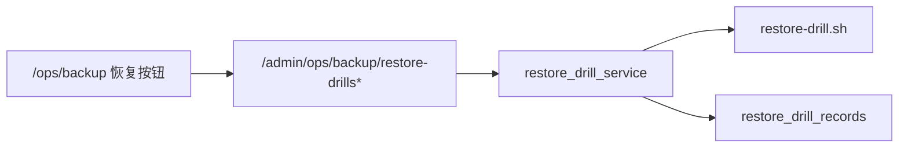
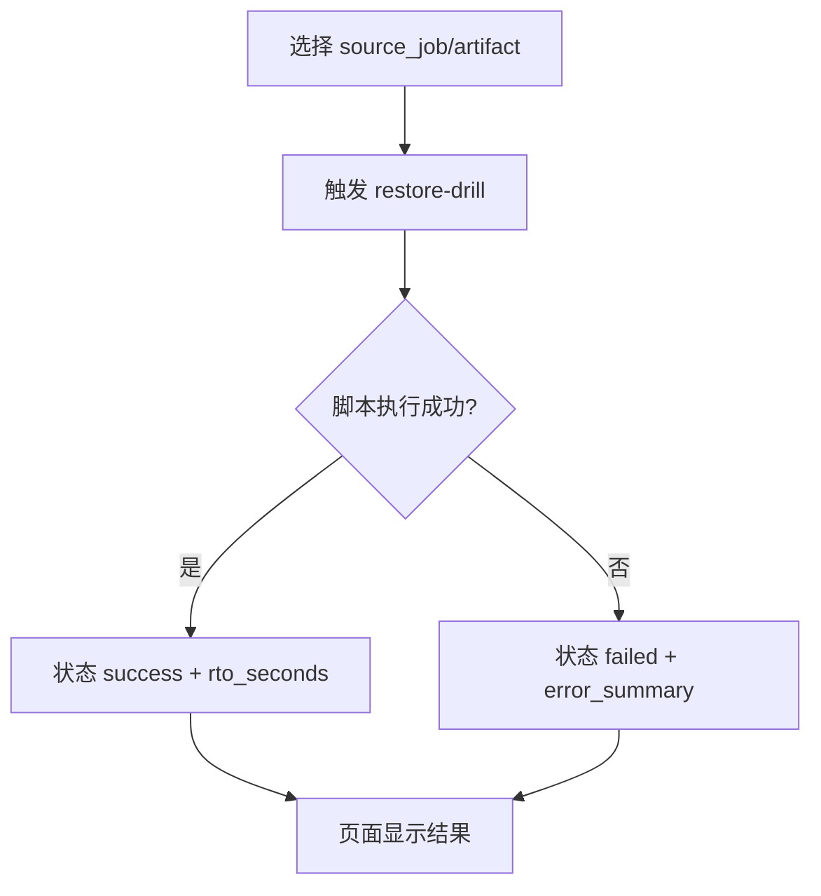
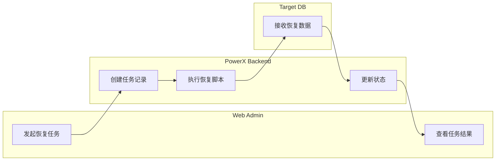

# Use Case US3：触发恢复任务验证可用性

## 1. 功能背景与目标

### 1.1 为什么要做
- 业务背景：备份价值最终由“可恢复”定义。
- 当前痛点：只看备份成功并不能证明文件可用。
- 目标收益：通过恢复任务验证备份有效性，并记录 RTO/结果摘要。

### 1.2 本文解决什么问题
- 面向角色：运维、QA。
- 本文范围：从作业触发恢复任务并查看结果。
- 非本文范围：生产级全量灾备切换。

## 2. 角色与适用范围

- 运维：执行恢复任务和结果复核。
- QA：验证成功/失败分支可观察。
- 环境：local/staging（prod 需严格隔离）。

## 3. 整体架构与模块关系



## 4. 核心流程



## 5. 跨角色协作流程



## 6. 前置条件与依赖

- 至少有一条成功备份作业（包含可用 `storage_uri`）。
- 恢复脚本存在：`backend/scripts/ops/restore-drill.sh`。
- 目标库连接配置正确且隔离。

## 7. 操作步骤（可执行）

### 场景 A：页面操作（Web Admin）
1. 动作：在备份中心选择成功作业并点击“恢复数据任务”。  
入口：`/ops/backup`。  
预期结果：新增一条恢复任务记录。  
失败处理：查看任务详情中的失败原因。

2. 动作：展开任务详情查看 `status/rto_seconds/result_summary`。  
入口：恢复任务列表。  
预期结果：状态明确为 `success` 或 `failed`。  
失败处理：复制 `trace_id` 到日志页查询。

### 场景 B：接口调用（Admin API）
1. 触发命令：
```bash
curl -sS -X POST -H "Authorization: Bearer $TOKEN" -H "Content-Type: application/json" \
  -d '{"source_job_id":"5","reason":"manual-check"}' \
  "http://127.0.0.1:8080/api/v1/admin/ops/backup/restore-drills/run" | jq
```
2. 查询命令：
```bash
curl -sS -H "Authorization: Bearer $TOKEN" \
  "http://127.0.0.1:8080/api/v1/admin/ops/backup/restore-drills?page=1&page_size=20" | jq
```
3. 失败处理：
```bash
journalctl -u powerx-backend -n 300 --no-pager | grep -E "backup.restore_drill|restore"
```

### 场景 C：本地联调
1. 启动命令：
```bash
cd backend && make dev
cd web-admin && npm run dev
```
2. 验证命令：
```bash
curl -sS -H "Authorization: Bearer $TOKEN" \
  "http://127.0.0.1:8080/api/v1/admin/ops/backup/restore-drills?page=1&page_size=10" | jq
```
3. 日志定位：
```bash
journalctl -u powerx-backend -n 300 --no-pager | grep -E "restore_drill|trace_id"
```

## 8. 预期结果与验收标准

- [ ] 恢复任务可创建并进入状态机。
- [ ] 成功时有 RTO/结果摘要；失败时有明确错误信息。
- [ ] 可用 trace_id 继续在 Logs/Trace 页面定位。

## 9. 代码实现映射

| 文档步骤 | 代码位置 | 说明 |
|---|---|---|
| 恢复路由 | `backend/internal/transport/http/admin/backup/routes.go` | `/restore-drills*` |
| 恢复 handler | `backend/internal/transport/http/admin/backup/handler.go` | Trigger/List/Get |
| 恢复服务 | `backend/internal/service/backup_ops/restore_drill_service.go` | 状态机与审计 |
| 脚本执行 | `backend/internal/service/backup_ops/script_runner.go` | 调用恢复脚本 |

## 10. 常见问题与排障

### Q1：恢复任务失败但 UI 看不懂
- 现象：状态 failed，错误描述不明确。
- 排查命令：
```bash
curl -sS -H "Authorization: Bearer $TOKEN" \
  "http://127.0.0.1:8080/api/v1/admin/ops/backup/restore-drills/<drill_id>" | jq
```
- 修复建议：结合 `trace_id` 到 `/monitor/logs-trace` 检索并确认脚本失败点。

## 11. 回滚与风险控制

- 回滚开关：停止恢复任务触发，仅保留备份执行。
- 回滚步骤：停用策略恢复链路按钮（或临时屏蔽操作流程）。
- 风险提示：恢复目标库必须隔离，避免覆盖业务库。

## 12. 变更记录

- 2026-04-13 / Codex：首版 US3 指导文档。
