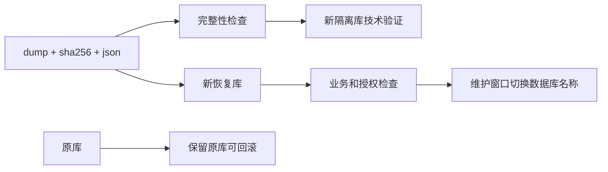
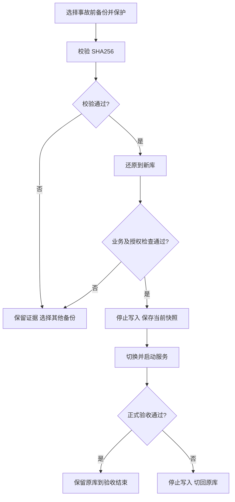

# US3：恢复验证、正式数据还原和回滚

## 1. 功能背景与目标

**“恢复验证”只验证归档，不切换正式库。** 正式还原先在新库检查数据，再在维护窗口切换，保留原库以便回滚。没有事故发生前的备份或 WAL，当前空库的 dump 不能找回旧记录。

## 2. 角色与适用范围

平台管理员选取、保护备份并验证；运维负责数据库和应用切换；业务负责人核对工单、订单等记录。恢复验证需要 Ops execute 权限；正式切换需 PostgreSQL 管理权限。下方正式站示例对应本服务器 **本机 PostgreSQL16 / powerx_pro**；必须先在运行配置中确认实际源库，不能套用到开发库或远程数据库。

## 3. 整体架构与模块关系


```mermaid
flowchart LR
 FILE[dump + sha256 + json] --> VALIDATE[完整性检查]
 VALIDATE --> PROBE[新隔离库技术验证]
 FILE --> RECOVERY[新恢复库]
 RECOVERY --> BUSINESS[业务和授权检查]
 BUSINESS --> SWITCH[维护窗口切换数据库名称]
 ORIGINAL[原库] --> KEEP[保留原库可回滚]
```

## 4. 核心流程


```mermaid
flowchart TD
 A[选择事故前备份并保护] --> B[校验 SHA256]
 B --> C{校验通过?}
 C -->|否| E[保留证据 选择其他备份]
 C -->|是| D[还原到新库]
 D --> F{业务及授权检查通过?}
 F -->|否| E
 F -->|是| G[停止写入 保存当前快照]
 G --> H[切换并启动服务]
 H --> I{正式验收通过?}
 I -->|是| J[保留原库到验收结束]
 I -->|否| K[停止写入 切回原库]
```

## 5. 跨角色协作流程


```mermaid
flowchart LR
 subgraph 管理员
  A[保护文件 发起验证]
 end
 subgraph Core与PostgreSQL
  B[校验并创建新隔离库]
  C[还原与记录结果]
 end
 subgraph 业务与运维
  D[核对关键数据]
  E[维护窗口正式切换]
  F[验收或回滚]
 end
 A --> B --> C --> D --> E --> F
```

## 6. 前置条件与依赖

- 必须有文件本体，不能只有成功任务记录。核对时间、源库、大小、SHA256 和 PostgreSQL 客户端版本。
- 同名 `.dump.json` 清单不含密钥。数据库角色、服务器配置、STS 注册表/host-values、媒体文件不属于这一份数据库归档，必须另有保留和检查。
- 新归档保存对象所有者和 ACL；正式恢复目标应存在原数据库角色，管理员可恢复 owner/ACL。验证模式明确跳过 owner/ACL，只证明数据与结构可还原。
- 旧 dump 若使用 `--no-privileges` 生成，需要确认插件 schema 的实际 owner/grant；不可只看到表数据就宣布插件可用。
- 保留足够磁盘容量：原库、候选库、dump 和可能的 WAL。不要为释放空间先删除原库。

## 7. 操作步骤

### A. 页面恢复验证

1. `/ops/backup` 的“备份作业与文件”选择**事故前**的 success 作业，点击“保留此备份”。确认作业标记已保留。
2. 展开 SHA256 并核对服务器文件；点击“恢复验证”，确认其只创建新隔离库。
3. 预期验证 success，报告有 `powerx_restore_probe_<job>_<UTC>_<pid>_<random>`、表数量和 RTO。默认验证后删除本次创建的库；备份文件不删除。
4. 表数量不代表业务完整：还需按 B/C 检查工单、订单、租户、关联、权限及媒体引用。失败看报告/Trace；缺脚本或坏归档明确失败。

脚本禁止 `POWERX_OPS_RESTORE_PROBE_DB` 和 `POWERX_OPS_RESTORE_PROBE_DB_PREFIX` 自定义目标。即使已存在同名隔离库，创建失败也不会删除它。

### B. 保留隔离库，核对业务数据

设 `JOB_ID` 为页面成功备份的真实作业 ID：

```bash
sudo systemd-run --wait --pipe --collect --property=User="$(systemctl show powerx-backend -p User --value)" --property=Group="$(systemctl show powerx-backend -p Group --value)" --property=WorkingDirectory=/opt/powerx/backend --property=EnvironmentFile=/etc/powerx/powerx.env /opt/powerx/backend/database backup-restore-verify -config /etc/powerx/config.yaml -job-id "$JOB_ID" -keep-restore-database
```

预期 CLI 退出 0、status success、`report_uri` 含本次实际 `db=... keep_db=1`。**使用报告里真实新库名**；从 `psql -d <实际新库名>` 查询业务表和已知工单号。不得改脚本把验证指向 `powerx_pro`。

完成检查后只有在确认该库由本次验证创建且不再使用时，运维才执行 `sudo -u postgres dropdb <实际新库名>`。API 自动验证默认删除；命令的 `-keep-restore-database` 只影响此次验证。

API 示例：

```bash
curl -fsS -X POST http://127.0.0.1:8080/api/v1/admin/ops/backup/restore-drills/run -H "Authorization: Bearer $TOKEN" -H 'Content-Type: application/json' -d "{\"source_job_id\":\"$JOB_ID\"}"
```

预期 `data.drill.status=success`。失败可能以 200 返回 `status=failed`，必须检查业务状态。详情接口 `/restore-drills/{id}` 包含 `restore_target_db`、`restored_table_count`、`keep_probe_db` 和实际报告。

### C. 正式还原到候选库（还没切换）

以下示例使用新的候选名 `powerx_restore_prod_20261008`。每次恢复使用不同名字；createdb 已存在时报错就停止，**绝不先 DROP 同名库**。

1. 从作业路径或 `.dump.json` 找到真实 `FILE`，设为绝对路径；确认不是当前空库新备份。校验：

```bash
sudo sh -c 'cd "$(dirname "$1")" && sha256sum -c "$(basename "$1").sha256"' sh "$FILE"
```

预期 `...dump: OK`；失败停止恢复。没有 sidecar 的旧备份从已登记任务取得预期 SHA256，再用 `sudo sha256sum "$FILE"` 比对。

2. 当前服务器使用本机 PostgreSQL 管理用户，先确认源库和角色（只读）：

```bash
sudo -u postgres psql -X -d powerx_pro -c 'SELECT current_database(), current_user;'
```

预期数据库 powerx_pro。若 runtime 面板源主机不是本机，需换成受控管理连接，不能对本机另一个 PG 实例操作。

3. 创建新库并恢复，保留归档中的 ownership/ACL：

```bash
sudo -u postgres createdb powerx_restore_prod_20261008
```

预期新库创建成功；已存在或权限失败立即停止。文件权限为 0600，使用 root 打开文件并通过 stdin 交给 PostgreSQL 用户，避免给全体用户开放 dump：

```bash
sudo sh -c 'runuser -u postgres -- pg_restore --exit-on-error -d powerx_restore_prod_20261008 < "$1"' sh "$FILE"
```

预期退出 0。任何扩展、owner、角色或 grant 错误都需要修复候选库后重新验证；不带 `--clean`、不针对已有业务库执行。

4. 核对：Core 租户与登录用户；插件 schema / 表 / 记录数；至少一条已知工单及订单；主外键、UUID、业务状态、序列和文件引用。确认插件原角色可访问自己的 schema，不能扩大跨租户授权。媒体文件还需要独立备份恢复。

### D. 维护窗口切换（只有 C 验收后才能执行）

这些命令会改变正式库名称并中断业务写入，**须由运维确认候选数据和维护窗口后执行**。本实现不自动执行此步骤。本服务器 Core 管理插件子进程；另行启动的插件、后台作业或外部写入也必须停止。

1. 停止独立 timer 和 Core；确认插件进程已退出：

```bash
sudo systemctl stop powerx-backup.timer powerx-backup.service powerx-backend
```

2. 保存此时原库的独立快照（本机 PG 示例，文件名不可复用覆盖已有快照）：

```bash
sudo sh -c 'umask 077; test ! -e /opt/powerx/storage/backups/pre-restore-20261008.dump && runuser -u postgres -- pg_dump --format=custom powerx_pro > /opt/powerx/storage/backups/pre-restore-20261008.dump'
```

预期退出 0，文件非空，并用 `pg_restore -l` 检查。原库仍完整保留。

3. 只读检查该两库的连接；应没有残留业务连接：

```bash
sudo -u postgres psql -X -d postgres -c "SELECT datname,pid,usename,application_name FROM pg_stat_activity WHERE datname IN ('powerx_pro','powerx_restore_prod_20261008');"
```

若仍有连接，先定位并停止所属应用。不要批量终止整个 PostgreSQL 的连接。

4. 在一个事务中把原库改为保留名、候选改成原来的正式名称：

```bash
sudo -u postgres psql -X -v ON_ERROR_STOP=1 -d postgres -c 'BEGIN; ALTER DATABASE powerx_pro RENAME TO powerx_pro_before_restore_20261008; ALTER DATABASE powerx_restore_prod_20261008 RENAME TO powerx_pro; COMMIT;'
```

预期事务成功；原库仍在 `powerx_pro_before_restore_20261008`，候选成为 powerx_pro。保留源数据库名称使 Core 配置及插件 DSN 的数据库名保持一致。若改用“配置切到另一个名称”，必须同时修改插件数据库绑定和 host-values，不能仅改 Core YAML。

5. 用同环境工具确认 Core/插件历史版本合同与 schema 一致；如需新版本迁移执行 US1 的 `database migrate`，**不要 seed/refresh 来掩盖恢复问题**。还原旧数据后 STS 数据库凭证和磁盘 registry/host-values 可能不同，先保存这些磁盘文件，检查错误，再按已有 `repair-plugin-runtime-credentials` 的预览及明确确认流程对齐，不能盲目重新安装或自动轮换。
6. 运维启动 Core：`sudo systemctl start powerx-backend`。检查 `/api/v1/health`、登录、租户、插件启用、工单和媒体访问。验收通过后恢复 timer：`sudo systemctl start powerx-backup.timer`，并在页面检查恢复库中的策略是否应继续启用。

### E. 回滚切换

出现业务或授权问题时，先停止 Core、独立 timer 及所有写入。确认旧库保留名存在且没有连接，再执行：

```bash
sudo -u postgres psql -X -v ON_ERROR_STOP=1 -d postgres -c 'BEGIN; ALTER DATABASE powerx_pro RENAME TO powerx_pro_failed_restore_20261008; ALTER DATABASE powerx_pro_before_restore_20261008 RENAME TO powerx_pro; COMMIT;'
```

预期旧库恢复正式名，失败候选保留供检查。随后启动 Core 验证，再恢复 timer。回滚前已经写入候选库的新数据不会自动合并回原库，须业务核对；所以切换验收期间应限制写入。

### F. 本地验证

`cd backend && go test ./internal/service/backup_ops` 运行安全单测；真实 PG 使用 `POWERX_BACKUP_TEST_ADMIN_DSN` 执行 `go test ./internal/service/backup_ops -run TestBackupIntegration -v`。该测试只创建自己生成的新数据库，检查插件两条测试订单恢复后仍存在，再删除这些测试库。

## 8. 预期结果与验收标准

技术验证：归档 SHA256 一致、恢复脚本真实执行、成功/失败明确、新库唯一、旧库不删除。业务验证：已知工单/订单和关联可读、角色授权正确、媒体可用。正式切换：旧库保留、服务正常、可按明确名称回滚。三个层次分别记录，不把验证 success 当作正式恢复完成。

## 9. 代码实现映射

`restore_drill_service.go` 验证大小/SHA256、状态及脚本存在；`restore-drill.sh` 只原子创建新目标，恢复不带 clean；`artifact_file.go` 限定登记路径；`script_runner.go` 管理子进程；`database backup-restore-verify` 提供留库检查。正式 rename 由运维执行，不属于自动验证 API。

## 10. 常见问题与排障

- 缺 pg_restore/createdb、源角色无创建权限、扩展不可安装：在隔离目标修复依赖；不改为覆盖正式库。
- 文件或清单不匹配：保留证据并选择其他备份；不手改 SHA256 让损坏归档通过。
- 表数成功但页面空：核对归档时间、源库、租户、插件 schema 和已知工单，不用“表存在”代替业务检查。
- 插件启动报 STS 不匹配：数据库与磁盘运行凭证来自不同时间点，按凭证修复工具预览处理；禁止将开发库凭证抄到正式库。
- 验证进程被强杀：可能留下报告指定的隔离库，只清理确认属于此次验证的名称。

## 11. 回滚与风险控制

不在现有业务库执行 clean/drop；不自动清理原库；不同时允许旧库和候选库继续业务写入；不按通配符删除库。单机 dump 不能替代异机备份或 PITR，事故前无备份的记录不能保证恢复。恢复媒体、角色、配置和运行凭证也是验收的一部分。

## 12. 变更记录

2026-10-08：明确隔离验证及正式还原，补齐 checksum、权限、原库保留、数据库名称切换、插件 DSN/STS 核对和回滚。
