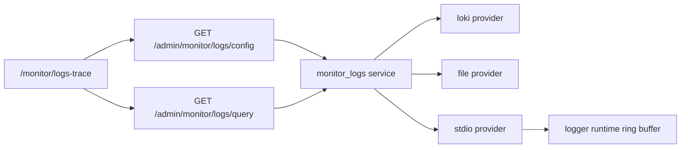
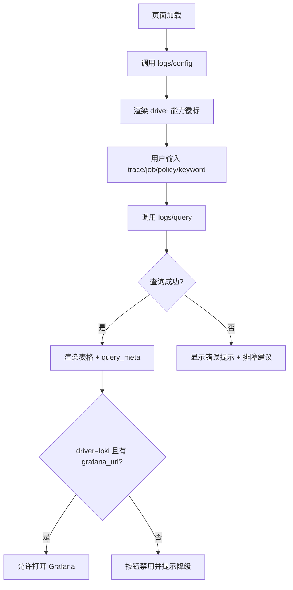
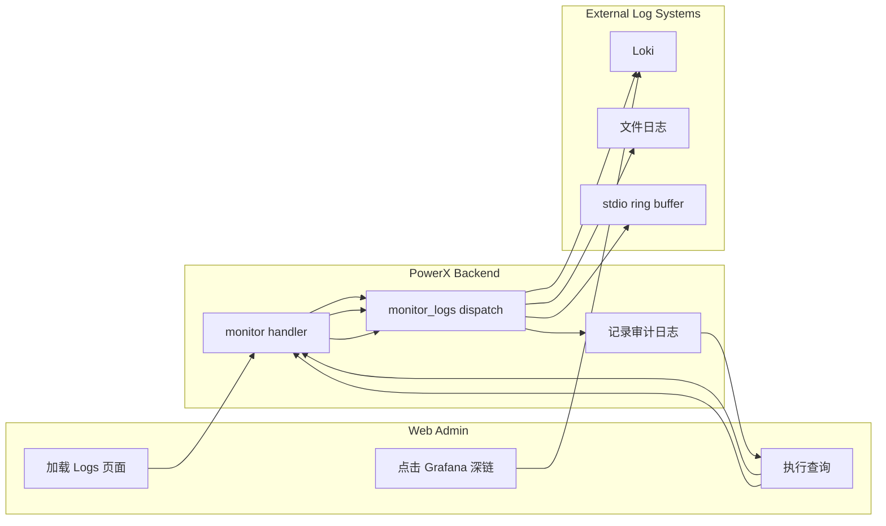

# Use Case US4：日志与链路追踪监控（loki/file/stdio）

## 1. 功能背景与目标

### 1.1 为什么要做
- 业务背景：备份与恢复一旦失败，需要在平台内快速定位 trace/job/policy 链路。
- 当前痛点：不同日志驱动能力不一致，容易出现“页面按钮可点但后端不支持”。
- 目标收益：统一 `logs/config + logs/query` API，并在页面按能力矩阵动态渲染。

### 1.2 本文解决什么问题
- 面向角色：运维、研发、QA。
- 本文范围：Logs/Trace 页面、日志配置查询、日志检索、Grafana 深链。
- 非本文范围：Loki 多租户权限模型、外部日志平台运维。

## 2. 角色与适用范围

- 运维：生产排障首屏。
- 研发：联调定位与问题复盘。
- QA：验证三驱动降级行为。

## 3. 整体架构与模块关系



## 4. 核心流程



## 5. 跨角色协作流程



## 6. 前置条件与依赖

### 6.1 配置
- `loki`：`log.loki.enable=true` + `log.loki.url`。
- `file`：`log.file.enable=true` + `info_file_path/error_file_path` 可读。
- `stdio`：`log.loki.enable=false` 且 `log.file.enable=false`（默认回退）。

### 6.2 权限与数据
- Root 或具备 Ops Backup 读权限。
- 有可查询日志样本（先执行一次备份操作或日志查询）。

## 7. 操作步骤（可执行）

### 场景 A：页面操作（Web Admin）
1. 动作：打开 Logs/Trace 页面。  
入口：`/monitor/logs-trace`。  
预期结果：顶部显示 `driver=...`，能力徽标状态正确。  
失败处理：点击“刷新配置”，并用 API 校验。

2. 动作：填入 `trace_id` 或 `keyword` 点击“查询日志”。  
入口：页面查询区域。  
预期结果：表格返回日志行；分页统计更新。  
失败处理：查看 toast 错误并执行 API 对照命令。

3. 动作：点击“打开 Grafana”（仅 loki）。  
入口：页面按钮。  
预期结果：新窗口打开 explore 页面。  
失败处理：检查 `query_meta.grafana_url` 是否为空。

### 场景 B：接口调用（Admin API）
1. 查询配置：
```bash
curl -sS -H "Authorization: Bearer $TOKEN" \
  "http://127.0.0.1:8080/api/v1/admin/monitor/logs/config" | jq
```
2. 查询日志：
```bash
curl -sS -H "Authorization: Bearer $TOKEN" \
  "http://127.0.0.1:8080/api/v1/admin/monitor/logs/query?trace_id=<TRACE_ID>&page=1&page_size=20" | jq
```
3. 预期响应：`data.items + data.pagination + data.query_meta`。
4. 失败处理：
```bash
journalctl -u powerx-backend -n 300 --no-pager | grep -E "monitor.logs.config|monitor.logs.query"
```

### 场景 C：本地联调（backend/web-admin）
1. 启动命令：
```bash
cd backend && make dev
cd web-admin && npm run dev
```
2. 生成日志样本：
```bash
curl -sS -H "Authorization: Bearer $TOKEN" \
  "http://127.0.0.1:8080/api/v1/admin/monitor/logs/query?page=1&page_size=20&keyword=monitor.logs" | jq
```
3. 验证审计字段：
```bash
journalctl -u powerx-backend -n 300 --no-pager | grep -E "monitor.logs.config|monitor.logs.query"
```

## 8. 预期结果与验收标准

- [ ] `logs/config` 返回 driver + capabilities。
- [ ] `logs/query` 支持 trace/job/policy/keyword/time 范围过滤。
- [ ] 页面按能力禁用不可用入口（特别是 Grafana 按钮）。
- [ ] 审计日志含 `operator/trace_id/status` 与查询筛选摘要。

## 9. 代码实现映射

| 文档步骤 | 代码位置 | 说明 |
|---|---|---|
| Monitor 路由 | `backend/internal/transport/http/admin/monitor/routes.go` | config/query 路由注册 |
| Config Handler | `backend/internal/transport/http/admin/monitor/log_config_handler.go` | 驱动配置返回 + 审计 |
| Query Handler | `backend/internal/transport/http/admin/monitor/log_query_handler.go` | 过滤参数、查询、审计 |
| Dispatch Service | `backend/internal/service/monitor_logs/service.go` | 驱动选择与分发 |
| Loki Provider | `backend/internal/service/monitor_logs/loki_provider.go` | query_range + grafana_url |
| File Provider | `backend/internal/service/monitor_logs/file_provider.go` | 文件读取与过滤 |
| Stdio Provider | `backend/internal/service/monitor_logs/stdio_provider.go` | ring buffer 最近窗口 |
| Ring Buffer | `backend/pkg/utils/logger/runtimebuffer/buffer.go` | stdout 采集缓冲 |
| 页面与状态 | `web-admin/app/components/monitor/MonitorCenterWorkspace.vue`、`web-admin/app/stores/monitorLogs.ts` | UI + store |

## 10. 常见问题与排障

### Q1：driver 显示为 stdio 但我配置了 loki
- 现象：页面显示 `driver=stdio`。
- 排查命令：
```bash
grep -n "^\s*loki:" -n backend/etc/config.yaml -A6
curl -sS -H "Authorization: Bearer $TOKEN" "http://127.0.0.1:8080/api/v1/admin/monitor/logs/config" | jq
```
- 修复建议：确认 backend 读取的是同一份配置并已重启。

### Q2：Grafana 按钮不可点
- 现象：`loki` 下仍不可用。
- 排查命令：
```bash
curl -sS -H "Authorization: Bearer $TOKEN" \
  "http://127.0.0.1:8080/api/v1/admin/monitor/logs/query?page=1&page_size=20" | jq '.data.query_meta'
```
- 修复建议：确认 `query_meta.grafana_url` 是否生成；若为空检查 `log.loki.url` 格式。

## 11. 回滚与风险控制

- 回滚开关：临时切换到 `file` 驱动，禁用 Loki 深链。
- 回滚步骤：修改配置 -> 重启 backend -> 验证 `/logs/config`。
- 风险提示：`stdio` 模式无法保证长时历史检索，生产建议至少启用 `file` 或 `loki`。

## 12. 变更记录

- 2026-04-13 / Codex：首版 US4 指导文档。
