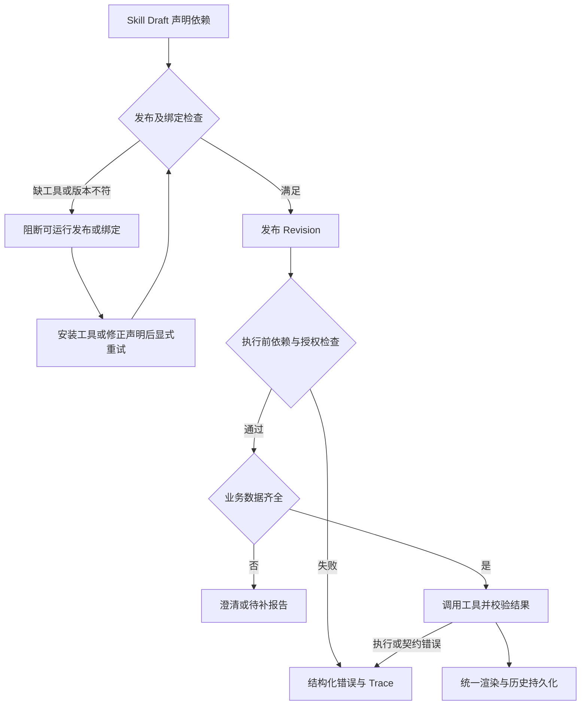

# Agent、Skill、工具与 Runtime 分层开发规范

状态：2026-09-08 确认的架构约束；新开发与整改必须遵守。本文描述的工具依赖预检、计算证据链和结果分类尚需实现与验收，不代表当前版本已提供全部接口。需求与任务见 [024 spec](../../../specs/024-ai-engineering-skills/spec.md) 的 FR-079～FR-086 和 [tasks](../../../specs/024-ai-engineering-skills/tasks.md) 的 Phase 23。

## 1. 目标与适用范围

PowerX 是工具执行与治理平台。固有示例、用户自建 Agent/Team、导入的 Skill 使用相同的发布、授权、执行和追踪机制。新增业务公式或算法通过 Skill 和工具扩展交付，不要求修改或重新编译 Core。

计算正确、输入材料真实、业务归因成立是三个独立判断。表达式校验和工具调用成功只能证明相应执行事实，不能自动证明数据真实或业务结论成立。

## 2. 职责与策略归属

| 层级 | 必须负责 | 禁止承担 |
| --- | --- | --- |
| Agent/Team | 在绑定且获授权的能力范围内选择 Skill、组织任务、澄清信息 | 通过团队名称、Agent UUID 或 Skill 标识触发 Core 中的业务分支 |
| Skill | 业务公式、指标口径、适用条件、数据要求、工具依赖、业务解释 | 伪造工具结果、把原文主张升级为已验证事实、控制平台核心版式 |
| 工具实现 | 按版本化输入输出契约执行运算或业务算法，返回执行记录 | 隐式改变公式、输入口径或权限；把导入包直接当可信代码执行 |
| PowerX Runtime | 解析已发布定义、依赖检查、授权、参数校验、调度、超时/取消、结果校验、追踪 | 内置营销复盘等业务规则；按业务标识选专用 executor |
| PowerX 渲染与历史 | 统一显示结果类型、来源、缺口和错误，持久化可恢复状态 | 重算业务结论、改变核实状态、刷新后丢失结果或 Trace |

平台安全与授权策略是执行边界，Skill 声明只能在该边界内选择工具，不能扩大权限。业务策略随 Skill Revision 发布；工具行为随工具契约版本发布；平台执行规则统一治理。模型负责提出工具调用，运行结果必须来自实际执行。

所有用户/Agent 可见名称、提示、错误说明和 Prompt 使用 locale 资源；业务对象关联使用稳定 UUID。机器语义的 capability key、协议版本、表达式变量和 Trace 标识不作为默认业务展示名称。

## 3. 通用计算的边界

通用计算工具可以提供受限表达式求值、精度与舍入控制、类型及单位校验、除零和资源限制。工具只知道运算语义；“哪些订单属于增量收入”“ROI 采用哪个成本口径”由 Skill 或领域工具定义。

Skill 选择业务公式，例如“GMV / 活动投入”；工具执行实际运算；汇总 Skill 解释结果。对金额等精度敏感输入，工具契约必须明确数值精度、单位、比例尺度和舍入规则。不得使用任意代码 `eval` 作为表达式执行机制。

下例仅说明目标数据流，不是已发布 API、JSON Schema 或可复制请求：

```text
Skill：选择 revenue / spend
数据绑定：revenue -> 输入记录的 GMV 字段；spend -> 同口径投入字段
Runtime：解析引用、核对权限和实际值，调用受控计算工具
工具：返回数值、单位、舍入信息和本次执行引用
汇总：引用该结果，并说明业务口径与证据限制
```

数据引用必须解析到本租户、本次授权上下文中的实际结构化输入或工具输出，并保留版本/快照。模型写出的自由文本来源标签不是证据。模型提取的结构化字段应保留材料定位及“提取、未核实”的状态；结构化不等于真实。公式中的常量必须显式声明用途，不能把百分比反写为虚构的业务计数。

通用工具可以证明 `27.8 / 100 = 27.8%`，但不能证明存在 27.8 个复购客户及 100 个客户。只有原文百分比时，应保留原文报告值，不能用该等式冒充从客户人数复核出的指标。

## 4. 用户需要当前版本没有的工具时

按工具契约和授权范围选择扩展路径：

1. 已有可用工具：Skill 声明依赖并绑定授权，直接复用。
2. 插件或外部服务提供算法：通过正式 Capability/工具接入机制注册版本、输入输出 Schema、权限和执行绑定；Skill 引用该能力。REST/gRPC 等入口是同一业务能力的 protocol binding，不因入口不同重复创建授权单元。
3. 没有现成工具：开发者实现插件或独立服务，再按同一治理链路接入。普通用户可以让主 Agent 生成 Skill 草稿、查找工具并协助配置，但保存 Prompt 不会产生尚不存在的执行能力。
4. Skill 包含脚本：只有部署环境明确支持且启用了受控脚本 executor、隔离环境和权限策略时才可运行。脚本需要有资源/网络/文件访问限制、超时、产物校验和审计。导入成功不代表脚本已获执行权限；当前环境不支持则明确拒绝执行。

工具扩展复用平台支持的协议和 executor 时无需改 Core。若缺少的是新的协议适配器或执行环境，则由平台实现一次通用扩展，并显式声明最低 Runtime 版本；不能承诺任意技能包在任意版本均可运行，也不能为单个客户 Skill 添加分支。

## 5. 依赖检查与失败语义

依赖声明必须包含可解析的工具/Capability 身份、版本约束、输入输出契约及所需权限；执行时固定实际版本并记录，避免执行中漂移。

导入或创作可以保存含未满足依赖的非可执行 Draft。发布、绑定为可运行 Skill 以及执行前都必须核对各阶段可确定的依赖条件；依赖缺失的版本不得被标记为可运行。执行前重新检查租户授权、工具可用性和版本，不能依赖发布时的检查代替运行时授权。



| 情况 | 处理要求 |
| --- | --- |
| 工具不存在、版本不符、executor 不支持 | 阻断依赖节点，给出实际与要求版本、修复动作；允许保存 Draft |
| 未授权或跨租户引用 | 拒绝执行，保留脱敏审计；不泄露无权访问的对象信息 |
| 业务数据缺失 | 进入声明的澄清流程，或输出明确待补报告；不伪造数据 |
| 工具超时、取消、结果契约错误 | 明确记录失败节点和阶段；不得标记为已完成计算 |
| 原文和复算冲突 | 保留两者、计算口径及缺失信息，业务结果标为待处理 |

禁止静默改用模型心算、自由文本解析、旧版本契约、其他传输或跳过依赖作为兜底。用户显式恢复动作必须重新经过检查；依赖节点如何停止由声明的失败策略控制，不得把未执行结果伪装为成功。

## 6. 结果证据与统一渲染

以下分类采用显式 V4 契约，字段与迁移见 [V4 实现说明](agent-response-evidence-v4.md)；不得向旧 V3 注入字段或转换旧数据冒充新执行证据。

| 分类 | 必备语义 | 核实边界 |
| --- | --- | --- |
| 原文报告值 | 原始数值/单位、来源定位、来源版本、未复核状态 | 仅证明材料如此记载 |
| 工具计算值 | 公式及口径、操作数引用、真实工具执行引用、固定工具版本、结果和舍入规则 | 证明在给定输入下完成计算，保留输入本身的可信状态 |
| 冲突或缺失 | 原文主张、计算证据或缺失字段、澄清行动 | 不得删去矛盾后宣称验证完成 |

汇总 Agent 必须传递这些状态，不能因上游重复引用而升级证据等级。Runtime 必须核对计算结果对应真实执行记录，模型不能自填结果/执行引用冒充计算完成。渲染层统一生成章节、表格和来源展示；技术标识只在明确的诊断视图中显示。

Trace 必须关联本轮、节点、Skill Revision、工具身份与版本、脱敏输入引用、表达式、实际结果、开始/结束时间、超时或校验阶段。结构校验通过、运行完成和业务结论成立是独立状态。最终校验失败必须可在 Trace 看见，不允许出现整轮失败却只有绿色节点且无失败原因的报告。

## 7. 当前实现与交付边界

2026-09-08 实施更新：已实现受限计算与 V4 证据报告、内置依赖预检、同次运行结果核验及 locale 渲染。业务字段、单位和公式由 Skill calculation_policy 声明；平台生成原文数值 token，模型仅映射字段，不允许自行换算或填计算值。旧 V3 不再是可执行响应契约。下表记录整改起点，不是最新验收结论；当前字段、真实模型测试和未完成的插件工具生产接线见 [V4 实现说明](agent-response-evidence-v4.md)。

| 当前代码入口 | 可以确认的基础 | 本规范要求的后续交付 |
| --- | --- | --- |
| `backend/internal/service/skills/definition_invoke_service.go` | 读取发布定义并调用 executor | 完整工具依赖预检及固定版本执行证据 |
| `backend/internal/service/skills/executor_manifest.go` | 通用 Skill executor 入口 | 核对现有工具复用范围，再补受控计算工具；不得新增业务专用分支 |
| `backend/config/agent/response_envelope.v4.schema.json` | 已实现报告值/计算值/冲突结构 | 真实模型及历史 UI 验收 |
| `backend/internal/server/agent/runtime/response_envelope.go` | 当前响应校验 | 字段级来源和真实工具执行结果核验 |

上述入口存在不代表全部目标已完成。旧 V3 的模型分子/分母与展示值复算不足以证明来源，已经由 V4 显式替代；插件工具生产依赖接线仍待完成。旧格式必须重新发布、新建运行，禁止静默转换。数据库迁移与 seed 分开执行。

## 8. 必须通过的验收

- 用户新建非营销 Skill 并接入插件工具，在不增加 Core 业务分支的前提下执行成功。
- 更换 Agent、Team、Skill 的名称和 UUID，不改变通用调度行为。
- 缺工具、版本不符、不支持 executor、未授权、跨租户引用均在对应边界显式阻断；无模型心算兜底。
- 原文只含 `27.8%` 时不生成客户人数；伪造来源或执行引用不能通过校验。
- 对输入 29 和 34.2 使用除法，工具得到约 0.848；原文另称 3.37 时报告口径冲突，不强行替原文解释。测试还必须随机替换数值，禁止答案写死。
- 不同渠道、时间或客户池不能被当作同口径混算；单位换算必须显式且可追溯。
- 工具结果不得由模型覆盖；业务信息不足与系统执行失败有不同状态。
- 成功、失败、冲突和待补报告在实时消息、历史刷新、Trace 中一致；所有用户可见文案按 locale 渲染。

发布验收必须包含真实调用及历史回读证据，不能只以静态 Prompt 检查、Schema 合法或 `completed` 作为业务正确的证明。
