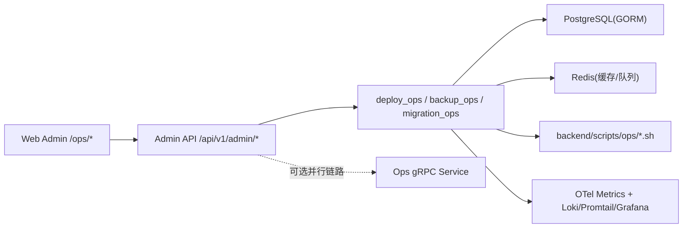
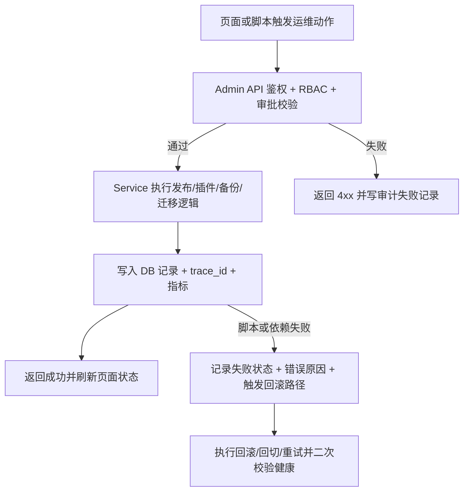
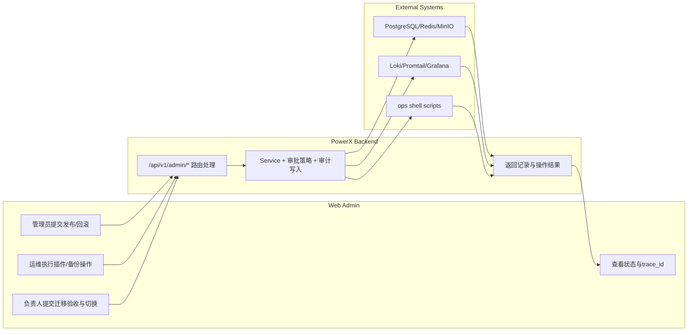

# PowerX 部署与运维治理基线 使用指导（版本：v0.1）

## 1. 功能背景与目标

### 1.1 为什么要做
- 业务背景：PowerX 需要在单节点生产首发时，同时保证未来可扩展到 K8s/多节点。
- 当前痛点：部署方式不统一、插件升级与回滚链路分散、备份恢复与日志观测缺少统一入口。
- 目标收益：在同一套 P0 运维控制台中完成部署发布、插件生命周期、备份恢复与迁移演练闭环。

### 1.2 本文解决什么问题
- 面向角色：平台管理员、运维、研发、QA、项目负责人。
- 本文范围：`025-powerx-docker-systemd` 的 P0 运维治理能力（Deploy/Plugin/Backup/Migration）。
- 非本文范围：K8s 编排自动化、零停机迁移、插件市场完整能力。

## 2. 角色与适用范围

- 适用环境：测试、预发、生产（首版为单节点生产，配置兼容多节点）。
- 角色说明：
  - 平台管理员：负责 Docker/systemd 发布与回滚。
  - 运维：负责插件切换/回滚、备份/恢复演练、日志检索。
  - 项目负责人：负责 A->B 迁移演练、验收与切换回切。
- 高风险操作策略：按环境切换 `none` / `dual_approval`，双人审批模式下需 2 张审批票。

## 3. 整体架构与模块关系



- 前端模块：`web-admin/app/pages/ops/{deploy,plugins,backup,migration}.vue`。
- 后端模块：`backend/internal/transport/http/admin/{deploy,backup,migration}` + `backend/internal/service/{deploy_ops,backup_ops,migration_ops,observability_ops}`。
- 外部依赖：PostgreSQL、Redis、MinIO/S3、Loki、Grafana、Promtail。
- 与其他功能关系：复用统一 Admin 鉴权、RBAC、trace_id 传递与审计写入。

## 4. 核心流程



## 5. 跨角色协作流程



## 6. 前置条件与依赖

### 6.1 配置
- 基础环境变量：`POWERX_BASE_URL`、`POWERX_ADMIN_AUTH_HEADER`、`DATABASE_DSN`、`REDIS_ADDR`。
- 审批策略配置：
  - `POWERX_APPROVAL_DEFAULT_MODE`（默认 `none`）
  - `POWERX_APPROVAL_ENV_OVERRIDES`（示例：`prod:dual_approval,staging:none`）
- 生产部署资产：
  - Docker：`deploy/powerx/docker/compose.prod.yaml` + `.env.prod.example`
  - systemd：`deploy/powerx/systemd/*.service`
- 观测配置：`deploy/observability/{loki,promtail,grafana}`。

### 6.2 权限与数据
- 角色权限点：`OpsResourceDeploy`、`OpsResourcePlugin`、`OpsResourceBackup`、`OpsResourceMigration`。
- 必要数据：至少存在 1 条备份策略、1 个可切换插件、1 个可演练迁移源目标环境。
- 外部依赖可用性：PostgreSQL/Redis/MinIO 可访问，Loki 3100 与 Grafana 可访问。

## 7. 操作步骤（按场景拆分）

本特性存在 4 条可独立验收链路，详细步骤拆分为独立文档。

### 7.1 Use Case 索引

| 文档 | 适用角色 | 验收口径 |
|---|---|---|
| `usecase-us1-deploy-rollback.md` | 平台管理员 | 60 分钟内完成上线，15 分钟内完成回滚 |
| `usecase-us2-plugin-lifecycle.md` | 运维 | 完成“先验证后切换”并可回滚，审计完整 |
| `usecase-us3-backup-observability.md` | 运维负责人 | 备份/清理/恢复演练闭环，日志可检索 |
| `usecase-us4-migration-runbook.md` | 项目负责人 | 完成 A->B 演练与回切，验收记录完整 |

### 7.2 页面操作步骤（Web Admin）
- 动作：进入对应页面并执行场景动作。
- 入口：`/ops/deploy`、`/ops/plugins`、`/ops/backup`、`/ops/migration`。
- 预期结果：页面出现记录更新，包含状态与 `trace_id`/操作 ID。
- 失败处理：检查按钮权限提示、接口 4xx/5xx 返回、后端日志与审计记录。

### 7.3 接口调用步骤（Admin API）

```bash
curl -X POST "http://127.0.0.1:8080/api/v1/admin/deploy/releases?mode=docker&approval_tickets=2" \
  -H 'Authorization: Bearer <admin-token>' \
  -H 'Content-Type: application/json' \
  -d '{"environment":"prod","backend_version":"v1.2.3","web_admin_version":"v1.2.3"}'
```

- 预期结果：返回 `release` 对象，`status` 进入 `pending/running` 后可追踪到终态。
- 失败处理：
  - 400：参数非法（版本/模式/字段）
  - 403：RBAC 权限不足
  - 409：审批票不足或存在进行中任务

### 7.4 本地联调步骤（backend/web-admin/脚本）

```bash
# 1) 后端合同+集成回归
cd backend && GOCACHE=$PWD/.gocache GOMODCACHE=$PWD/.gomodcache \
go test ./tests/contract/ops ./tests/integration/ops -count=1

# 2) 前端 E2E
cd ../web-admin && npm run test:e2e

# 3) 预发布阻断
cd .. && bash backend/scripts/ops/pre-release-gate.sh
```

- 预期结果：测试通过，阻断脚本输出 `[gate] pre-release checks passed`。
- 失败处理：按失败项回到 `specs/025-powerx-docker-systemd/tasks.md` 与对应测试文件修复。

## 8. 预期结果与验收标准

- [ ] 发布与回滚主链路可执行，回滚可在 15 分钟内完成（US1）。
- [ ] 插件“安装/切换/回滚”动作具备审计证据（US2）。
- [ ] 备份成功率与恢复演练结果可见，RTO 目标可验证（US3）。
- [ ] 迁移记录包含 DB 验收、实例验收、切换与回切状态（US4）。
- [ ] 关键动作可通过 `trace_id` 在页面、API、审计、日志中串联。

## 9. 代码实现映射

| 文档步骤 | 代码位置 | 说明 |
|---|---|---|
| HTTP 路由入口 | `backend/internal/transport/http/admin/deploy/routes.go` | `/admin/deploy/*` 与插件审计路由 |
| HTTP 路由入口 | `backend/internal/transport/http/admin/backup/routes.go` | `/admin/backup/*` |
| HTTP 路由入口 | `backend/internal/transport/http/admin/migration/routes.go` | `/admin/migration/*` |
| Deploy 服务 | `backend/internal/service/deploy_ops/service.go` | 发布/回滚/健康聚合 |
| Plugin 服务 | `backend/internal/service/deploy_ops/plugin_lifecycle_service.go` | 插件动作与审计 |
| Backup 服务 | `backend/internal/service/backup_ops/{policy_service.go,job_service.go,restore_drill_service.go}` | 策略/任务/演练 |
| Migration 服务 | `backend/internal/service/migration_ops/service.go` | 迁移编排与流量切换 |
| 审批策略 | `backend/internal/service/deploy_ops/approval_policy_service.go` | `none/dual_approval` 判定 |
| 审计与观测 | `backend/internal/service/observability_ops/audit_writer.go` | 审计落库与指标记录 |
| 前端页面 | `web-admin/app/pages/ops/{deploy,plugins,backup,migration}.vue` | P0 管理入口 |
| 前端 API | `web-admin/app/composables/api/services/*OpsService.ts` | Admin API 调用封装 |
| E2E 验证 | `web-admin/tests/e2e/ops/*.spec.ts` | 页面行为验收 |
| 合同/集成验证 | `backend/tests/{contract,integration}/ops/*.go` | API 契约与链路回归 |

## 10. 常见问题与排障

### Q1：发布/回滚返回审批不足或冲突
- 现象：返回 `approval required` 或 409。
- 排查命令：
```bash
rg -n "POWERX_APPROVAL_DEFAULT_MODE|POWERX_APPROVAL_ENV_OVERRIDES" backend/internal/service/deploy_ops/approval_policy_service.go
```
- 修复建议：生产环境补齐 `approval_tickets>=2`，或调整环境审批策略。

### Q2：备份任务触发成功但无产物
- 现象：任务记录存在但无有效 artifact。
- 排查命令：
```bash
bash backend/scripts/ops/backup-db.sh <policy_id>
```
- 修复建议：确认脚本实现已替换占位逻辑并可访问目标存储（MinIO/S3）。

### Q3：迁移流程可触发但切换后状态异常
- 现象：`traffic_switch_status` 未进入 `success`。
- 排查命令：
```bash
bash backend/scripts/ops/verify-migration.sh <migration_id> <source_env> <target_env>
bash backend/scripts/ops/rollback-traffic.sh <migration_id> <source_env> <target_env>
```
- 修复建议：先回切恢复，再复核验收结论与目标环境依赖。

## 11. 回滚与风险控制

- 发布回滚：
  - API：`POST /api/v1/admin/deploy/rollback`
  - 脚本：`backend/scripts/ops/rollback-release.sh <env> <target_version> [mode]`
- 迁移回切：
  - API：`POST /api/v1/admin/migration/traffic/switch`（`rollback=true`）
  - 脚本：`backend/scripts/ops/rollback-traffic.sh`
- 风险提示：
  - 首版部分脚本仍为占位实现，生产前需替换为真实执行逻辑。
  - 高风险操作必须审计并保留 `trace_id`。
  - 发布前强制运行 `pre-release-gate.sh` 阻断未完成清单。

## 12. 变更记录

- 版本：v0.1
- 日期：2026-03-25
- 修改人：Codex
- 变更内容：基于 `specs/025-powerx-docker-systemd` 生成总览与 4 条用例索引，补齐流程图、泳道图、验收、排障、回滚与代码映射。
