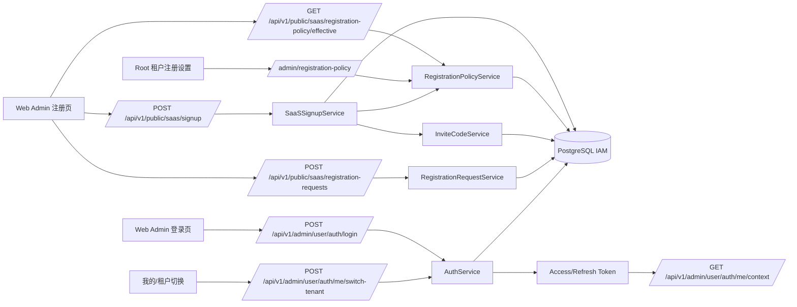
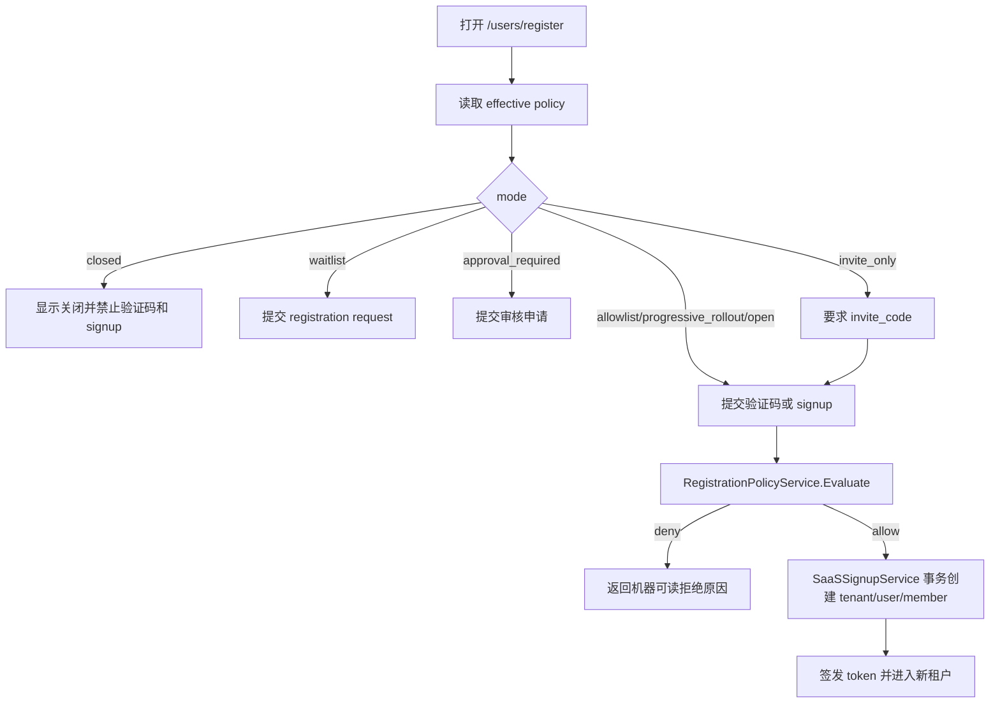
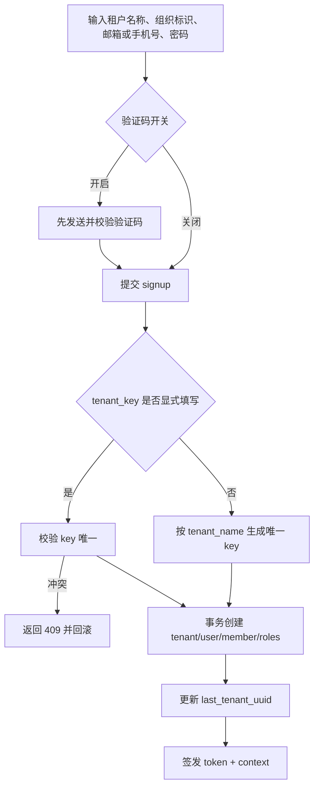
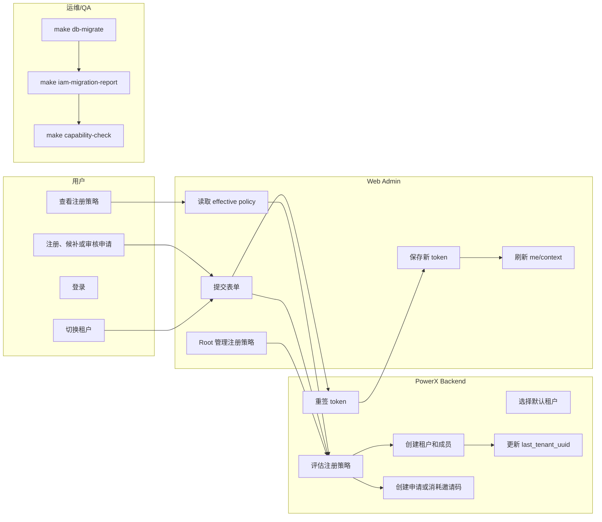

# SaaS IAM 注册、登录与租户切换指南

## 功能背景与目标

PowerX SaaS IAM 的核心边界是：`User` 是全局账号，`Member` 是用户在某个租户里的身份，登录 token 必须同时明确 `tenant_uuid + member_id/member_uuid`。租户自助注册现在由注册准入策略控制，默认关闭，root 可以逐步切换到邀请制、候补、审核、白名单、灰度或完全开放。本指南用于验证自助注册、多租户登录、租户切换、root 边界、注册灰度和历史数据迁移是否与 `specs/026-iam` 一致。

目标：

1. 新用户只有在 active 注册策略允许时，才可以通过公开注册入口创建租户，并成为该租户 owner/admin/user。
2. 同一个 user 可以加入多个租户，登录后默认进入最近使用的有效租户。
3. 切换租户必须重新签发 token，不能只改前端状态。
4. 手机号注册用户不得显示伪造邮箱。
5. 历史数据上线前必须先迁移、再巡检、再开放 SaaS 能力。
6. SaaS 上线前可以按 `closed -> invite_only/waitlist -> progressive_rollout -> open` 阶段放量。

## 角色与适用范围

适用角色：

1. SaaS 新用户：使用注册页创建租户。
2. 租户 owner/admin/member：登录、切换租户、使用租户业务能力。
3. Root：平台运维与全局插件包治理，不默认进入租户业务控制台。
4. QA/运维：执行迁移、巡检、回归测试。

不适用范围：

1. 外部身份源同步。
2. 租户计费结算。
3. 插件业务内部数据模型。

## 整体架构与模块关系



关键数据：

1. `iam_user.email/phone/password credential` 是全局登录凭证。
2. `iam_user.last_tenant_uuid` 是最近租户偏好，不是权限。
3. `iam_member.tenant_uuid + user_id` 决定用户在租户里的身份。
4. `role_owner`、`role_admin`、`role_user` 决定租户内权限。

## 核心流程

### 注册准入流程



失败分支：

1. `closed`、未命中 allowlist、灰度桶未命中、超出配额或缺邀请码时，后端拒绝验证码发送和 signup。
2. `waitlist` 只创建申请，不创建租户。
3. `approval_required` 当前需要后续补齐 owner 密码合同或邀请/重置密码流程；未注入租户创建器时审核通过会明确失败。

### 租户创建流程



失败分支：

1. 显式 `tenant_key` 已存在：返回冲突错误，不保留半成品 tenant/member。
2. 已有 user 但密码错误：拒绝创建第二租户。
3. 验证码关闭时仍不需要 `verification_code`。

## 跨角色协作流程



## 前置条件与依赖

注册准入策略：

1. setup 安装完成时默认创建 active `closed` 策略。
2. root 后台入口「设置 > 系统配置 > 租户注册策略」可以创建并激活新策略，直达 URL 为 `/settings/config?section=registration`。
3. `requires_verification` 是验证码是否必需的权威字段。
4. 不使用旧 feature gate 或前端环境变量作为注册准入兜底。

发布前必须执行：

```bash
make db-migrate
make db-seed
make iam-migration-report
make capability-check
```

`make db-migrate` 必须包含：

1. `iam_tenant.domain` 历史回填。
2. `iam_member.username` 调整为租户内唯一。
3. API key profile key 调整为租户内唯一。
4. `iam_user.last_tenant_uuid` 字段。

## 操作步骤

### 页面操作步骤

root 配置注册策略：

1. 动作：用 root 账号进入租户注册设置页。
2. 入口：左侧菜单「设置」>「系统配置」> 配置分类「租户注册策略」；直达 URL 为 `/settings/config?section=registration`。
3. 填写：选择注册模式，按阶段配置验证码、邀请码、审核、配额和灰度规则。
4. 预期结果：保存后生成 draft 并激活为 active policy，页面显示新版本号。
5. 失败处理：如果返回 403，确认当前账号是 root；如果保存失败，检查后端 `registration_policy` 错误码和策略字段是否完整。

root 生成邀请码：

1. 动作：在租户注册设置页创建邀请码批次并生成邀请码。
2. 入口：「设置 > 系统配置 > 租户注册策略」的邀请码区域。
3. 填写：批次名称、最大数量、单码使用次数、允许邮箱域名、允许渠道。
4. 预期结果：页面只在生成后显示一次明文邀请码，数据库只保存 hash。
5. 失败处理：如果没有返回 `plain_codes`，不要手工补码；检查 `registration_invite` service 日志和批次 UUID。

注册：

1. 动作：打开注册页。
2. 入口：`/users/register`。
3. 填写：租户名称、组织标识、邮箱或手机号、密码、确认密码；邀请制时填写邀请码。
4. 预期结果：`open`、命中白名单或命中灰度允许时注册成功并进入工作台；`waitlist` 或 `approval_required` 时提交申请；`closed` 时不能发送验证码或提交注册。
5. 失败处理：如果组织标识重复，修改为新的 `tenant_key`；如果已有手机号/邮箱，确认密码是否为该全局账号密码；如果策略拒绝，按返回的机器可读 reason code 检查模式、邀请码、白名单和配额。

登录：

1. 动作：使用邮箱或手机号登录。
2. 入口：`/users/login`。
3. 预期结果：单租户用户直接进入该租户；多租户用户进入 `last_tenant_uuid` 指向的最近有效租户。
4. 失败处理：检查该 user 是否仍有 active member。

切换租户：

1. 动作：在“我的/租户切换”选择目标租户。
2. 入口：前端调用 `/api/v1/admin/user/auth/me/switch-tenant`。
3. 预期结果：前端保存返回的新 `access_token/refresh_token`，随后 `me/context` 与 token claims 指向同一租户成员。
4. 失败处理：403 表示当前 user 没有目标租户 active member。

### 接口调用步骤

查询公开注册策略：

```bash
curl --noproxy '*' -sS http://127.0.0.1:8080/api/v1/public/saas/registration-policy/effective
```

预期响应片段：

```json
{
  "data": {
    "mode": "invite_only",
    "can_signup": true,
    "requires_invite_code": true,
    "requires_verification": true
  }
}
```

SaaS 注册：

```bash
curl --noproxy '*' -sS http://127.0.0.1:8080/api/v1/public/saas/signup \
  -H 'Content-Type: application/json' \
  -d '{
    "tenant_name": "Acme Inc",
    "tenant_key": "acme-inc",
    "plan": "free",
    "owner_phone": "13800000000",
    "owner_password": "secret123",
    "owner_display_name": "Owner",
    "invite_code": "PX-EXAMPLE",
    "channel": "private_beta"
  }'
```

预期响应片段：

```json
{
  "data": {
    "access_token": "...",
    "refresh_token": "...",
    "context": {
      "current_tenant_uuid": "...",
      "current_member_id": 1
    }
  }
}
```

提交候补或审核申请：

```bash
curl --noproxy '*' -sS http://127.0.0.1:8080/api/v1/public/saas/registration-requests \
  -H 'Content-Type: application/json' \
  -d '{
    "tenant_name": "Acme Inc",
    "tenant_key": "acme-inc",
    "plan": "free",
    "owner_phone": "13800000000",
    "owner_display_name": "Owner",
    "channel": "waitlist"
  }'
```

预期响应必须包含申请 UUID 和提交状态，不应创建 tenant/member。

root 激活注册策略：

```bash
curl --noproxy '*' -sS http://127.0.0.1:8080/api/v1/admin/registration-policy \
  -H "Authorization: Bearer $ROOT_ACCESS_TOKEN" \
  -H 'Content-Type: application/json' \
  -X PUT \
  -d '{
    "mode": "closed",
    "requires_verification": false,
    "requires_invite_code": false,
    "requires_root_approval": false,
    "rules": []
  }'

curl --noproxy '*' -sS http://127.0.0.1:8080/api/v1/admin/registration-policy/activate \
  -H "Authorization: Bearer $ROOT_ACCESS_TOKEN" \
  -H 'Content-Type: application/json' \
  -d '{"policy_uuid":"<policy-uuid>"}'
```

预期结果：`GET /api/v1/public/saas/registration-policy/effective` 随后返回新 active 策略摘要。

切换租户：

```bash
curl --noproxy '*' -sS http://127.0.0.1:8080/api/v1/admin/user/auth/me/switch-tenant \
  -H "Authorization: Bearer $ACCESS_TOKEN" \
  -H 'Content-Type: application/json' \
  -d '{"tenant_uuid":"<target-tenant-uuid>"}'
```

预期响应必须包含：

```json
{
  "data": {
    "token_type": "Bearer",
    "access_token": "...",
    "refresh_token": "...",
    "context": {}
  }
}
```

### 本地联调步骤

```bash
cd backend
make db-migrate
GOCACHE=$PWD/.gocache GOMODCACHE=$PWD/.gomodcache go test ./tests/integration/iam ./internal/service/auth ./internal/transport/http/admin/user/auth ./pkg/corex/db/migration -count=1

cd ../web-admin
npm run test -- tests/unit/iam/registration-policy.spec.ts
npm run build
```

## 预期结果与验收标准

1. 新租户注册后，首个 member 同时拥有 `role_owner`、`role_admin`、`role_user`。
2. `tenant_name` 可以重复；未显式填写 `tenant_key` 时系统自动生成唯一 key。
3. 显式 `tenant_key` 冲突返回错误，并且没有半成品 tenant/member。
4. 手机号注册用户不显示默认邮箱。
5. 登录不要求先选组织；多租户用户进入最近有效租户。
6. 切换租户后 token、context、页面当前租户一致。
7. root 默认不被前端判定为租户 admin。
8. IAM migration report 不破坏 root、system tenant、组织架构和已有角色绑定。
9. setup 安装后默认 active 策略为 `closed`，验证码发送和 signup 都被拒绝。
10. 邀请制下缺少或无效 `invite_code` 时不创建租户，也不消耗邀请码。
11. `waitlist` 和 `approval_required` 只创建申请记录；审核通过创建租户的凭证合同未补齐前必须明确失败。
12. root 后台注册策略 capability 为 `admin_user`、`resource_scope=platform`、`sts_direct=false`、`agent_usable=false`。

## 代码实现映射

| 能力 | 路径 |
|---|---|
| SaaS signup service | `backend/internal/service/auth/saas_signup_service.go` |
| 验证码 service | `backend/internal/service/auth/signup_verification_service.go` |
| 注册策略 service | `backend/internal/service/auth/registration_policy_service.go` |
| 邀请码 service | `backend/internal/service/auth/registration_invite_service.go` |
| 注册申请 service | `backend/internal/service/auth/registration_request_service.go` |
| SaaS signup handler | `backend/internal/transport/http/public/saas/signup_handler.go` |
| public 注册策略 handler | `backend/internal/transport/http/public/saas/registration_policy_handler.go` |
| root 注册策略 handler | `backend/internal/transport/http/admin/iam/registration_policy_handler.go` |
| 登录和租户切换 service | `backend/internal/service/auth/auth_service.go` |
| me/switch-tenant handler | `backend/internal/transport/http/admin/user/auth/me_extra_handler.go` |
| User last tenant repository | `backend/pkg/corex/db/persistence/repository/iam/user_repo.go` |
| IAM migrations | `backend/pkg/corex/db/migration/202605270001_*.go` 到 `202605270004_*.go` |
| 注册策略模型 | `backend/pkg/corex/db/persistence/model/iam/registration_policy_gorm.go` |
| 邀请码模型 | `backend/pkg/corex/db/persistence/model/iam/registration_invite_gorm.go` |
| 注册申请模型 | `backend/pkg/corex/db/persistence/model/iam/registration_request_gorm.go` |
| 注册策略 capability | `backend/config/platform_capabilities/iam.yaml` |
| 注册页 | `web-admin/app/pages/users/register.vue` |
| root 租户注册设置页 | `web-admin/app/pages/settings/config/index.vue` 中的 `registration` 分类 |
| 注册策略设置面板 | `web-admin/app/components/settings/RegistrationPolicyPanel.vue` |
| 注册策略前端 API | `web-admin/app/composables/api/services/registrationPolicyService.ts` |
| 注册策略前端类型 | `web-admin/app/composables/domain/registrationPolicy.ts` |
| 登录页 | `web-admin/app/pages/users/login.vue` |
| me service | `web-admin/app/composables/api/services/meService.ts` |
| user store | `web-admin/app/stores/user.ts` |

## 常见问题与排障

注册时报 `tenant key already exists`：

1. 显式组织标识已被占用。
2. 修改组织标识后重试。
3. 不要手动删除已有 tenant 规避唯一约束。

手机号注册后显示邮箱：

1. 检查 `iam_user.email` 是否被写入伪造默认邮箱。
2. 检查 Header/Sidebar 是否按 email、phone、`-` 顺序展示。

切换租户后接口仍打旧租户：

1. 检查前端是否保存 `switch-tenant` 返回的新 token。
2. 检查新 token claims 是否包含目标 `tenant_uuid + member_id/member_uuid`。
3. 检查 `me/context` 是否强制刷新。

登录进入错误租户：

1. 检查 `iam_user.last_tenant_uuid`。
2. 检查该 user 在目标租户是否仍有 active member。
3. 最近租户无效时应回退到第一个 active member。

迁移失败：

1. 先看 `make db-migrate` 输出的具体约束或索引名。
2. 不手动删 root/setup/组织架构数据。
3. 修复后重新执行 `make iam-migration-report`。

注册页显示关闭或不能发送验证码：

1. 调用 `GET /api/v1/public/saas/registration-policy/effective` 查看当前 active 策略。
2. 确认 root 后台「设置 > 系统配置 > 租户注册策略」是否已激活非 `closed` 策略。
3. 检查后端拒绝 reason code，不用前端环境变量绕过策略。

邀请码无法使用：

1. 确认批次状态为 active，未过期，未超过 `max_codes` 和单码使用次数。
2. 确认请求体使用结构化字段 `invite_code`，不要把邀请码放入自由文本字段。
3. 邀请码失败时不应消耗次数；如次数已变化，检查注册事务边界。

capability-check 报 registration route uncovered：

1. 检查 `backend/config/platform_capabilities/iam.yaml` 中 `com.corex.iam.registration_policy.admin_manage`。
2. 所有 `/api/v1/admin/registration-*` binding 必须是 `actor_context: admin_user`、`resource_scope: platform`、`sts_direct: false`。
3. public `/api/v1/public/saas/*` 注册入口不是租户 capability，不通过 ignore 掩盖 admin 声明缺失。

## 回滚与风险控制

1. 发布前备份 PostgreSQL。
2. 先执行迁移，再执行 `make iam-migration-report`。
3. 若 `manual_fix_required` 非空，不开放 SaaS signup。
4. 验证码开关默认关闭；未接入 SMTP/短信前不要在生产开启。
5. 出现 token/context 不一致时，优先回滚前端切换租户入口或禁用多租户切换入口，保留登录基础能力。
6. SaaS 放量异常时，root 立即激活 `closed` 策略；该动作只影响新租户注册，不删除已有 tenant/user/member。
7. 邀请制异常时，先暂停或 revoke 对应邀请码批次，再检查审计事件和注册失败分布。

## 变更记录

| 日期 | 变更 | 责任 |
|---|---|---|
| 2026-05-27 | 对齐 SaaS signup、登录默认租户、switch-tenant 重签 token、验证码开关和 IAM 迁移验收 | PowerX Core |
| 2026-08-08 | 增加租户注册准入策略、邀请码、候补/审核、root 后台注册设置和 capability 验收说明 | PowerX Core |
