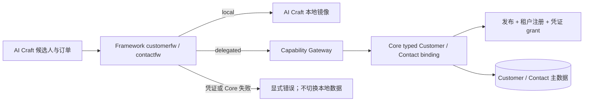
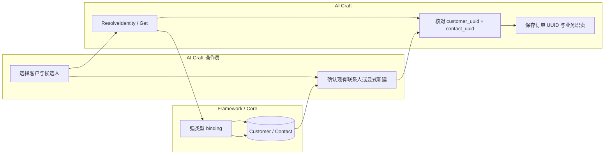

# AI Craft 对齐交接：Customer / Contact

> 交接日期：2026-09-24。PowerXPlugin Framework Lab 的 local/API Key 客户列表与联系人列表已由使用者提供截图并确认联调成功。插件安装后的 delegated/STS、Contact 写入和 AI Craft 业务链路尚未据此验收。以下契约以当前工作树为准，相关改动尚未提交。

## 1. 对齐目标与边界

AI Craft 通过 Framework 的 `customerfw` 与 `contactfw` 使用 Core Customer/Contact。Customer 是客户主体；Contact 是其名下自然人；渠道候选记录只是候选。业务订单以 `customer_uuid` 和 `primary_contact_uuid` 引用权威对象，`designer`、`purchaser`、`finance` 等职责放在 AI Craft 的 ContactAssignment 中。

Customer 的 `service_manage/create` 原子创建基础客户、当前租户成员关系和一位 `primary` 自然人 Contact，**不会**创建密码登录身份。`type` 可传 `person|company`，未传或空值默认并保存为 `person`：person 缺少明确 `primary_contact` 时使用客户姓名及可用邮箱、电话；company 必须显式提供自然人的 `primary_contact`。成功响应包含 `type`、`primary_contact_uuid`。需要可登录客户时，应另行走明确的身份注册流程。

`primary_contact` 在当前创建合同中是联系人资料对象（`display_name` 必填，`given_name`、`family_name`、`email`、`phone` 可选）；Core 在同一事务中创建并绑定它。当前合同尚不支持传入一个既有 `contact_uuid` 迁移归属，AI Craft 不应把已有联系人的 UUID 当成此字段提交。创建 `person` 的示例：

```json
{"operation":"create","type":"person","display_name":"Ada Chen","primary_email":"ada@example.com"}
```

创建 `company` 的示例：

```json
{"operation":"create","type":"company","display_name":"Acme Ltd","primary_contact":{"display_name":"Jane Li","email":"jane@example.com"}}
```

`primary` 和 `legal_representative` 是当前 Core 的通用关系标签，并非“只有两种联系人”。一个 Customer 可以有多位 Contact；其他业务职责由 AI Craft 的 ContactAssignment 表达。

## 2. 接入图





## 3. 固定能力与授权

| 用途 | Capability ID | `core_internal` endpoint / operation | API Key scope |
| --- | --- | --- | --- |
| 客户选择 | `com.corex.customer.accounts.service_read` | `core://customer/accounts` / `list` | `_scope.customer.accounts.service_read` |
| 创建与更新基础客户 | `com.corex.customer.accounts.service_manage` | `core://customer/accounts` / `create`, `update` | `_scope.customer.accounts.service_manage` |
| 联系人读取、解析 | `com.corex.customer.contacts.service_read` | `core://customer/contacts` / `list_by_customer`, `get`, `resolve_identity` | `_scope.customer.contacts.service_read` |
| 联系人创建、更新、绑定 | `com.corex.customer.contacts.service_manage` | `core://customer/contacts` / `create`, `update`, `bind_identity` | `_scope.customer.contacts.service_manage` |

Local Host 模拟使用已显式授予上述 scope 的 `PX_GATEWAY_API_KEY`；安装后的 delegated 模式使用插件 STS 凭证及对应 capability grant。两者都经 `/api/v1/tenant/invocations`、正式 capability 发布和租户 registration 检查。`/api/v1/admin/customers/*` 是用户 JWT/RBAC 面，插件服务不得用它代替 service grant。生产 API Key 也不会仅因 capability 存在而自动获得 grant。

`POST /api/v1/tenant/capabilities:grant-status` 可检查当前凭证的授权，但调用该接口本身还需要 `com.corex.capabilities.grant_status.read`。部署时先运行 Core 的 `make capability-check` 与 `make capability-seed`，再用目标 tenant 的实际凭证检查四项 capability 是否 granted；缺一项时先查发布、registration、permission 和凭证 grant。`make capability-seed` 不是 migrate。

## 4. AI Craft 实施顺序

1. **启动装配**：沿用 `backend/internal/bootstrap/framework_contact.go` 的 `BindFrameworkContact`，消费方在启动时解析 `ContactRuntime.Store()`。local 与 delegated 只选一个，缺 adapter 即启动失败。
2. **客户选择与创建**：通过 Framework `customerfw.AccountSelectorClient` 的 `ListAccounts` / `CreateBasicAccount`；分别请求 `service_read/list` 和 `service_manage/create`。新建请求的 `type` 未传或为空时默认 `person`；company 还必须有明确自然人 `primary_contact`。将返回的 `primary_contact_uuid` 用作后续选择候选，并在订单写入前再次验证归属。
3. **联系人选择**：在确定 `customer_uuid` 后调用 `contactfw.Store.ListByCustomer`。订单写入前用 `Get(customer_uuid, contact_uuid)` 验证归属；不得只信页面传来的联系人名称或 UUID。
4. **候选解析**：使用 `ResolveIdentity(customer_uuid, channel_dictionary_item_uuid, external_subject)`。`CONTACT_IDENTITY_NOT_FOUND` 只表示未找到；由操作员选择现有联系人或明确创建 regular/temporary Contact，然后调用 `BindIdentity`。`channel_dictionary_item_uuid` 必须来自当前租户启用的 `corex.customer.contact_identity_channel` 字典项，不接受自由文本渠道。
5. **订单与职责**：新订单以 `customer_uuid`、`primary_contact_uuid` 为权威引用。AI Craft 自己保存 ContactAssignment；历史名称和候选字段仅供人工治理，不自动反推 Contact。

Contact `CreateContactInput` 包含 `customer_uuid`、`display_name`、可选 `given_name/family_name/email/phone`、`status`、`roles`、`tags`、`creation_intent`。`temporary` 必须配 `explicit_temporary`；其他状态使用 `explicit_create`。Core 通用 roles 仅 `primary` / `legal_representative`。调用方不得提交 `tenant_uuid`、actor、任意 HTTP endpoint、method、headers 或 raw proxy body；Framework client 固定这些传输字段。

AI Craft 业务代码应调用 typed Store，例如：

```go
store, err := deps.ContactRuntime.Store()
if err != nil {
    return err
}
page, err := store.ListByCustomer(ctx, contactfw.ListByCustomerInput{
    CustomerUUID: customerUUID,
    Page: 1,
    PageSize: 20,
})
if err != nil {
    return err
}
contact, err := store.Get(ctx, contactfw.GetContactInput{
    CustomerUUID: customerUUID,
    ContactUUID: primaryContactUUID,
})
if err != nil {
    return err
}
```

示例只表达调用形态，`page` 可供选择器使用；实际代码需处理返回值，并在保存订单前检查 `contact` 与所选 Customer 的归属。不要在订单 service 中自行构造 Gateway payload。

## 5. 联调与验收

Framework 应将下表作为 local 与 delegated 共用的身份解析合同用例。delegated adapter 只调用 Core typed binding；检查插件本地 Customer/Contact 表未被写入。Core 的已验证 Shopify 路径也应运行同样的 UUID 与行数断言。

| 输入状态 | 期望 |
| --- | --- |
| 新可信个人身份 | 返回 `type=person`、`customer_uuid`、`membership_uuid`、`primary_contact_uuid`，三类主数据一次提交 |
| 同一身份再次解析或登录 | 返回原 Customer 和原 primary Contact UUID，Contact 数量不变 |
| 成员关系缺主联系人引用，恰有一位 active Contact | 绑定原 Contact，重复调用 UUID 不变 |
| 成员关系缺主联系人引用，没有 active Contact | 同事务创建一位 primary Contact，重复调用不再创建 |
| 多位 active Contact 或引用已失效 | 显式失败，不猜测或覆盖 |
| Customer 类型为空 | 在客户写入或已验证身份解析事务中补存 person，并确保主要联系人；失败整体回滚 |
| 明确 company | 保持 company；可复用唯一有效 Contact，无 Contact 则要求明确自然人 |
| 未知非空类型或身份不可信 | 明确失败 |
| Contact 创建失败 | Customer/身份/成员关系写入整体回滚，不返回成功 |

| 场景 | 操作与入口 | 通过证据 | 失败排查 |
| --- | --- | --- | --- |
| 已有 local/API Key 证据 | PowerXPlugin `/admin/templates/framework-lab` → 客户/联系人 Runtime → 加载客户、选择客户、列举联系人 | 2026-09-24 使用者提供截图和成功确认；截图显示 `local` | 复测时记录 Network 请求和服务日志，不把截图当作安装证据 |
| 客户/联系人写入 | 同页分别执行“新增客户”和“创建联系人”，重新列表并读取 UUID | 两条创建分别返回客户 UUID、联系人 UUID，后者归属选中客户 | 核对 `service_manage` grant、字段校验及 Core 审计 |
| 安装后的 delegated | 安装插件后以真实 STS 走同一 Framework client，列举、创建、读取与身份绑定 | API 响应、trace ID、当前 grant-status、Core 主数据一致 | 检查 STS client、发布、tenant registration、credential grant；不得切回 local |
| AI Craft 订单 | 选客户、解析/显式创建联系人、创建订单并重读 | 订单 UUID 对应 Core Contact，职责只在 AI Craft；不同 Customer 的 Contact 被拒绝 | 检查 `CONTACT_CUSTOMER_MISMATCH` 与订单事务，禁止名称猜测 |
| 故障与撤销 | 撤销一项服务 grant 后重试，或使 Core binding 不可用 | 撤销后 403；delegated 不可用返回 `CONTACT_DELEGATE_UNAVAILABLE`，本地表不被查询 | 查目标 capability 与当前凭证，恢复授权后再试 |

当前 AI Craft 已有 `BindFrameworkContact`、local store 和订单两个 UUID 字段；候选解析/显式绑定、订单归属验证、业务职责、存量订单治理及安装后端到端证据仍需要实现或补齐。Core 对已验证且类型为 `person` 的同一插件身份提供有限的幂等补齐：成员关系缺主联系人引用时复用唯一的现有 Contact，或在没有 Contact 时创建一位；多位候选和失效引用报错。其他旧 Customer 的缺失类型或主要联系人仍保留原状；可预览、需主动执行的补录工具仍待实现。详见 [任务清单](../../../../specs/030-customer-contact/tasks.md) 和 [总指南](./guide.md)。

## 6. 回滚与代码定位

按 Core → Framework → AI Craft 顺序发布。若 AI Craft 新订单链路失败，暂停依赖联系人的新订单或流转动作，保留已有 UUID 和人工治理状态；不要从名字、邮箱或候选人自动生成主数据，也不要在 delegated 失败时读本地镜像。

| 契约 | 代码位置 |
| --- | --- |
| Core capability 声明与 API Key metadata | `backend/config/platform_capabilities/customer.yaml` |
| Core typed dispatch | `backend/internal/service/customer/capability_invoker.go` |
| Framework Customer client | `PowerXPlugin/framework/backend/go/runtime/customerfw/account_selector_client.go` |
| Framework Contact client / DTO | `PowerXPlugin/framework/backend/go/runtime/contactfw/capability_client.go`、`types.go` |
| AI Craft 装配与本地 mirror | `com.powerx.plugin.ai-craft/backend/internal/bootstrap/framework_contact.go`、`internal/services/customer/framework_contact_local_store.go` |

当前 Core 声明中 Contact 的两个 service binding 仍写 `auth_type: sts`，同时配置了显式 `api_key` 元数据；Customer 的 service binding 写 `api_key_or_sts`。AI Craft 上线前应以实际 API Key 请求及 `grant-status` 确认 Contact 授权解释一致，并由 Core 维护者收敛声明，不能只凭 Framework Lab 的 `local` 标识推断联系人操作已经经过 Core API Key。

变更记录：2026-09-24，Codex，根据使用者提供的 PowerXPlugin local/API Key 联调证据建立 AI Craft 交接基线。

## 客户资料编辑合同补充（2026-09-26）

Core 已新增 `accounts.service_manage/update`，字段 presence、清空规则、返回结构、错误与验收证据见 [客户资料更新合同](../../../contracts/customer-service-update.md)。客户类型与主要联系人引用不能在该操作修改；资料更新不修改 Contact 或登录身份。PowerXPlugin 仍需新增 Framework typed 更新方法并接入 Delegated 编辑页。此项不需要新增 schema migration。

2026-09-26 默认类型规则：客户写入及可信身份解析可补齐历史空类型与缺失主联系人；Contact 查询、客户读取和普通迁移不写入补齐。已存在的 Contact 不随客户资料更新同步姓名/邮箱/电话。

## 客户外部身份管理（2026-09-27）

Core 新增 `service_read` 的 Lookup/ListByCustomer 与 `service_manage` 的 Bind/CreateAndBind。具体 DTO、实例范围、API Key plugin_id 映射、姓名标签规则及部署验收见 [客户外部身份管理合同](../../../contracts/customer-external-identity-management.md)。管理页面检查关联必须使用 Lookup，不能调用有创建/补写副作用的登录 Resolve。Framework 提供 `ExternalIdentityStore` 和 delegated `ExternalIdentityClient`；消费者 UI/Local adapter 对齐仍需逐插件验收。

2026-09-27 运行验收补充：用户重启 Core 后，客户更新及四项客户外部身份操作的真实 API Key／STS Exchange 网关验收通过，含幂等、跨租户、冲突及 grant 撤销。见 [完整 trace 记录](../../../contracts/customer-live-acceptance-2026-09-27.md)。这不代表插件 UI/安装生命周期或所有 Local adapter 已验收。
