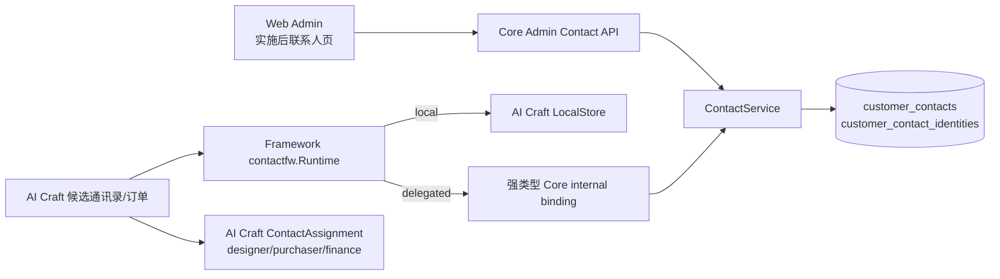
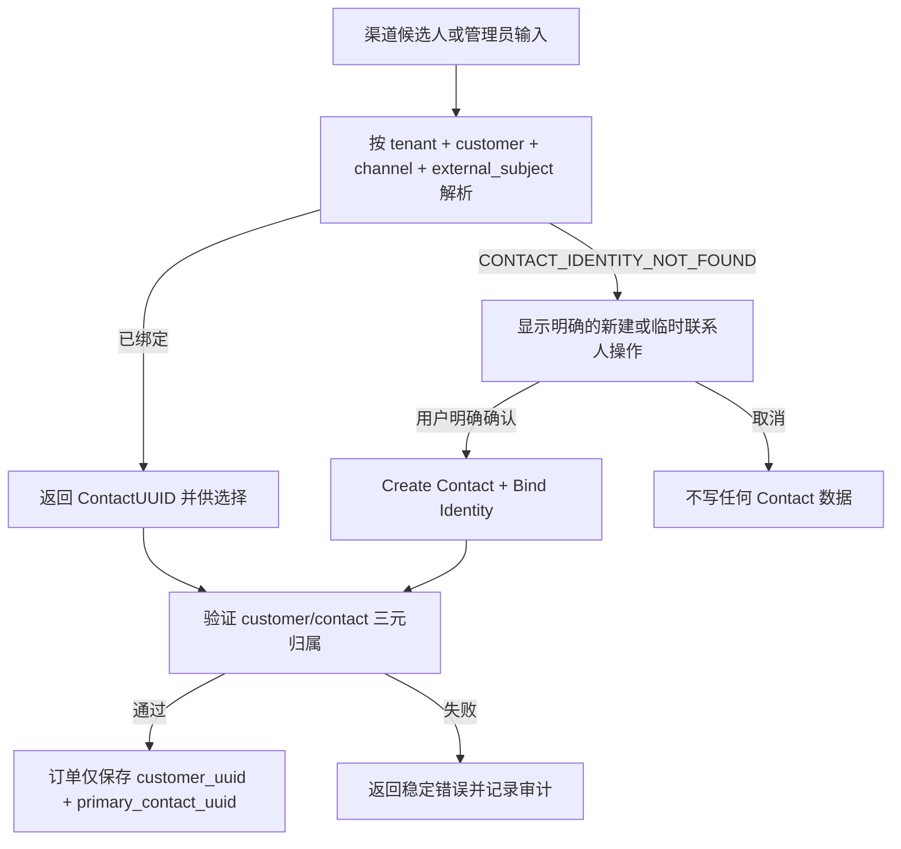
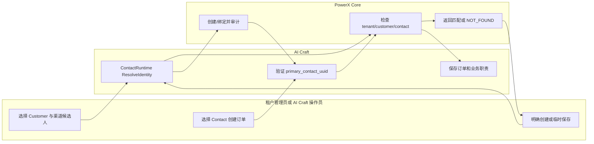

# Customer Contact 实施与验收指南（版本：v1 设计基线）

> 状态：Core Contact 迁移、Admin 路由、Core internal typed binding、Framework `contactfw` 与 AI Craft local/delegated runtime 装配已实现；候选联系人操作界面、订单 UUID 迁移、业务职责分配、存量治理及端到端验收尚未实现。本指南用于继续实施、联调和验收；不得将未交付的 UI 或插件能力写成当前可用功能。

## 1. 功能背景与目标

Customer 表达客户主体及其登录身份，不足以表达一个客户侧企业中的多个自然人。Contact 负责联系人主数据，ContactIdentity 负责渠道稳定身份；AI Craft 只在此基础上定义设计、采购、财务等业务职责。

目标是消除订单中的自由文本“设计师”输入，并确保本地模式与 delegated 模式的语义、UUID、租户边界和失败行为一致。

## 2. 角色与适用范围

| 角色 | 可做什么 |
| --- | --- |
| 租户管理员 | 在 Customer 下管理 Contact 和显式绑定渠道身份。 |
| AI Craft 操作员 | 从候选通讯录解析、选择或明确新建联系人，再创建订单。 |
| 插件服务 | 仅在已授权 capability 下调用强类型 service read/manage binding。 |
| 运维、QA、研发 | 迁移、能力授权、local/delegated 回归和存量订单治理。 |

不适用：Customer 登录身份管理、自动从渠道创建 Contact、Customer 自助门户、或把 AI Craft 角色写入 Core 通用 role。

## 3. 整体架构与模块关系



Customer authentication continues to use `customer_accounts`, `customer_auth_identities`, and `customer_tenant_memberships`. Neither Contact table replaces them.

## 4. 核心流程



失败不是回退：delegated Core 不可用时返回 `CONTACT_DELEGATE_UNAVAILABLE`；不会转查 AI Craft local 表。

## 5. 跨角色协作流程



## 6. 前置条件与依赖

实施后，管理员需要 Contact 管理权限；插件服务需要已发布、已注册且已授予的 `service_read` 或 `service_manage` capability。`/api/v1/admin/*` 只能使用用户 JWT，插件普通 STS token 不可调用。

AI Craft 必须显式声明 Contact 消费。声明后，启动阶段必须解析 `ContactRuntime.Store()`：local 模式要求 LocalStore；delegated 模式要求强类型 Core client。未声明且无消费者的插件不构造该 runtime。

## 7. 操作步骤（按场景拆分）

### 场景 A：页面操作（待实现）

1. 动作：在 Customer 详情打开“联系人”区域，选择“新建联系人”。
   - 入口：计划页 `web-admin/app/pages/customers/[customer_uuid]/contacts.vue`；当前分支尚未存在该页面。
   - 预期结果：表单只提交联系人字段和受控通用 roles/tags，不出现 AI Craft `designer` 等职责字段。
   - 失败处理：若 Customer 不在当前 tenant 或无权限，页面显示对应 i18n 错误状态，不以 UUID 作为人名展示。
2. 动作：从渠道候选人选择“解析联系人”。
   - 入口：AI Craft 订单联系人选择器（实施后）。
   - 预期结果：已命中时显示 Contact display name；未命中时显示“新建联系人”与“作为临时联系人保存”。
   - 失败处理：`CONTACT_IDENTITY_NOT_FOUND` 不创建记录；取消操作不产生写入。

### 场景 B：接口调用（实施后）

以下是已实现的 Core Admin API；仍需具备有效的管理员 JWT 和租户 RBAC：

```bash
curl -sS -X POST http://127.0.0.1:8080/api/v1/admin/customers/<customer_uuid>/contacts \
  -H 'Authorization: Bearer <admin-user-jwt>' \
  -H 'Content-Type: application/json' \
  -d '{"display_name":"Chen Li","status":"active","roles":["primary"],"tags":["vip"]}'
```

预期响应中 `contact_uuid` 是业务引用；请求没有 `tenant_uuid`。如果将返回的 Contact UUID 放到另一个 Customer 路径下，预期得到 `CONTACT_CUSTOMER_MISMATCH`，且不会产生重绑。

### 场景 C：本地联调（实施后）

1. 动作：迁移并运行 Core focused tests。
   - 入口/命令：`cd backend && go test ./internal/service/customer ./pkg/corex/db/persistence/repository/customer ./internal/transport/http/admin/customer`
   - 预期结果：归属、identity miss、冲突与 capability 测试通过。
   - 失败处理：先检查 `migrateCustomerModels` 是否挂载 Contact 模型，再检查测试 fixture 是否含 UUID 和 tenant/customer 三元字段。
2. 动作：运行 capability 静态校验。
   - 入口/命令：`make capability-check`
   - 预期结果：Contact capability 的 binding、method、scope 与 catalog 一致。
   - 失败处理：检查 `backend/config/platform_capabilities/customer.yaml` 与强类型 operation 映射；不要通过修改 STS validator 绕过登记。
3. 动作：运行 AI Craft local/delegated 运行时测试。
   - 入口/命令：在 AI Craft backend 模块根执行 ContactRuntime focused tests。
   - 预期结果：local 与 delegated 都验证同一 Customer/Contact 归属；delegated 故障返回 `CONTACT_DELEGATE_UNAVAILABLE`。
   - 失败处理：检查 bootstrap 的显式 `Store()` 校验及 credential capability grant，不增加 local fallback。

## 8. 预期结果与验收标准

- [ ] Contact 与 Customer AuthIdentity 有独立模型、表、服务和 capability。
- [ ] 任意查询和写入均验证 tenant、Customer、Contact 三元归属。
- [ ] identity 未命中不会创建任何主数据。
- [ ] local/delegated 模式仅选其一；已声明消费者的 adapter 缺失导致启动失败。
- [ ] delegated 故障无 local fallback。
- [ ] AI Craft 订单只写 `customer_uuid + primary_contact_uuid`；业务角色不污染 Core Contact roles。
- [ ] 存量未确认订单可被识别并阻止责任相关后续动作。

## 9. 代码实现映射

| 目标 | 当前/目标代码位置 | 说明 |
| --- | --- | --- |
| Customer 模型基础 | `backend/pkg/corex/db/persistence/model/customer/customer_gorm.go` | 现有 Customer/AuthIdentity；Contact 将在同域新增。 |
| 迁移入口 | `backend/pkg/corex/db/database/migration.go::migrateCustomerModels` | 集中 AutoMigrate 挂载点。 |
| Customer capability 先例 | `backend/internal/service/customer/capability_invoker.go` | Contact 需新增强类型 dispatch，不复制通用 endpoint 模式。 |
| Admin Customer 路由 | `backend/internal/transport/http/admin/customer/` | Contact Admin HTTP 目标目录。 |
| Framework Customer 先例 | `PowerXPlugin/framework/backend/go/runtime/customerfw/` | Contact 使用独立 `runtime/contactfw/`。 |
| AI Craft 启动装配 | `com.powerx.plugin.ai-craft/backend/internal/bootstrap/framework_customer.go` | `BindFrameworkContact` 与之相邻实现。 |
| AI Craft local Customer 先例 | `com.powerx.plugin.ai-craft/backend/internal/services/customer/framework_local_store.go` | Contact 必须使用独立 LocalStore。 |

## 10. 常见问题与排障

### Q1：delegated 模式为什么不能用本地 Contact 数据救急？

- 现象：Core 调用超时或 capability 未授权。
- 排查：确认 capability 已发布、租户已注册、当前插件 credential 已获 Contact capability；检查 trace ID。
- 修复：恢复 Core binding 或授权；返回 `CONTACT_DELEGATE_UNAVAILABLE`，不得增加 fallback。

### Q2：为什么渠道候选人不能直接成为联系人？

- 现象：候选记录有姓名或邮箱，但解析返回 `CONTACT_IDENTITY_NOT_FOUND`。
- 排查：确认它是否已有显式 ContactIdentity binding。
- 修复：由用户选择新建或临时保存，随后原子绑定；不从候选字段推断 Customer 或 Contact。

### Q3：历史订单的设计师文本怎么办？

- 现象：订单缺少 `primary_contact_uuid`。
- 排查：查看迁移产生的 remediation inventory。
- 修复：运营人员选择已存在 Contact 或明确新建；完成前阻止需要责任联系人的订单动作。

## 11. 回滚与风险控制

代码发布按 Core → Framework → AI Craft 顺序。已创建的 Contact 与 Identity 不回写为旧自由文本。若 AI Craft 切换出现问题，停止新订单入口或责任相关 transition，并保留 remediation 状态；不要恢复旧字段双写或自动推断逻辑。

## 12. 变更记录

| 日期 | 修改人 | 变更 |
| --- | --- | --- |
| 2026-09-20 | Codex | 建立 Contact 设计、实施和验收基线；功能尚未实现。 |
