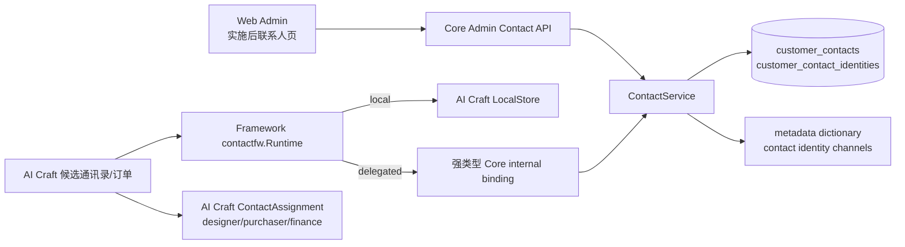
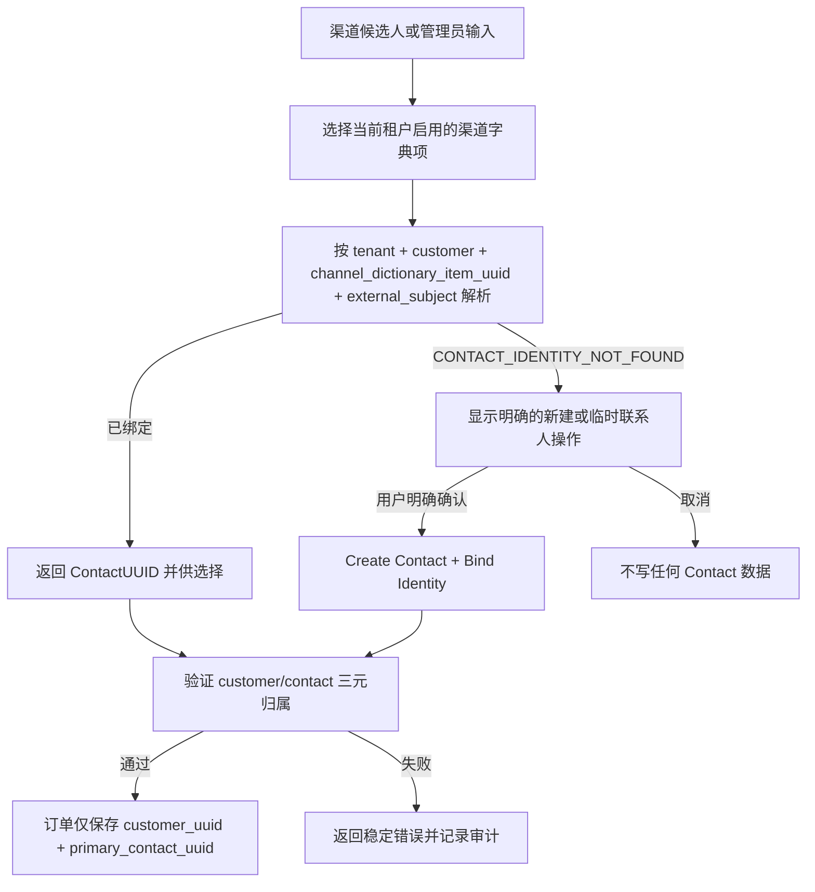
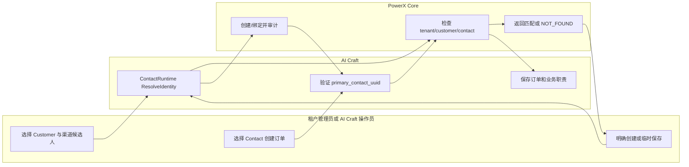

# Customer Contact 实施与验收指南（版本：v1 设计基线）

> 状态（2026-09-24）：Core Customer/Contact 的 Admin 路由、强类型 service binding 与 Framework `customerfw`/`contactfw` 接口已有实现。使用者提供的 PowerXPlugin Framework Lab 截图显示 local 路径已加载客户、选中客户并列出联系人；使用者确认该路径以 API Key 联调成功。截图没有覆盖插件安装后的 delegated/STS 路径，也没有单独证明创建、身份绑定及 AI Craft 订单闭环。AI Craft 已有 ContactRuntime 装配及订单 UUID 字段，候选解析、归属校验、业务职责、存量治理和端到端验收仍需对齐。本文是实施与验收指南，不把局部联调写成全链路完成。

## 1. 功能背景与目标

Customer 表达类型明确的客户主体（`person` 个人、`company` 公司）及其登录身份，不足以表达一个客户侧企业中的多个自然人。Contact 负责自然人联系人主数据，ContactIdentity 负责渠道稳定身份；AI Craft 只在此基础上定义设计、采购、财务等业务职责。

新建 Customer 未指定或空类型时默认并保存为 person；明确 company 保持原值。新建 Customer 是原子业务操作：同时创建租户成员关系和一位 `primary` Contact，任一步失败即整体回滚。个人若未明确提供联系人，使用客户姓名及可用邮箱、电话创建本人联系人；若提供 `primary_contact`，使用该自然人信息且不重复造人。公司必须明确提供自然人 `primary_contact`，不能用公司名称生成联系人。返回 `type` 和 `primary_contact_uuid`。已由 Core 验证的插件身份时（空类型在事务中补存为 `person`，明确 company 保留），重复身份解析可在同一事务内补齐缺失的主要联系人引用：唯一现有 Contact 复用，零联系人创建；多位候选或失效引用报错。客户资料写入也执行相同不变量检查及补齐。公司无 Contact 时仍需明确自然人联系人。批量历史补录仍走可预览、主动执行的治理流程；读取、Contact 查询和普通迁移不触发补写。

目标是消除订单中的自由文本“设计师”输入，并确保本地模式与 delegated 模式的语义、UUID、租户边界和失败行为一致。

## 2. 角色与适用范围

| 角色 | 可做什么 |
| --- | --- |
| 租户管理员 | 在 Customer 下管理 Contact 和显式绑定渠道身份。 |
| AI Craft 操作员 | 从候选通讯录解析、选择或明确新建联系人，再创建订单。 |
| 插件服务 | 仅在已授权 capability 下调用强类型 service read/manage binding。 |
| 运维、QA、研发 | 迁移、能力授权、local/delegated 回归和存量订单治理。 |

不适用：Customer 登录身份管理、自动从渠道创建 Contact、Customer 自助门户、或把 AI Craft 角色写入 Core 通用 role。

## 3. 整体架构与模块关系



Customer authentication continues to use `customer_accounts`, `customer_auth_identities`, and `customer_tenant_memberships`. Neither Contact table replaces them.

### 渠道不是一个概念

| 字典 | 表达什么 | 示例 |
| --- | --- | --- |
| `corex.customer.contact_identity_channel` | 某个联系人在外部系统的稳定账号类型 | 邮箱、企业微信、WhatsApp、Shopify 买家 ID |
| `corex.marketing.acquisition_channel` | 客户第一次被获客或归因的营销来源 | 搜索广告、达人合作、展会、客户推荐 |
| `corex.marketing.content_distribution_channel` | 内容生产后的发布平台 | YouTube、抖音、小红书、知乎、公众号、微博 |

MediaX Studio 安装后应读取后两类营销字典以提供统一选项；仍必须通过其 Provider/ProviderApp/Account 合同判断账号是否已授权和可发布。不能因为客户从抖音获客，就把“抖音”作为某个 Contact 的身份绑定。

## 4. 核心流程



失败不是回退：delegated Core 不可用时返回 `CONTACT_DELEGATE_UNAVAILABLE`；不会转查 AI Craft local 表。

## 5. 跨角色协作流程



## 6. 前置条件与依赖

实施后，管理员需要 Contact 管理权限；插件服务需要已发布、已注册且已授予的 `service_read` 或 `service_manage` capability。`/api/v1/admin/*` 只能使用用户 JWT，插件普通 STS token 不可调用。

AI Craft 必须显式声明 Contact 消费。声明后，启动阶段必须解析 `ContactRuntime.Store()`：local 模式要求 LocalStore；delegated 模式要求强类型 Core client。未声明且无消费者的插件不构造该 runtime。

AI Craft 的具体对齐顺序、能力矩阵和验收证据见 [AI Craft 对齐交接](./ai-craft-alignment.md)。其中 Customer 基础资料创建同时建立客户、租户成员关系和主要联系人，不等同于创建可密码登录的 Customer 身份。

| Use Case | 文档 | 适用角色 | 验收口径 |
| --- | --- | --- | --- |
| Core Customer/Contact 管理 | 本指南第 7–8 节 | Core 管理员、QA | Admin JWT 下创建与读取，三元归属和字典校验 |
| AI Craft 消费 Customer/Contact | [AI Craft 对齐交接](./ai-craft-alignment.md) | AI Craft 研发、QA | local/API Key、安装后 delegated/STS 与订单事实分别验证 |

## 7. 操作步骤（按场景拆分）

### 场景 A：页面操作

1. 动作：在 Customer 详情打开“联系人”区域，选择“新建联系人”。
   - 入口：`web-admin/app/pages/customers/[customer_uuid].vue` 的“联系人”标签页。
   - 预期结果：表单只提交联系人字段和受控通用 roles/tags，不出现 AI Craft `designer` 等职责字段。
   - 失败处理：若 Customer 不在当前 tenant 或无权限，页面显示对应 i18n 错误状态，不以 UUID 作为人名展示。
2. 动作：从联系人“渠道账号”选择“解析渠道身份”或“显式绑定渠道身份”。
   - 入口：`web-admin/app/pages/customers/[customer_uuid].vue`。
   - 输入：从当前租户 `corex.customer.contact_identity_channel` 字典中选择渠道，再填写渠道外部标识。
   - 预期结果：已命中时显示 Contact display name；未命中时显示“新建联系人”与“作为临时联系人保存”。
   - 失败处理：`CONTACT_IDENTITY_NOT_FOUND` 不创建记录；取消操作不产生写入。

### 场景 B：接口调用

以下是已实现的 Core Admin API；仍需具备有效的管理员 JWT 和租户 RBAC：

```bash
curl -sS -X POST http://127.0.0.1:8080/api/v1/admin/customers/<customer_uuid>/contacts \
  -H 'Authorization: Bearer <admin-user-jwt>' \
  -H 'Content-Type: application/json' \
  -d '{"display_name":"Chen Li","status":"active","roles":["primary"],"tags":["vip"],"creation_intent":"explicit_create"}'
```

预期响应中 `contact_uuid` 是业务引用；请求没有 `tenant_uuid`。如果将返回的 Contact UUID 放到另一个 Customer 路径下，预期得到 `CONTACT_CUSTOMER_MISMATCH`，且不会产生重绑。

### 场景 C：本地联调（实施后）

1. 动作：迁移并运行 Core focused tests。
   - 入口/命令：`cd backend && go run ./cmd/database migrate --config etc/config.yaml && go test ./internal/service/customer ./internal/service/capability_registry ./internal/transport/http/admin/customer ./internal/http`
   - 预期结果：归属、identity miss、冲突、事务审计、OpenAPI 无 tenant override 与 capability grant 撤销测试通过。
   - 失败处理：先检查 `migrateCustomerModels` 是否挂载 Contact 模型，再检查测试 fixture 是否含 UUID 和 tenant/customer 三元字段。
2. 动作：校验并发布 capability catalog。
   - 入口/命令：`make capability-check && make capability-seed`
   - 预期结果：Contact capability 的 binding、method、scope 与 catalog 一致，并为每个现有租户建立 published registration。
   - 失败处理：检查 `backend/config/platform_capabilities/customer.yaml` 与强类型 operation 映射；不要通过修改 STS validator 绕过登记。
3. 动作：运行 AI Craft local/delegated 运行时测试。
   - 入口/命令：在 AI Craft backend 模块根执行 ContactRuntime focused tests。
   - 预期结果：local 与 delegated 都验证同一 Customer/Contact 归属；delegated 故障返回 `CONTACT_DELEGATE_UNAVAILABLE`。
   - 失败处理：检查 bootstrap 的显式 `Store()` 校验及 credential capability grant，不增加 local fallback。

## 8. 预期结果与验收标准

### Framework Host / delegated API Key 准入

任何明确供 Framework local Host 模拟或 delegated runtime 使用的 `core_internal` capability，必须在同一条 protocol binding 声明显式 `api_key` scope。Core 统一将该声明同步为 API Key 可授予权限；不得以 `/api/v1/admin/*` 的后台 RBAC 代替 service grant，也不得让调用方传入任意 HTTP method 或 endpoint。Customer Account selector 使用 `com.corex.customer.accounts.service_read` 与 `core://customer/accounts` 的固定 `list` operation；Contact 使用 `service_read` / `service_manage` 与 `core://customer/contacts` 的固定 operation。

Customer 基础资料创建另用 `com.corex.customer.accounts.service_manage`、`core://customer/accounts` 的固定 `create` operation；读取与创建分别授权。开发环境的 `POWERX_PLUGIN_API_KEY` 可获得这些 Customer/Contact Host scopes，以支持 Skeleton 联调；生产 API Key 必须由管理员显式授予所需 scopes。插件安装后的 delegated 模式使用已授权 STS，不能把 local API Key 联调结果直接视为安装验收。

PowerXPlugin Framework Lab 的 local/API Key 客户列表与联系人列表联调由使用者在 2026-09-24 提供截图并确认成功。尚需在目标环境分别记录 `grant-status`、联系人创建/读取/身份绑定的请求结果，以及插件安装后的 delegated/STS 请求结果。截图中的数据存在不代表这些路径都已通过。

- [x] Contact 与 Customer AuthIdentity 有独立模型、表、服务和 capability。
- [x] 任意查询和写入均验证 tenant、Customer、Contact 三元归属。
- [x] identity 未命中不会创建任何主数据。
- [x] Framework ContactRuntime 的单模式选择、启动缺 adapter 报错与无 local fallback 已有测试。
- [ ] 在安装后的 delegated/STS 环境重验单模式选择、故障传播和无 local fallback。
- [ ] AI Craft 订单只写 `customer_uuid + primary_contact_uuid`；业务角色不污染 Core Contact roles。
- [ ] 存量未确认订单可被识别并阻止责任相关后续动作。

## 9. 代码实现映射

| 目标 | 当前/目标代码位置 | 说明 |
| --- | --- | --- |
| Customer/Contact 模型 | `backend/pkg/corex/db/persistence/model/customer/customer_gorm.go` | Customer、Contact、ContactIdentity 分开建模。 |
| 迁移入口 | `backend/pkg/corex/db/database/migration.go::migrateCustomerModels` | 集中 AutoMigrate 挂载点。 |
| 强类型 Core dispatch | `backend/internal/service/customer/capability_invoker.go` | 固定 Customer `list/create` 与 Contact 六个 operation。 |
| Contact Admin 路由 | `backend/internal/transport/http/admin/customer/` | Admin JWT/RBAC 入口。 |
| Framework 客户与联系人 | `PowerXPlugin/framework/backend/go/runtime/customerfw/`、`runtime/contactfw/` | local/delegated typed client 和校验。 |
| AI Craft 启动装配 | `com.powerx.plugin.ai-craft/backend/internal/bootstrap/framework_contact.go` | 已有 `BindFrameworkContact`。 |
| AI Craft 本地联系人 | `com.powerx.plugin.ai-craft/backend/internal/services/customer/framework_contact_local_store.go` | local mirror；不得替代 delegated Core。 |

## 10. 常见问题与排障

### Q1：delegated 模式为什么不能用本地 Contact 数据救急？

- 现象：Core 调用超时或 capability 未授权。
- 排查：确认 capability 已发布、租户已注册、当前插件 credential 已获 Contact capability；检查 trace ID。
- 修复：恢复 Core binding 或授权；返回 `CONTACT_DELEGATE_UNAVAILABLE`，不得增加 fallback。

### Q2：为什么渠道候选人不能直接成为联系人？

- 现象：候选记录有姓名或邮箱，但解析返回 `CONTACT_IDENTITY_NOT_FOUND`。
- 排查：确认它是否已有显式 ContactIdentity binding。
- 修复：由用户选择新建或临时保存，随后原子绑定；不从候选字段推断 Customer 或 Contact。

### Q4：为什么渠道不允许手工输入 `wecom` 或 `shopify`？

- 渠道是租户元数据，不是任意字符串。ContactIdentity 请求必须提交当前租户 `corex.customer.contact_identity_channel` 中启用项的 `channel_dictionary_item_uuid`。
- 若字典项被停用、属于其他租户或不在该命名空间，Core 返回 `CONTACT_CHANNEL_DICTIONARY_INVALID`；页面会禁用绑定和解析，直到元数据治理恢复该字典。
- 历史 identity 没有该 UUID 时，Core 返回 `CONTACT_IDENTITY_CHANNEL_MIGRATION_REQUIRED`。必须人工提供明确映射，禁止依据旧 `channel` 文本猜测。

### Q3：历史订单的设计师文本怎么办？

- 现象：订单缺少 `primary_contact_uuid`。
- 排查：查看迁移产生的 remediation inventory。
- 修复：运营人员选择已存在 Contact 或明确新建；完成前阻止需要责任联系人的订单动作。

## 11. 回滚与风险控制

创建客户出现 PostgreSQL `22P02: invalid input syntax for type uuid: ""`，且 SQL 指向 `customer_tenant_memberships.primary_contact_uuid` 时，应检查 Core 是否仍运行旧代码。2026-09-26 修复了会员模型首次插入空字符串的问题：未绑定时省略该列以保存 SQL NULL，在同一事务创建 Contact 后再回写 UUID。此修复需要重建并重启 Core，不需要再次迁移，也不要求插件生成联系人 UUID。真实 PostgreSQL 回归使用独立 schema，测试结束整体回滚：在 `backend` 执行 `POWERX_CUSTOMER_TEST_CONFIG="$PWD/etc/config.yaml" go test ./internal/service/customer -run '^TestCustomerCreationPostgresNullablePrimaryContact$' -count=1`。

代码发布按 Core → Framework → AI Craft 顺序。已创建的 Contact 与 Identity 不回写为旧自由文本。若 AI Craft 切换出现问题，停止新订单入口或责任相关 transition，并保留 remediation 状态；不要恢复旧字段双写或自动推断逻辑。

## 12. 变更记录

| 日期 | 修改人 | 变更 |
| --- | --- | --- |
| 2026-09-20 | Codex | 建立 Contact 设计、实施和验收基线；功能尚未实现。 |
| 2026-09-22 | Codex | 将 ContactIdentity 渠道收敛为租户元数据字典 UUID，完成 Core/Admin 页面接入与种子。 |
| 2026-09-24 | Codex | 记录使用者提供的 PowerXPlugin local/API Key 联调证据，补充 Customer 创建能力及 AI Craft 对齐交接；安装后的 delegated 验收仍待执行。 |
