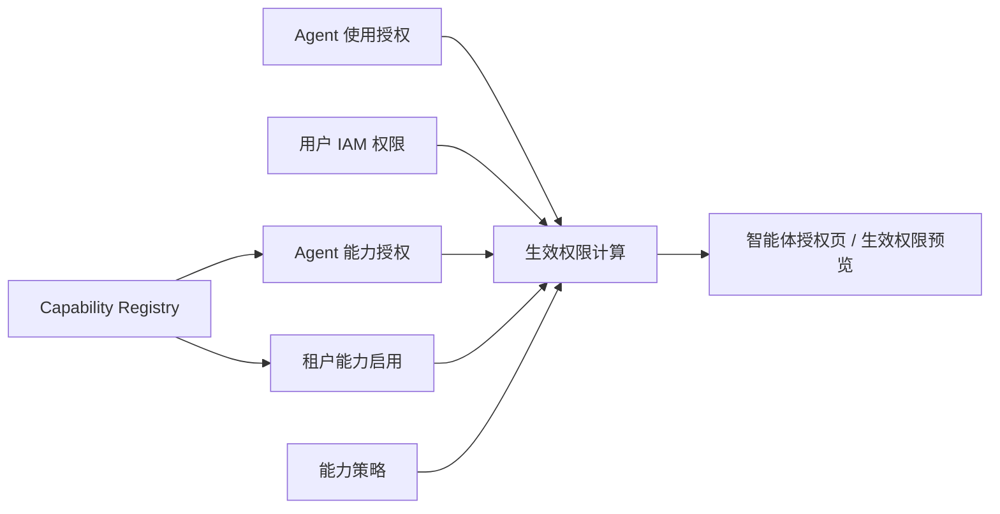
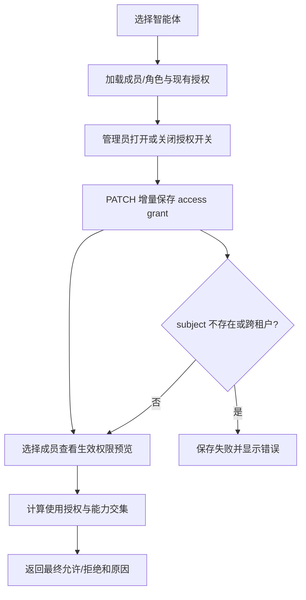
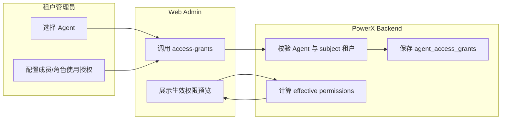

# 智能体使用授权指南

## 功能背景与目标

智能体运行时不仅要看“这个 Agent 能调用哪些能力”，还要先判断“当前成员或其角色是否可以使用这个 Agent”。本功能把关系授权放到 `设置 > AI 设置 > 智能体授权`，用于配置成员/角色与智能体的使用关系，并提供生效权限预览。

最终规则：

```text
最终权限 = 智能体使用授权 ∩ 用户 IAM 权限 ∩ Agent 能力授权 ∩ 租户能力启用 ∩ 能力策略允许
```

## 生效权限算法

生效权限预览是动态计算结果，不会写入“最终权限”快照表。保存的是配置数据：

- `agent_access_grants`：成员或角色是否可以使用某个 Agent。
- `agent_capability_grants`：Agent 是否显式允许使用其他插件能力。
- IAM 角色、权限、成员绑定：用户实际拥有的权限。
- Capability Registry：系统中可授权能力、协议绑定、租户启用和策略状态。

计算公式：

```text
effective_allowed = agent_access_allowed
  && user_allowed
  && agent_allowed
  && tenant_enabled
  && policy_allowed
```

| 字段 | 含义 |
| --- | --- |
| `agent_access_allowed` | 当前成员或其角色是否被授权使用该 Agent |
| `user_allowed` | 当前成员通过 IAM 有效角色是否拥有该 capability 对应权限 |
| `agent_allowed` | Agent 是否允许调用该 capability |
| `tenant_enabled` | 当前租户是否启用该 capability |
| `policy_allowed` | capability 策略是否允许 Agent 使用 |

### 用户 IAM 怎么算

用户 IAM 权限不是只看成员直绑角色，还会合并成员通过组织/团队/岗位/用户组继承的角色。

有效角色来源：

- 成员直绑角色。
- `ORG` assignment 映射到 `ORG_UNIT` 角色绑定。
- `TEAM`、`POSITION`、`GROUP` assignment 映射到同名角色绑定。

### 底座能力怎么对齐 IAM

底座 REST capability 不直接拿 `corex.rest:*` 权限码查 IAM。系统会从 capability 的 REST 协议绑定中读取 `method + endpoint`，映射成 IAM 三元组。

示例：

```text
GET /api/v1/admin/agents
=> admin / admin_agents / list
```

```text
GET /api/v1/admin/agents/:uuid
=> admin / admin_agents_uuid / read
```

插件能力继续使用插件配置里的结构化 `permission_code`。例如：

```text
com.powerx.plugins.base.template:create
=> module=com.powerx.plugins.base
=> resource=template
=> action=create
```

插件能力同步到 IAM 后会按默认角色授权策略写入 `iam_role_permission`：

- `role_owner`、`role_admin` 默认获得插件 capability 对应权限。
- `role_user`、`role_readonly`、`role_vendor` 不默认获得，除非 capability descriptor 显式声明。

面向普通成员直接使用的插件能力，应在 descriptor 中声明：

```yaml
default_role_grants:
  - role_user
```

也可以写在 `security.default_role_grants` 或 `rbac.default_role_grants` 下。PowerX Core 同步时会校验角色码，只接受租户默认角色：`role_owner`、`role_admin`、`role_user`、`role_readonly`、`role_vendor`。非法角色码会同步失败，不能静默忽略。

### Agent 能力怎么判断

Agent 能力授权分三层：

- 底座能力默认允许。
- Agent 所属插件能力默认允许。
- 其他插件能力必须在 Agent 能力授权里显式开启。

插件 ID 按独立实体判断，`com.powerx.plugins.base.local` 和 `com.powerx.plugins.base` 不合并。

### 缓存策略

生效权限结果会走 PowerX Cache，默认 TTL 为 `30s`。缓存不是事实源，只是减少重复计算。

缓存失效规则：

- 修改成员/角色使用授权或 Agent 能力授权后，Agent 授权版本递增，旧缓存失效。
- 修改 IAM 角色权限、成员角色绑定、角色权限集合后，租户 IAM 版本递增，旧缓存失效。
- 算法升级时提升缓存算法版本，避免旧结果继续命中。

## 角色与适用范围

- 租户管理员：配置哪些成员或角色可以使用某个智能体。
- 平台管理员：维护底座能力、插件能力和授权边界。
- QA/研发：验证插件能力声明、Agent grants、IAM 权限和使用授权是否一致。

适用环境：PowerX Core、Web Admin、已启用 IAM、Agent 管理和 Capability Registry 的租户。

## 整体架构与模块关系



## 核心流程



## 跨角色协作流程



## 前置条件与依赖

- 当前登录用户能访问 AI 设置。
- 请求上下文必须有当前租户。
- 成员和角色必须属于当前租户。
- 角色表必须存在 UUID；旧数据由迁移补齐。
- Agent 能力目录必须已同步，能力声明应带结构化 `permission_code`。

## 操作步骤（按场景拆分）

### 页面操作步骤（Web Admin）

动作：配置成员或角色是否可以使用 Agent。  
入口/命令：进入 `设置 > AI 设置 > 智能体授权`，选择智能体，在“成员授权”或“角色授权”中打开/关闭开关。  
预期结果：开关保存后，该成员或角色的授权状态立即更新。  
失败处理：如果保存失败，查看页面错误提示和后端 request_id；优先检查 subject 是否属于当前租户。

动作：查看成员最终生效权限。  
入口/命令：在同一页面选择成员，点击“查看生效权限”。  
预期结果：页面展示能力总数、最终允许、最终拒绝；未授权使用 Agent 时显示明确提示。  
失败处理：如果生效权限为空，检查 Agent 能力授权、租户 capability registry 和 IAM 角色权限。

### 接口调用步骤（Admin API）

动作：增量授权成员使用 Agent。  
入口/命令：

```bash
curl -X PATCH \
  -H "Authorization: Bearer $ADMIN_TOKEN" \
  -H "Content-Type: application/json" \
  -d '{"grants":[{"subject_type":"member","subject_uuid":"'$MEMBER_UUID'","enabled":true}]}' \
  "$POWERX_BASE_URL/api/v1/admin/agents/$AGENT_UUID/access-grants?env=dev"
```

预期结果：返回当前 Agent 的授权列表，目标 subject 状态为 `enabled`。  
失败处理：400 表示 UUID、subject_type 或租户归属不合法。

动作：预览指定成员最终权限。  
入口/命令：

```bash
curl -H "Authorization: Bearer $ADMIN_TOKEN" \
  "$POWERX_BASE_URL/api/v1/admin/agents/$AGENT_UUID/effective-permissions?member_uuid=$MEMBER_UUID&env=dev"
```

预期结果：

```json
{
  "code": 200,
  "data": {
    "agent_access_allowed": true,
    "member_uuid": "member-uuid",
    "items": [
      {
        "permission_code": "corex.agent.session:use",
        "effective_allowed": true
      }
    ]
  }
}
```

### 本地联调步骤

动作：验证后端。  
入口/命令：

```bash
cd backend
go test ./internal/service/agent_authz ./internal/transport/http/admin/agent ./internal/transport/http/admin/menu ./tests/contract/iam
```

预期结果：测试通过。  
失败处理：检查 `agent_access_grants` 迁移、Role UUID 补齐和路由注册。

动作：验证前端。  
入口/命令：

```bash
cd web-admin
npm run build
```

预期结果：Nuxt 构建通过，locale JSON 可编译。  
失败处理：检查 `web-admin/app/pages/settings/ai/agent-access-grants.vue` 和 `web-admin/i18n/locales/*.json`。

## 预期结果与验收标准

- AI 设置菜单显示“智能体授权”，不再显示“权限诊断”。
- 授权页可以选择 Agent，并按成员/角色分 Tab 配置。
- 授权开关调用增量 PATCH，不覆盖其他 subject。
- 生效权限预览包含 `agent_access_allowed`。
- 未授权成员的拒绝原因包含 `agent_access_grant_missing`。
- 页面主标签显示名称，不把 UUID 当作主显示文本。

## 代码实现映射

| 能力 | 文件 |
| --- | --- |
| 授权页面 | `web-admin/app/pages/settings/ai/agent-access-grants.vue` |
| 前端 API | `web-admin/app/composables/agent/useAgentManager.ts` |
| 授权模型 | `backend/internal/server/agent/persistence/model/agent_gorm.go` |
| 授权仓储 | `backend/internal/server/agent/persistence/repository/agent_access_grant.go` |
| 路由/Handler | `backend/internal/transport/http/admin/agent/api.go`, `backend/internal/transport/http/admin/agent/agent_authz_handler.go` |
| 生效权限计算 | `backend/internal/service/agent_authz/service.go` |
| 生效权限缓存 | `backend/internal/service/agent_authz/effective_permissions_cache.go` |
| REST capability 到 IAM 映射 | `backend/internal/service/integration_gateway/apikeypermissions/platform_capabilities.go` |
| IAM 有效角色/权限 | `backend/internal/service/iam/rbac_service.go`, `backend/pkg/corex/db/persistence/repository/iam/permission_repo.go` |
| 菜单 | `backend/internal/transport/http/admin/menu/system_menus_handler.go` |
| 多语言 | `web-admin/i18n/locales/{zh,en,ja,ko}.json` |

## 常见问题与排障

问题：成员已授权但能力仍拒绝。  
处理：检查用户 IAM、Agent 能力授权、租户能力启用和能力策略，拒绝原因会在预览里显示。若大量显示“成员缺少 IAM 权限”，需要确认 capability 的 REST binding 是否能映射到 `iam_permission.module/resource/action`，并确认成员有效角色已绑定这些 permission。

问题：角色授权后成员仍无法使用。  
处理：确认成员已经绑定该角色，并确认角色 UUID 已由迁移补齐。

问题：保存授权失败。  
处理：确认 `subject_uuid` 是当前租户成员或角色的 UUID，不要传数字 ID。

问题：刚保存后预览仍显示旧结果。  
处理：刷新页面或等待短 TTL 过期；如果是后端代码算法变化，必须重启 backend，并确认缓存算法版本已提升。

## 回滚与风险控制

- 回滚前端：移除 `agent-access-grants.vue`，恢复菜单入口前需确认业务是否接受缺失使用授权配置。
- 回滚后端：移除 `agent_access_grants`、相关路由和 `agent_access_allowed` 计算前，必须评估现有运行时是否依赖该门槛。
- 风险控制：PATCH 增量保存，避免误覆盖其他成员/角色；跨租户 subject 直接失败。

## 变更记录

| 版本 | 日期 | 责任人 | 说明 |
| --- | --- | --- | --- |
| v2 | 2026-07-11 | PowerX Team | 将“权限诊断”调整为“智能体使用授权”，新增成员/角色使用授权关系和生效权限预览。 |
