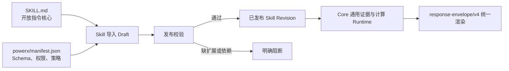
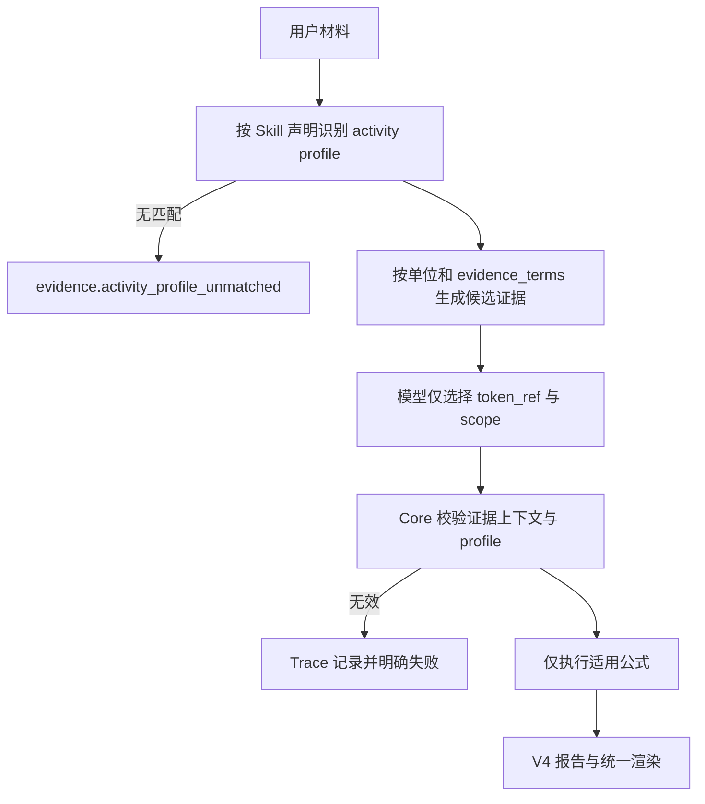
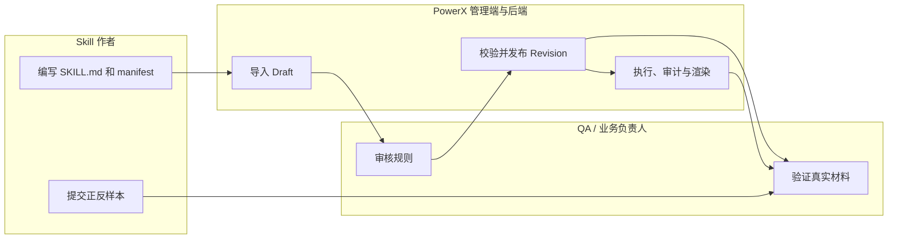

# Skill Package 分层与发布使用指导（版本：V2）

## 1. 功能背景与目标

营销复盘一类输入常同时出现周期、金额、比例和业务结论。仅依赖 Prompt 容易把“近 6 个月”错误映射为“6 个线索”。本规范把可移植的 Skill 说明与 PowerX 的可执行治理分开：业务规则由包声明，平台只执行通用的证据、计算、权限和响应契约。

适用对象是 Skill 作者、插件开发者、平台管理员、QA 与 Agent 团队维护者；不把任意外部 `SKILL.md` 自动授权为可执行代码。

## 2. 角色与适用范围

| 角色 | 责任 |
| --- | --- |
| 业务/Skill 作者 | 定义业务 profile、字段证据词、公式和验收样本 |
| 平台管理员 | 审核、发布 Skill Revision，配置权限与工具依赖 |
| PowerX Runtime | 解释已发布策略，执行计算并保存 Trace |
| QA | 验证适用场景、非适用场景与伪造证据均符合预期 |

## 3. 整体架构与模块关系



- `SKILL.md`：跨生态可读的用途、限制、输入输出语义与示例。
- `powerx/manifest.json`：PowerX 专属但公开、版本化的执行扩展。
- `calculation_policy/v2`：`activity_profiles`、字段证据约束与公式适用范围；它是 Revision 的业务声明，不是 Core 代码。

## 4. 核心流程



时间、金额、比率或编号不能仅因“包含数字”成为业务指标；不属于激活 profile 的字段也不会进入模型可选 Schema。

## 5. 跨角色协作流程



## 6. 前置条件与依赖

- Skill 必须有已发布 Revision；仅 `SKILL.md` 的外部包只能以 `instruction_only` Draft 存在。
- 可执行 V4 Skill 必须声明 `response_contract=powerx.agent.response/v4`、工具依赖、`evidence_sources` 与 V2 calculation policy。
- 外部计算或行业算法必须是受控工具依赖；没有对应 Runtime 时发布或执行明确阻断。

## 7. 操作步骤

### 场景 A：编写并发布业务 Skill

1. 动作：在包根目录写 `SKILL.md`，在 `powerx/manifest.json` 写 PowerX 扩展。
   - 预期结果：导入时形成可审核 Draft。
   - 失败处理：缺少扩展时保持 `instruction_only`，不要绕过发布校验。
2. 动作：在 `executor.calculation_policy` 声明 profile、字段的 `evidence_terms_i18n/applies_to`、以及公式的 `applies_to`。
   - 预期结果：V2 校验通过；无 profile、无字段证据词或无公式适用范围均被拒绝。
   - 失败处理：修订 Skill 定义后创建新 Revision；不修改 Core 增加业务分支。

### 场景 B：本地验证固有营销 Skill

1. 动作：在仓库根目录执行：

```bash
make seed
cd backend && go test ./pkg/corex/agent/evidence ./internal/service/skills ./cmd/database/seed -count=1
```

2. 预期结果：种子中的营销 Skill 使用 V2；“GMV/ROI/复购”材料激活交易留存 profile，而不会激活线索目标公式。
3. 失败处理：查看返回的 `skill.calculation_policy_*` 或 `evidence.*` 错误和 Trace 的 `evidence_validation` 字段。

### 场景 C：通过管理端验收

1. 动作：在“智能体 → 团队任务”选择营销活动复盘协作团队，提交一段 GMV/ROI/复购导向材料。
2. 预期结果：回复由统一 V4 渲染器展示原文报告值、平台计算值、冲突、缺口与下一步；不出现虚构线索或访问人数。
3. 失败处理：点击“追踪本轮”，检查 profile、被选择 token 和失败阶段；不要用刷新或重试掩盖错误。

## 8. 预期结果与验收标准

- [ ] 外部标准 Skill 可导入为 Draft，但未经 PowerX 扩展校验不可执行。
- [ ] 同一 Skill 在不改 Core 的情况下可新增 profile、字段、公式与工具依赖。
- [ ] `6个月` 不能映射为访问、线索、客户或目标数。
- [ ] 交易/留存材料不会生成线索活动专属缺口。
- [ ] 所有计算值都可追溯到同次工具执行与原文证据。

## 9. 代码实现映射

| 行为 | 代码位置 |
| --- | --- |
| V2 策略、profile 与公式校验 | `backend/pkg/corex/agent/evidence/policy.go` |
| 原文 token、字段证据匹配 | `backend/pkg/corex/agent/evidence/source_tokens.go` |
| 通用 Runtime 编排 | `backend/internal/service/skills/executor_evidence.go` |
| 固有营销声明 | `backend/cmd/database/seed/locales/marketing_calculation_policy.json` |
| 统一报告协议 | `backend/config/agent/response_envelope.v4.schema.json` |

## 10. 常见问题与排障

### Q1：外部包为什么不能直接运行？

仅有 `SKILL.md` 不含 PowerX 的权限、执行器、输入 Schema 与工具依赖，因而只能导入 Draft。补齐 `powerx/manifest.json` 并发布新 Revision。

### Q2：为什么数值没有被选中？

字段须同时满足当前 profile、单位与 `evidence_terms_i18n`。这是防止数值错配的强制校验；应调整该 Skill 的字段声明，而不是放宽 Runtime。

## 11. 回滚与风险控制

通过停用或回滚到上一已发布 Revision 恢复。V1 策略不会被 V2 Runtime 静默转换；必须修订并重新发布，避免旧模板重新引入不适用字段。

## 12. 变更记录

- 2026-09-08：新增开放核心 + PowerX 执行扩展的分层协议与 V2 证据/profile 约束。
