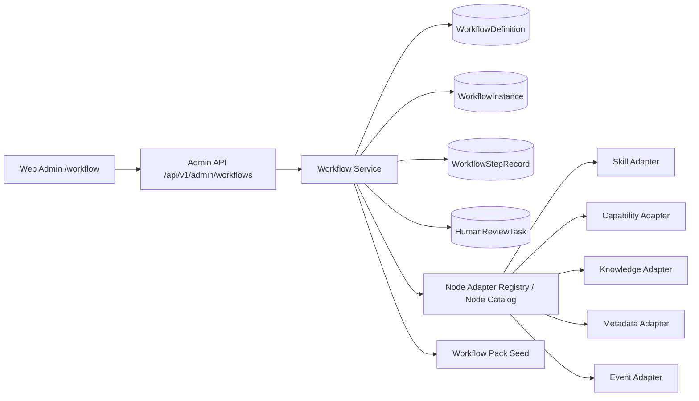
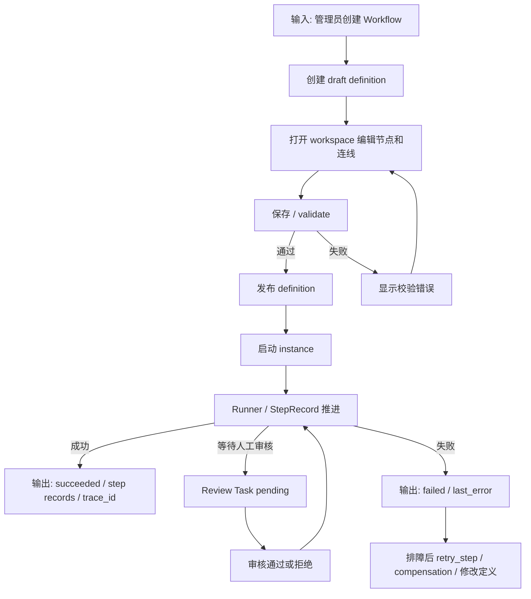
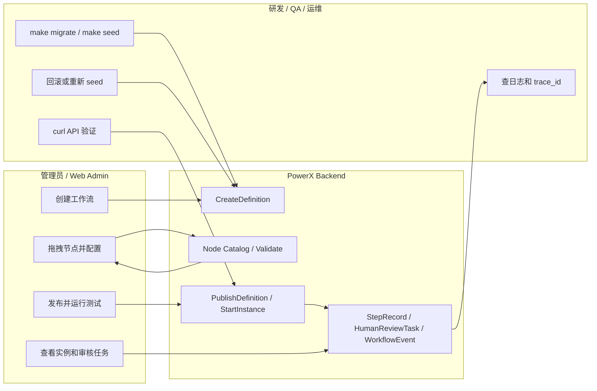

# PowerX Workflow 操作指导手册

## 1. 功能背景与目标

Workflow 是 PowerX 用来编排租户业务流程的运行时能力。它面向智能体、知识库增量迭代、插件复合能力、人工审核和补偿回滚，不替代 EventBus、Task Queue、Scheduler 这类底座 Flow。

本手册用于指导管理员、研发和 QA 在当前 Web Admin 与 Admin API 中完成工作流的创建、编辑、运行、审核查看和排障。

当前目标：

- 在 Web Admin 查看 Workflow Definition 列表。
- 创建 draft 工作流定义并打开编辑器。
- 在编辑器中拖入节点、连线、配置节点、保存和运行测试。
- 通过 Admin API 创建、发布、启动和查询 Workflow。
- 通过 seed 初始化内置 Workflow Pack。
- 通过实例详情和 Review Task 页面进行基础运行巡检。

当前边界：

- Web Admin 编辑器已接入真实 `/api/v1/admin/workflows` API 和 Node Catalog。
- 内置 Workflow Pack 通过 `make seed` 的 `db-seed` 阶段写入。
- 当前 Runner、节点适配器、Human Review 处理链路仍需按 `docs/plan/ai_engineering/workflow` 继续完善；手册中标注的验收必须以当前实现为准。

## 2. 角色与适用范围

| 角色 | 主要用途 | 环境 |
| --- | --- | --- |
| 平台管理员 | 创建、发布、运行工作流，查看审核任务和实例状态 | Web Admin、本地/测试/远程 dev |
| 研发 | 联调 Admin API、Node Catalog、seed、Runner 和节点适配器 | 本地开发环境 |
| QA | 按页面和 API 验证成功链路、失败链路和权限边界 | 测试环境 |
| 运维 | 在部署后执行 migrate/seed、检查日志、回滚异常发布 | systemd dev / production |

适用页面：

- `/workflow`
- `/workflow/workspace?id=<workflow_definition_uuid>`
- `/workflow/instances/<workflow_instance_uuid>`
- `/workflow/review-tasks`

适用 API：

- `/api/v1/admin/workflows/*`

不适用：

- 不把 `/workflow` 当前前端页面路径当作后端 API 前缀。
- 不通过 numeric id 引用工作流定义、实例、用户、智能体或审核任务。
- 不把未通过发布校验的 draft 当作可执行生产工作流。

## 3. 整体架构与模块关系



关键模块：

| 模块 | 职责 |
| --- | --- |
| Web Admin Workflow List | 搜索、筛选、分页、创建、打开编辑器、启动实例 |
| Workflow Workspace | Vue Flow 画布、组件库、节点配置、节点说明、运行面板 |
| Workflow Admin API | 定义、实例、节点目录、审核任务、Workflow Pack |
| Workflow Service | 定义校验、发布、实例启动、控制、seed、事件记录 |
| Node Catalog | 将语义节点 `skill.invoke`、`human.review` 等暴露给编辑器 |
| Workflow Pack Seed | 初始化内置可复用流程定义 |

## 4. 核心流程



失败分支处理原则：

- 定义校验失败：回到 workspace 修正节点、连线或必填配置。
- 实例启动失败：检查 definition 状态是否 `published`，以及 API Token/RBAC。
- 节点执行失败：从实例详情读取 `trace_id`、`step_id`、`error_message`。
- 审核卡住：进入 `/workflow/review-tasks`，按状态筛选 pending 任务。

## 5. 跨角色协作流程



## 6. 前置条件与依赖

### 6.1 服务依赖

- PostgreSQL 已完成迁移。
- 后端服务已启动，并加载包含 Workflow 模块的配置。
- Web Admin 已启动并指向当前后端。
- 当前用户拥有访问 `/api/v1/admin/workflows/*` 的后台权限。

### 6.2 数据依赖

初始化数据库：

```bash
make migrate
make seed
```

说明：

- `make migrate` 执行数据库迁移。
- `make seed` 顺序执行 `db-seed` 和 `capability-seed`。
- `db-seed` 当前包含 CoreX、Metadata、Workflow Pack 等种子数据。

远程 systemd dev 环境不要在没有 Makefile 的发布包 backend 目录里直接跑 `make seed`。应使用发布包实际包含的二进制或部署脚本约定，例如：

```bash
cd /opt/powerx-dev/backend
sudo -u powerx ./database migrate --config /etc/powerx-dev/config.yaml
sudo -u powerx POWERX_CONFIG=/etc/powerx-dev/config.yaml ./database seed
sudo -u powerx POWERX_CONFIG=/etc/powerx-dev/config.yaml ./powerx capability-seed
```

具体命令以当前发布包和 systemd 文档为准。

### 6.3 权限与身份

- 页面访问使用用户 JWT、租户成员和 RBAC。
- API 示例中的 `<TOKEN>` 必须是可访问 Admin Workflow API 的用户态 token。
- 不使用插件 STS token 直接调用 `/api/v1/admin/workflows/*` 绕过用户权限。

## 7. 操作步骤（按场景拆分）

### 7.1 页面操作：查看工作流列表

动作：打开工作流管理页面。

入口：

```text
Web Admin -> /workflow
```

操作：

1. 查看顶部统计：总流程、已发布、草稿。
2. 使用搜索框按名称或描述搜索。
3. 使用状态筛选：全部、草稿、已发布、已归档。
4. 使用分页控件切换每页数量。

预期结果：

- 页面展示 Workflow Definition 卡片。
- 卡片展示名称、描述、版本、状态和更新时间。
- 内置 Workflow Pack 显示“内置包”标识。

失败处理：

- 页面空白：检查 `GET /api/v1/admin/workflows/definitions` 是否 200。
- 没有内置包：确认已执行 `make seed` 或远程环境的 `./database seed`。
- 401/403：检查当前登录用户的后台权限。

### 7.2 页面操作：新建工作流

动作：创建 draft Workflow Definition。

入口：

```text
/workflow -> 新建流程
```

操作：

1. 点击“新建流程”。
2. 输入流程名称。
3. 可选输入描述。
4. 点击“创建”。

预期结果：

- 创建成功后打开新窗口：

```text
/workflow/workspace?id=<workflow_definition_uuid>
```

- 新定义默认包含一个 `input.capture` 起始节点。

失败处理：

- 创建按钮不可点：确认流程名称非空。
- 400：检查后端返回的校验错误，常见原因是 `steps` 为空或 `node_kind` 不合法。
- 新窗口被拦截：允许浏览器弹窗，或从列表卡片重新点击进入编辑。

### 7.3 页面操作：编辑工作流画布

动作：通过 Workflow Workspace 编辑节点和连线。

入口：

```text
/workflow/workspace?id=<workflow_definition_uuid>
```

操作：

1. 左侧“组件库”搜索节点。
2. 将节点拖到画布中。
3. 拖拽节点 handle 建立连线。
4. 点击节点，右侧“节点配置”显示 schema 表单。
5. 点击右侧“节点说明”查看节点类型、必填字段和输出端口。
6. 使用顶部工具栏放大、缩小、适应视图、居中、重置缩放、全屏和切换小地图。
7. 点击“保存”。

预期结果：

- 节点在画布可拖拽、可连线。
- 右侧属性面板随选中节点更新。
- 小地图和缩放百分比与画布状态联动。
- 保存后定义的 `step_graph` 与画布节点/连线一致。

失败处理：

- 左侧组件库为空：检查 `GET /api/v1/admin/workflows/node-catalog`。
- 右侧属性为空：先点击一个节点。
- 画布空白：确认 URL 中 `id` 是有效 `workflow_definition_uuid`。
- 节点不能发布：检查节点必填字段、能力授权、Skill/Capability/Knowledge Space 引用是否存在。

### 7.4 页面操作：运行实例和查看详情

动作：从列表启动 Workflow Instance。

入口：

```text
/workflow -> 卡片菜单 -> 运行
```

预期结果：

- 跳转到：

```text
/workflow/instances/<workflow_instance_uuid>
```

- 页面显示实例状态、定义 UUID 摘要、trace 和步骤记录。

失败处理：

- 启动失败：确认定义状态是 `published`。
- 详情页无步骤：确认请求包含 `include_steps=true`，并检查后端 StepRecord 是否写入。
- 实例失败：复制 `trace_id` 和失败步骤，查后端日志。

### 7.5 页面操作：查看人工审核任务

动作：查看 Human Review 待办。

入口：

```text
/workflow -> 人工审核
/workflow/review-tasks
```

操作：

1. 选择任务状态：pending、approved、rejected、changes_requested、canceled。
2. 点击刷新。
3. 点击任务右侧查看按钮进入实例详情。

预期结果：

- 列表展示 `review_type`、实例 UUID 摘要、任务状态。
- 可跳转到对应 Workflow Instance。

失败处理：

- pending 为空：确认工作流中是否存在 `human.review` 节点，以及实例是否推进到该节点。
- 审核动作不可见：当前页面只提供基础查看入口，动作能力需按 Human Review 页面计划继续完善。

### 7.6 接口调用：创建、发布、运行和查询

准备：

```bash
export POWERX_BASE_URL="http://127.0.0.1:8077"
export ADMIN_TOKEN="<TOKEN>"
```

创建定义：

```bash
curl -sS -X POST "$POWERX_BASE_URL/api/v1/admin/workflows/definitions" \
  -H "Authorization: Bearer $ADMIN_TOKEN" \
  -H "Content-Type: application/json" \
  -d '{
    "name": "marketing-knowledge-capture",
    "description": "营销知识采集流程",
    "steps": [
      {
        "id": "capture",
        "type": "system",
        "node_kind": "input.capture",
        "config": {
          "artifact_output_path": "$.artifacts.source"
        },
        "next_step_ids": ["extract"]
      },
      {
        "id": "extract",
        "type": "system",
        "node_kind": "skill.invoke",
        "node_ref": "knowledge.extract.marketing",
        "depends_on": ["capture"],
        "config": {
          "skill_id": "knowledge.extract.marketing",
          "output_path": "$.vars.extracted"
        }
      }
    ]
  }'
```

响应片段：

```json
{
  "uuid": "<definition_uuid>",
  "name": "marketing-knowledge-capture",
  "status": "draft",
  "version": 1
}
```

校验定义：

```bash
curl -sS -X POST "$POWERX_BASE_URL/api/v1/admin/workflows/definitions/<DEFINITION_UUID>/validate" \
  -H "Authorization: Bearer $ADMIN_TOKEN" \
  -H "Content-Type: application/json" \
  -d '{"steps":[]}'
```

预期失败：

- 空 `steps` 或非法 `node_kind` 应返回明确校验错误。

发布定义：

```bash
curl -sS -X POST "$POWERX_BASE_URL/api/v1/admin/workflows/definitions/<DEFINITION_UUID>/publish" \
  -H "Authorization: Bearer $ADMIN_TOKEN"
```

启动实例：

```bash
curl -sS -X POST "$POWERX_BASE_URL/api/v1/admin/workflows/instances" \
  -H "Authorization: Bearer $ADMIN_TOKEN" \
  -H "Content-Type: application/json" \
  -d '{
    "definition_uuid": "<DEFINITION_UUID>",
    "input": {
      "source_asset_uuid": "<SOURCE_ASSET_UUID>"
    }
  }'
```

查询实例：

```bash
curl -sS "$POWERX_BASE_URL/api/v1/admin/workflows/instances/<INSTANCE_UUID>?include_steps=true" \
  -H "Authorization: Bearer $ADMIN_TOKEN"
```

查询节点目录：

```bash
curl -sS "$POWERX_BASE_URL/api/v1/admin/workflows/node-catalog" \
  -H "Authorization: Bearer $ADMIN_TOKEN"
```

触发 Workflow Pack seed：

```bash
curl -sS -X POST "$POWERX_BASE_URL/api/v1/admin/workflows/packs/seed" \
  -H "Authorization: Bearer $ADMIN_TOKEN" \
  -H "Content-Type: application/json" \
  -d '{"keys":[]}'
```

### 7.7 本地联调步骤

动作：本地启动并验证主链路。

命令：

```bash
make migrate
make seed
```

启动后端和前端：

```bash
cd backend
go run ./cmd/powerx
```

```bash
cd web-admin
npm run dev
```

验证前端类型和 workflow 合同测试：

```bash
cd web-admin
npx vue-tsc --noEmit --pretty false
npm run test -- workflow-contract.test.ts --run
```

验证后端相关测试：

```bash
cd backend
go test ./internal/service/workflow -count=1
go test ./internal/transport/http/admin/workflow -count=1
```

预期结果：

- `workflow-contract.test.ts` 通过，证明前端使用真实 Admin Workflow API 和 Node Catalog。
- 后端 workflow service 测试通过。
- `/workflow` 页面能显示内置 Workflow Pack 或新建的定义。

失败处理：

- `go test` 找不到包或编译失败：先跑 `make migrate`，检查 Go module 和生成代码。
- 前端 API 404：确认后端已注册 `backend/internal/transport/http/admin/workflow/routes.go`。
- 页面 locale key 裸露：检查 `web-admin/i18n/locales/zh.json` 和 `en.json`。

## 8. 预期结果与验收标准

| 验收项 | 操作 | 成功标准 |
| --- | --- | --- |
| 列表加载 | 打开 `/workflow` | 能看到定义卡片、分页和状态筛选 |
| 创建定义 | 点击“新建流程” | 成功打开 `/workflow/workspace?id=<uuid>` |
| 节点目录 | 打开 workspace | 左侧组件库显示真实 Node Catalog |
| 画布编辑 | 拖入节点并连线 | 节点和连线显示，右侧配置面板可切换 |
| 缩放联动 | 缩放画布 | 顶部百分比随 viewport 变化 |
| API 创建 | `POST /definitions` | 返回 `uuid/status/version` |
| API 发布 | `POST /definitions/:uuid/publish` | 状态变为 `published` |
| API 运行 | `POST /instances` | 返回 `workflow_instance_uuid` 或实例 `uuid` |
| 实例查看 | 打开实例页 | 能看到 state、trace、steps |
| 失败路径 | 提交非法 steps | 返回明确错误，不静默创建错误定义 |

## 9. 代码实现映射

| 能力 | 代码路径 |
| --- | --- |
| Admin Workflow 路由 | `backend/internal/transport/http/admin/workflow/routes.go` |
| Admin Workflow Handler | `backend/internal/transport/http/admin/workflow/handler.go` |
| Workflow Service | `backend/internal/service/workflow/service.go` |
| 实例控制 | `backend/internal/service/workflow/service_control.go` |
| Runner | `backend/internal/service/workflow/runner.go` |
| Node Catalog / Adapter Registry | `backend/internal/service/workflow/node_catalog.go`、`node_adapter.go` |
| Human Review | `backend/internal/service/workflow/human_review.go` |
| Workflow Pack seed | `backend/cmd/database/seed/seed_workflow_packs.go`、`backend/config/workflow_packs` |
| 数据库 seed 入口 | `backend/cmd/database/seed/seed.go` |
| Make seed | `make_files/database.mk` |
| 前端 API client | `web-admin/app/composables/api/services/workflowService.ts` |
| 工作流列表页 | `web-admin/app/pages/workflow/index.vue` |
| 工作流编辑器 | `web-admin/app/pages/workflow/workspace.vue`、`web-admin/app/components/workflow/WorkflowEditor.vue` |
| 工作流节点组件 | `web-admin/app/components/workflow/nodes/GenericNode.vue` |
| 实例详情页 | `web-admin/app/pages/workflow/instances/[instance_uuid].vue` |
| 审核任务页 | `web-admin/app/pages/workflow/review-tasks/index.vue` |
| i18n | `web-admin/i18n/locales/zh.json`、`web-admin/i18n/locales/en.json` |
| 规划文档 | `docs/plan/ai_engineering/workflow` |
| Spec | `specs/006-workflow-and-agent` |

## 10. 常见问题与排障

### 10.1 `/workflow` 页面为空

检查：

```bash
curl -sS "$POWERX_BASE_URL/api/v1/admin/workflows/definitions?page_size=20&offset=0" \
  -H "Authorization: Bearer $ADMIN_TOKEN"
```

处理：

- 如果 API 返回空列表但 seed 预期有内置流程，执行 `make seed` 或远程发布包 seed。
- 如果 API 401/403，检查登录用户权限。
- 如果 API 404，确认后端注册了 workflow 路由。

### 10.2 组件库为空

检查：

```bash
curl -sS "$POWERX_BASE_URL/api/v1/admin/workflows/node-catalog" \
  -H "Authorization: Bearer $ADMIN_TOKEN"
```

处理：

- 如果返回空，检查 `RegisterWorkflowNodeAdapters` 是否执行。
- 如果返回 500，查看后端日志中的 workflow/node catalog 错误。

### 10.3 创建工作流后 workspace 空白

检查：

- URL 是否包含 `id=<workflow_definition_uuid>`。
- `GET /api/v1/admin/workflows/definitions/<uuid>` 是否返回 `step_graph`。
- 前端是否加载了 `workflowFromDefinition` 转换逻辑。

### 10.4 发布失败

常见原因：

- 无起始节点。
- `steps[*].id` 重复。
- `node_kind` 不在 Node Catalog。
- 必填配置缺失。
- 引用的 Skill、Capability、Knowledge Space 或 Metadata namespace 不存在。

处理：

- 在 workspace 选中节点，查看右侧“节点说明”的必填字段。
- 调用 `/validate` 获取校验结果。

### 10.5 实例一直 waiting

可能原因：

- 到达 `human.review` 节点，等待人工处理。
- 某个节点适配器未实现或依赖不可用。

处理：

- 打开 `/workflow/review-tasks?status=pending`。
- 查询实例详情，查看 `current_step_id`、`last_error` 和 steps。

### 10.6 systemd dev seed 没生效

检查：

```bash
sudo journalctl -u powerx-dev-backend -n 300 --no-pager | grep -Ei "workflow|seed|migrate"
```

处理：

- 确认 seed 使用正确 config：

```bash
sudo -u powerx POWERX_CONFIG=/etc/powerx-dev/config.yaml ./database seed
```

- 不要在缺少 Makefile 的发布包目录里执行 `make seed`。

## 11. 回滚与风险控制

### 11.1 页面配置错误

处理：

- 不发布 draft。
- 删除或重新创建错误定义。
- 使用 `/validate` 找到错误节点和字段。

### 11.2 已发布定义异常

处理：

- 将新实例切回上一个已验证的 Workflow Definition 版本。
- 暂停或取消异常实例：

```bash
curl -sS -X POST "$POWERX_BASE_URL/api/v1/admin/workflows/instances/<INSTANCE_UUID>/actions" \
  -H "Authorization: Bearer $ADMIN_TOKEN" \
  -H "Content-Type: application/json" \
  -d '{"action":"pause","reason":"rollback"}'
```

### 11.3 Seed 写入错误

处理：

- 先备份数据库。
- 修正 `backend/config/workflow_packs` 后重新执行 seed。
- 对生产环境，优先通过迁移或运维脚本显式修正，不手工编辑数据库。

### 11.4 权限风险

规则：

- `/api/v1/admin/workflows/*` 必须走用户 JWT、租户成员、RBAC。
- 插件服务态 STS 不得绕过 Admin 用户权限直接执行后台工作流管理接口。
- 工作流节点中的 Capability 必须来自正式 Capability Registry，不允许硬编码绕过。

## 12. 变更记录

| 版本 | 日期 | 责任人 | 变更 |
| --- | --- | --- | --- |
| 0.1 | 2026-07-20 | PowerX Core | 新增 Workflow 操作指导手册，覆盖页面、API、联调、验收、排障和代码映射。 |
