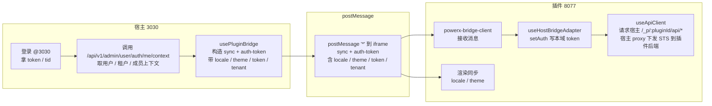

# Plugin Release 应用层使用指南

本指南基于 `specs/009-install-plugin-pxp` 的交付内容，串联开发者、审核员、运维和租户管理员在现实场景中的操作步骤。按照顺序执行即可完成从本地调试到多渠道分发的整条流水线。

插件与底座之间的 token 边界以 `docs/guides/auth/plugin_auth_token_model.md` 为准。插件包内菜单、页面、动作与接口权限声明以 `docs/guides/plugin_release/permission_declaration.md` 为对外执行指南。

## 0. 角色及工具准备
- **开发者**：安装 `px-plugin` 与 `px` CLI。
- **发布经理 / 审核员**：具备 Admin API Token。
- **运维**：掌握 Prometheus/Grafana、对象存储访问权限。
- **企业租户管理员**：拥有离线导入权限。

## 1. 本地热更新（Phase 3，T024-T031）
1. 在插件仓库执行：
   ```bash
   px-plugin build --target local
   px-plugin dev --watch \
     --grpc-addr localhost:9090 \
     --tenant-uuid 101 --developer-id 2025 \
     --artifact ./dist/plugin-bundle.zip \
     --feature-flag beta_ui
   ```
2. CLI 会触发 `StartLocalInstall` → `PushHotReload` → `StopLocalInstall`，对应 `backend/internal/service/plugin_release/local/...`。
3. 可用 `GET /api/tenant/plugin-release/local/sessions/:id` 查询热更新状态，日志将同步到 `plugin_release.hotload.latency_ms`。

## 2. 提交候选与审批（Phase 4，T032-T040）
1. 使用 `px publish create` 提交候选：
   ```bash
   px publish create \
     --tenant-uuid tenant-dev \
     --plugin-id px.demo \
     --version v1.2.3 \
     --artifact-uri s3://bucket/px-demo-v1.2.3.zip \
     --commit <sha> \
     --label channel=beta \
     --label coverage=95
   ```
2. 发布经理可在 Admin API 调用：
   - `POST /api/admin/plugin-release/candidates`（若需 Web Admin 页面）
   - `POST /api/admin/plugin-release/candidates/:id/gates`
   - `POST /api/admin/plugin-release/plans`
3. 质量门禁由 GateRunner 执行：确保 Release Notes ≥ 20 字、Commit Hash ≥ 7 位、`coverage` 标签达标。

### 2.1 权限声明门禁

提交候选前，插件包必须按 `docs/guides/plugin_release/permission_declaration.md` 声明 `permissions[]`：

- 每个菜单入口声明 `type=menu`。
- 菜单入口必须声明 `menu_path`，PowerX 按它渲染菜单层级；不得使用 `module=menu`，也不得把插件 ID 拼进 `permission_code/module/menu_path`。
- 菜单如果需要联动授予页面读取权限，必须声明 `page_permission_codes` 并指向已声明的 `type=page` 权限；底座不得按标题、路径或插件 ID 猜测关联。
- 每个插件后台业务页面和详情页声明 `type=page`，并提供 GET `protocol_bindings`。
- 每个按钮、节点流转或业务动作声明 `type=action`。
- 每个敏感接口声明 `type=api`，并通过 `business_permission_code` 指向业务 action，除非该接口是独立授权边界。
- `page/action/api` 必须声明 `module/resource/action`；`module` 是业务域，例如 `production`、`settings`、`integration`，不是插件 ID 或权限类型。
- 若主 `plugin.yaml` 使用 `catalogs.rbac`，则 `permissions[]`、`rbac`、`routes` 只能放在 `plugin.d/rbac.yaml`；主 manifest 不得重复声明这些字段。
- delegated/host 模式下，插件前后端必须消费 PowerX 下发的 `permission_codes`、`policy_version`、`perms_hash`，不得只读取旧 `permissions` 字段或回退旧粗权限。
- 插件后端二次校验必须使用接口 binding 的 `effective_permission_code`：优先 `business_permission_code`；只有 `independent: true` 的 API 才校验 raw API `permission_code`。
- 插件如果通过 runtime ws-bus/taskbus 发布事件，必须在 `event_fabric` manifest 中给插件服务态 principal 显式授权：`principal_type: plugin`、`principal_id: "{{plugin_id}}"`、`actions: [publish]`。只给 `member:system` 或 `role:role_admin` 授权不能代表插件 STS principal。
- 插件如果通过 STS/Bearer 调用 PowerX Core 的运行时合同接口，还必须确认底座 STS direct route policy 已显式放行。例如 Host Scheduler 需要允许 `/api/v1/admin/scheduler/jobs`、`/api/v1/admin/scheduler/jobs/{job_id}`、`trigger/pause/resume/runs`。Event Fabric topic bootstrap 推荐走正式能力 `POST /api/v1/event-fabric/topics`；历史 admin 入口 `POST /api/v1/admin/event-fabric/topics` 只是显式运行时合同例外。只补插件权限或 topic ACL 不能解决 `sts token not allowed for this route`。

缺少 `permission_code`、i18n、`menu_path`、`module/resource/action`、page/api binding、`actor_context`、`resource_scope`，或主 manifest 与 `catalogs.rbac` 分片重复声明同一字段的插件包不得进入正式发布。`business_permission_code` 指向不存在的业务权限，或把插件 ID 拼进业务权限码、菜单路径、资源名，也不得进入正式发布。

若运行时报 `sts token not allowed for this route`，先看插件服务态调用的是哪个 PowerX Core HTTP 路由：Scheduler 仅允许 `/api/v1/admin/scheduler/jobs` 系列；topic bootstrap 优先使用 `POST /api/v1/event-fabric/topics`。若运行时报 `taskbus host publish failed: PUBLISH_UPSTREAM_REJECTED` 或 `topic not allowed`，再检查 Event Fabric topic 是否注册，以及 `event_acl_bindings` 是否存在 `principal_id=plugin:<plugin_id>` 的 `publish` 权限。

## 3. 灰度部署与回滚（Phase 5，T041-T049）
1. 生成计划后，使用 CLI 触发灰度：
   ```bash
   px publish deploy \
     --plan-id <plan-id> \
     --batch-name batch-a \
     --final-action promote
   ```
2. HTTP Admin 也可调用：
   - `POST /api/admin/plugin-release/plans/:planId/deploy/canary`
   - `POST /api/admin/plugin-release/plans/:planId/deploy/finalize`
3. Prometheus 指标（`plugin_release.canary.phase_duration_seconds`、`plugin_release.canary.rollback_seconds`）用于监控 5 分钟回滚 SLA。

## 4. 离线包与 Marketplace（Phase 6，T050-T059）

### 4.1 通过 Web Admin UI 操作（推荐）

PowerX Web Admin 提供了完整的图形化操作界面，操作步骤更直观：

#### 4.1.1 提交离线包

1. 登录 PowerX Web Admin（需要 admin 或 system_admin 角色）
2. 导航至「插件发布」→「离线包入库」
3. 填写表单：
   - **发布候选ID**：从流水线获取的候选版本号（如 `candidate-123`）
   - **校验和**：包体的 SHA256 校验值
   - **包体URI**：S3 存储路径（如 `s3://bucket/package.pxp`）
4. 点击「提交审核」按钮
5. 系统返回审计参考ID，可在后续流程中追踪

#### 4.1.2 审核 Marketplace Listing

1. 进入「插件发布」→「Marketplace 审核列表」
2. 查看待审核列表，系统显示：
   - Listing ID、渠道（online/offline）
   - 审核状态（pending/approved/rejected）
   - 审核次数、SLA 截止时间
3. 使用状态筛选功能快速定位待审核项
4. 点击「审核」按钮，在弹窗中：
   - 选择审核结果（通过/拒绝）
   - 填写审核意见
5. 提交后列表自动刷新，显示最新状态

#### 4.1.3 查看审核详情

1. 在列表中点击「详情」按钮进入详情页
2. 详情页展示：
   - **基本信息**：ID、渠道、审核状态、创建时间
   - **SLA 监控**：剩余时间倒计时，预警提示
   - **定价策略**：企业版/专业版等层级定价
   - **支持政策**：SLA 协议、响应时间
3. 可通过「返回」按钮回到列表页

### 4.2 通过 CLI/API 操作

1. 开发者上传离线包：

   ```bash
   px publish package \
     --offline \
     --candidate-id <uuid> \
     --artifact ./dist/plugin-release.pxp \
     --grpc-addr localhost:9090
   ```

2. 运营在 Admin API 提交/审批：
   - `POST /api/admin/plugin-release/offline-packages`
   - `POST /api/admin/plugin-release/marketplace/listings`
   - `POST /api/admin/plugin-release/marketplace/listings/:id/reviews`

3. 企业租户自助导入：
   - CLI：`px plugin import --offline --tenant-uuid <tid> --package-uri <uri> --checksum <sha>`
   - OpenAPI：`POST /api/tenant/offline-imports`

### 4.3 部署菜单配置

Web Admin 的菜单项通过配置文件自动生成，位于：

```typescript
web-admin/app/services/menuConfig.ts
```

发布时需确保：

1. 菜单配置已包含插件发布模块
2. 用户角色具备相应权限（admin/system_admin）
3. API Token 权限范围正确（plugin-release.*）

## 5. 观测与告警（Phase 7，T060）
1. 完成 `docs/guides/plugin_release/observability.md` 中的仪表盘与告警配置。
2. 常用指标：
   - `plugin_release.pipeline.duration_seconds`：审批耗时
   - `plugin_release.distribution.sla_seconds`：离线审核 SLA
3. 告警示例：
   - `plugin_release_canary_rollback_sla_breach`
   - `plugin_release_hotload_latency_regression`

## 6. 安全基线（Phase 7，T064）
1. 按 `docs/guides/plugin_release/security_baseline.md` 检查 Feature Flag、RBAC、审计与告警。
2. 使用 `scripts/ci/run_quickstart.sh` 产出最新的 `backend/reports/plugin_release/dry_run.md` 作为验收证据。

## 7. 文档与 SOP 更新
- 快速入门：`specs/009-install-plugin-pxp/quickstart.md`
- Use Case：`docs/use_cases/_from_hub/SCN-PUBLISH-HUB-001/*.md`
- 权限声明：`docs/guides/plugin_release/permission_declaration.md`
- 观测指南：`docs/guides/plugin_release/observability.md`
- 安全基线：`docs/guides/plugin_release/security_baseline.md`

完成以上步骤即可覆盖 spec 中的全部阶段，确保插件发布能力在实践中可被开发、审核、运维、租户多角色复用。

## 8. 宿主 ↔ 插件 iframe 会话桥接（postMessage）

背景与 origin 说明：宿主前端常在 `localhost:3030`，插件 iframe 默认直连网关 `127.0.0.1:8077/_p/<pluginId>/admin/...`（不依赖 3030 代理）。只有在你自行配置 Nuxt dev 反代时，iframe 才可能经过 3030。浏览器按实际 origin 隔离 localStorage，宿主无法跨域直接写入插件存储，必须通过 postMessage 传递 token（与 theme/locale 共用同一桥）。

数据流（主 → 从）：
- 宿主在 `PluginWebView` 注册 iframe，`usePluginBridge` 立即发送 `sync`（locale/theme/hostOrigin）和 `auth-token`，targetOrigin 统一用 `'*'` 规避 127/localhost 差异。
- 插件 `powerx-bridge-client.ts` 收到 `ready/request-sync` 后，宿主再次补发 `sync`+`auth-token`。插件 `onAuthToken` 经 `useHostBridgeAdapter.applyAuthToken -> useAuth.setAuth` 将 token 写入 iframe 所在 origin 的 localStorage。
- `resolveApiBase` 根据当前路径拼 `/api/v1`，`useApiClient` 从 localStorage 读 `access_token` 并加 `Authorization`，必要时从 JWT 解出 `JWT claims（tid/tenant_uuid）`。

登录跳转规则（嵌入模式）：
- 插件内的 `useAuth.syncFromStorage` 需检测嵌入 PowerX（`insidePowerX` 或 `__PX_ADAPTER_BOUND__`）；在嵌入模式且本地无 token 时，不应跳 `/users/login`，而是等待宿主注入 token。
- 若看到仍跳转登录，优先检查运行时配置是否标记了嵌入模式；修正后刷新即可，避免依赖手动跳转。

调试提示：
- 插件 Console 看到 `[Bridge][Plugin] onAuthToken <- ...` 且 `after setAuth localStorage.access_token ...` 表示 token 已写入；localStorage 的 key 会落在 iframe 实际 origin（可能是 3030 而非 8077）。
- 静态资源 `/_p/.../admin/assets/...` 不带 Authorization，不影响登录态；检查业务接口 `/api/v1/...` 的请求头是否包含 Authorization/JWT claims（tid/tenant_uuid） 以判定会话是否生效。

### 流程速查（token/locale/theme）
- 会话来源：宿主登录后，`/api/v1/admin/user/auth/me/context` 只返回用户、租户和成员上下文，不返回签名上下文或宿主 JWT 桥接字段。
- 宿主桥接：`usePluginBridge` 从 token/localStorage 读取 token，并带上 locale/theme/tenant，构造 `auth-token`/`sync`，`postMessage('*')` 给 iframe。
- 插件接收：`powerx-bridge-client` 收到后调用 `useHostBridgeAdapter`，`useAuth.setAuth` 写入本域 localStorage。
- API 发起：插件业务 API 通过宿主 `/_p/:pluginId/api/*` proxy 访问；宿主 proxy 完成 RBAC 判定后向插件后端下发 STS 短期令牌。
- 身份接口边界：`/api/v1/admin/{identity}/auth/*` 必须走宿主主路由；不要通过 `/_p/:pluginId/api/v1/admin/{identity}/auth/*`。`/_p/:pluginId/api/*` 只用于插件业务 API。
- 渲染同步：`sync` 内的 locale/theme 直接应用到 i18n/colorMode，保持宿主与插件一致。

#### 流程图（文本）


注意：插件不得依赖宿主 JWT 或签名上下文透传。租户与权限由宿主 proxy 的入站登录态、RBAC 判定和下游 STS 令牌承载。
