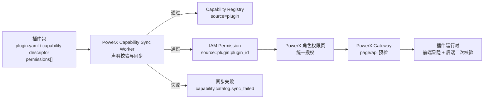
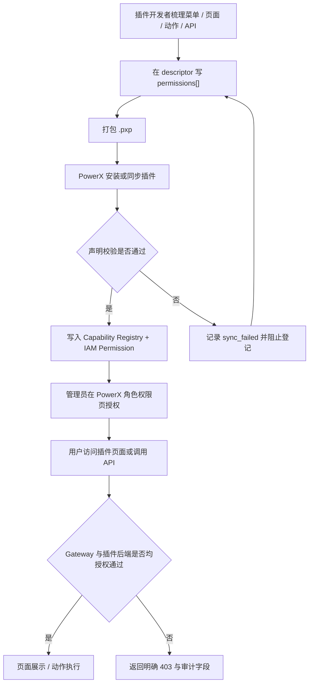
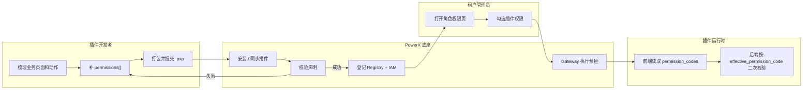

# 插件发布权限声明指南

本文面向插件开发者、发布审核员和 PowerX 租户管理员，说明插件在打包、安装和升级时如何声明菜单、页面、页面内动作与接口权限。正式角色授权入口始终在 PowerX 统一权限中心；插件只声明权限颗粒度，并在运行时消费 PowerX 下发的授权结果。

内部目标架构与 spec 见：

- `docs/plan/integration/powerx_capability.md`
- `docs/plan/ai_engineering/multi_plugin_capability_guide.md`
- `specs/007-integration-gateway-and-mcp/*`

## 1. 功能背景与目标

旧插件常把菜单、页面、按钮和接口权限分散在插件设置页、前端 route guard、后端 middleware 或粗权限码里，容易出现三个问题：

1. 管理员不知道应该在 PowerX 还是插件内授权。
2. 前端按钮隐藏了，但接口仍可越权调用。
3. 插件升级后旧粗权限无法解释新增页面和业务动作。

新的发布规范要求插件在包内提交统一 `permissions[]`：

- `menu`：菜单入口。
- `page`：插件后台业务页面和详情页。
- `action`：按钮、节点流转、业务动作。
- `api`：接口与业务权限的 protocol binding。

PowerX 在插件安装或同步时校验这些声明，登记到 Capability Registry 与 IAM Permission，再由 PowerX 角色权限页统一授权。

关键边界：

- 插件声明的是业务语义，PowerX 负责强校验、登记、渲染、授权、Gateway 预检和权限快照下发。PowerX 不被动展示插件任意拼出来的权限字符串；不符合本指南的声明必须同步失败或标记登记异常，不得进入正式授权。
- 角色权限页固定渲染两类授权视图：菜单权限、能力/API 权限。菜单权限由 `type=menu` 的 `menu_path` 和 i18n 元数据生成；能力/API 权限按“来源 → 模块 → 操作权限/API 权限”展示，其中来源第一层固定为 `PowerX 底座` 或具体插件，`module` 只能作为第二层业务模块。`admin`、`production`、`settings` 等 module 不得被展示或声明为来源。
- 能力/API 权限视图中，`page/action/data/admin_action` 统一归入“操作权限”，是管理员主要勾选对象；`api` 归入“API 权限”，默认作为 Gateway 与插件后端 enforcement mapping 展示。API 绑定挂在 `business_permission_code` 指向的业务能力下面；只有 `independent: true` 的 API 才表达独立授权边界。
- `api_key` 不是“API 权限”的同义词。它表示 API Key 机器凭证的授权范围，归属 API Key Profile 配置，不得作为角色权限页能力/API 视图的顶层类型与 `api` 混排。
- `type=page` 只声明插件后台 SPA 页面访问，不会自动放开该页面里调用的接口。
- 每一个真实业务接口都必须声明 `type=api` + `protocol_bindings`。同一个页面下的 `GET/POST/PUT/DELETE` 接口要逐个声明 method 和 path。
- API 的授权键统一使用 `effective_permission_code`：`business_permission_code` 非空时取 `business_permission_code`；否则仅当 `independent: true` 时取 API 自身 `permission_code`；两者都没有时声明无效。Gateway 预检、插件后端二次校验和前端按钮判断必须使用同一个 effective 权限。
- PowerX 角色授权保存时只依据显式声明做联动。插件如需“勾选菜单时自动补齐页面读取权限”，必须在菜单声明中提供明确的页面关联字段，指向已声明的 `type=page` 权限；底座不得仅按 `permission_code`、菜单标题或插件 ID 猜测关联。该补齐只覆盖页面 read，不会自动授予 `type=action` 或写接口权限。
- 老的 `rbac.resources`、`routes.permissions`、`required_policies` 只属于插件本地运行时或历史兼容元数据，不能替代 PowerX Gateway 的正式权限登记。
- PowerX Gateway 只按安装后登记成功的 `permissions[].protocol_bindings` 做预检；没有登记的接口会直接 403，不会转发给插件后端。
- delegated/host 模式下，PowerX 下发给插件后端的授权字段固定为 `permission_codes`、`policy_version`、`perms_hash`。插件后端不得只读取旧 `permissions` 字段，也不得在 claims 缺失时回退到旧粗权限。
- `policy_version/perms_hash` 的新鲜度和 hash mismatch 判断必须来自 PowerX 可验证来源：PowerX signed context、短期 signed claims，或 authz/introspection 响应。插件后端至少要校验字段存在和签名/来源有效；如果插件无法验证快照是否最新，必须调用 PowerX introspection 或明确拒绝，不得自行猜测。
- 插件服务态 STS token 的 `aud` 固定表达目标受众，例如 `powerx:api`；插件身份固定来自 `plugin_id` claim。不得把 `plugin:<plugin_id>` 塞进 audience，也不得从 audience 反推插件身份。
- 插件后端通过 STS 调用 PowerX runtime ws-bus/taskbus 发布事件时，`event_fabric` manifest 必须给插件 principal 显式授权，例如 `principal_type: plugin` + `principal_id: "{{plugin_id}}"` + `actions: [publish]`。只给 `member:system` 或 `role:role_admin` 授权不能代表插件服务态 principal。
- 插件后端通过 STS 调用 PowerX Core HTTP 接口时，还必须满足 STS direct route policy。Host Scheduler 是明确的插件服务运行时合同，`/api/v1/admin/scheduler/jobs` 系列必须由 PowerX Core 静态放行；Event Fabric topic bootstrap 的推荐入口是正式能力 `POST /api/v1/event-fabric/topics`，历史 admin 入口 `POST /api/v1/admin/event-fabric/topics` 仅作为显式运行时合同例外。否则会返回 `sts token not allowed for this route`。这不是插件 page/api RBAC，也不是 topic ACL。

## 1.1 权限层级与命名标准

PowerX 角色权限页不是简单按 `permission_code` 字符串切分渲染。插件必须提交足够结构化的字段，让底座按同一规则渲染和校验。

### 1.1.1 菜单树

菜单树只来自 `type=menu` 权限。它控制导航入口可见，不代表页面内 API 已授权。

插件后台菜单有两个职责不同的声明入口：

| 声明位置 | 职责 | 是否是正式授权 |
|---|---|---|
| `frontend.admin.menus` | 声明左侧导航 UI 树、路由、图标、排序、父子关系。 | 否。它只是导航结构。 |
| `permissions[]` 中的 `type=menu` | 声明 PowerX IAM 可授权菜单能力。 | 是。它进入角色权限页和授权结果。 |

两者不是可互相替代的重复配置。插件必须用菜单项的 `required_policies` 指向已声明的 `type=menu.permission_code`，并保证该权限的 `menu_path` 与菜单项在 `frontend.admin.menus` 中的真实祖先链一致。

PowerX 角色权限页按以下逻辑展示菜单权限：

1. PowerX 先按插件分组，把插件菜单挂到左侧菜单的 `APPS` 分类下。
2. 插件内部层级只按 `type=menu.menu_path` 渲染。
3. `menu_path` 不包含 `APPS`、插件 ID、插件名称、`/_p/<plugin_id>`、`/api/v1` 或真实 URL。
4. 如果 `frontend.admin.menus` 与 `permissions[].menu_path` 不一致，插件声明无效；PowerX 不得按权限码、标题或插件 ID 自动猜测和修正。

必填字段：

| 字段 | 规则 |
|---|---|
| `type` | 固定为 `menu`。 |
| `permission_code` | 格式为 `menu.<business_module>.<menu_key>:view`。 |
| `module` | 业务域，例如 `production`、`settings`、`integration`，不得写成 `menu`。 |
| `menu_path` | 从插件内部一级菜单到叶子菜单的稳定业务路径数组，例如 `[business_operations, production, sample_tracks]`。必须与对应 `frontend.admin.menus` 菜单项的祖先链一致。 |
| `title_i18n` / `description_i18n` | 用户可见菜单名称和说明。 |
| `page_permission_codes` | 可选。菜单入口对应的页面读取权限列表；需要菜单勾选联动页面时必须显式提供。 |

示例：

```yaml
frontend:
  admin:
    menus:
      - id: business_operations
        title_i18n:
          key: menus.businessOperations
          default: 业务运营
        children:
          - id: production
            title_i18n:
              key: menus.production
              default: 生产单
            children:
              - id: sample_tracks
                route: /production/sample-tracks
                title_i18n:
                  key: menus.sampleTracks
                  default: 小样跟踪单
                required_policies:
                  - menu.production.sample_tracks:view

permissions:
  - type: menu
    permission_code: menu.production.sample_tracks:view
    module: production
    menu_path:
      - business_operations
      - production
      - sample_tracks
    title_i18n:
      zh-CN: 小样跟踪单
      en: Sample tracking
    description_i18n:
      zh-CN: 允许查看生产模块下的小样跟踪单菜单入口。
      en: Allows viewing the sample tracking menu entry in production.
    page_permission_codes:
      - production.sample_track:read
    risk_level: low
    data_scope: tenant
```

这个例子里的对照关系是：

- 左侧菜单层级来自 `frontend.admin.menus.children`。
- 菜单授权层级来自 `permissions[].menu_path`。
- `frontend.admin.menus[].required_policies` 必须命中 `permissions[].permission_code`。
- `menu_path` 必须等于该菜单项在插件内部菜单树里的 ID 祖先链：`business_operations / production / sample_tracks`。

禁止写法：

```yaml
- type: menu
  permission_code: menu.plugin.com.powerx.plugins.ai-craft.plugins.operations:view
  module: menu
```

原因：

- `menu_path` 缺失，PowerX 只能从字符串猜层级。
- `module=menu` 把权限类型和业务域混在一起。
- 插件 ID 被拼进业务权限树，管理员看到的是技术来源，不是业务结构。
- `frontend.admin.menus` 没有用 `required_policies` 指向正式 `type=menu` 权限，PowerX 无法校验导航入口和授权入口是否一致。

### 1.1.2 业务能力树

业务能力树来自 `type=page` 和 `type=action`。它是管理员主要勾选对象，控制页面访问、按钮、节点流转和业务动作。

必填字段：

| 字段 | 规则 |
|---|---|
| `permission_code` | 格式为 `<business_module>.<resource>:<action>`。 |
| `module` | 业务域，不是插件 ID，也不是权限类型。 |
| `resource` | 业务资源名，例如 `sample_track`、`bulk_order`、`template`。 |
| `action` | 动作名，例如 `read`、`create`、`update`、`delivery`、`factory_schedule`。 |
| `title_i18n` / `description_i18n` | 管理员可理解的业务名称和说明。 |

示例：

```yaml
- type: action
  permission_code: production.sample_track:delivery
  module: production
  resource: sample_track
  action: delivery
  title_i18n:
    zh-CN: 小样交付资料
    en: Deliver sample materials
  description_i18n:
    zh-CN: 允许提交小样交付资料。
    en: Allows submitting sample delivery materials.
  risk_level: medium
  data_scope: tenant
```

禁止写法：

```yaml
- type: action
  permission_code: com.powerx.plugins.ai-craft.production.sample_track:delivery
  module: com.powerx.plugins.ai-craft
  resource: production.sample_track
```

插件 ID 只能作为来源字段保存，例如 `plugin_id=com.powerx.plugins.ai-craft`、`iam_permission.source=plugin:com.powerx.plugins.ai-craft`。它不得进入 `permission_code`、`module`、`resource`、`action` 或 `menu_path`。

### 1.1.3 API 绑定明细

API 绑定来自 `type=api`。它描述真实接口如何落到业务能力，不是管理员默认主勾选对象。

规则：

- API `permission_code` 推荐格式为 `<business_module>.<resource>_api:<operation>`，只作为技术登记键。
- 普通业务接口必须写 `business_permission_code`，指向一个已声明的 `type=page` 或 `type=action`。
- PowerX Gateway、插件后端和前端按钮都使用 `effective_permission_code`，即 `business_permission_code`。
- 只有 API 本身就是独立授权边界时，才允许 `independent: true` 并把 raw API `permission_code` 作为授权键。

示例：

```yaml
- type: api
  permission_code: production.sample_track_api:delivery
  business_permission_code: production.sample_track:delivery
  module: production
  resource: sample_track_api
  action: delivery
  title_i18n:
    zh-CN: 小样交付接口
    en: Sample delivery API
  description_i18n:
    zh-CN: 允许调用小样交付资料提交接口。
    en: Allows calling the sample delivery submission API.
  risk_level: medium
  data_scope: tenant
  protocol_bindings:
    - channel: rest
      method: POST
      path: /sample-tracks/*/nodes/delivery
      actor_context: admin_user
      resource_scope: tenant
```

在角色权限页中，这条 API 应显示为 `production.sample_track:delivery` 的接口绑定明细。管理员主勾选的是“小样交付资料”，不是“小样交付接口”。

### 1.1.4 登记异常与拒绝规则

以下情况必须登记为异常或同步失败，不得进入正式授权：

- 缺少 `permission_code`、`module`、`title_i18n`、`description_i18n`、`risk_level`、`data_scope`。
- `type=menu` 缺少 `menu_path`，或 `module=menu`。
- `type=page/action` 缺少 `resource/action`，或 `permission_code` 与 `module/resource/action` 不一致。
- `type=api` 缺少 `protocol_bindings`。
- `type=api` 同时缺少 `business_permission_code` 和 `independent: true`。
- `business_permission_code` 指向不存在、已废弃或非 active 的业务权限。
- `permission_code`、`module`、`resource`、`action`、`menu_path` 拼入插件 ID、UUID、host route、`/_p/<plugin_id>` 或 `/api/v1`。
- 动态路径使用 `{uuid}`、`:id` 或真实 UUID 样本，而不是 `*`。
- 旧 `rbac.resources`、`routes.permissions`、`required_policies` 试图替代正式 `permissions[]`。

## 2. 角色与适用范围

| 角色 | 关注点 |
|---|---|
| 插件开发者 | 在 `plugin.yaml` 或 capability descriptor 中补齐 `permissions[]`，并让前后端消费 `permission_codes`。 |
| 发布审核员 | 检查插件包是否声明 page/api binding、i18n、风险等级和默认角色建议。 |
| PowerX 管理员 | 在 PowerX 角色权限页给租户角色勾选插件权限。 |
| 运维 | 安装插件后验证 sync 状态、审计日志、迁移报告和 Gateway 拒绝原因。 |

适用范围：

- PowerX delegated/host 模式插件。
- Skeleton/local 模式插件的本地授权模拟。
- `.pxp` 离线包、插件市场包、手动安装包。

不适用范围：

- 静态资源、`/_nuxt/**`、图片、CSS、JS。
- 插件 health/debug bridge。
- 插件自有业务配置项，例如工厂资料、Webhook URL、渠道密钥。

## 3. 整体架构与模块关系



模块职责：

| 模块 | 职责 |
|---|---|
| 插件包 | 声明权限，不做正式角色授权。 |
| Capability Sync Worker | 校验 `permission_code`、`menu_path`、`module/resource/action`、i18n、page/api binding、风险等级和真实 transport。 |
| IAM Permission | 保存可授权项，`source=plugin:<plugin_id>`。 |
| PowerX 角色权限页 | 管理员给角色授权的唯一主入口。 |
| Gateway | 按 `plugin_id + method + path` 映射到 `effective_permission_code` 并预检。 |
| 插件运行时 | 使用同一 `effective_permission_code` 控制菜单、页面、按钮和接口。 |

## 4. 核心流程



失败分支的处理原则：

- 缺 `permission_code`、`menu_path`、`module/resource/action`、i18n、page/api binding、`actor_context`、`resource_scope` 时，同步失败。
- 旧粗权限只用于迁移报告，不作为运行时 alias。
- 旧 `rbac.resources`、`routes.permissions` 和菜单 `required_policies` 不能自动转换为 PowerX 正式授权项。插件必须补 `permissions[]`。
- 迁移窗口内 PowerX 对历史插件 HTML 页面做 warn/allow 只能作为运维保护；新插件和新版本必须按本指南声明。

## 5. 跨角色协作流程



## 6. 前置条件与依赖

插件包必须具备：

- `plugin_id` 稳定。
- `permissions[]` 可被 PowerX 安装/同步流程读取。
- 用户可见文案使用 i18n，不使用 UUID、raw route 或 capability id 作为主展示名称。
- page/api binding 使用插件内部稳定业务路径，不包含宿主挂载前缀 `/_p/<plugin_id>`。

PowerX 环境必须具备：

- Capability Sync Worker 已启用。
- IAM Permission 与角色权限页可用。
- Gateway 已接入插件 page/api route permission resolver。
- 管理员拥有可访问角色权限页的 Admin Token。
- 插件如使用 runtime ws-bus/taskbus，PowerX 已启用 Event Fabric Topic/ACL seed，并会在插件安装/启用时播种 `event_fabric.yaml`。

## 7. 操作步骤

### 7.1 插件包声明权限

在 `plugin.yaml` 或 capability descriptor 中添加 `permissions[]`。最小示例：

如果插件使用 `catalogs.rbac` 分片，这里的 `permissions[]` 实际写入 `plugin.d/rbac.yaml`，主 `plugin.yaml` 只保留 catalog 路径声明。

```yaml
permissions:
  - type: menu
    permission_code: menu.example.records:view
    module: example
    menu_path:
      - example
      - records
    title_i18n:
      zh-CN: 示例记录菜单
      en: Example record menu
    description_i18n:
      zh-CN: 允许查看示例记录菜单入口。
      en: Allows viewing the example record menu entry.
    page_permission_codes:
      - example.record:read
    risk_level: low
    data_scope: tenant

  - type: page
    permission_code: example.record:read
    module: example
    resource: record
    action: read
    title_i18n:
      zh-CN: 示例记录读取
      en: Read example records
    description_i18n:
      zh-CN: 允许查看示例记录列表、详情和状态信息。
      en: Allows reading example record lists, details, and status fields.
    risk_level: low
    data_scope: tenant
    protocol_bindings:
      - channel: rest
        method: GET
        path: /admin/example/records
        actor_context: admin_user
        resource_scope: tenant
      - channel: rest
        method: GET
        path: /admin/example/records/*
        actor_context: admin_user
        resource_scope: tenant

  - type: action
    permission_code: example.record:approve
    module: example
    resource: record
    action: approve
    title_i18n:
      zh-CN: 示例记录审批
      en: Approve example record
    description_i18n:
      zh-CN: 允许执行示例记录审批。
      en: Allows approving example records.
    risk_level: medium
    data_scope: tenant

  - type: api
    permission_code: example.record_api:update
    business_permission_code: example.record:approve
    module: example
    resource: record_api
    action: update
    title_i18n:
      zh-CN: 示例记录审批接口
      en: Example record approval API
    description_i18n:
      zh-CN: 允许调用示例记录审批接口。
      en: Allows example record approval API calls.
    risk_level: medium
    data_scope: tenant
    protocol_bindings:
      - channel: rest
        method: POST
        path: /records/*/approve
        actor_context: admin_user
        resource_scope: tenant
```

### 1.1.3 能力/API 权限页展示层级

PowerX 角色权限页的能力/API 权限不按 `permission_code` 字符串切分，也不按 URL 前缀切分。统一展示层级如下：

```text
PowerX 底座
  <module>
    操作权限
      page/action/data
    API 权限
      api

<plugin display name>
  <module>
    操作权限
      page/action/data
    API 权限
      api binding
```

规则：

- 第一层是来源，只能是 `PowerX 底座` 或插件。插件来源来自 `plugin_id` / `iam_permission.source=plugin:<plugin_id>`；底座来源来自非插件系统权限。
- 第二层是业务模块 `module`。例如 `admin` 是 PowerX 底座下的后台管理模块，不是来源；插件的 `production`、`marketing`、`settings` 也是插件来源下的业务模块。
- `module=admin` 表示该能力归属 PowerX 底座的后台管理业务域，不等于“所有 `/api/v1/admin/*` 路径前缀”。路径前缀只属于 `protocol_bindings` 技术入口，不能反向决定角色权限页层级。
- 第三层固定分为“操作权限”和“API 权限”。`page/action/data/admin_action` 进入操作权限；`api` 进入 API 权限。`admin_action` 是底座内部 subtype，用户界面必须显示为“操作权限”，不得作为独立筛选项暴露。
- `api_key` 表示 API Key 机器凭证授权范围，不是 endpoint API 权限。角色权限页能力/API 视图不得把 `api_key` 与 `api` 混为同类；需要配置机器凭证 scope 时，应进入 API Key Profile 专用配置。
- `type=menu` 不进入能力/API 权限页，只在菜单权限页展示。
- 来源筛选必须包含 `全部来源`、`PowerX 底座` 和已安装插件。筛选器不得命名为“全部插件”后继续显示底座权限。
- API 权限也必须有 i18n 标题和说明。`permission_code`、HTTP method/path、`/_p/<plugin_id>` 或 `/api/v1` 只能作为技术辅助信息，不能作为角色权限页的主标题。PowerX 底座能力与插件能力遵守同一规则；缺少可读标题的 API 应显示为登记缺陷并要求补齐能力元数据。
- PowerX 底座操作/API 权限的正式来源是 `backend/config/platform_capabilities/*.yaml` 中手写或治理通过的业务能力声明。每条正式 capability 必须有 `permission_code`、`title_i18n`、`description_i18n`；seed 时会用 `permission_code` 生成一条“操作权限”，并把 REST protocol binding 生成“API 权限”。`generated.auto.yaml`、Swagger/OpenAPI、Gin route 自动识别结果只能作为 `api_candidate` 候选审计项，必须以 deprecated/invalid 状态写入或展示在专门审计视图，不能作为 active 角色授权项，也不能进入角色页主授权树。
- 插件 API 权限的正式来源是插件包内的 `permissions[]`，使用 `catalogs.rbac` 时写在 `plugin.d/rbac.yaml`。每个 `type=api` 项必须声明 `title_i18n`、`description_i18n`、`protocol_bindings`，并通过 `business_permission_code` 指向对应业务能力；缺少这些字段应登记为 invalid，而不是让 PowerX 从 URL 或权限码推断展示文案。

底座 seed 后的验收标准：

```bash
make seed
```

必须满足：

```sql
-- 1. 不允许 active API 缺少可读标题
SELECT count(*)
FROM public.iam_permission
WHERE status = 'active'
  AND meta->>'type' = 'api'
  AND COALESCE(meta->'title_i18n'->>'zh-CN', meta->'title_i18n'->>'zh', meta->'title_i18n'->>'en', meta->'title_i18n'->>'en-US', '') = '';

-- 2. 不允许自动候选或 swagger raw 权限进入 active 授权树
SELECT source, meta->>'type', status, count(*)
FROM public.iam_permission
WHERE source IN ('platform_capability_generated', 'swagger')
   OR meta->>'type' = 'api_candidate'
GROUP BY source, meta->>'type', status;

-- 3. 插件权限 source 必须统一为 plugin:<plugin_id>
SELECT source, count(*)
FROM public.iam_permission
WHERE source LIKE 'com.powerx.plugin.%'
   OR source LIKE 'com.powerx.plugins.%'
GROUP BY source;
```

第一条必须返回 `0`；第二条不得出现 `status=active`；第三条必须无结果。`make seed` 内置的 permission audit 会按同一规则失败退出，不能靠页面隐藏错误数据。

预期结果：

- `menu/page/action` 会在 PowerX 角色权限页成为可理解的授权项。
- `menu` 按 `menu_path` 渲染菜单树；`page/action/data` 按来源和 `module/resource/action` 渲染操作权限。
- `api` 默认作为后端 enforcement mapping，按来源和 module 展示在 API 权限下；只有标记 `independent: true` 时才表达独立业务授权边界。

失败处理：

- page 缺 `protocol_bindings`：补 GET page binding。
- menu 缺 `menu_path`：补稳定业务路径数组，不要从 `permission_code` 或插件 ID 推断菜单层级。
- page/action 缺 `resource/action`：补结构化业务资源和动作，确保与 `permission_code` 一致。
- api 缺 `business_permission_code`：补业务动作权限，或显式 `independent: true`。
- 路径写了 `/_p/<plugin_id>`：改为插件内部业务路径。

### 7.1.1 主 Manifest 与分片 Catalog

插件可以选择两种声明布局，但同一个字段只能有一个来源。

简单插件可以直接在 `plugin.yaml` 写：

```yaml
permissions:
  - type: page
    permission_code: example.record:read
```

分片插件应在主 `plugin.yaml` 只登记 catalog 路径：

```yaml
catalogs:
  rbac: ./plugin.d/rbac.yaml
```

然后在 `plugin.d/rbac.yaml` 写权限明细：

```yaml
permissions:
  - type: page
    permission_code: example.record:read
```

强制规则：

- 使用 `catalogs.rbac` 后，`permissions[]`、`rbac`、`routes` 必须统一放在 `plugin.d/rbac.yaml`。
- 主 `plugin.yaml` 不得再重复声明顶层 `permissions:`、`rbac:` 或 `routes:`。
- 安装器遇到主 manifest 与 catalog 分片同时声明同一字段时，必须拒绝安装，并返回 `catalog conflict on field "<field>" (catalog=rbac)`。
- PowerX 不合并、不覆盖重复字段；插件开发者必须先整理为单一来源再打包。
- `plugin.d/rbac.yaml` 中的旧字段 `rbac:`、`routes:` 可以保留给插件本地 RBAC 使用，但不会生成 PowerX Gateway 的正式接口授权。正式授权只读取 `permissions[]`。

### 7.2 页面声明规则

每个插件后台业务页面都必须声明 `type: page`：

| 页面类型 | 是否声明 | 示例 |
|---|---:|---|
| 列表页 | 是 | `/admin/example/records` |
| 详情页 | 是 | `/admin/example/records/*` |
| 工具工作台 | 是 | `/admin/example/workbench` |
| `/_nuxt/**` 静态资源 | 否 | JS/CSS chunk |
| 图片、字体、manifest | 否 | `/assets/logo.png` |
| health/debug bridge | 否 | `/health`、`/bridge-dev/*` |

page binding 固定要求：

- `channel: rest`
- `method: GET`
- `actor_context: admin_user`
- `resource_scope: tenant`

页面权限不能替代接口权限。比如用户打开 `/templates/crud` 页面需要 `type=page`：

```yaml
- type: page
  permission_code: base.templates:read
  module: base
  resource: templates
  action: read
  title_i18n:
    zh-CN: 模板 CRUD 页面
    en: Template CRUD page
  description_i18n:
    zh-CN: 允许访问模板 CRUD 页面。
    en: Allows accessing the template CRUD page.
  risk_level: low
  data_scope: tenant
  protocol_bindings:
    - channel: rest
      method: GET
      path: /templates/crud
      actor_context: admin_user
      resource_scope: tenant
```

但这个声明只允许页面访问，不允许页面里的 `PUT /templates/17` 更新接口。

### 7.2.1 API 声明规则

每个会读取或改变业务数据的 HTTP 接口都必须声明 `type=api`。规则如下：

- 按实际 HTTP method 精确声明。`GET /templates` 不会放开 `POST /templates`、`PUT /templates/*` 或 `DELETE /templates/*`。
- 动态路径统一使用 `*` 声明，例如实际请求 `/templates/17`，binding 写 `/templates/*`。
- binding path 使用插件内部 API 路径，不带 `/_p/<plugin_id>`，也不带 `/api/v1` 前缀。
- 如果 API 只是某个业务动作的技术入口，必须通过 `business_permission_code` 指向业务 `action`。
- 如果 API 本身就是独立授权边界，必须显式写 `independent: true`，并解释其业务含义。
- 同一个页面里的列表、创建、更新、删除接口都要分别声明，不得因为页面已授权就省略 API binding。

API 授权解析规则固定如下：

| API 声明 | effective 权限 | 适用场景 |
|---|---|---|
| `permission_code=example.record_api:update` + `business_permission_code=example.record:approve` | `example.record:approve` | API 只是业务动作的技术入口。 |
| `permission_code=example.audit_api:export` + `independent: true` | `example.audit_api:export` | API 本身是独立授权边界。 |
| `permission_code=example.record_api:read` 且无 `business_permission_code`、无 `independent` | 无效声明 | 必须补 `business_permission_code` 或显式 `independent: true`。 |

PowerX 角色授权、Gateway 预检、插件前端按钮判断和插件后端二次校验都使用 effective 权限。`*_api:*` 这类 raw API permission 默认只是接口 binding 的技术登记键，不应作为业务动作授权键，除非该 API 显式 `independent: true`。

模板 CRUD 的最小声明示例：

```yaml
permissions:
  - type: action
    permission_code: base.templates:read
    module: base
    resource: templates
    action: read
    title_i18n:
      zh-CN: 读取模板
      en: Read templates
    description_i18n:
      zh-CN: 允许读取模板列表和详情。
      en: Allows reading template lists and details.
    risk_level: low
    data_scope: tenant

  - type: action
    permission_code: base.templates:create
    module: base
    resource: templates
    action: create
    title_i18n:
      zh-CN: 创建模板
      en: Create templates
    description_i18n:
      zh-CN: 允许创建模板。
      en: Allows creating templates.
    risk_level: medium
    data_scope: tenant

  - type: action
    permission_code: base.templates:update
    module: base
    resource: templates
    action: update
    title_i18n:
      zh-CN: 更新模板
      en: Update templates
    description_i18n:
      zh-CN: 允许更新模板。
      en: Allows updating templates.
    risk_level: medium
    data_scope: tenant

  - type: action
    permission_code: base.templates:delete
    module: base
    resource: templates
    action: delete
    title_i18n:
      zh-CN: 删除模板
      en: Delete templates
    description_i18n:
      zh-CN: 允许删除模板。
      en: Allows deleting templates.
    risk_level: high
    data_scope: tenant

  - type: api
    permission_code: base.templates_api:list
    business_permission_code: base.templates:read
    module: base
    resource: templates_api
    action: list
    title_i18n:
      zh-CN: 模板列表接口
      en: Template list API
    description_i18n:
      zh-CN: 允许调用模板列表接口。
      en: Allows calling the template list API.
    risk_level: low
    data_scope: tenant
    protocol_bindings:
      - channel: rest
        method: GET
        path: /templates
        actor_context: admin_user
        resource_scope: tenant

  - type: api
    permission_code: base.templates_api:create
    business_permission_code: base.templates:create
    module: base
    resource: templates_api
    action: create
    title_i18n:
      zh-CN: 模板创建接口
      en: Template create API
    description_i18n:
      zh-CN: 允许调用模板创建接口。
      en: Allows calling the template create API.
    risk_level: medium
    data_scope: tenant
    protocol_bindings:
      - channel: rest
        method: POST
        path: /templates
        actor_context: admin_user
        resource_scope: tenant

  - type: api
    permission_code: base.templates_api:update
    business_permission_code: base.templates:update
    module: base
    resource: templates_api
    action: update
    title_i18n:
      zh-CN: 模板更新接口
      en: Template update API
    description_i18n:
      zh-CN: 允许调用模板更新接口。
      en: Allows calling the template update API.
    risk_level: medium
    data_scope: tenant
    protocol_bindings:
      - channel: rest
        method: PUT
        path: /templates/*
        actor_context: admin_user
        resource_scope: tenant

  - type: api
    permission_code: base.templates_api:delete
    business_permission_code: base.templates:delete
    module: base
    resource: templates_api
    action: delete
    title_i18n:
      zh-CN: 模板删除接口
      en: Template delete API
    description_i18n:
      zh-CN: 允许调用模板删除接口。
      en: Allows calling the template delete API.
    risk_level: high
    data_scope: tenant
    protocol_bindings:
      - channel: rest
        method: DELETE
        path: /templates/*
        actor_context: admin_user
        resource_scope: tenant
```

错误示例：

```yaml
rbac:
  resources:
    - resource: base.templates
      actions: [read, create, update, delete]
routes:
  permissions:
    - method: PUT
      path: /templates/*
      permission:
        resource: base.templates
        action: update
```

上面的旧写法只能服务插件本地 RBAC 或历史调试，PowerX Gateway 不会把它当作正式接口授权登记。必须补 `permissions[]` 的 `type=api`。

### 7.3 打包与安装前检查

动作：

1. 打包插件。
2. 确认包内 descriptor 能被 PowerX 读取。
3. 对 effective manifest 执行权限声明检查。
4. 对插件暴露 HTTP route 和 `permissions[].protocol_bindings` 做差异审计。
5. 用 schema 或本地 catalog 接口做预检查。

命令示例：

```bash
px-plugin build --target release
```

如果插件仓库使用 Makefile，`make dist` 或 release target 必须强制执行插件权限声明检查。检查对象必须是合并 catalog 后的 effective manifest，而不是只读取主 `plugin.yaml`。使用 `catalogs.rbac` 时，检查脚本必须读取 `plugin.d/rbac.yaml` 中的 `permissions[]`，并拒绝主 manifest 与分片 catalog 的重复声明。

推荐 Makefile 约束：

```bash
make plugin-permission-declaration-check
make route-permission-audit
make dist
```

`route-permission-audit` 必须覆盖插件实际暴露的所有业务 HTTP route，不得只扫描某个业务目录。可接受的实现方式：

- Gin route dump：从已注册 router 输出 method/path 列表。
- 后端 RBAC route 表 dump：输出 runtime guard 实际使用的 method/path/permission。
- Manifest diff：将 route dump 与 effective `permissions[].protocol_bindings` 做差异对比。

审计必须至少报告：

- 未声明 `type=api` binding 的业务接口。
- 声明了 binding 但后端没有真实 route 的死声明。
- route guard 使用的权限与 effective 权限不一致。
- 动态路径没有使用 `*` 的声明。

如果插件仓库已接入 PowerX 本地 catalog 调试接口，安装前检查响应中应包含：

```json
{
  "local_permission_snapshot": {
    "permission_codes": [
      "example.record:read",
      "example.record:approve"
    ],
    "source": "local_mock"
  }
}
```

失败处理：

- 没有 `local_permission_snapshot`：检查 descriptor 是否被插件框架导出。
- `permission_codes` 为空：检查 `permissions[]` 是否在包内正确路径。

### 7.4 安装后验证 PowerX 登记结果

动作：安装或同步插件后，用 PowerX Admin API 查看插件权限目录。

```bash
export POWERX_BASE_URL="http://127.0.0.1:8077/api/v1"
export ADMIN_TOKEN="<admin-jwt>"
export PLUGIN_ID="com.example.plugins.workflow"

curl -sS -H "Authorization: Bearer $ADMIN_TOKEN" \
  "$POWERX_BASE_URL/admin/iam/permissions/plugin-catalog?plugin_id=$PLUGIN_ID" | jq .
```

预期结果：

- 返回按插件分组的菜单树、业务能力树和 API 绑定明细。
- 每项含 `permission_code`、i18n 展示元数据、风险等级。
- menu 项包含 `menu_path`；page/action 项包含 `module/resource/action`；page/api 项包含 `protocol_bindings`。
- 登记失败时能看到明确同步错误，而不是空白目录。

失败处理：

- HTTP 404：确认 API 前缀是否为 `/api/v1`，以及当前环境是否部署了 IAM plugin catalog。
- 目录为空：检查插件 sync job 和 `iam_permission.source = 'plugin:<plugin_id>'`。
- page 不在目录中：检查插件包是否声明 `type: page`。

### 7.5 管理员授权

页面操作：

1. 登录 PowerX Web Admin。
2. 进入角色权限配置页面。
3. 找到目标插件分组。
4. 给角色勾选业务权限，例如：
   - 示例记录读取。
   - 示例记录审批。
   - 示例记录删除。
5. 保存生效策略。

预期结果：

- 当前角色对应用户刷新后获得新的 `permission_codes`。
- 菜单、页面、按钮、接口使用同一权限源。

失败处理：

- 页面看不到插件权限：先查 `plugin-catalog` API。
- 勾选后仍无权限：检查 token 权限快照是否刷新，确认 `policy_version/perms_hash` 是否更新。

### 7.6 插件运行时消费

前端必须只读取 PowerX 或 local mock 下发的授权快照：

```json
{
  "permission_codes": [
    "example.record:read",
    "example.record:approve"
  ],
  "policy_version": "2026-08-11T10:00:00Z",
  "perms_hash": "sha256:..."
}
```

后端必须按接口 binding 解析出的 `effective_permission_code` 二次校验。解析规则固定为：

```text
effective_permission_code =
  api.business_permission_code 非空时：api.business_permission_code
  否则 api.independent=true 时：api.permission_code
  否则：声明无效，安装 / 同步必须失败
```

不能只依赖：

- 菜单是否可见。
- 前端按钮是否隐藏。
- 旧粗权限 `legacy.record:read/manage`。
- 插件设置页里的本地正式授权。

delegated 模式只代表身份来源、租户上下文和授权快照由 PowerX 下发，不代表插件后端可以跳过显式 route permission 表。插件后端仍必须：

- 加载包内声明的 route permission 表或等价的 typed guard 配置。
- 对每个敏感接口按 `effective_permission_code` 语义做二次校验。
- 使用 PowerX 下发的 `permission_codes`、`policy_version`、`perms_hash` 作为授权输入。
- 在缺少授权快照或 route permission 映射时明确失败，不得退回旧粗权限或纯路径推断。
- `policy_version/perms_hash` 过期或 hash mismatch 的判定必须依赖 PowerX signed context 或 introspection。没有可验证来源时，插件后端只能把快照视为不可验证并拒绝，或调用 PowerX introspection 获取最新授权结果。

后端 route guard 必须与 `effective_permission_code` 使用同一语义。若插件后端仍使用 `Resource + Action` 结构，映射规则固定为：

| 声明 | effective 权限 | 后端 `Resource` | 后端 `Action` |
|---|---|---|---|
| `type=page permission_code=example.record:read` | `example.record:read` | `example.record` | `read` |
| `type=action permission_code=example.record:approve` | `example.record:approve` | `example.record` | `approve` |
| `type=api permission_code=example.record_api:update business_permission_code=example.record:approve` | `example.record:approve` | `example.record` | `approve` |
| `type=api permission_code=example.audit_api:export independent=true` | `example.audit_api:export` | `example.audit_api` | `export` |

强制要求：

- 插件后端 route permission 表、middleware、handler 级兜底校验必须使用上述细权限。
- `api` 如果只是业务动作的技术入口，后端应校验 `business_permission_code` 指向的 action，而不是 raw API permission。
- raw `*_api:*` 权限只有在该 API 显式 `independent: true` 时才作为后端二次校验目标。
- 不得继续校验旧粗权限，例如 `legacy.record:read/manage`。
- 不得把插件 ID 拼进业务资源名，例如 `com.example.plugin:example.record`。
- 不得用 PowerX Gateway 已预检作为插件后端放弃二次校验的理由。
- delegated token 中的授权字段名固定为 `permission_codes`，不是 `permissions`、`scopes` 或插件自定义字段。插件后端必须同时校验 `policy_version` 或 `perms_hash`；字段缺失时明确拒绝，字段过期或 hash 不匹配时必须依据 PowerX signed context 或 introspection 结果判断。

运行时基础设施入口必须显式分类，不得被自由路径推断成业务权限：

| 入口类型 | 示例 | 处理方式 |
|---|---|---|
| health/readiness | `/healthz`、`/readyz` | 明确排除业务 RBAC，只做部署健康检查。 |
| 静态资源 / dev bridge | `/_nuxt/**`、`/bridge-dev/*` | 明确排除业务 RBAC 或限制为开发环境。 |
| runtime contract | `/admin/runtime/ws-bus/grant`、`/admin/runtime/ws-bus/publish` | 明确声明为运行时合同入口，要求 delegated 身份和 tenant context；如需角色授权，声明独立 `type=api` + `independent: true`。 |
| debug / test-flow | `/admin/runtime/ws-bus/test-flow`、调试探针 | 生产包默认关闭；如保留，必须独立授权并标记风险等级。 |

运行时合同入口不是业务页面动作，不能被路径推断为 `runtime.ws_bus:manage`、`admin.runtime:manage` 这类未声明权限；也不能借用业务 action，例如模板更新、记录审批等。

### 7.7 Event Fabric / ws-bus / taskbus 声明

插件如果通过 PowerX runtime ws-bus 或 taskbus 发布事件，必须在插件包内提供 Event Fabric manifest。建议文件位置：

- `plugin.d/events.yaml`，并在 `plugin.yaml` 的 `catalogs.events` 指向该文件。
- 或 `config/event_fabric.yaml`、`platform_capabilities/event_fabric.yaml`、包根 `event_fabric.yaml`。

最小示例：

```yaml
version: v1
topics:
  - key: powerx.runtime.scheduler.triggered.v1
    namespace: powerx.runtime.scheduler.triggered
    name: v1
    acl:
      - principal_type: plugin
        principal_id: "{{plugin_id}}"
        actions: [publish]
      - principal_type: role
        principal_id: role:role_admin
        actions: [subscribe, replay]
```

授权规则：

- 插件后端使用 delegated STS 调用 PowerX `/api/v1/admin/runtime/ws-bus/publish` 时，运行时 principal 是 `plugin:<plugin_id>`。
- 因此可发布 topic 的 ACL 必须包含插件 principal，对应 manifest 写法是 `principal_type: plugin`、`principal_id: "{{plugin_id}}"`。
- `member:system` 只代表系统成员 principal，不能代表插件 STS principal。
- `role:role_admin` 只代表用户角色订阅或管理权限，不能代表插件服务态 publish 权限。
- 只声明 topic、不声明插件 principal publish ACL，运行时会被 PowerX 拒绝，典型错误是 `PUBLISH_UPSTREAM_REJECTED`、`topic not allowed`。
- 插件运行时调用 `/admin/runtime/ws-bus/grant` 只用于给当前 principal 绑定已注册 topic 的 ACL，不负责替代安装期 topic 声明；生产包不得依赖 grant 接口隐式创建正式 topic。
- 插件服务态如果需要启动时幂等创建 topic，应优先调用底座正式能力 `POST /api/v1/event-fabric/topics`；`POST /api/v1/admin/event-fabric/topics` 只保留给已确认的 host bootstrap 运行时合同，不能扩展成整个 `/admin/event-fabric/*` 的服务态访问。
- Topic bootstrap 只解决“路由是否允许 STS 访问”；真正发布事件仍必须满足 topic 注册和 `principal_id=plugin:<plugin_id>` 的 `publish` ACL。

安装/启用后必须能在 PowerX Event Fabric 注册表中看到：

- `event_topics` 存在该 topic。
- `event_acl_bindings` 存在 `principal_id=plugin:<plugin_id>` 且 `action=publish`。
- `event_acl_manifest_bindings` 记录了该插件、topic 与插件 principal 的 manifest binding。

排障判断：

| 现象 | 判断 | 处理 |
|---|---|---|
| `taskbus host publish failed: PUBLISH_UPSTREAM_REJECTED` | 插件已调用底座 publish，但底座拒绝上游发布。 | 查 topic 是否注册、插件 principal 是否有 `publish` ACL。 |
| `sts token not allowed for this route` | 插件服务态调用了未纳入 STS direct policy 的 Core HTTP 路由。 | Scheduler 只允许 `/api/v1/admin/scheduler/jobs` 系列；topic bootstrap 优先改用 `POST /api/v1/event-fabric/topics`。 |
| `topic not allowed` | topic 未注册、租户不匹配，或当前 principal 缺 ACL。 | 补 `event_fabric` manifest 并重新安装/启用插件。 |
| 只有 `member:system` 或 `role:role_admin` ACL | 插件服务态 principal 没被授权。 | 补 `principal_type: plugin` + `principal_id: "{{plugin_id}}"`。 |
| ws-bus grant 200 但 publish 403 | grant 的 topic/principal 和实际 publish principal 不一致。 | 以实际 publish token 的 principal 为准补 ACL。 |

## 8. 预期结果与验收标准

发布前必须满足：

- 插件包有效 manifest 位置存在 `permissions[]`：简单包在 `plugin.yaml`，分片包在 `catalogs.rbac` 指向的 `plugin.d/rbac.yaml`。
- 每个菜单入口都有 `type=menu` + `menu_path`，且 `module` 是业务域。
- 每个用户可访问的插件后台业务页面都有 `type=page` + GET binding。
- 每个 page/action/api 都有与 `permission_code` 一致的 `module/resource/action`。
- 每个敏感接口都有 `type=api` binding，并映射到业务 `action` 或显式独立授权。
- `permission_code` 均遵守菜单、业务能力、API 技术登记的命名格式。
- 用户可见文案来自 i18n。
- PowerX `plugin-catalog` 能查到插件权限。
- 未授权用户访问页面或接口返回明确 403。
- local 模式和 delegated 模式输出同结构的 `permission_codes/policy_version/perms_hash`。
- local 模式只能从同一 `permissions[]` 生成 delegated 兼容授权快照，不得维护另一份正式授权定义、另一套路由权限表或另一组字段名。
- 打包流程已执行 effective manifest 权限检查和 route-permission audit。
- delegated 模式插件后端仍加载显式 route permission 表，并按 PowerX 授权快照做二次校验。
- health、静态资源、runtime contract、debug/test-flow 入口已被明确排除或独立授权，不依赖路径推断。
- 插件后端 403 响应中的 `required_resource/required_action` 与已声明的 `permission_code` 语义一致。

## 9. 代码实现映射

| 行为 | 代码 / 契约位置 |
|---|---|
| 权限声明 JSON Schema | `specs/007-integration-gateway-and-mcp/contracts/plugin-permissions.schema.json` |
| 插件权限同步与校验 | `backend/internal/service/capability_registry/sync_worker.go` |
| 插件权限写入 IAM | `backend/internal/service/capability_registry/sync_worker.go` |
| IAM 插件权限目录 API | `backend/internal/transport/http/admin/iam/permission_handler.go` |
| IAM 插件权限目录服务 | `backend/internal/service/iam/permission_service.go` |
| Web Admin 权限目录消费 | `web-admin/app/stores/permission.ts` |
| 插件本地 catalog 调试 | `backend/internal/transport/http/admin/plugin_dev/capability_catalog_handler.go` |
| Gateway page/api 预检 | `backend/internal/infra/plugin/manager/router/router.go` |
| 旧粗权限迁移报告 | `scripts/migrations/plugin-permission-granularity-report.mjs` |

## 10. 常见问题与排障

### 页面打开返回 access denied

现象：

```json
{"error":"access denied at gateway","reason":"no registered permission binding for this route"}
```

原因：

- 插件页面没有声明 `type=page`。
- page binding 路径和实际插件内部 route 不一致。
- 使用了宿主挂载路径 `/_p/<plugin_id>/admin/...` 作为 binding path。

处理：

1. 在插件包中补 page 权限。
2. 使用插件内部路径，例如 `/admin/example/records`。
3. 重新打包、安装或同步插件。
4. 用 `plugin-catalog` API 确认 page binding 已登记。

### 页面能打开但保存 / 删除接口返回 403

现象：

```text
[GATE-DENY] plugin=com.powerx.plugins.base method=PUT clientPath=/templates/17
reason=no registered permission binding for this route
```

浏览器里通常表现为：

```text
PUT /_p/com.powerx.plugins.base/api/v1/templates/17: 403 Forbidden
```

判断方法：

- PowerX 日志是 `[GATE-DENY]`，说明请求被 PowerX Gateway 前置拒绝，没有转发到插件后端。
- `reason=no registered permission binding for this route` 表示插件包安装后没有登记该 method/path 的 `type=api` binding。
- 这不是“角色没有勾选”的第一判断点；如果 binding 根本不存在，PowerX 角色权限页也没有可勾选的接口/动作来源。

常见原因：

- 只声明了 `type=page`，例如 `/templates/crud`，没有声明页面内调用的 `PUT /templates/*`。
- 只保留了旧 `routes.permissions` 或 `rbac.resources`，没有补 `permissions[]` 的 `type=api`。
- 只声明了 `GET /templates`，但实际调用的是 `POST /templates`、`PUT /templates/*` 或 `DELETE /templates/*`。
- binding path 写成了 `/_p/com.powerx.plugins.base/api/v1/templates/*`，而不是插件内部路径 `/templates/*`。

处理：

1. 在插件包 `permissions[]` 中补业务 `action`，例如 `base.templates:update`。
2. 在插件包 `permissions[]` 中补接口 `api`，例如 `base.templates_api:update`。
3. 让 `api.business_permission_code` 指向业务 action。
4. binding 使用实际 method 和插件内部路径：

```yaml
- type: api
  permission_code: base.templates_api:update
  business_permission_code: base.templates:update
  protocol_bindings:
    - channel: rest
      method: PUT
      path: /templates/*
      actor_context: admin_user
      resource_scope: tenant
```

5. 重新打包并安装插件。
6. 用 PowerX 插件权限目录确认该 binding 已登记。

### API 已声明但按钮仍不可见

原因：

- 只声明了 `api`，没有声明业务 `action`。
- `api.business_permission_code` 指向的 action 未授权。

处理：

- 补 `type=action` 权限。
- 让 `api.business_permission_code` 指向该 action。
- 在 PowerX 角色权限页授权 action。

### 管理员看不到普通用户默认授权

原因：

- 插件没有显式声明 `default_role_grants: [role_user]`。
- PowerX 默认只授予 owner/admin。

处理：

- 插件确实面向普通成员默认开放时，显式声明 `default_role_grants`。
- 不要通过 SQL 手工补长期默认授权。

### local 模式正常，delegated 模式失败

原因：

- local 使用了另一套本地权限定义。
- delegated token claims 缺少 `permission_codes/policy_version/perms_hash`。
- 插件后端仍读旧粗权限。
- 插件后端在 delegated 模式跳过了显式 route permission 表，只校验 PowerX token 来源。
- 运行时合同入口被路径推断成未声明的业务权限。

处理：

- local 权限目录必须从同一 `permissions[]` 生成。
- local mock 输出必须包含 delegated 兼容字段：`permission_codes/policy_version/perms_hash/source=local_mock`。
- delegated 缺 claims 时走 PowerX authz/introspection 或明确拒绝。
- 移除 `legacy.record:*` 运行时判断。
- delegated 模式先验证 PowerX 身份来源，再按 route permission 表和 `permission_codes` 校验接口权限。
- health、静态资源、runtime contract、debug/test-flow 入口必须显式排除或独立授权，不得靠路径推断。

### PowerX 已转发但插件接口返回 Insufficient permissions

现象：

```json
{
  "error": "Insufficient permissions",
  "required_resource": "legacy.record",
  "required_action": "read"
}
```

判断方法：

- PowerX 日志出现 `[PROXY-BACKEND-ERR] upstream_status=403`，说明请求已经通过 Gateway 并到达插件后端。
- 返回体里的 `required_resource/required_action` 来自插件后端，不是 PowerX Gateway。

原因：

- 插件后端 route guard 仍在校验旧粗权限。
- 插件后端把插件 ID 拼到了业务资源名里。
- 插件后端 API route 表和 `permissions[].protocol_bindings` 没有使用同一权限语义。

处理：

1. 找到插件后端的 route permission 表或 handler 级权限声明。
2. 将该接口的 required permission 改成该接口 `effective_permission_code` 对应的 `Resource + Action`。
3. 重新打包并安装插件。
4. 再次访问接口，确认插件后端 403 不再要求旧粗权限。

## 11. 回滚与风险控制

权限声明变更属于授权面变更。发布前必须确认：

- 新增页面是否需要新授权，还是复用已有 read 权限。
- 新增接口是否只是动作入口，还是独立业务授权边界。
- 删除或重命名 `permission_code` 会影响既有角色授权，应提供迁移报告。

回滚建议：

1. 插件版本回滚到上一版。
2. PowerX 重新同步上一版权限目录。
3. 保留审计中的授权变更记录。
4. 对旧粗权限缺口运行迁移报告：

```bash
node scripts/migrations/plugin-permission-granularity-report.mjs <plugin-repo> --format=markdown
```

不得通过恢复旧粗权限 alias 长期绕过新权限模型。

## 12. 变更记录

| 日期 | 版本 | 变更 |
|---|---|---|
| 2026-08-11 | v1.0 | 新增插件发布权限声明指南，明确 page binding、api/action 映射、PowerX 统一授权与排障流程。 |
