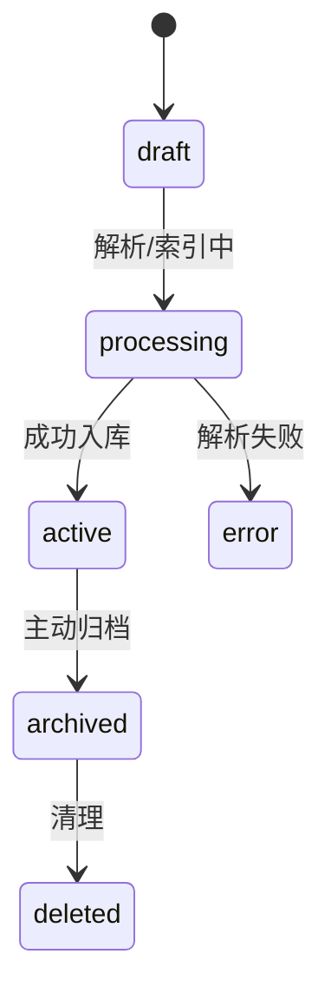
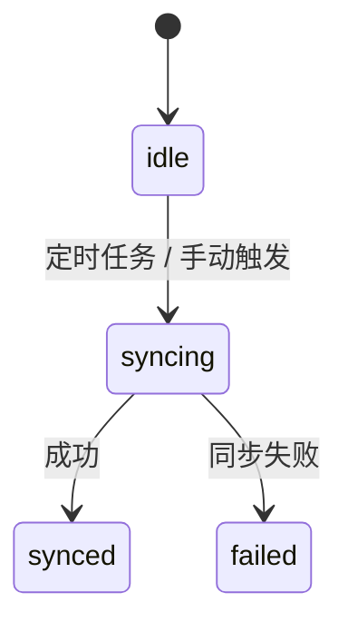

# PowerX 知识领域模型（Knowledge Domain Model）

## 1. 设计原则

- **契约优先**：所有实体均以 API/SDK 契约为唯一入口，保持插件与核心解耦。
- **多租户隔离**：所有表结构含 `tenant_id` 字段，并在查询层强制注入租户过滤。
- **版本化与可追踪**：文档与片段支持版本链，确保索引、回滚与审计的一致性。
- **跨源统一**：文件、结构化表、对话日志等均抽象为统一的 `KnowledgeAsset`。
- **可扩展性优先**：所有驱动（Parser、Indexer、Ranker、GraphLinker）均可注册替换。

---

## 2. 模型分层概览

| 层级 | 职责 | 模块示例 |
|------|------|----------|
| **Domain Layer** | 定义核心实体及其关系 | `KnowledgeSpace`, `KnowledgeDocument`, `Embedding` |
| **Service Layer** | 封装业务逻辑与事件流 | `IndexingService`, `RetrievalService`, `SyncScheduler` |
| **Integration Layer** | 外部依赖接口与适配层 | 向量存储、ElasticSearch、ObjectStorage、GraphDB |

---

## 3. 核心实体模型

| 实体 | 描述 | 关键字段 |
|------|------|----------|
| `KnowledgeSpace` | 租户级知识空间，绑定权限与默认检索配置。 | `id`, `tenant_id`, `name`, `slug`, `visibility`, `rank_profile` |
| `KnowledgeSource` | 知识来源（文件、URL、Webhook、插件），定义采集策略与同步状态。 | `id`, `space_id`, `type`, `config`, `sync_state`, `last_synced_at` |
| `KnowledgeDocument` | 抽象逻辑文档，与 Source 解耦，具有生命周期。 | `id`, `space_id`, `title`, `status`, `sensitivity`, `schema` |
| `DocumentVersion` | 文档版本记录，包含原始内容引用与解析模板。 | `id`, `document_id`, `version_no`, `content_uri`, `parser`, `metadata` |
| `DocumentChunk` | 文档片段，是索引与检索的最小原子单元。 | `id`, `version_id`, `seq`, `text`, `embedding_status`, `keywords`, `entities` |
| `Embedding` | 向量实体，支持多模型并存。 | `id`, `chunk_id`, `model`, `dimension`, `vector`, `quality_score` |
| `KnowledgeTag` | 标签层级体系，用于过滤与敏感控制。 | `id`, `space_id`, `name`, `path`, `sensitivity` |
| `KnowledgeLink` | 关系链接，用于图谱与上下文扩展。 | `id`, `from_node`, `to_node`, `relation`, `weight`, `provenance` |
| `Feedback` | 用户反馈，用于召回质量评估与重排优化。 | `id`, `space_id`, `query_id`, `chunk_id`, `rating`, `comment`, `user_id` |

---

## 4. 状态机与生命周期

### KnowledgeDocument 状态流转



### KnowledgeSource 状态流转



---

## 5. 领域事件（Domain Events）

| 事件名                            | 描述                  | 触发方               |
| ------------------------------ | ------------------- | ----------------- |
| `knowledge.space.created`      | 新建知识空间后刷新权限与配置      | CoreX IAM         |
| `knowledge.document.versioned` | 文档新版本触发索引任务         | Indexing Service  |
| `knowledge.chunk.updated`      | 片段变更触发 Embedding 更新 | Vectorizer        |
| `knowledge.feedback.submitted` | 用户反馈触发离线评估          | Retrieval Service |

所有事件经由 `Event Bus` 广播，供 `Agent`, `Flow`, `Monitoring` 等模块订阅。

---

## 6. 表结构草案（DDL Blueprint）

### `knowledge_spaces`

```sql
id uuid PRIMARY KEY
tenant_id uuid NOT NULL
name text NOT NULL
slug text NOT NULL UNIQUE
visibility enum('private','shared','public')
rank_profile jsonb
settings jsonb
created_at timestamptz
updated_at timestamptz
deleted_at timestamptz
```

### `knowledge_documents`

```sql
id uuid PRIMARY KEY
space_id uuid REFERENCES knowledge_spaces(id)
source_id uuid REFERENCES knowledge_sources(id)
title text
status enum('draft','processing','active','archived','deleted','error')
sensitivity enum('low','normal','high','critical')
schema enum('unstructured','table','faq','chatlog')
attributes jsonb
created_by uuid
updated_by uuid
published_at timestamptz
created_at timestamptz
updated_at timestamptz
deleted_at timestamptz
```

### `document_versions`

```sql
id uuid PRIMARY KEY
document_id uuid REFERENCES knowledge_documents(id)
version_no int
content_uri text
checksum text
parser text
metadata jsonb
parsed_at timestamptz
created_at timestamptz
updated_at timestamptz
```

### `document_chunks`

```sql
id uuid PRIMARY KEY
version_id uuid REFERENCES document_versions(id)
seq int
text text
keywords tsvector
entities jsonb
embedding_status enum('pending','indexed','failed')
chunk_hash text
created_at timestamptz
updated_at timestamptz
```

### `embeddings`

```sql
id uuid PRIMARY KEY
chunk_id uuid REFERENCES document_chunks(id)
model text
dimension int
vector vector
quality_score numeric
created_at timestamptz
updated_at timestamptz
```

---

## 7. Schema 映射与 API 契约

| 层级           | 数据结构                                 | 契约路径                                  |
| ------------ | ------------------------------------ | ------------------------------------- |
| Domain Model | `KnowledgeDocument`, `DocumentChunk` | `/internal/corex/knowledge/models`    |
| REST API     | DTO 层（`KnowledgeDocumentDTO` 等）      | `/api/v1/knowledge/...`               |
| SDK          | TS/Go 封装                             | `powerx/sdk/knowledge`                |
| gRPC         | proto 定义（同步于 REST）                   | `PowerX/api/grpc/gen/knowledge.proto` |

所有层级遵循单向依赖：

> Domain → Service → API → SDK，不可反向依赖。

---

## 8. 权限与审计

- 每个 `KnowledgeSpace` 绑定 RBAC 策略（`knowledge.space.*`）。
- `KnowledgeTag` 用于细粒度敏感级过滤。
- 所有写操作通过 `AuditLogger` 记录：

  ```
  tenant_id, user_id, entity_type, entity_id, diff_summary, action, timestamp
  ```

- 支持 chunk 级别最小引用控制，用于敏感数据隐藏。

---

## 9. 可扩展点（Extension Points）

| 扩展类型             | 接口                  | 说明                              |
| ---------------- | ------------------- | ------------------------------- |
| Parser Driver    | `DocumentParser`    | 插件可注册自定义文档解析器                   |
| Embedding Engine | `EmbeddingProvider` | 支持不同向量模型（如 OpenAI, BGE, MiniLM） |
| Rank Profile     | `RankStrategy`      | 自定义召回与排序策略                      |
| Graph Linker     | `RelationBuilder`   | 构建知识图谱的实体关系                     |
| Source Connector | `SyncAdapter`       | 支持 Webhook / SaaS 同步            |

注册示例：

```go
registry.Register("parser.pdf", PDFParser{})
registry.Register("embedding.openai", OpenAIEmbedder{})
registry.Register("rank.custom.crm", CRMRankStrategy{})
```

---

## 10. 未来演进（Phase 2+）

| 模块                 | 功能方向                 |
| ------------------ | -------------------- |
| GraphEntity        | 实体节点 + 三元组关系存储       |
| RelationExtractor  | LLM + Pattern 混合关系抽取 |
| KnowledgeMarket    | 跨租户知识共享授权            |
| Continuous Indexer | 流式增量索引与自动刷新          |
| Feedback Loop      | 基于反馈信号的排序模型自学习       |

---

**文档状态：** Draft v0.3
**维护者：** PowerX CoreX 团队
**上次更新：** 2025-10-13
