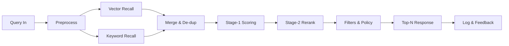

# 检索与排序（Retrieval_and_Ranking）

> 文档状态：Draft v0.5  
> 维护者：PowerX CoreX 团队  
> 上次更新：2025-10-13

---

## 1. 设计目标

- **混合检索（Hybrid）**：语义 + 关键词 + 结构化过滤，低延迟、高准确率，面向 Agent/Workflow 的上下文注入。  
- **可解释与可调优**：可返回来源、权重分解与重排得分，支持 Rank Profile 在线调参与 A/B。  
- **易扩展**：二阶段重排（Cross-Encoder / LLM-Reranker）、图谱增强、反馈闭环学习。  
:contentReference[oaicite:1]{index=1}

---

## 2. 查询处理流程（Pipeline）



### 2.1 预处理（Preprocess）

- 语言检测、租户校验、敏感级预过滤（tag/sensitivity）。
- 可选 Query Rewriting（意图扩展、同义词/词形还原、停用词处理）。
- Workflow 注入变量（如 `customer_id`, `order_no`）用于结构化过滤。

---

## 3. 候选召回（Candidate Recall）

### 3.1 语义召回

- 向量检索（Top-K），度量 `cosine` 或 `ip`（由 VectorStore/模型决定）。
- 过滤：按 `tenant_id / space_id / tags / time_range`。
- 结果：`{chunk_id, sim_score, meta...}`。

### 3.2 关键词召回

- Postgres `tsvector` / OpenSearch。
- 字段：`title`, `text`, `keywords`；支持短语匹配、字段权重。
- 结果：`{chunk_id, kw_score, meta...}`。

### 3.3 合并与去重

- 合并池大小：`K_vec + K_kw`，基于 `chunk_id` 与 `document_id` 去重。
- 文档级多片段压缩（同一文档多片段合并时可取最高得分或做分数聚合）。

---

## 4. 阶段一：基础打分（Stage-1 Scoring）

### 4.1 融合公式（Linear Fusion）

对同一 `chunk` 的语义与关键词得分做归一化（Min-Max 或 Z-Score），得到：

```
score_base = α * score_sem + (1 - α) * score_kw
```

参数：

- `α = rank_profile.semantic_weight`（默认 0.65）。
- 归一化策略由 `rank_profile.normalize = minmax|zscore` 控制。

### 4.2 业务加权（Business Weights）

在 `score_base` 基础上叠加以下项：

```
score = score_base
      + w_source  * source_boost(source_type)
      + w_recency * recency_boost(published_at, now)
      - w_sensitive * sensitivity_penalty(level)
      + w_feedback * feedback_boost(chunk_id/user_id)
```

- `source_boost`：按数据源优先级（如「知识规范/白名单源」更高）。
- `recency_boost`：`exp(-λ * age_days)`；`λ = rank_profile.recency_weight`。
- `sensitivity_penalty`：`{low:0, normal:0, high:0.2, critical:0.5}` 可配置。
- `feedback_boost`：基于历史点击/评分（Top@3命中 +1，差评 -1）。

### 4.3 多样化（MMR 去冗余，文档级）

避免返回高度相似的片段，使用 **Maximal Marginal Relevance (MMR)**：

```
MMR = argmax_{c ∈ C \ S} [ β * score(c) - (1 - β) * max_{s ∈ S} sim(c, s) ]
```

- `β`（默认 0.7）控制相关性与新颖性权衡；
- `sim` 可使用向量相似度或同文档惩罚；
- 先在文档级做去冗余，再在片段级做细化。

---

## 5. 阶段二：重排（Stage-2 Rerank，可选）

### 5.1 Cross-Encoder

- 模型：`cross-encoder/ms-marco-MiniLM-L-6-v2` 等；
- 输入：`(query, chunk_text)`，输出相关性分数；
- 对 Top-`k_rerank` 候选进行重排（默认 20）。

### 5.2 LLM-Reranker（纯文本或工具化）

- 模型对 Top-K 候选进行解释式重排，返回理由与新分数；
- 成本较高，仅在高价值场景启用；
- 支持缓存与去重（相同 query_hash + chunk_id）。

---

## 6. 过滤与策略（Filters & Policy）

- **权限**：`tenant_id` 强制过滤；`space`、`tag`、`sensitivity`。
- **时间**：文档有效期（过期则降权/剔除）。
- **合规**：对「高/关键敏感」内容做摘录截断与水印标识（在 Admin 展示层）。

---

## 7. Rank Profile（空间级配置）

### 7.1 配置字段

- `semantic_weight`：语义得分权重（默认 0.65）
- `keyword_weight`：关键词得分权重（= 1 - semantic_weight）
- `recency_weight`：时间衰减系数 `λ`
- `sensitivity_penalty`：敏感级惩罚表
- `feedback_boost`：反馈加权开关/系数
- `source_priority`：源类型到加权值表
- `normalize`：`minmax|zscore`（分数归一化策略）
- `mmr_beta`：MMR 的 β（默认 0.7）

### 7.2 示例（存于 `knowledge_spaces.default_rank_profile`）

```json
{
  "semantic_weight": 0.65,
  "recency_weight": 0.02,
  "sensitivity_penalty": { "low": 0.0, "normal": 0.0, "high": 0.2, "critical": 0.5 },
  "feedback_boost": { "enabled": true, "click": 0.05, "like": 0.1, "dislike": -0.15 },
  "source_priority": { "kb_spec": 0.3, "policy": 0.25, "faq": 0.15, "web": 0.05 },
  "normalize": "minmax",
  "mmr_beta": 0.7,
  "rerank": { "enabled": true, "topk": 20, "provider": "cross-encoder/ms-marco-MiniLM-L-6-v2" }
}
```

---

## 8. 响应结构与可解释性（Explainability）

### 8.1 Response DTO（简化）

```json
{
  "query": "如何配置媒体存储？",
  "top_n": 8,
  "items": [
    {
      "chunk_id": "c_123",
      "document_id": "d_456",
      "version_no": 3,
      "source_type": "kb_spec",
      "space_id": "crm_docs",
      "text_snippet": "…配置示例…",
      "highlights": ["媒体", "存储"],
      "score": 0.842,
      "scores": {
        "semantic": 0.91,
        "keyword": 0.62,
        "recency": 0.05,
        "source_boost": 0.30,
        "sensitivity_penalty": 0.00,
        "feedback": 0.02,
        "rerank": 0.12
      },
      "explain": "语义为主，来源为 kb_spec 加权，近期更新+轻微反馈提升"
    }
  ]
}
```

### 8.2 解释字段

- `scores` 内部各项便于排障与调优；
- `explain` 面向 Admin/调参者的人类可读解释；
- `document_id + version_no` 便于回溯与审计。

---

## 9. API 契约（摘要）

### 9.1 REST

- `POST /api/v1/knowledge/query`

  - 入参：`query`, `space_id`, `filters`, `top_n`, `profile_override?`
  - 出参：见 **8.1 DTO**。
- `POST /api/v1/knowledge/profile/{space_id}`（Admin）

  - 更新 Rank Profile 并返回新配置（触发灰度）。

### 9.2 gRPC

- `rpc Query (KBQueryRequest) returns (KBQueryResponse);`
- `rpc UpdateRankProfile (UpdateProfileRequest) returns (ProfileAck);`
  （与 REST 对齐，SDK 同步生成）

---

## 10. 反馈闭环（Feedback Loop）

- 采集：点击、复制、人工评分、Agent 追问等信号 → `Feedback`。
- 周期：离线任务周期性刷新 `feedback_boost` 和文档级权重；
- KPI：Top@3 命中率、平均评分、查询成功率、平均响应时间。
- 实践：保存「查询 → 候选池 → 最终结果」快照以便回放。

---

## 11. A/B 实验与灰度

- 粒度：按 `space_id` 或 `tenant_id` 切流；
- 维度：`semantic_weight`、`normalize`、`mmr_beta`、`rerank.provider`；
- 指标：在线命中率、用户评分、转化（例如减少客服二次追问）。
- 回退：Profile 版本化，支持一键回滚。

---

## 12. 观测与回放（Observability）

- 指标：

  - `kb_recall_latency_ms{stage=vector|keyword|merge}`
  - `kb_rerank_latency_ms{provider=...}`
  - `kb_score_distribution{bucket=...}`
- 日志：记录 `query_id`, `profile_id`, 候选池与权重分解；
- 回放：`px kb replay --query-id <id> --profile <ver>` 比对不同策略结果。

---

## 13. 失败与降级策略

- Reranker 超时：仅用 Stage-1 结果返回（记录降级标记）。
- 向量库不可用：降级至关键词检索 + 文档级召回（并告警）。
- 关键词侧不可用：仅用向量召回（α 自动提升至 0.9）。
- 结果为空：触发 Query Rewriting（同义词/放宽过滤）后重试一次。

---

## 14. FAQ（工程落地要点）

- **Q：语义与关键词怎么归一化？**
  A：默认 Min-Max；分布异常时切换 Z-Score，并开启分数截断。
- **Q：MMR 要放在哪一层？**
  A：放在 Stage-1 末尾，先粗排再多样化，之后再重排。
- **Q：如何做长文档多片段的结果合并？**
  A：文档级聚合（max/mean/加权）+ 片段级多样化，避免“刷屏”。
- **Q：Rerank 的性价比？**
  A：Top-20 重排最常见；对长问答或高价值任务开启 LLM 重排并缓存。
