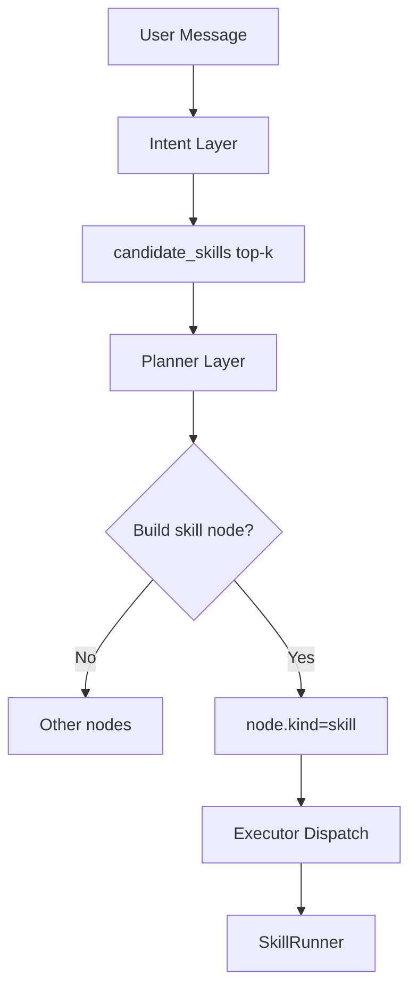

# Skills 运行时架构设计

本文定义 Skill 在 PowerX 的双路径运行时接入方案。

## 1. 总体架构

Skill 运行时支持两条路径：

1. 路径A：Agent 内 SkillRunner
2. 路径B：Capability Gateway 的 SkillAdapter（`preferred_protocol=skill`）

两条路径共享：

- SkillRegistry
- SkillManifest 校验
- 审计与追踪模型
- 安全策略（tool_grants/safe_mode）

## 2. 路径A：Agent + Skill

### 2.1 触发条件

当 Agent Planner 识别到任务节点类型为 `skill` 时，进入 SkillRunner。

### 2.1.1 决策分层（Intent / Planner / Executor）

Skill 是否执行，不由单一阶段直接拍板，而是三层决策：

1. Intent 层：给出 `candidate_skills[]`（候选）。
2. Planner 层：结合依赖、权限、上下文，决定是否把候选落为 `skill` 节点。
3. Executor 层：按 `node.kind/use` 分发，`kind=skill` 才进入 SkillRunner。

建议在 Intent 输出增加结构化字段：

```json
{
  "intent": "incident_triage",
  "candidate_skills": [
    {"skill_id": "incident-triage", "confidence": 0.91, "reason": "match keywords + context"}
  ]
}
```

### 2.1.2 Skill 候选识别（Intent 内增强）

不建议每个 Agent 独立硬编码；建议在现有 Intent 层统一增加 `Skill Resolver`：

1. 召回：关键词/标签规则匹配。
2. 语义：向量检索候选 skills。
3. 重排：LLM 或规则打分，输出 top-k。

最终由 Planner 消解冲突并定案。

### 2.1.3 提示词策略（统一模板）

建议使用统一提示模板，而不是每个 Agent 各写一套：

1. 输入：`user_message + allowed_skills + agent_profile + context`。
2. 约束：只能从 `allowed_skills` 选择。
3. 输出：结构化 JSON（`intent/candidate_skills/confidence`）。
4. 无命中：返回空数组，不得臆造 skill_id。

### 2.2 执行流程

1. Planner 生成 `skill_id + version + params`
2. Runner 拉取 Manifest 与 Bundle
3. 校验权限、上下文、依赖
4. 执行 entrypoint
5. 产出标准 `SkillExecutionResult`
6. 输出到 Agent stream（token/log/state/final）
7. 写审计与指标

### 2.3 失败语义

1. 可重试错误：依赖临时不可用、网络抖动
2. 不可重试错误：鉴权失败、manifest 非法、签名不通过

## 3. 路径B：Capability + Skill

### 3.1 触发条件

租户调用：

- `POST /api/v1/tenant/invocations` 且 `preferred_protocol=skill`
- 或 `POST /api/v1/tenant/skills/invoke`

### 3.2 执行流程

1. Selector 解析 capability/policy
2. Router 选到 `transport=skill`
3. SkillAdapter 装配执行上下文
4. Runner 执行 Skill
5. 返回统一 envelope（trace/status/protocol/result）
6. 写 InvocationTrace 与审计事件

## 4. 统一结果模型

`SkillExecutionResult` 建议字段：

- `trace_id`
- `status`：`completed/failed/denied`
- `output`
- `artifacts`
- `latency_ms`
- `protocol_used`：固定 `skill`
- `fallback_used`

## 5. 与现有模块映射

- Agent：`backend/internal/server/agent/*`
- Selector/Invocation：`backend/internal/service/capability_registry/*`
- Tenant API：`backend/internal/transport/http/openapi/capability_registry/*`

## 6. 观测要求

每次执行必须上报：

- Metrics：`skill_invocations_total`, `skill_invocation_latency_ms`
- Trace 标签：`skill_id`, `skill_version`, `tenant_uuid`
- Audit 字段：`source`, `entrypoint`, `tool_grants`

## 7. 决策流程图（三层抉择）


