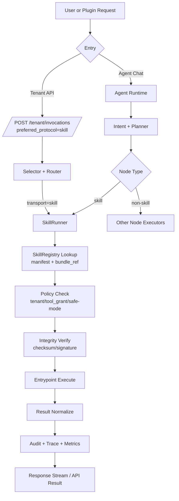
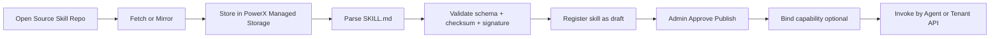

# Skill 标准定义与使用原理（含外部出处）

本文用于回答三个问题：

1. Skill 标准到底是什么  
2. Skill 的使用原理是什么  
3. PowerX 该如何对齐公开标准并做工程落地  

## 1. 什么是 Skill（标准定义）

从公开标准看，Skill 是“目录化的能力包”：

1. 最小单元是一个目录。
2. 目录至少包含 `SKILL.md`。
3. 可选包含 `scripts/`、`references/`、`assets/` 等辅助资源。

按 Agent Skills 规范，`SKILL.md` 需要：

- YAML frontmatter
- Markdown 正文说明
- 必填字段至少包括 `name` 与 `description`

这意味着 Skill 不是“单个 prompt”，而是“可复用、可版本化、可携带资源的任务能力包”。

## 2. Skill 的使用原理

### 2.1 发现与装载

Skill 的执行通常遵循“元数据先发现、正文后加载”的模式：

1. 先读取 `name/description` 等元数据做匹配。
2. 只有命中时才加载完整 `SKILL.md` 与其附属资源。

这就是公开文档中提到的 `progressive disclosure`（渐进式披露），目的就是降低上下文负担、提高匹配效率。

### 2.2 调用方式

公开产品文档显示一般有两种调用方式：

1. 显式调用：用户通过命令或明确指定 skill。
2. 隐式调用：模型根据任务语义与 `description` 自动命中。

因此，`description` 的质量是 Skill 命中率的核心因素之一。

### 2.3 执行边界

Skill 本质是“指令 + 资源 +（可选）脚本”：

1. 指令定义流程与约束。
2. 资源提供上下文与模板。
3. 脚本执行具体动作（在宿主工具权限范围内）。

## 3. 为什么这是“公开标准”

Agent Skills 网站给出的定位是“开放格式（open format）”，并提供：

1. 规范文档（Specification）
2. 参考实现与文档仓库（GitHub）
3. 客户端实现指南（如何在 agent 中支持 skills）

OpenAI Codex 文档与 `openai/skills` 仓库也明确指向同一个 open standard，这说明跨产品互通是现实目标，而不是私有格式。

## 4. 对 PowerX 的工程含义

结合当前 PowerX 架构（Agent + Capability Registry + Selector）：

1. Skill 应作为独立能力对象管理（注册、版本、发布、回滚）。
2. Skill 执行应支持双路径：
   - Agent 内部 SkillRunner
   - Capability 统一入口（`preferred_protocol=skill`）
3. Skill 元信息应至少覆盖公开标准必填字段，并扩展治理字段：
   - `source/checksum/signature/tenant_scope/tool_grants`

## 5. Agent 如何调度 Skill（PowerX 调度原理）

这一节回答“Agent 在运行时到底怎么用 Skill”。

### 5.1 调度入口

PowerX 中 Skill 有两个入口：

1. `Agent 内入口`：Planner 命中 `skill` 节点后由 SkillRunner 执行。
2. `统一网关入口`：Tenant 调用 `/tenant/invocations`，并设置 `preferred_protocol=skill`。

### 5.2 Agent 内调度流程（推荐主路径）

1. 用户消息进入 Agent Runtime。
2. Intent/Planner 识别任务，生成执行计划。
3. 计划中某节点类型为 `skill`（携带 `skill_id/version/params`）。
4. SkillRunner 读取 SkillRegistry 获取 Manifest 与 BundleRef。
5. 执行前做安全校验（租户、ToolGrant、safe-mode、checksum/signature）。
6. 进入 entrypoint 执行（可读取 `references/assets/scripts`）。
7. 输出统一结果模型（status/output/artifacts/latency）。
8. 结果回流到 Agent Stream（token/log/state/final）并落审计。

### 5.3 调度流程图（Agent + Gateway 双入口）

### 5.4 关键实现要点

1. 调度与执行分离：Planner 负责“选 skill”，Runner 负责“跑 skill”。
2. 结果模型统一：Agent 路径与 Gateway 路径都返回统一结构，避免前端/插件分支处理。
3. 安全前置：校验在执行前完成，不允许“先执行后拒绝”。
4. 可观测闭环：每次调用必须有 `trace_id + skill_id + version`。

## 6. 开源 Skill 包如何安装到 PowerX

这一节回答“网上开源 Skill 包如何接入 PowerX”。

### 6.1 来源类型

1. GitHub 仓库（例如 `openai/skills`、`anthropics/skills`）
2. 组织内部镜像仓库
3. 插件发布系统产出的 Skill Bundle

### 6.2 标准安装流程

1. `发现`：选择目标 Skill（确定 `skill_id + version + source_url`）。
2. `拉取`：下载/镜像到 PowerX 托管存储（本地或 S3/MinIO）。
3. `解析`：读取 `SKILL.md`，映射为 `SkillManifest`。
4. `校验`：
   - 必填字段（`name/description/version/entrypoints`）
   - 完整性（`checksum`）
   - 可选可信性（`signature`）
5. `注册`：写入 SkillRegistry（状态 `draft`）。
6. `发布`：管理员审批后切换到 `published`。
7. `绑定`：可选绑定 capability（用于 `/tenant/invocations` 统一调用）。
8. `调用`：租户或 Agent 使用 skill。
9. `回滚`：版本异常时切换到上一个稳定版本。

### 6.3 安装流程图（开源仓库 -> PowerX）

### 6.4 PowerX 不建议的安装方式

1. 直接在生产环境执行任意外链脚本。
2. 无校验落库（不记录 checksum/source）。
3. 不经发布流程直接对租户可见。

### 6.5 最小安装元数据（建议）

至少记录：

- `skill_id`
- `version`
- `source_url`
- `source_commit_or_tag`
- `bundle_uri`
- `checksum`
- `imported_at`
- `imported_by`

## 7. 安装后如何使用 Skill（不强依赖 Flow）

这一节明确回答：安装第三方或自定义 Skill 后，怎么用。

Skill 使用有三种模式，只有第 3 种才依赖 flow 编排。

### 7.1 模式 A：直接调用 Skill（不依赖 Flow）

适用场景：

1. 想快速验证某个 skill 是否可用。
2. 插件或租户系统只需要“单次技能执行”。

方式：

1. 调用 `POST /api/v1/tenant/skills/invoke`
2. 传入 `skill_id + version + payload`

结果：

1. 返回统一执行结果（含 `trace_id/status/result`）
2. 可直接做冒烟测试和联调

### 7.2 模式 B：通过统一能力网关调用（不依赖 Flow）

适用场景：

1. 已接入 PowerX 统一调用入口。
2. 希望和 http/grpc/mcp 一样使用一套调用协议。

方式：

1. 调用 `POST /api/v1/tenant/invocations`
2. 设置 `preferred_protocol=skill`
3. 使用绑定的 `capability_id`

结果：

1. 走 Selector/Router 的统一治理链路
2. 复用 ToolGrant、审计、策略能力

### 7.3 模式 C：Flow 编排内调用 Skill（依赖 Flow）

适用场景：

1. 多步骤任务编排（skill + llm + tool + workflow）。
2. 需要前后置依赖和复杂流程控制。

方式：

1. 在 flow 节点声明 `kind=skill`
2. Agent 通过 intent/planner 选中 flow
3. 执行到 skill 节点时由 SkillRunner 执行

结果：

1. Skill 成为编排图中的一个节点能力
2. 适合复杂业务自动化

### 7.4 推荐使用顺序

1. 先用模式 A 验证 skill 可执行。
2. 再用模式 B 接入统一治理。
3. 最后按需要纳入模式 C 做编排。

## 8. PowerX 推荐最小对齐清单（MVP）

1. 目录结构对齐：`<skill>/SKILL.md` + 可选资源目录。
2. 字段对齐：至少支持 `name`、`description` 必填校验。
3. 执行语义对齐：支持显式/隐式两种触发语义。
4. 上下文策略对齐：采用渐进式加载。
5. 治理增强：在不破坏标准前提下加上审计、安全、租户隔离。

## 9. 与本目录其他文档关系

- 规范映射细节：`standard_mapping.md`
- 运行时实现：`runtime_architecture.md`
- API 合同：`api_contracts.md`
- 安全治理：`security_and_governance.md`

## 10. 外部出处（官方/主源）

1. Agent Skills Overview（官方站点）  
https://agentskills.io/home

2. Agent Skills Specification（官方规范）  
https://agentskills.io/specification

3. Agent Skills GitHub（规范与文档仓库）  
https://github.com/agentskills/agentskills

4. OpenAI Codex Skills 文档（官方）  
https://developers.openai.com/codex/skills

5. OpenAI Skills 仓库（官方）  
https://github.com/openai/skills

6. Claude Code Skills 文档（官方）  
https://docs.claude.com/en/docs/claude-code/skills

7. Anthropic Skills 仓库（官方）  
https://github.com/anthropics/skills

> 访问与核对日期：2026-03-06
