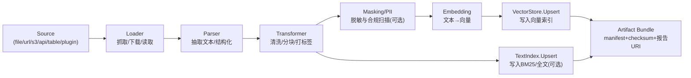

# PowerX 知识库（Knowledge Base / Knowledge Space）搭建与 RAG 工程方案（Draft）

> 版本：v0.1（草稿）  
> 适用范围：PowerX Core（后端知识空间 + Web Admin）与任意智能体框架适配（默认 `backend/internal/server/agent/drivers/eino`）  
> 相关规范/参考：`specs/011-knowledge-space/*`、`docs/guides/knowledge_space/*`、`backend/api/grpc/contracts/powerx/knowledge/v1/knowledge_space.proto`、Eino `components/retriever|indexer|embedding|document`
>
> 目录调整：本方案文档已归档到 `docs/plan/ai_engineering/knowledge/`。

---

## 1. 背景与目标

PowerX 的智能体引擎当前以 Eino 作为默认实现之一（`backend/internal/server/agent/drivers/eino`），但系统需要保持 **“智能体框架可替换”** 的工程弹性。因此知识库（RAG）的核心能力必须沉淀为 **框架无关的领域服务与驱动层**，由上层 Agent/Workflow/Tool 以适配方式调用。

本文目标是为 PowerX 知识库开发提供一份可落地的设计说明，覆盖：
- 知识库资产如何入库（Indexing / Ingestion）
- 在线检索与回答如何组织（Retrieval / RAG）
- 多种 RAG 策略如何通过配置与组合实现（Policy-driven）
- Web Admin 的 UI 信息架构、关键页面与交互逻辑

**非目标**
- 不绑定到某一个 LLM/Embedding/向量数据库厂商；驱动可插拔。
- 不在本文内实现完整的 EinoDev 画布编排（仅描述接口与 UI/配置结构）。

---

## 2. 术语与对象

| 名称 | 定义 | 备注 |
| --- | --- | --- |
| Knowledge Space（知识空间） | 一个“可治理”的知识库容器，按租户隔离，含配额/策略/生命周期 | 对齐 `specs/011-knowledge-space/data-model.md` |
| Source（来源） | 文档/数据源：文件、URL、S3、API、表格、爬虫、插件输出等 | Source 只描述“如何拿到内容” |
| Document（文档） | 原始内容单位（可能很大），带元数据 | Eino `schema.Document` 可作为交换结构 |
| Chunk（片段） | Document 拆分后的最小召回单元（段落/标题块/表格行等） | chunk_id 全局唯一 |
| Embedding（向量） | 将 chunk 内容向量化后的表示 | 可多模型/多维度共存（建议按 space 策略固定） |
| Index / VectorStore | 向量索引存储（pgvector/milvus/redis-search/pinecone…） | “驱动层”负责实现 |
| BM25 / TextIndex | 关键词索引（可选） | 作为 Hybrid RAG 的一条召回通道 |
| Ingestion Job（入库任务） | 单次入库/更新的流水线执行记录 | 对齐 proto 中的 IngestionJobStatus |
| Artifact Bundle（资产包） | 入库过程产物清单：chunk/vector/报告 URI + checksum | 建议落在 MinIO/S3，仅存 URI |
| Retrieval Policy（检索策略） | 在线检索的策略组合（改写/召回/融合/重排/压缩） | 与 Agent 配置解耦 |
| Fusion Strategy（融合策略） | 多路召回结果融合的权重、冲突处理等 | 见 proto FusionStrategy |
| Feedback Case（反馈） | 质量反馈闭环：错误、缺失、过期、敏感等 | 见 proto FeedbackCase |

---

## 3. 设计原则

1. **框架无关**：知识空间的入库、索引、检索、反馈闭环以领域服务形式提供；Eino/其他框架仅做适配调用。
2. **策略可配置**：RAG 策略不写死在驱动或 Handler 内；以策略版本化（PolicyTemplateVersion / FusionStrategyVersion）实现灰度与回滚。
3. **可治理与可观测**：每一次入库/检索都有 trace_id、审计字段与指标；支持回滚、降级、重放（对齐 `docs/guides/knowledge_space/runbook.md`）。
4. **多租户隔离**：tenant_uuid 贯穿索引、查询、审计；空间级 ACL/Tool Grant 控制可见性（参考 `docs/guides/develop/open_capability/knowledge_space.md`）。
5. **资产可追溯**：chunk、向量、摘要、masking report 等都能溯源到 source 与 job；支持增量更新与删除。

---

## 4. 总体架构（分层）

### 4.1 分层视图

```
┌────────────────────────────────────────────────────────────┐
│              Web Admin / API / Workflow / Agent            │
│  - Admin UI: Space/Job/Policy/Playground/Feedback          │
│  - gRPC/HTTP: KnowledgeSpaceAdminService + OpenAPI endpoints│
│  - Agent adapters: eino driver / future drivers            │
└────────────────────────────────────────────────────────────┘
                 │（框架无关调用：领域服务接口）
┌────────────────────────────────────────────────────────────┐
│                 Knowledge Space Domain Services             │
│  - Provisioning: space lifecycle, quotas, retention         │
│  - Ingestion: parse→chunk→enrich→embed→upsert→artifact      │
│  - Query/RAG: recall→fusion→rerank→compress→context         │
│  - Feedback: issue tracking, reprocess, rollback            │
└────────────────────────────────────────────────────────────┘
                 │（驱动接口：可替换实现）
┌────────────────────────────────────────────────────────────┐
│                 Storage / Driver Layer                      │
│  - VectorStore (pgvector / milvus / pinecone / ...)         │
│  - TextIndex (optional)                                     │
│  - ObjectStore (MinIO/S3) for manifests & reports           │
│  - PostgreSQL metadata (space/job/policy/feedback/audit)     │
│  - Redis cache/queues/ratelimit (optional)                   │
└────────────────────────────────────────────────────────────┘
```

### 4.2 Indexing 与 Online RAG 的职责边界

- **Indexing（离线/准实时）**：对内容做“可检索化”处理（chunk/embedding/索引/资产清单/合规报告）。
- **Online RAG（在线）**：对 query 做“检索+证据组织+生成”处理（支持多种策略组合、可解释、可观测）。

这两个阶段的边界要清晰：Indexing 产出稳定的“知识资产”；Online RAG 只是“消费知识资产”并按策略拼装上下文。

---

## 5. 知识库搭建（Indexing / Ingestion）方案

### 5.1 典型流水线



**关键输出**
- chunk 资产：chunk_id、content、metadata（标题层级、来源、时间、权限标签、hash 等）
- embedding 资产：chunk_id → vector（维度、模型、版本）
- 可选 text index 资产：chunk_id → tokens/fields
- ArtifactBundle：`chunk_manifest_uri`、`vector_manifest_uri`、`masking_report_uri` 等（对齐 `specs/011-knowledge-space/data-model.md`）

### 5.2 数据模型（建议对齐 specs/011）

PowerX 已在 `specs/011-knowledge-space/data-model.md` 给出核心实体，落地建议如下：
- `KnowledgeSpace`：空间元信息 + lifecycle（draft/active/pending/retired）+ quotas/retention + policy_template_version_id
- `IngestionJob`：流水线状态与覆盖率：chunk_total、chunk_covered_pct、embedding_success_pct、masking_coverage_pct、error_code
- `ArtifactBundle`：各类 manifest/report 的对象存储 URI（MinIO/S3），仅在 DB 保存 URI + checksum
- `FusionStrategyVersion`：在线融合策略版本（bm25/vector 权重、冲突策略、reranker_model、deployment_state）
- `FeedbackCase`：质量反馈闭环，驱动 reprocess/rollback

### 5.3 向量库驱动（VectorStore Driver）策略

PowerX 建议把“向量数据库差异”压缩在一个 **驱动接口** 内，上层 Ingestion/Query 只面向抽象：
- `Upsert(space_id, records[])`
- `Query(space_id, embedding, topK, filters)`
- `DeleteByChunkIDs(space_id, chunkIDs[])`
- `DropSpace(space_id)`
- `Health()`

配置层建议对齐现有 `backend/config/config.go`：
- `knowledge_space.vector_store.driver`（`pgvector|milvus|pinecone|...`）
- `knowledge_space.vector_store.pgvector.schema/table/dimensions/ivfflat_lists/...`

> 备注：驱动只负责存取与索引健康；不要把“多查询、融合、重排、压缩”等 RAG 策略写进驱动。

### 5.4 增量更新（Delta）与回滚

知识库不是一次性写入，而是持续更新：
- 文档新增：新增 source → ingestion job → upsert chunk + vector
- 文档变更：通过 content hash 识别变更范围（按 chunk 级 diff），仅对变更 chunk 重算 embedding 并 upsert
- 文档删除：按 source_id/doc_id 反查 chunk_id → `DeleteByChunkIDs`

PowerX 可采用 `knowledge_space delta` 机制（proto 里 `DeltaJob`）实现“对比报告 + 审批发布 + 回滚”：
- StartDeltaJob：生成差异与风险（diff_accuracy、masking coverage）
- PublishDeltaJob：通过/部分发布
- RollbackDelta：回滚到上一 bundle 或上一策略版本

---

## 6. 在线检索与回答（Online RAG）策略组合

### 6.1 策略分解：把 RAG 拆成可插拔模块

在线 RAG 不应该是一个巨大的 if-else，而是由 6 类模块组合：

1) **Query 改写（Rewrite）**：MultiQuery、HyDE、纠错、翻译、意图分类  
2) **召回（Recall/Retriever）**：Vector TopK、BM25、Hybrid、多库 Router  
3) **融合（Fusion）**：RRF、去重、来源加权、时间衰减、冲突处理  
4) **重排（Rerank）**：Cross-Encoder、LLM rerank、规则 rerank  
5) **压缩与上下文构建（Compress/Context Build）**：裁剪、摘要、去冗余、引用拼装  
6) **生成与工具协作（Generate/Tool）**：ReAct、函数调用、结构化输出、引用溯源

这些模块都以 “统一的 chunk/document 结构” 作为输入输出，底座与 agent 框架解耦。

### 6.2 推荐的策略配置模型（Policy-driven）

建议在 PowerX 内定义一个策略对象（可版本化、可被 UI 编辑），示例结构（伪 YAML，仅表达意图）：

```yaml
rag_policy:
  rewrite:
    mode: multiquery        # none|multiquery|hyde|custom
    max_queries: 5
  recall:
    mode: hybrid            # vector|bm25|hybrid|router
    top_k: 30
    filters:
      enforce_acl: true
      time_range_days: 365
  fusion:
    mode: rrf
    weights:
      bm25: 0.4
      vector: 0.6
  rerank:
    mode: cross_encoder     # none|cross_encoder|llm
    model: "rerank-v1"
    top_k: 10
  compress:
    mode: contextual        # none|extract|summary|contextual
    budget_tokens: 3000
  answer:
    cite_sources: true
    refusal_policy: strict
    trace_level: verbose
```

策略作用域建议分三层：
- **空间级默认策略**：适用于此 space 的大多数 QA（和 `PolicyTemplateVersion` 绑定）
- **Agent 级覆盖策略**：某个 agent 在调用该 space 时，可覆盖部分参数（如 top_k、budget_tokens）
- **请求级临时策略**：用于调试/Playground，不落库

### 6.3 与 Eino/其他智能体框架的关系

- Eino 侧有 `Retriever/Indexer/Embedding` 抽象，但 PowerX 不应直接“围绕 Eino 抽象建库”。正确做法是：
  - PowerX Domain Service 提供 `RetrievalPlan / RetrievedChunks / ContextPack` 等框架无关结构
  - Eino driver 仅适配：把 `ContextPack` 转成 prompt 或 `schema.Document`，把 tool trace/引用写回审计与反馈
- 未来替换框架（LangGraph/LlamaIndex-Go/自研）时，仅重写 adapter，不动 knowledge_space 底座。

---

## 7. API 设计（对接 UI 与外部调用）

### 7.1 gRPC（管理面）

PowerX 已有 proto：`backend/api/grpc/contracts/powerx/knowledge/v1/knowledge_space.proto`，覆盖：
- `CreateKnowledgeSpace / UpdateKnowledgeSpace / RetireKnowledgeSpace`
- `IngestionJobRequest / IngestionJobStatus`
- `FusionStrategy*`（列表/回滚/发布态）
- `Feedback*`
- `DeltaJob*`（Start/Get/Publish/Rollback）
- `HotUpdate` / Event apply/retry（运维/补丁链路）

UI 的“管理面”优先走 gRPC（更一致的 schema 与权限模型），HTTP 仅用于浏览器直连/开放查询。

### 7.2 OpenAPI（只读/调试面）

当前已挂载只读与 QA 调试入口：`backend/internal/transport/http/openapi/knowledge_space/routes.go`
- `GET /openapi/knowledge-spaces/status`：空间状态聚合
- `POST /openapi/knowledge-spaces/qa/retrieval-plan`：返回检索计划（用于 Playground 展示每一步）
- `POST /openapi/knowledge-spaces/qa/memory-snapshot`：返回回答/会话所用的记忆快照（用于可解释性）

建议补齐（若现有未实现）：
- `POST /openapi/knowledge-spaces/qa/query`：返回 `candidates + scores + citations`（用于前端直接调试）

---

## 8. Web Admin UI 设计逻辑（信息架构 + 关键交互）

目标：让非工程用户也能完成“建库→验证→上线→治理→迭代”的闭环；同时为工程用户提供“可观测、可调试、可回滚”的能力。

### 8.1 信息架构（IA）

一级导航建议：
- **Knowledge Spaces**（空间管理）
- **Ingestion Jobs**（入库任务）
- **Retrieval Playground**（检索调试）
- **Policies**（策略模板/融合策略）
- **Feedback**（质量反馈）
- **Observability**（指标/事件/追踪）

### 8.2 Knowledge Spaces（空间列表/详情）

**列表页（table + filters）**
- 필터：tenant、status、department_code、feature_flags、更新时间
- 列：name、status、quota、policy_template_version、最近一次入库、覆盖率（chunk/embedding/masking）、告警状态
- 行操作：进入详情、Retire、复制策略、触发入库

**详情页（tabs）**
1. Overview：空间元信息、配额、生命周期、策略版本、最近事件
2. Sources / Documents：来源列表、权限标签、变更历史（支持导入/移除）
3. Ingestion：入库任务列表、进度条、失败原因、重试/暂停/恢复、产物 bundle 预览
4. Retrieval：默认策略概览 + “用当前策略跑一次检索”的快捷入口
5. Fusion Strategy：策略版本列表（draft/active/rollback）、权重编辑、灰度发布与回滚
6. Feedback：反馈案例、关联 chunk、触发 reprocess/rollback
7. Access & Compliance：ACL/Tool Grant、masking profile、审计摘要

### 8.3 建库向导（Create/Provisioning Wizard）

建议用分步向导降低复杂度：
1. 基础信息：name/department/标签/生命周期（draft→active）
2. 资源与配额：quota_cpu/storage、retention_days
3. Embedding 选择：provider/model/dimensions（空间内建议固定，避免混维度）
4. 向量库驱动：pgvector（schema/table/ivfflat_lists）、或 milvus/pinecone 连接参数
5. 默认策略模板：PolicyTemplateVersion（可选用“官方模板”）
6. 校验与创建：预估成本（chunk 数、embedding tokens）、权限检查

### 8.4 Ingestion Jobs（入库任务页）

**任务详情要做到“可解释”**
- Pipeline 状态图：Loader/Parser/Transformer/Masking/Embedding/Upsert
- 指标：chunk_total、chunk_covered_pct、embedding_success_pct、masking_coverage_pct
- 产物：ArtifactBundle（manifest URI、checksum、保留到期时间）
- 失败诊断：error_code、blocked_reason、重试次数与退避
- 快捷操作：Retry、Pause、DropSpaceVectors（需二次确认）、下载报告

### 8.5 Retrieval Playground（检索调试页）

核心：让策略迭代可视化、可复现。

输入区：
- 选择 space + 策略版本（空间默认 / draft / 临时）
- 输入 query + 过滤条件（时间范围、标签、权限）
- 可选：对话历史/用户画像（用于 memory snapshot）

输出区（分栏展示）：
- Retrieval Plan：展示每一步（rewrite/recall/fusion/rerank/compress）耗时与参数（对齐 `/openapi/knowledge-spaces/qa/retrieval-plan`）
- Candidates：展示召回 chunk 列表（score、source、snippet、tags、命中方式）
- Context Pack：最终拼装的上下文（token 预算、去重/摘要结果）
- Answer（可选）：一键调用 agent/LLM，展示引用与 trace_id

必备能力：
- “固定随机种子/记录策略快照”以复现结果
- “对比两份策略”以支持 A/B（TopK、rerank on/off、hybrid 权重等）

### 8.6 Policies（策略模板/融合策略）

- PolicyTemplateVersion：模板列表（approved/active）、版本 diff、回滚 token
- FusionStrategyVersion：空间内版本化，支持 `draft → active → rollback`
- 变更必须记录：actor、reason、payload_hash、发布窗口（便于审计）

### 8.7 Feedback（质量闭环）

- 反馈录入：issue_type（accuracy/missing/outdated/safety）、severity、关联 chunk、tool_trace_ref
- 自动动作：触发 reprocess 或建议 rollback（阈值触发）
- SLA：按 severity 自动计算 `sla_due_at`（对齐 `specs/011-knowledge-space/data-model.md`）

---

## 9. 可观测性、审计与运行保障

建议在入库与检索两条链路都输出一致字段：
- `tenant_uuid`、`space_id`、`source_id`、`job_id`、`policy_version`、`trace_id`

运行检查建议复用现有指南：
- Runbook：`docs/guides/knowledge_space/runbook.md`
- Smoke：`docs/guides/knowledge_space/smoke_checklist.md`
- Perf：`docs/guides/knowledge_space/perf_validation.md`

---

## 10. 分阶段实施建议（里程碑）

**M0：最小闭环（可用）**
- pgvector 驱动（Upsert/Query/Delete/Drop/Health）+ migrations
- Ingestion：file/url → chunk → embed → upsert（单策略）
- Playground：能看到 candidates + 基本 plan + trace_id

**M1：策略化与治理**
- PolicyTemplateVersion + FusionStrategyVersion（draft/active/rollback）
- Hybrid recall（bm25 + vector）+ RRF
- FeedbackCase + reprocess（按 chunk 重算/替换）

**M2：增量与合规**
- DeltaJob：diff report + 审批发布 + 回滚
- masking profile + blocked enforcement（masking_coverage_pct<100 则 blocked）
- 事件补偿与批量回放（event hotfix）

---

## 11. 关键决策点（需要尽早定下来）

1. **空间内 embedding 是否允许多模型/多维度共存**（建议默认不允许，避免召回不可比）
2. **chunk 策略的标准化**（按文档类型：markdown/pdf/table/api，需产出统一 metadata）
3. **Hybrid 的 text index 选型**（Postgres FTS/Elastic/RedisSearch；与 pgvector 共存策略）
4. **权限模型落在哪一层**（建议 Query 层强制 enforce ACL，避免上层漏传）
5. **反馈触发 reprocess/rollback 的阈值与流程**（需要产品/合规对齐）
