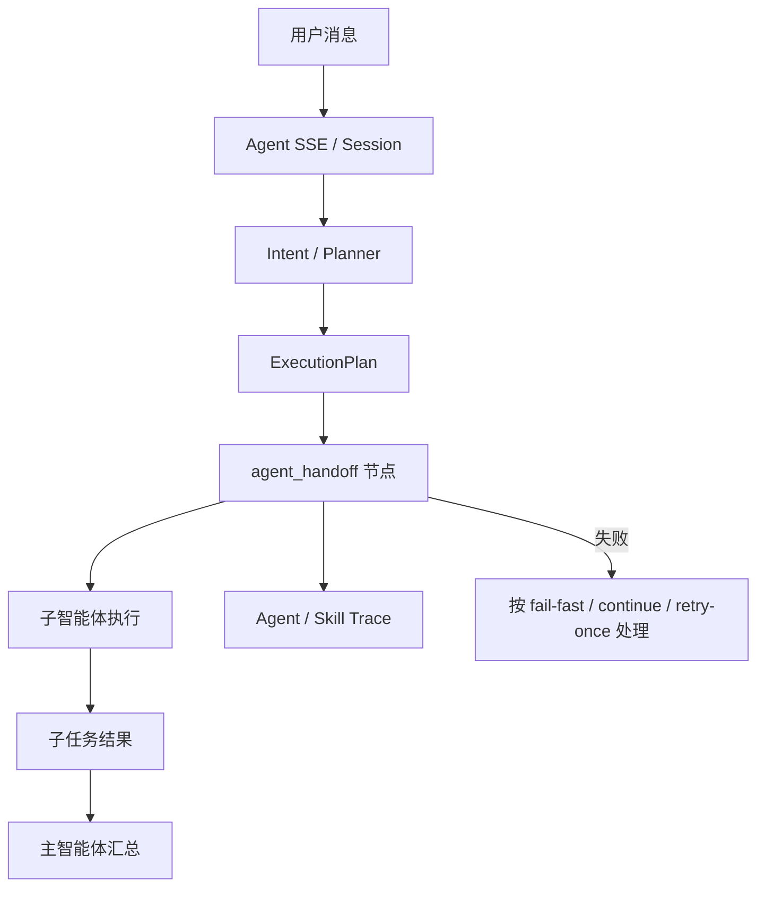

# Multi-Agent 当前实现映射

## 1. 实现目标

当前实现目标是让 PowerX Core 在不依赖插件 executor 的情况下，完成 Core-only A2A 多智能体协作基线。发布准备协作团队是第一条可测试链路。

## 2. 数据模型

| 模型 | 作用 | 代码路径 |
| --- | --- | --- |
| `AgentTeam` | 团队配置，保存主智能体、团队名、分发模式、失败策略、状态。 | `backend/pkg/corex/db/persistence/model/agent/*.go` |
| `AgentTeamMember` | 团队子智能体成员，保存子智能体、角色、优先级、启用状态。 | `backend/pkg/corex/db/persistence/model/agent/*.go` |
| `AgentHandoffTask` | 一次子智能体 handoff 执行记录。 | `backend/pkg/corex/db/persistence/model/agent/*.go` |
| `AgentSharedContextRef` | 主子智能体之间可见的上下文引用边界。 | `backend/pkg/corex/db/persistence/model/agent/*.go` |

迁移挂载：

```text
backend/pkg/corex/db/database/migration.go
```

## 3. Seed 映射

| 对象 | 代码路径 |
| --- | --- |
| 发布准备 Agent、Skills、Team、Members | `backend/cmd/database/seed/seed_a2a_release_readiness.go` |
| seed 主入口挂载 | `backend/cmd/database/seed/seed.go` |
| Agent 分类字典 | `backend/config/metadata_governance/seed.yaml` |

seed 后应具备：

1. `release.coordinator`
2. `release.knowledge_analyst`
3. `release.workflow_planner`
4. `release.notification_scheduler`
5. `release.readiness.team`
6. `powerx.release.knowledge_analysis`
7. `powerx.release.workflow_planning`
8. `powerx.release.notification_schedule`
9. `powerx.release.report_synthesis`

## 4. 后端接口

| 能力 | 方法与路径 | Handler |
| --- | --- | --- |
| 创建团队 | `POST /api/v1/admin/agents/teams` | `backend/internal/transport/http/admin/agent/team_handler.go` |
| 查询团队 | `GET /api/v1/admin/agents/teams` | `backend/internal/transport/http/admin/agent/team_handler.go` |
| 更新团队 | `PATCH /api/v1/admin/agents/teams/:teamId` | `backend/internal/transport/http/admin/agent/team_handler.go` |
| 更新团队状态 | `PATCH /api/v1/admin/agents/teams/:teamId/status` | `backend/internal/transport/http/admin/agent/team_handler.go` |
| 删除团队 | `DELETE /api/v1/admin/agents/teams/:teamId` | `backend/internal/transport/http/admin/agent/team_handler.go` |
| 查询成员 | `GET /api/v1/admin/agents/teams/:teamId/members` | `backend/internal/transport/http/admin/agent/team_handler.go` |
| 新增/更新成员 | `PUT /api/v1/admin/agents/teams/:teamId/members` | `backend/internal/transport/http/admin/agent/team_handler.go` |
| 删除成员 | `DELETE /api/v1/admin/agents/teams/:teamId/members/:childAgentId` | `backend/internal/transport/http/admin/agent/team_handler.go` |
| Agent SSE | `GET /api/v1/agents/stream/sse` | `backend/internal/transport/http/admin/agent/api.go` |
| Session SSE | `GET /api/v1/agents/sessions/:id/stream/sse` | `backend/internal/transport/http/admin/agent/api.go` |

## 5. 执行链路



关键实现：

| 行为 | 代码路径 |
| --- | --- |
| 计划任务结构 | `backend/pkg/corex/flow/schemas/plan.go` |
| A2A 执行分发 | `backend/internal/server/agent/manager_execute.go` |
| Runtime 状态事件 | `backend/internal/server/agent/runtime/run_state_events.go` |
| Agent Trace sink | `backend/internal/service/agent_trace/local_sink.go` |
| Skill Trace 查询 | `backend/internal/transport/http/admin/skills/*` |

## 6. 页面映射

| 页面 | 路径 | 作用 |
| --- | --- | --- |
| Agent 管理 | `/settings/ai/agents` | 查看固有智能体和分类。 |
| 团队管理 | `/settings/ai/agent-teams` | 查看或维护 Agent Team。 |
| 团队任务 | `/agent/team-tasks` | 面向用户的多智能体任务入口。 |
| Agent Trace | `/agent/traces` | 查看 Agent 执行过程。 |
| Skills | `/settings/ai/skills` | 查看 Skill 执行和 A2A 相关 trace。 |

## 7. 运行时约束

1. `planner` 只允许作为主智能体职责，不允许作为子成员 role。
2. 子成员 role 只允许 `retriever`、`executor`、`reviewer`。
3. Team、Agent、Skill 必须属于当前租户边界。
4. 子智能体不能隐式继承完整 session。
5. 没有 handoff invoker、child agent、Skill 或权限时必须显式失败。
6. 最终答复不能在缺少真实子任务结果时输出“已完成”类成功结论。

## 8. 测试映射

| 测试 | 覆盖 |
| --- | --- |
| `backend/tests/integration/skills/skill_agent_a2a_release_readiness_mvp_test.go` | Release seed、MVP 执行、部分失败、上下文隔离。 |
| `backend/tests/integration/skills/skill_agent_a2a_basic_integration_test.go` | 基础 A2A handoff 执行。 |
| `backend/tests/integration/skills/skill_agent_a2a_partial_failure_integration_test.go` | 部分失败策略。 |
| `backend/tests/integration/skills/skill_agent_a2a_context_authz_integration_test.go` | 上下文与授权边界。 |
| `backend/tests/integration/skills/skill_agent_a2a_trace_filter_integration_test.go` | team/handoff 维度 trace 查询。 |
| `backend/tests/integration/skills/skill_agent_run_state_a2a_integration_test.go` | A2A run state 页面事件语义。 |

推荐回归：

```bash
cd backend
GOTOOLCHAIN=go1.26.7 go test ./tests/integration/skills \
  -run 'TestSkillAgentA2AReleaseReadinessSeed|TestSkillAgentA2AReleaseReadinessMVP|TestSkillAgentA2AReleaseReadinessPartialFailure|TestSkillAgentA2AReleaseReadinessContextIsolation' \
  -count=1
```

## 9. 与最终使用方文档的对应关系

| 实现文档 | 使用方文档 |
| --- | --- |
| `docs/plan/ai_engineering/multi-agent/scenario-catalog.md` | `docs/guides/agent/native_agents/release-readiness-demo.md` |
| `docs/plan/ai_engineering/multi-agent/implementation-map.md` | `docs/guides/agent/multi_agent/09_a2a_team_collab_progressive.md` |
| `docs/plan/ai_engineering/skills/multi_agent_a2a.md` | `docs/guides/agent/native_agents/release-readiness-demo.md` |
