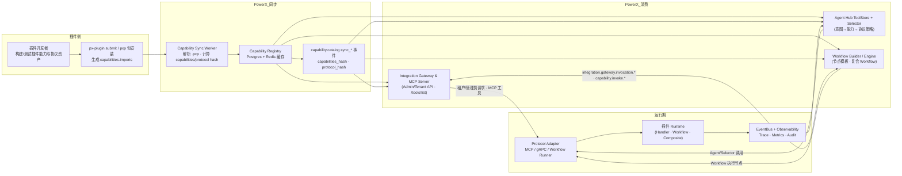

# PowerX 底座多插件智能体能力调用开发指南（PRD）

> 版本：v1.0（草稿） · 参考资料：`PowerXPlugin/docs/plan/006-plugin-capability.md`、`PowerXPlugin/docs/guides/publish/capabilities/*.md`、`specs/007-integration-gateway-and-mcp/*`

---

## 1. 背景与目标

- 插件侧已按《006 — 插件能力多协议暴露与复合任务设计》在安装阶段输出统一能力目录（原子 + 复合 + Workflow/Agent 协议）。
- PowerX Core 现有实现（`capability_registry`、Integration Gateway、Agent Hub）分散记录了调用逻辑，但缺少面向“多插件智能体调用”的一份 PRD 来描述宿主如何消费上述目录并提供一致的开发体验。
- 本文聚焦于 **PowerX 底座 → 多插件 → 智能体/Workflow/租户 API** 的调用链，输出一套统一标准，指导 Integration Gateway、Agent Hub、Workflow Builder、Selector 与 Capability Registry 的协作。
- 插件菜单、页面、页面内动作和业务接口权限的统一登记与角色授权，以 `docs/plan/integration/powerx_capability.md` 的“插件细颗粒度权限注册与授权目标架构”为准；本文只描述 Agent/Workflow/Integration Gateway 如何消费已经登记且已授权的能力。

**业务目标**
1. 在插件提交 `.pxp` 包或通过 `px-plugin capabilities submit` 后 ≤3 分钟，PowerX 能在 `agent hub + workflow builder + integration gateway` 三个入口展示并调用最新能力。
2. 多插件共存时，Agent Hub 能基于意图/ToolScope/租户策略选择合适能力，自动完成协议切换（MCP/gRPC/Workflow）。
3. 调用全程具备可观测性（Trace/Metrics/Audit），并与 `integration.gateway.*` 事件保持一致。

**非目标**
- 不重新描述插件侧如何编写 Handler/协议资产（沿用插件文档）。
- 不在本 PRD 中设计新的 Agent 语言或 Workflow DSL，复用 `specs/007` 及 `docs/standards/powerx/backend/plugins/*.md` 的既定规范。

---

## 2. 范围与角色

| 角色/系统 | 职责 |
|-----------|------|
| 插件（PowerXPlugin） | 通过 `capabilities/*.yaml` + `contracts/exposure/*` 声明所有协议通道，执行 `capabilities submit/export` 提交。
| Capability Registry Service | 存储能力目录、协议引用、版本哈希、权限码和插件授权元数据；对外提供查询 API（供 Agent Hub/Integration Gateway/Workflow Builder/角色权限中心）。
| Integration Gateway | 管理/租户 API + MCP Server（见 `specs/007`），负责租户 HTTP 调用与 MCP 工具拉取。
| Agent Hub & Selector | 根据意图、租户、能力策略选择插件通道；执行多插件调用并协调 Workflow。
| Workflow Builder/Engine | 读取插件提供的 Workflow Step 模板，在编排期/执行期复用插件能力。

本 PRD 同时约束 **PowerX Admin API、Tenant API、MCP Server、Workflow Engine、Agent Hub** 对能力目录的统一消费方式。

---

## 3. 设计原则

1. **单一事实来源**：所有能力、协议、Workflow 模板以插件 `capabilities.imports` 为准；PowerX 只做缓存与索引，不允许手工补登。
2. **协议自描述**：Registry 记录每个能力的 `protocols.rest/grpc/mcp/workflow/...` 引用；调用方通过协议矩阵自动生成网关条目，无需额外配置。
3. **双入口一致**：Workflow Builder 与 Agent Hub 共享同一能力 ID 与 schema；Integration Gateway 暴露同样的 schema 与追踪字段。
4. **选择器优先**：读场景支持 MCP↔gRPC 并发竞速；写场景强制走 gRPC；复合/智能任务走 Workflow/Agent（参见 `docs/standards/powerx/backend/plugins/readme.md`）。
5. **可观测性内置**：Registry/Selector/Gateway 输出一致的 Trace/Metric，事件主题沿用 `integration.gateway.*`。
6. **多插件隔离**：每次调用都绑定 `plugin_id + capability_id + tenant_uuid`，Selector 不得混淆不同插件的上下文/配额。
7. **授权来源一致**：Agent/Workflow 只能调用当前租户已授权的插件能力。插件业务页的菜单、页面、按钮、接口校验也必须使用同一 `permission_code`，不得在插件设置页另设正式授权来源。

---

## 4. 架构全景（PowerX 视角）

```
Plugin Package (.pxp)
   │ px-plugin submit/export
   ▼
Capability Sync Worker (PowerX)
   │ 解析 capabilities imports + contracts/exposure
   ▼
Capability Registry (Postgres + Redis cache)
   │           │
   │           ├─▶ Integration Gateway (Admin/Tenant API + MCP Server)
   │           ├─▶ Agent Hub ToolStore + Selector
   │           └─▶ Workflow Builder Catalog
   ▼
Invocation Runtime (Agent Hub / Workflow Engine / Integration Gateway Tenant API)
   │
   ├─▶ Protocol Adapter: MCP (mark3labs/mcp-go)
   ├─▶ Protocol Adapter: gRPC (buf contracts)
   ├─▶ Protocol Adapter: Workflow Runner（复合任务）
   └─▶ EventBus + Observability (Trace/Metrics/Audit)
```

- 插件提交的能力 → `capability_registry.sync` job 解析并计算 `capabilities_hash`。（参照 `PowerXPlugin/docs/guides/publish/capabilities/registration.md`）
- Registry 把 `tool_scope/intent/workflow_step` 等字段写入缓存，Agent Hub/Workflow Builder/Integration Gateway 通过统一接口加载。
- Selector 根据 `capability.policy.prefer` 字段决定 MCP/gRPC/Agent/Workflow 的优先级。

### 4.1 泳道图：PowerX 底座插件能力管理与使用



> 读链路默认优先走 MCP，写链路强制走 gRPC；Workflow/Composite 场景通过 `workflow_template_ref` 描述节点→协议映射。Registry + 事件是唯一事实来源，所有调用端都在订阅事件后刷新缓存，确保 ≤3 分钟 SLA。

---

## 5. 能力目录统一接入

### 5.1 元数据模型扩展

结合 `specs/007/data-model.md` 与插件目录，Registry 需要新增字段：

| 字段 | 来源 | 说明 |
|------|------|------|
| `capability_id` | `capabilities/*.yaml` | 全局唯一 ID，例如 `com.powerx.demo.template.create`。
| `plugin_id` | plugin manifest | 与 `.pxp` 包绑定。
| `protocols` | 同上 | `rest/grpc/mcp/agent_stream/workflow_step/...` 的引用路径。
| `intents/tool_scope` | `contracts/exposure/mcp-tools.json` | Agent Hub 用于意图匹配。
| `workflow_template_ref` | `contracts/exposure/workflow/*.json` | Workflow Builder 节点模板。
| `composite.graph` | `contracts/exposure/composites/*.json` | 复合任务 DAG。
| `protocol_hash` | PowerX 计算 | 组合 hash，用于热更新。

### 5.2 同步流程

1. 插件发布/更新 → 触发 `capability_registry.sync`（CLI `submit` 或宿主扫描 `.pxp` 包）。
2. Worker 校验：`capabilities lint` 通过 + 协议文件存在 → 写入 Postgres + Redis。失败时发 `capability.catalog.sync_failed` 事件。
3. Integration Gateway/Agent Hub 订阅 `capability.catalog.sync_*` 事件后刷新本地缓存，确保 ≤3 分钟内可见。

### 5.3 API 统一

- Admin：`GET /api/v1/admin/capabilities?plugin_id=` 返回能力 + 协议 + Workflow 元信息。
- Tenant：`GET /api/v1/tenant/capabilities?channel=agent` 仅暴露授权后的能力列表。
- MCP：`/tools/list` 直接从 Registry 获取 `mcp-tools.json` 中的结构，避免插件重复实现。

---

## 6. 协议矩阵与路由策略

| 协议 | 插件资产 | PowerX 适配器 | 调用策略（默认） | 说明 |
|------|---------|--------------|----------------|------|
| REST/OpenAPI | `contracts/exposure/openapi.yaml` | Integration Gateway HTTP 反代 | `prefer=rest`（仅少量读） | 主要用于租户 API/Portal；不直接给 Agent Hub。
| gRPC | `contracts/exposure/proto/*.proto` + buf | Gateway gRPC Client、Workflow Engine | 写路径唯一；读作兜底 | 遵循 `docs/standards/powerx/backend/plugins/readme.md` 中的写路径约束。
| MCP Tool | `contracts/exposure/mcp-tools.json` | Agent Hub MCP Registry | 读优先；可与 gRPC 竞速 | Agent Hub 在 `intent → tool_scope → capability_id` 之间映射。
| Agent SSE/WS | `contracts/exposure/agent-streams/*.yaml` | Agent Hub SSE Broker | 复合/长任务事件 | 结合 `PowerXPlugin/docs/guides/publish/capabilities/mcp-guide.md` 的会话管理。
| Workflow Step | `contracts/exposure/workflow/*.json` | Workflow Builder Catalog | 复合任务/批量场景 | Workflow Engine 执行时仍根据节点协议调用插件。
| Composite DAG | `contracts/exposure/composites/*.json` | Workflow Engine / Agent Hub Planner | 复用/导入插件 Workflow | 供 Agent Hub 直接触发插件内建 Workflow。

Selector 默认策略：
- `capability.policy.prefer` 缺省 → 读走 `mcp`，写走 `grpc`。
- 若 `workflow_template_ref` 存在且 `type=workflow/composite`，Agent Hub 优先调度 Workflow Runner，再由 Runner 调用节点能力。

**Agent Hub 调用路径**：Agent Hub 默认通过 MCP 发现和编排插件能力（`/tools/list`、意图匹配均读取 Registry 缓存的 `mcp-tools.json`），在 MCP Session 正常的情况下走 MCP 以获得读操作的低延迟及流式反馈；一旦遇到写操作或 MCP 断链，会由 Selector 自动切换到 gRPC 通道，并确保写请求附带幂等键与审计字段。

**Workflow 协议选择**：Workflow Builder 渲染的每个节点都引用插件提供的 `workflow_template_ref` 与 `params.protocol`，执行期仍交由 Selector 根据节点声明与全局策略选择实际协议——读节点可使用 MCP/REST 并发竞速，写节点被强制在 gRPC 上落地，确保与 Agent Hub 路径保持一致的治理与观测能力。

---

## 7. 调用链（端到端）

### 7.1 安装阶段
1. 插件构建 `.pxp` → 内含 `capabilities/`、`contracts/exposure/*`（参考 `PowerXPlugin/docs/guides/publish/capabilities/tooling-template.md`）。
2. PowerX Plugin Manager 解包 → 触发 `Capabilities Manager` 调用 `RegisterWithHost()`。
3. Registry 校验 hash、落库、广播事件；Integration Gateway/Agent Hub/Workflow Builder 刷新缓存。

### 7.2 Runtime 发现
1. Integration Gateway Admin API：`POST /admin/integration/routes` 创建入口时，从 Registry 选择能力 ID + 协议。
2. Tenant API/MCP Server：列举租户可用能力时，基于 Tool Grant + Registry 过滤。
3. Agent Hub：在 `intent_router` 中，通过 `intent → tool_scope → capability_id` 查表并获取协议策略。

### 7.3 调用执行
1. Agent Hub/Workflow Engine/Integration Gateway 构造 `CapabilityInvokeRequest`：包含 `capability_id/plugin_id/tenant_uuid/idempotency_key/trace_id/preferred_protocol`。
2. Selector 依据 `prefer/fallback`、健康度、限流、租户策略决定实际 Adapter。
3. Adapter 调用插件：
   - MCP：建立/复用 session（参照 `mcp-guide` 的 Register/Ack/Heartbeat），并订阅 SSE。
   - gRPC：调用插件暴露的 service（buf 生成），写路径携带 `idempotency_key`。
   - Workflow：将 `workflow_template_ref` 下发给 Workflow Engine（如 `contracts/exposure/workflow/template-quality-distribute.json`），Engine 再串行/并行调度节点。
4. 结果写入 EventBus：`integration.gateway.invocation.*` 与 `capability.invoke.*` 事件均包含 `trace_id`、`tenant_uuid`、`plugin_id`、`capability_id`。

### 7.4 失败与回滚
- Selector 若检测到协议失败（如 MCP 断线）→ fallback 至 gRPC，或触发 Workflow 回滚节点（复合任务需在 `contracts/exposure/composites/*.json` 声明补偿能力）。
- 所有失败都需回写 Registry 状态并触发告警（`capability.policy.prefer` 可标记 `rollback_capability_id`）。

---

## 8. 核心实现要求（PowerX 底座）

1. **Capability Sync Worker**（新模块）
   - 读取 `.pxp/capabilities/catalog.json` + `plugin.yaml`，生成 `CapabilityRecord`。
   - 校验 `protocols` 引用是否存在；对 MCP/Workflow/Composite 做 schema 合法性检查。
   - 输出 `capability_catalog_sync_status` 指标（参考插件文档第 14 节）。

2. **Registry API**
   - Admin/tenant/MCP/Agent 统一走 `CapabilityRegistryService`，提供 `ListCapabilities`, `GetCapability`, `ListWorkflows`, `ListCompositeTasks`。
   - 支持按 `tenant/tool_grant/protocol` 过滤。

3. **Agent Hub ToolStore**
   - 监听 Registry 事件，缓存 `intent/tool_scope/capability_id/protocol/prefer`。
   - 启动时对所有插件计算 `capabilities_hash`，与 MCP Session Ack 中的 hash 校验一致性。

4. **Selector & Adapter**
   - 统一 `CapabilityInvokeRequest` 结构，封装上下文、RBAC、限流、幂等。
   - MCP Adapter 复用 `specs/007` 的 MCP Server；gRPC Adapter 复用 Buf 代码；Workflow Adapter 可重用 `docs/standards/powerx/backend/integration/04_orchestration`。

5. **Integration Gateway 对齐**
   - Admin API 创建入口时强制从 Registry 选择能力 ID，不允许手写协议路径。
   - MCP Server `/tools/list` 输出 = Registry 中标记 `channel=mcp` 的能力；`/invoke` 请求 payload 与插件 `mcp-tools.json` Schema 自动对齐。

6. **Workflow Builder**
   - 读取 `workflow_template_ref`，在 UI 中渲染节点模板；执行时根据模板 `params.protocol` 调 Selector。
   - 支持导入插件 Workflow（`composite.type=workflow`）。

7. **可观测性**
   - Trace：统一使用 W3C Trace Context，标签 `capability_id/plugin_id/protocol/tenant_uuid`
   - Metrics：`powerx_capability_invoke_total`、`_latency_ms`、`_error_total` 按能力×协议维度打点。
   - Audit：记录 `actor/tenant/capability/tool_scope/result/trace_id`。

---

## 9. 测试与验收

| 级别 | 场景 | 验收标准 |
|------|------|---------|
| Contract | Registry API（REST/gRPC）、MCP `/tools/list`、Integration Gateway Admin/Tenant API | 与 `specs/007/contracts` 保持一致，新增字段出现在 OpenAPI/Proto 中，CI 运行 `tests/contract/integration_gateway` 通过。 |
| Integration | 插件 Template 场景（compose/audit/quality_distribute） | PowerX 能在 Agent Hub 中展示三个 intent，读能力 MCP 调用成功，写能力走 gRPC 并带幂等键。 |
| Workflow | 导入插件 Workflow 节点 | Workflow Builder 能拖拽插件节点，执行后自动串联插件原子能力并回传结果。 |
| Failure | MCP 断线、gRPC 超时、限流超限 | Selector fallback、生效的 `integration.gateway.invocation.failed` 事件、audit 有记录。 |

---

## 10. 交付阶段建议

| 阶段 | 时间 | 交付 |
|------|------|------|
| Phase 0 | Week 1 | 完成 Registry 模型/DAO/事件 schema，打通 `px-plugin submit → Registry`。 |
| Phase 1 | Week 2-3 | Integration Gateway Admin/Tenant API 改造，支持从 Registry 选能力；MCP `/tools/list` 接入 Registry。 |
| Phase 2 | Week 4 | Agent Hub Selector + MCP/gRPC Adapter 串联，跑通 Template 示例的能力调用。 |
| Phase 3 | Week 5 | Workflow Builder 导入插件 Workflow，E2E 与 Agent Hub 双入口联调。 |
| Phase 4 | Week 6 | 观测性与告警完成，Quickstart/README 更新。 |

---

## 11. 缓存刷新与模板升级

### 11.1 Registry 缓存
- **Key 命名**：`capability_registry:cache:{capability_id}`（能力详情）、`toolstore:policy:{tenant_uuid}:{hash}`（SelectorPolicySnapshot）、`capability_registry:workflow_catalog`（Workflow Catalog 全量）。所有键 TTL 180s，携带 `capabilities_hash` 以便对齐事件版本。
- **刷新流程**：
  1. 触发 `make capability-sync` 或 `scripts/capability_registry/verify.sh --sync-artifact tmp/plugins/latest.pxp`，写入最新能力。
  2. 监听 `capability.catalog.sync_*`，Agent Hub/Workflow Catalog 收到后立即调用 Registry API 回源。
  3. 如果缓存疑似脏数据，执行 `POST /admin/capabilities/cache:flush`，或手动 `redis-cli KEYS 'capability_registry:cache:*' | xargs redis-cli DEL` 再通过脚本拉起。
- **脚本支持**：`scripts/capability_registry/verify.sh` 会依次执行
  - `make capability-sync`
  - `curl /admin/capabilities`、`curl /tenant/capabilities`
  - `curl /tenant/invocations`（发起一次示例调用并打印 `trace_id`）
  - `curl /admin/workflow-templates`，比对 `needs_upgrade` 字段
  脚本通过 `POWERX_BASE_URL/ADMIN_TOKEN/TENANT_TOKEN/PLUGIN_ID/CAPABILITY_ID/TENANT_UUID` 环境变量驱动，可在 CI 与本地快速复现 Quickstart 步骤 1-4。

### 11.2 模板手动升级
- Worker 将插件 Workflow 模板写入 `capability_registry_workflow_template_refs`，并以 `requires_manual_upgrade=true` 为默认值。Workflow Builder 读取 Catalog 时，若 `needs_upgrade=true`，UI/CLI 会阻止直接切换。
- 管理员需调用 `POST /admin/workflow-templates/{templateId}/upgrade`，传入最新 `capabilities_hash` 与备注。成功后 `WorkflowTemplateApproval` 记录审批信息，Workflow Engine/Agent Hub 才允许租户引用最新模板。
- 版本锁：Selector + Workflow Engine 会在调用前校验 `capabilities_hash`。若检测到租户版本滞后，将返回“需手动升级”错误，并在事件总线写入 `capability.policy.degraded`。

## 12. 遥测与 QA

### 12.1 指标
- Registry/Selector：沿用 `powerx_capability_invoke_total`、`powerx_capability_invoke_latency_ms`、`powerx_capability_invoke_error_total`。
- Workflow Catalog：新增 `powerx_workflow_template_snapshot_total{template_id,needs_upgrade}`，每次刷新 Catalog 后记录样本数，帮助运营追踪升级进度。
- Workflow 执行：`powerx_workflow_invocation_total{template_id,protocol,result,needs_upgrade}` 与 `_error_total`；Step Adapter 执行后调用 `WorkflowTelemetry.ObserveWorkflowExecution` 打点。

### 12.2 Trace/Audit
- Trace：所有 Admin/Tenant/MCP/Workflow 调用共享 `trace_id`，标签至少包含 `capability_id/plugin_id/tenant_uuid/protocol`，便于从 Agent Hub/Gateway/Workflow 日志串联。
- Audit：`CapabilitySyncJob`、`WorkflowTemplateApproval`、`InvocationTrace` 均写入 `audit.capability_registry`，失败时附带 `error_summary`。

### 12.3 QA Checklist
1. `scripts/capability_registry/verify.sh` 完整跑通且退出码 0。
2. `go test ./tests/integration/capability_registry -run 'WorkflowCatalog|TemplateUpgrade|WorkflowTelemetry'` 通过。
3. Prometheus 中 `needs_upgrade=true` 的模板占比 < 5%，否则触发运营告警。
4. 任意一次 Workflow 执行的 `trace_id` 可在日志中查到 Selector→Adapter→Workflow Engine 的链路，并匹配 `powerx_workflow_invocation_total`。

## 13. 参考资料

- 插件能力目录：`PowerXPlugin/docs/plan/006-plugin-capability.md`
- MCP 联调：`PowerXPlugin/docs/guides/publish/capabilities/mcp-guide.md`
- Workflow & Agent 指南：`PowerXPlugin/docs/guides/publish/capabilities/workflow-agent-guide.md`
- Integration Gateway 规范：`specs/007-integration-gateway-and-mcp/spec.md`, `quickstart.md`
- PowerX 插件统一设计：`docs/standards/powerx/backend/plugins/readme.md`
- Agent 适配器规范：`docs/standards/powerx/backend/integration/09_agent/*.md`
