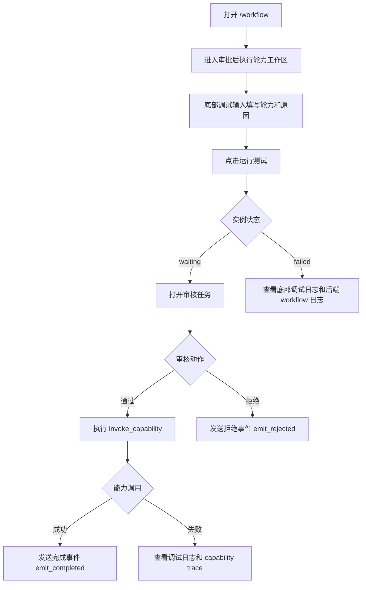

# 审批后执行能力（approval_guarded_capability）

## 0. 先看这个：页面调试到底怎么跑通

这个 Workflow 不是点一次“运行测试”就直接成功结束。它的设计目标就是：

```text
提交执行请求 -> 等人审核 -> 审核通过才执行能力
```

所以页面上看到 `等待中` 通常是正确结果，不是失败。它表示流程已经跑到“人工审核”节点，正在等你去审核任务页面处理。

### 0.1 最短页面操作路径

| 步骤 | 页面动作 | 预期看到 | 如果不是这样 |
| --- | --- | --- | --- |
| 1 | 打开 `/workflow`。 | 列表里有“审批后执行能力”。 | 先执行 Workflow Pack seed。 |
| 2 | 点击“审批后执行能力”。 | 进入 `/workflow/workspace?id=<definition_uuid>`，画布有 5 个节点。 | 查 `/api/v1/admin/workflows/definitions` 是否有 published 定义。 |
| 3 | 不要先改右侧节点配置。先看底部“运行记录”。 | 底部有“调试输入”区域。 | 刷新页面或重启 web-admin。 |
| 4 | 在底部“调试输入”里填写能力、执行原因、是否 dry run、备注。 | 这些字段是本次运行的 input。 | 不要在右侧节点配置里填运行参数。 |
| 5 | 点击右上角“运行测试”。 | 底部“最近运行”变为 `等待中`，并出现“当前等待人工审核”。 | 如果变成 `已失败`，看底部“调试日志”和后端日志。 |
| 6 | 点击底部“打开审核任务”。 | 进入 `/workflow/review-tasks`，看到 pending 审核任务。 | 如果没有任务，按“排障命令”查 instance steps。 |
| 7 | 在审核任务页面点击通过或拒绝。 | 通过后继续执行 `invoke_capability`；拒绝后进入 `emit_rejected`。 | 如果审核 action 失败，检查当前用户是否有审核权限、`reviewer_uuid` 是否正确。 |
| 8 | 回到工作区或刷新工作区。 | 运行记录会恢复最近一次实例状态。 | 如果没有恢复，查 `GET /api/v1/admin/workflows/instances?definition_uuid=...&include_steps=true`。 |

### 0.2 页面上三个区域分别是什么意思

| 区域 | 用途 | 什么时候改 |
| --- | --- | --- |
| 左侧组件库 | 拖拽新增节点。 | 设计新 Workflow 时用；调试 seed 时一般不动。 |
| 中间画布 | 看流程拓扑，选择节点。 | 只用于理解或选择节点。 |
| 右侧节点配置 | 配置“节点定义”，例如人工审核通过后去哪个节点、拒绝后去哪个节点。 | 设计 Workflow 时改；普通调试不要改。 |
| 底部运行记录 | 看最近一次运行实例、运行日志、待审核任务。 | 调试时主要看这里。 |
| 底部调试输入 | 配置“本次运行输入”，例如本次要审核执行哪个 capability。 | 每次运行测试前可以改。 |

关键区别：

```text
右侧节点配置 = 设计期配置，改的是 WorkflowDefinition
底部调试输入 = 运行期输入，改的是本次 WorkflowInstance input
```

如果你只是想验证这个 seed 能不能跑通，不需要改右侧节点配置。直接改底部调试输入，然后点“运行测试”。

### 0.3 当前 seed 的默认调试输入表单

页面底部会把这个 seed 的 input 表单化，不需要手写 JSON：

| 字段 | 示例 | 说明 |
| --- | --- | --- |
| 能力 | `com.corex.metadata.dictionary.read` | 本次审核通过后要调用的 Capability。调试阶段建议用低风险只读能力。 |
| 执行原因 | `workflow_debug_approval_guarded_capability` | 审核人看到的执行原因。 |
| 仅模拟执行 | 开启 | 调试时建议开启。 |
| 备注 | `approval_guarded_capability_debug` | 进入 `request.payload.note`。 |

运行测试时，前端会把表单组装成：

```json
{
  "capability_id": "com.corex.metadata.dictionary.read",
  "request": {
    "reason": "workflow_debug_approval_guarded_capability",
    "payload": {
      "dry_run": true,
      "note": "approval_guarded_capability_debug"
    }
  }
}
```

### 0.4 什么状态算成功

第一阶段成功，不要求能力真的执行完成：

```text
运行测试 -> 实例 waiting -> 出现 pending 审核任务
```

这说明：

- `capture_request` 已完成。
- `review_request` 已创建人工审核任务。
- Workflow Runtime 和 Human Review 这半条链路已经通了。

第二阶段成功，要求审核通过后继续执行：

```text
审核通过 -> invoke_capability completed -> emit_completed completed -> instance succeeded
```

如果审核通过后 `invoke_capability` 失败，不代表前面的 Workflow 调度失败。它通常表示 Capability ID、授权、协议 binding 或 payload 不符合目标能力要求。

### 0.5 页面调试时不要做的事

| 不要做 | 原因 |
| --- | --- |
| 不要把运行参数填到右侧节点配置里。 | 右侧改的是 WorkflowDefinition，不是本次运行 input。 |
| 不要一开始就用删除、批量更新这类高风险能力。 | 先用低风险只读能力验证流程。 |
| 不要看到 `waiting` 就认为失败。 | `waiting` 是人工审核节点的正常状态。 |
| 不要直接改 YAML 后期待页面马上变化。 | 已 seed 的 WorkflowDefinition 在数据库里，需要重新 seed 或更新定义。 |

### 0.6 页面调试流程图



### 0.7 页面调试泳道图

```mermaid
flowchart LR
    subgraph WebAdmin[Web Admin]
      A1[/workflow 列表]
      A2[工作区运行测试]
      A3[审核任务页面]
    end

    subgraph Backend[PowerX Backend]
      B1[Start WorkflowInstance]
      B2[Runner 执行 capture_request]
      B3[Human Review 创建 pending task]
      B4[审核 action 唤醒 Runner]
      B5[Capability Invoke 或 Reject Event]
    end

    subgraph Operator[审核人]
      C1[查看请求内容]
      C2[通过或拒绝]
    end

    A1 --> A2 --> B1 --> B2 --> B3 --> A3 --> C1 --> C2 --> B4 --> B5
```

## 页面对应关系

| 项目 | 值 |
| --- | --- |
| Web Admin 显示名 | 审批后执行能力 |
| workflow_key | `approval_guarded_capability` |
| i18n key | `workflow.pack.approvalGuardedCapability.name` |
| seed 文件 | `backend/config/workflow_packs/common/approval_guarded_capability.yaml` |
| 页面入口 | `/workflow` |
| 页面卡片标识 | 内置包 |

## 1. 这个 seed 解决什么问题

`approval_guarded_capability` 用来表达“先人工审核，再执行某个能力”。

它适合任何高风险动作，例如删除数据、批量修改、触发外部系统写操作、导出敏感资料、给插件开通某个权限。Agent 或插件不能直接执行这些动作，而是先提交一个请求，等人审通过后再调用指定 Capability。

## 2. seed 文件

```text
backend/config/workflow_packs/common/approval_guarded_capability.yaml
```

seed 后生成：

```text
WorkflowDefinition.workflow_pack_key = approval_guarded_capability
WorkflowDefinition.status = published
```

## 3. 谁会用它

| 使用方 | 场景 |
| --- | --- |
| 高风险操作治理智能体 | 用户要求删除、批量更新、导出敏感数据时，先转成人审任务。 |
| 插件后台 | 插件想调用 Core 高风险能力时，必须先走人审。 |
| 运营管理员 | 把一些后台操作放进标准审批流程。 |
| 垂类业务 Agent | 例如营销 Agent 想触发大批量客户状态变更，先审核再执行。 |

## 4. 前置对象

必须准备：

| 对象 | 说明 |
| --- | --- |
| Capability | 需要被调用的能力 ID，例如 `${capability_id}`。 |
| 审核角色 | 默认是 `workflow_reviewer`。 |
| 输入表单或文本 | 请求内容会进入 `$.artifacts.request`。 |

这个 seed 的 YAML 中 `required_capabilities: []`，因为具体要调用哪个能力由 `${capability_id}` 占位决定。真正绑定 Agent 或实例化时必须填入正式 Capability Registry 中存在且已授权的能力。

## 5. 节点一步步做什么

```text
capture_request
  -> review_request
  -> invoke_capability
  -> emit_completed
```

拒绝分支：

```text
review_request
  -> emit_rejected
```

| 步骤 | node_kind | 做什么 | 输入 | 输出 |
| --- | --- | --- | --- | --- |
| `capture_request` | `input.capture` | 收集用户或插件提交的执行请求。 | 文本或表单 | `$.artifacts.request` |
| `review_request` | `human.review` | 创建人工审核任务。审核人看 `$.artifacts.request`。 | `$.artifacts.request` | `$.review` |
| `invoke_capability` | `capability.invoke` | 审核通过后调用 `${capability_id}`。 | `$.artifacts.request` | `$.vars.capability_result` |
| `emit_completed` | `event.emit` | 能力执行完成后发送事件。 | `$.vars.capability_result` | `workflow.capability.completed` |
| `emit_rejected` | `event.emit` | 审核拒绝后发送拒绝事件。 | `$.review` | `workflow.capability.rejected` |

## 6. 需要填哪些占位值

| 占位符 | 必填 | 示例 | 说明 |
| --- | --- | --- | --- |
| `${capability_id}` | 是 | `com.corex.customer.accounts.admin_manage` | 被审核保护的能力 ID。 |

## 7. 怎么 seed

先准备环境变量：

```bash
export POWERX_BASE_URL="http://127.0.0.1:8077"
export ADMIN_TOKEN="<TOKEN>"
export REVIEWER_UUID="<当前审核人的 user_uuid>"
```

执行 seed：

```bash
curl -sS -X POST "$POWERX_BASE_URL/api/v1/admin/workflows/packs/seed" \
  -H "Authorization: Bearer $ADMIN_TOKEN" \
  -H "Content-Type: application/json" \
  -d '{"keys":["approval_guarded_capability"]}'
```

## 8. 怎么验证 seed 成功

```bash
curl -sS "$POWERX_BASE_URL/api/v1/admin/workflows/packs?page_size=20&offset=0" \
  -H "Authorization: Bearer $ADMIN_TOKEN"
```

预期看到：

```json
{
  "workflow_key": "approval_guarded_capability"
}
```

再查定义：

```bash
curl -sS "$POWERX_BASE_URL/api/v1/admin/workflows/definitions?page_size=20&offset=0" \
  -H "Authorization: Bearer $ADMIN_TOKEN"
```

预期看到：

```json
{
  "workflow_pack_key": "approval_guarded_capability",
  "status": "published"
}
```

把 `definition_uuid` 保存下来，后续启动实例要用：

```bash
export DEFINITION_UUID="<上一步返回的 definition_uuid>"
```

页面验证：

```text
Web Admin -> /workflow -> 审批后执行能力
```

预期：

- 卡片显示为内置包。
- 卡片标题显示“审批后执行能力”，不是 `approval_guarded_capability`。
- 打开 workspace 后，顶部标题显示“审批后执行能力”。
- 打开 workspace 后能看到 5 个节点，页面主标题显示中文名称，step_id 只作为调试辅助：

| 页面节点名 | step_id |
| --- | --- |
| 输入采集 | `capture_request` |
| 人工审核 | `review_request` |
| 调用能力 | `invoke_capability` |
| 发送事件 | `emit_completed` |
| 发送事件 | `emit_rejected` |

## 9. 页面调试：按 Web Admin 从头跑一遍

这一节是给“只用页面、不用 curl”的调试路径。更短的总览见文档开头 `0. 先看这个：页面调试到底怎么跑通`。

### 9.1 打开工作区

动作：

1. 打开 `Web Admin -> /workflow`。
2. 找到卡片“审批后执行能力”。
3. 点击卡片进入工作区。

预期结果：

- URL 类似 `/workflow/workspace?id=<definition_uuid>`。
- 顶部标题是“审批后执行能力”。
- 画布中有 5 个节点：
  - 输入采集
  - 人工审核
  - 调用能力
  - 发送事件（完成分支）
  - 发送事件（拒绝分支）
- 顶部紧凑指标显示节点数、连线数、版本、状态。

失败处理：

- 如果列表没有这个卡片，先看 `7. 怎么 seed`。
- 如果标题显示机器 ID，说明 i18n 或 Workflow Pack 显示映射没有对齐。
- 如果画布为空，查 `GET /api/v1/admin/workflows/definitions/<definition_uuid>` 的 `step_graph`。

### 9.2 不要先改右侧节点配置

右侧“节点配置”是设计期配置。例如选中“人工审核”节点时，右侧字段含义是：

| 字段 | 含义 | 调试时要不要改 |
| --- | --- | --- |
| 审核类型 | 当前审核任务的业务类型。 | 一般不改。 |
| 审批角色 | 哪些角色可以审核，默认 `workflow_reviewer`。 | 只有验证权限策略时才改。 |
| 审核内容路径 | 审核人看到哪段运行数据，默认 `$.artifacts.request`。 | 一般不改。 |
| 通过路由 | 审核通过后走哪个节点。 | 不要随便改。 |
| 拒绝路由 | 审核拒绝后走哪个节点。 | 不要随便改。 |

如果只是验证 seed 能不能跑通，不需要改右侧任何节点配置。

### 9.3 填底部调试输入

动作：

1. 看页面底部。
2. 切到“运行记录”。
3. 在“调试输入”表单中确认或填写：

| 字段 | 推荐值 |
| --- | --- |
| 能力 | `com.corex.metadata.dictionary.read` |
| 执行原因 | `workflow_debug_approval_guarded_capability` |
| 仅模拟执行 | 开启 |
| 备注 | `approval_guarded_capability_debug` |

预期结果：

- 页面不要求你手写 JSON。
- 这些字段是本次 `WorkflowInstance.input`。
- 点“恢复示例”会恢复默认调试输入。

失败处理：

- 如果底部仍然只显示 JSON，刷新 web-admin 或确认前端代码已经更新。
- 如果能力为空，运行测试会直接失败并提示能力不能为空。

### 9.4 点击运行测试

动作：

1. 点击右上角“运行测试”。
2. 看底部“最近运行”和“调试日志”。

预期结果：

```text
最近运行 = 等待中
待审核任务 = 1
调试日志包含：
  采集执行请求 completed
  审核执行请求 waiting
```

解释：

- `等待中` 是正确状态。
- 它表示 workflow 已经到 `human.review`。
- 此时不会继续执行 `调用能力`，因为还没有人工审核通过。

失败处理：

| 页面现象 | 可能原因 | 处理 |
| --- | --- | --- |
| 点“运行测试”没反应 | 前端请求失败或按钮状态异常。 | 打开浏览器 Network，看 `POST /api/v1/admin/workflows/instances`。 |
| 直接 `已失败` | input、节点 adapter 或后端 runner 失败。 | 看底部“调试日志”的错误，再查后端日志。 |
| 一直 `排队中` | runner 没推进。 | 查后端 workflow runner 日志。 |
| 没有待审核任务 | 没跑到 `review_request`。 | 查实例 steps，确认 `review_request` 是否存在。 |

### 9.5 打开审核任务

动作：

1. 在底部运行记录里点击“打开审核任务”。
2. 页面跳转到 `/workflow/review-tasks`。
3. 找到刚创建的 pending 审核任务。

预期结果：

- 审核任务状态是“待处理”。
- 审核类型是“能力执行审核”。
- 任务关联的实例短 ID 应和工作区底部“最近运行”的实例一致。

失败处理：

- 如果审核任务列表为空，用 API 查：

```bash
curl -sS "$POWERX_BASE_URL/api/v1/admin/workflows/review-tasks?status=pending&page=1&page_size=20" \
  -H "Authorization: Bearer $ADMIN_TOKEN"
```

### 9.6 审核通过后看流程继续

动作：

1. 在审核任务页面点击通过。
2. 回到工作区。
3. 刷新或重新打开该 Workflow。

预期结果：

- `review_request` 从 waiting 变成 approved/completed。
- Workflow 继续执行 `invoke_capability`。
- 如果能力调用成功，继续执行 `emit_completed`。
- 最终实例进入成功或明确终态。

失败处理：

- 如果通过后 `invoke_capability` 失败，说明 Human Review 已跑通，下一步查 Capability：
  - Capability ID 是否存在。
  - 当前租户/用户是否有授权。
  - REST/gRPC binding 是否登记。
  - input payload 是否符合目标能力要求。

### 9.7 审核拒绝后看拒绝分支

动作：

1. 重新点击“运行测试”，创建一个新实例。
2. 打开审核任务。
3. 点击拒绝。
4. 回到工作区刷新。

预期结果：

```text
review_request -> emit_rejected
invoke_capability 不应该执行
```

如果拒绝后仍然执行了 `invoke_capability`，说明路由配置或 runner 分支判断有问题，需要查 `review_request` 的 `rejected_route` 和 step records。

## 10. API 调试：先跑到人工审核

第一轮建议只验证 Workflow 能不能启动，并且能不能创建 Human Review 任务。这个阶段不需要 Capability 真正执行成功。

### 10.1 选择一个测试 capability_id

这个 Workflow 有 `${capability_id}` 占位。调试时先选一个已经登记的、低风险的 capability。

如果不知道选哪个，先查能力列表：

```bash
curl -sS "$POWERX_BASE_URL/api/v1/admin/capabilities?source=corex&page=1&page_size=50" \
  -H "Authorization: Bearer $ADMIN_TOKEN"
```

然后选一个只读或低风险能力：

```bash
export CAPABILITY_ID="<一个已存在的 capability_id>"
```

注意：

- 不要先用删除、批量更新、发消息这类高风险能力调试。
- 如果只是验证“能进审核”，即使后续 capability 调用失败也可以接受。

### 10.2 启动 WorkflowInstance

```bash
curl -sS -X POST "$POWERX_BASE_URL/api/v1/admin/workflows/instances" \
  -H "Authorization: Bearer $ADMIN_TOKEN" \
  -H "Content-Type: application/json" \
  -d '{
    "definition_uuid": "'"$DEFINITION_UUID"'",
    "input": {
      "capability_id": "'"$CAPABILITY_ID"'",
      "request": {
        "reason": "approval_guarded_capability 单独调试",
        "payload": {
          "dry_run": true,
          "note": "先验证 Workflow 能否创建人工审核任务"
        }
      }
    },
    "tags": {
      "debug": "approval_guarded_capability"
    },
    "correlation_id": "debug-approval-guarded-capability"
  }'
```

保存返回的实例 UUID：

```bash
export INSTANCE_UUID="<返回的 uuid>"
```

### 10.3 查询实例和步骤

```bash
curl -sS "$POWERX_BASE_URL/api/v1/admin/workflows/instances/$INSTANCE_UUID?include_steps=true" \
  -H "Authorization: Bearer $ADMIN_TOKEN"
```

预期：

- `state` 可能是 `queued`、`running` 或 `waiting`。
- `steps` 中至少有 `capture_request`。
- Runner 推进后应出现 `review_request`。
- 到人工审核节点后，实例通常会进入等待状态。

如果没有推进，先看“排障命令”小节。

### 10.4 查询审核任务

```bash
curl -sS "$POWERX_BASE_URL/api/v1/admin/workflows/review-tasks?status=pending&page=1&page_size=20" \
  -H "Authorization: Bearer $ADMIN_TOKEN"
```

如果任务很多，可以按实例过滤：

```bash
curl -sS "$POWERX_BASE_URL/api/v1/admin/workflows/review-tasks?status=pending&workflow_instance_uuid=$INSTANCE_UUID&page=1&page_size=20" \
  -H "Authorization: Bearer $ADMIN_TOKEN"
```

预期看到：

```json
{
  "review_task_uuid": "<REVIEW_TASK_UUID>",
  "workflow_instance_uuid": "<INSTANCE_UUID>",
  "step_id": "review_request",
  "review_type": "capability_execution",
  "status": "pending"
}
```

保存审核任务 UUID：

```bash
export REVIEW_TASK_UUID="<review_task_uuid>"
```

页面也可以看：

```text
Web Admin -> /workflow/review-tasks
```

## 11. API 调试：审核通过后继续执行

确认 pending 任务存在后，可以提交审核动作。

### 11.1 审核通过

```bash
curl -sS -X POST "$POWERX_BASE_URL/api/v1/admin/workflows/review-tasks/$REVIEW_TASK_UUID/actions" \
  -H "Authorization: Bearer $ADMIN_TOKEN" \
  -H "Content-Type: application/json" \
  -d '{
    "action": "approve",
    "reviewer_uuid": "'"$REVIEWER_UUID"'",
    "comment": "单独调试通过",
    "payload": {
      "approved_for_debug": true
    }
  }'
```

预期：

- 审核任务状态变成 `approved`。
- Workflow 会尝试继续到 `invoke_capability`。

再查实例：

```bash
curl -sS "$POWERX_BASE_URL/api/v1/admin/workflows/instances/$INSTANCE_UUID?include_steps=true" \
  -H "Authorization: Bearer $ADMIN_TOKEN"
```

如果 `capability.invoke` 可用且参数符合能力要求，后续应看到：

```text
invoke_capability -> emit_completed
```

如果 capability 调用失败，仍然说明前半段 Workflow 和 Human Review 已经跑通；接下来要排查 Capability binding、权限和输入 payload。

### 11.2 审核拒绝

如果想测拒绝分支，重新启动一个实例，然后执行：

```bash
curl -sS -X POST "$POWERX_BASE_URL/api/v1/admin/workflows/review-tasks/$REVIEW_TASK_UUID/actions" \
  -H "Authorization: Bearer $ADMIN_TOKEN" \
  -H "Content-Type: application/json" \
  -d '{
    "action": "reject",
    "reviewer_uuid": "'"$REVIEWER_UUID"'",
    "comment": "拒绝分支调试",
    "payload": {
      "reason": "debug reject"
    }
  }'
```

预期：

```text
review_request -> emit_rejected
```

## 12. Agent 怎么启动它

Agent 运行时不直接读 YAML。正确流程：

```text
找到 workflow_pack_key=approval_guarded_capability 的 published WorkflowDefinition
  -> 绑定到 AgentInstance
  -> 启动 WorkflowInstance
  -> input 里带 capability_id 和请求内容
```

启动实例示例：

```bash
curl -sS -X POST "$POWERX_BASE_URL/api/v1/admin/workflows/instances" \
  -H "Authorization: Bearer $ADMIN_TOKEN" \
  -H "Content-Type: application/json" \
  -d '{
    "definition_uuid": "<DEFINITION_UUID>",
    "input": {
      "capability_id": "com.corex.customer.accounts.admin_manage",
      "request": {
        "reason": "批量更新客户状态前审核",
        "payload": {
          "customer_uuid": "<CUSTOMER_UUID>",
          "next_status": "inactive"
        }
      }
    }
  }'
```

但在 Agent 侧不要直接让模型拼自由文本。必须由 Agent/Skill 输出结构化字段：

| 字段 | 来源 |
| --- | --- |
| `definition_uuid` | AgentInstance 绑定的 WorkflowDefinition UUID。 |
| `capability_id` | Agent policy 或明确授权配置，不从用户自由文本猜。 |
| `request.reason` | 用户请求或业务表单。 |
| `request.payload` | 结构化业务参数。 |

## 13. 排障命令

### 13.1 查 Workflow Pack 是否 seed

```bash
curl -sS "$POWERX_BASE_URL/api/v1/admin/workflows/packs/approval_guarded_capability" \
  -H "Authorization: Bearer $ADMIN_TOKEN"
```

### 13.2 查定义内容

```bash
curl -sS "$POWERX_BASE_URL/api/v1/admin/workflows/definitions/$DEFINITION_UUID" \
  -H "Authorization: Bearer $ADMIN_TOKEN"
```

重点看：

- `status` 是否是 `published`
- `step_graph` 是否包含 5 个步骤
- `workflow_pack_key` 是否是 `approval_guarded_capability`

### 13.3 查实例步骤

```bash
curl -sS "$POWERX_BASE_URL/api/v1/admin/workflows/instances/$INSTANCE_UUID?include_steps=true" \
  -H "Authorization: Bearer $ADMIN_TOKEN"
```

重点看：

- `state`
- `current_step_id`
- `last_error`
- `steps[*].state`
- `steps[*].error_message`

### 13.4 查审核任务

```bash
curl -sS "$POWERX_BASE_URL/api/v1/admin/workflows/review-tasks?workflow_instance_uuid=$INSTANCE_UUID&page=1&page_size=20" \
  -H "Authorization: Bearer $ADMIN_TOKEN"
```

### 13.5 查后端日志

本地：

```bash
cd backend
go run ./cmd/powerx
```

systemd dev：

```bash
sudo journalctl -u powerx-dev-backend -n 300 --no-pager | grep -Ei "workflow|review|capability|runner|trace"
```

## 14. 常见失败点

| 失败 | 原因 | 处理 |
| --- | --- | --- |
| 找不到 `${capability_id}` | Agent 没有填真实能力 ID，或能力未登记。 | 先查 Capability Registry，确认能力存在并授权。 |
| 实例一直 `queued` | Runner 没运行或没有租约推进。 | 查 Runner 是否启动，查后端 workflow runner 日志。 |
| 一直 `waiting` | 到了 `human.review`，需要审核。 | 打开 `/workflow/review-tasks`。 |
| 没有 review task | `human.review` adapter 未执行、实例没推进到该节点、Review store 不可用。 | 查实例步骤和后端日志。 |
| 审核 action 400 | `reviewer_uuid` 缺失或不是 UUID。 | 设置 `REVIEWER_UUID`。 |
| capability invoke 失败 | 能力没有授权、协议绑定缺失、参数不符合能力输入。 | 查实例步骤错误和 capability trace。 |
| 审核通过后没有事件 | Event adapter 或事件发布依赖未配置。 | 查 `workflow.capability.completed` 发布日志。 |

## 15. 最小验收标准

第一阶段验收，不要求 capability 成功：

- seed 成功。
- `/workflow` 能打开该内置包。
- 能启动 WorkflowInstance。
- 能查到 `review_request` 对应 pending Human Review Task。

第二阶段验收，要求 capability 也成功：

- 审核通过后执行 `invoke_capability`。
- `invoke_capability` 状态为 completed。
- `emit_completed` 状态为 completed。
- 实例最终进入 `succeeded` 或明确完成状态。

拒绝分支验收：

- 审核拒绝后不执行 `invoke_capability`。
- 执行 `emit_rejected`。
- 实例步骤记录可追溯拒绝原因。

## 16. 适合不适合

适合：

- 高风险写操作。
- 插件能力执行前审批。
- 管理员确认后才允许 Agent 执行的动作。

不适合：

- 普通只读查询。
- 不需要人审的低风险自动化。
- 纯知识入库流程，应该用 `expert_knowledge_capture` 或领域知识类 Workflow。
