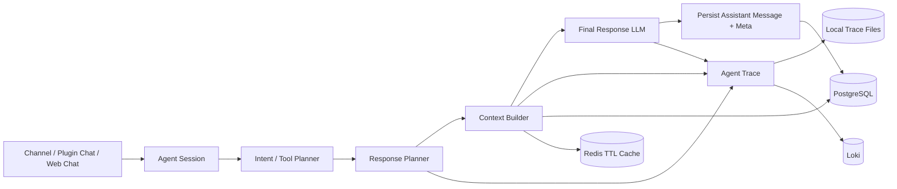
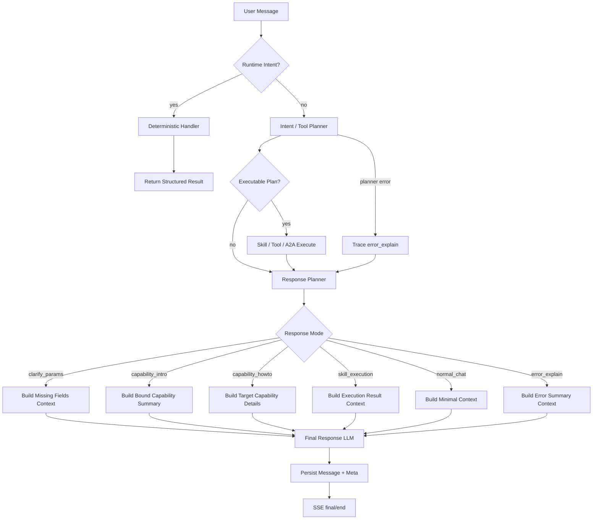
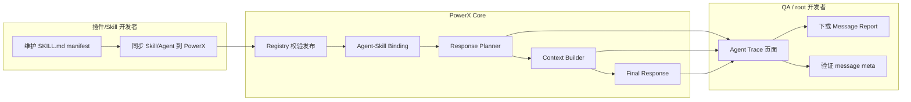

# Agent Response Planning 机制设计

本文定义 PowerX Agent Runtime 的 Response Planner、Context Builder 与 Final Response 分层机制。该机制解决“能力候选、会话上下文、执行结果和最终话术混在同一个 prompt 里”的问题，确保 Agent 回答只基于当前 Agent 被授权和绑定的事实材料，并可通过 Agent Trace 回放每个节点。

补充协议：最终回答前后的多任务、多 Agent、缺参等待、执行状态和结果链接展示，统一使用 [`agent_run_state_protocol.md`](./agent_run_state_protocol.md) 定义的 `agent_run.*` 事件与 `AgentRunState` reducer。ResponsePlanner 只决定本轮回答模式；用户可见的执行过程必须由 run state task/status/result 事件表达。

补充服务边界：跨轮业务参数、缺参状态、执行确认和 capability request 由 [`agent_runtime_standard_services.md`](./agent_runtime_standard_services.md) 中的 `SkillStateService` 承载。ResponsePlanner 可以读取 SkillState 摘要决定 `clarify_params/skill_execution/error_explain`，但不能在 Core prompt 中写死某个 Skill 的业务字段规则。

## 1. 功能背景与目标

当前 Agent Chat 不能把“候选能力摘要 + 最近消息”直接塞给 LLM 后让模型自由回答，否则会出现：

1. 把全局 system/public 候选误说成当前 Agent 已绑定能力。
2. 不区分“能力介绍 / 使用说明 / 执行请求 / 缺参数 / 错误解释 / 普通聊天”。
3. 重复介绍自己，或把 manifest/schema/id 原文暴露给用户。
4. 无法从消息历史里稳定判断上一轮回答模式，只能依赖文本匹配。
5. Trace 里看不清最终回答为什么使用了某些上下文。

目标是把 Agent 主链路升级为：

```text
User Message
  -> Intent / Tool Planner
  -> Response Planner
  -> Context Builder
  -> Final Response LLM
  -> Persist Message + Meta
```

职责边界：

1. PowerXPlugin 只负责提供真实 Skill Manifest、prompt spec、schema、executor 与 intent examples。
2. PowerX Core 负责意图识别、候选过滤、响应模式选择、上下文选择、最终自然语言回复和 message meta 落库。
3. LLM 只能看到当前模式允许注入的上下文，不得看到未授权候选或完整全局候选池。
4. PowerX Core 不写业务型回复规则；业务表达规范必须来自 Agent persona/prompt_seed 或 Skill `response_guidance`。
5. 多轮业务状态必须来自 SkillState，不得只靠最近消息文本让 LLM 每轮重新猜参数。

## 2. 角色与适用范围

适用入口：

1. Web Admin Agent Chat。
2. PowerXPlugin 本地 Agent Chat。
3. Telegram / Discord / 企业微信 / 微信 / SCRM / 移动端等渠道进入的 Agent Session。
4. A2A 主 Agent 与子 Agent 的 final response 汇总节点。

角色：

1. Agent Runtime 开发者：实现 ResponsePlanner、Context Builder、Final Response 模板。
2. Skill/插件开发者：补齐 manifest 的 title、description、intent_examples、input_schema、output_schema、prompt_spec。
3. QA：通过 SSE event、message meta、Agent Trace 验证模式判断和上下文注入。
4. root 开发者：在 Agent Trace 页面查看 response_plan、context_package 和 final_response 节点报告。

## 3. 整体架构与模块关系



模块职责：

| 模块 | 职责 | 权威数据源 |
| --- | --- | --- |
| Intent / Tool Planner | 判断是否需要 skill/tool/agent_handoff 执行，生成 plan/tasks | DB registry + bindings |
| Response Planner | 判断本轮最终回答模式和需要的上下文 | DB message meta + plan result |
| Context Builder | 按 response_mode 装配上下文包 | DB 为权威，Redis/内存仅缓存 |
| Final Response LLM | 把事实材料转成自然语言 | Context Package |
| Message Persist | 保存 assistant content 与 meta | PostgreSQL |
| Agent Trace | 保存节点输入输出摘要和报告 artifact | Local File / Loki |

## 4. 核心流程



失败分支：

1. ResponsePlanner 输出非法 JSON：重试一次结构化解析；仍失败则 fail-fast 为 `agent.response_plan_invalid`，进入 `error_explain`。
2. Context Builder 发现目标 skill 未绑定、未发布或租户不可见：fail-fast 为 `agent.context_capability_denied`，不得降级为全局候选。
3. Final Response 模型失败：记录 `final_response` node error，并返回稳定错误摘要，不暴露 stack、prompt 或 trace raw payload。

## 5. 跨角色协作流程



## 6. Response Mode

标准枚举：

```go
type ResponseMode string

const (
    ResponseModeCapabilityIntro ResponseMode = "capability_intro"
    ResponseModeCapabilityHowTo ResponseMode = "capability_howto"
    ResponseModeSkillExecution  ResponseMode = "skill_execution"
    ResponseModeClarifyParams   ResponseMode = "clarify_params"
    ResponseModeNormalChat      ResponseMode = "normal_chat"
    ResponseModeErrorExplain    ResponseMode = "error_explain"
)
```

语义：

| Mode | 触发语义 | 是否调用 Skill/Tool | 上下文注入 |
| --- | --- | --- | --- |
| `capability_intro` | 用户询问当前 Agent 能做什么、有什么能力、适用场景 | 否 | 当前 Agent 已绑定能力摘要、每个能力 1-2 个自然语言示例 |
| `capability_howto` | 用户追问某项能力如何使用、需要什么参数 | 可选 | 目标能力详情、actions、required fields、examples |
| `skill_execution` | 用户明确要求执行，且参数足够或已执行 | 是 | 执行结果、目标能力 title、成功/失败状态 |
| `clarify_params` | 用户想执行但缺必要参数 | 否 | 缺失字段、字段含义、示例提问 |
| `normal_chat` | 普通问答或上下文追问 | 否 | 最小会话上下文，不注入完整能力介绍 |
| `error_explain` | Planner/Executor/LLM 节点失败 | 否 | 脱敏错误摘要和可操作下一步 |

说明：

1. 这不是关键词穷举路由。自然语言请求仍由 LLM 结构化 planner 主导；确定性逻辑只用于 runtime intent、权限硬过滤、schema 校验和高置信约束。
2. ResponsePlanner 可以采用“小模型结构化输出 + schema 校验”的方式，首版允许统一使用 Agent 默认模型。
3. 不允许通过“看起来像能力问题”的文本规则绕过自然语言主链路；需要确定性结果时必须使用显式 Runtime Intent。

## 7. ResponsePlan 合同

ResponsePlanner 输出必须是结构化 JSON：

```json
{
  "response_mode": "capability_intro",
  "response_intents": [
    "greeting",
    "agent_identity",
    "capability_intro",
    "test_recommendation"
  ],
  "answer_requirements": [
    "简短回应用户问候。",
    "说明当前 Agent 的身份和服务对象。",
    "只列出当前 Agent 已绑定能力，不能列出全局平台能力或未绑定能力。",
    "基于当前已绑定能力推荐一个最适合先测试的能力或动作。"
  ],
  "should_call_tool": false,
  "target_capability_ids": ["powerxplugin.template.basic"],
  "use_capability_context": true,
  "include_examples": true,
  "include_schema": false,
  "repeat_full_intro": false,
  "needs_clarification": false,
  "missing_fields": [],
  "reason": "user asks what current agent can do"
}
```

字段约束：

1. `response_mode` 是本轮主回答模式，决定 Context Builder 使用哪类上下文。
2. `response_intents` 是同一条用户消息中的可组合意图；例如“你好 + 你是谁 + 能做什么 + 建议先测哪个”必须同时保留为多个 intent。
3. `answer_requirements` 是 Final Response 必须逐项满足的回答要求，不能被 `recent_capability_intro=true` 覆盖。
4. `target_capability_ids` 只能来自当前 Agent 已绑定、已发布、租户可见、权限通过的候选。
5. `should_call_tool=true` 时，必须存在 planner plan/task 或明确的 skill/tool target。
6. `clarify_params` 必须包含 `missing_fields`。
7. `repeat_full_intro=false` 时，Final Response 只能简短补充，不得重复完整能力介绍，但仍必须回答当前消息中的所有 `answer_requirements`。
8. `reason` 仅用于 trace/debug，不直接展示给终端用户。

## 8. Context Builder 策略

Context Builder 不能继续无条件注入完整 L1 capabilities。必须按 `response_mode` 动态选择：

| Mode | Context Layers |
| --- | --- |
| `capability_intro` | Agent profile + 当前绑定能力摘要 + intent examples + 最近 message meta |
| `capability_howto` | Agent profile + 目标能力详情 + input_schema.required + action enum + prompt_spec.instructions 摘要 |
| `skill_execution` | 用户请求 + planner result + executor result digest + artifact refs |
| `clarify_params` | 目标能力 title/description + missing_fields + 字段说明 + 示例 |
| `normal_chat` | Agent profile + session summary + recent messages；默认不注入完整能力目录 |
| `error_explain` | error_code + error_summary + failed_node + allowed next steps |

硬约束：

1. Context Builder 只读取当前 Agent 绑定能力，不读取全局候选池作为用户可见事实。
2. `system builtin` 或平台内部工具只有被当前 Agent 显式授权/绑定时，才能进入用户可见能力上下文。
3. 内部 runtime 工具可以参与执行，但不得在“你能做什么”的最终回答中被描述为用户可直接调用能力。
4. 大 payload、prompt、executor result 只能以 artifact ref 或 digest 进入上下文，是否可下载由 Agent Trace artifact policy 控制。

## 9. 上下文存储驱动

上下文不是只存在 runtime 内存里。推荐分层驱动：

| 驱动 | 用途 | 是否权威源 |
| --- | --- | --- |
| Runtime Memory | 当前请求内的 ResponsePlan、节点输出、短生命周期执行态 | 否 |
| PostgreSQL | Agent session/message、assistant message meta、Skill Registry、Agent-Skill Binding、模型策略、结构化摘要、context_ref metadata | 是 |
| Redis | 短 TTL planner/response_plan 缓存、候选快照、recent meta hot window、token 预算缓存 | 否 |
| Local File | 本地 Agent Trace：`run.json/timeline.jsonl/nodes/*.json/artifacts/*` | Trace 本地权威 |
| Loki | 生产 Agent Trace 查询源 | Trace 生产权威 |
| Object Storage | 大型 prompt/context/tool payload artifact，DB 保存引用 | artifact 权威 |

原则：

1. Runtime Memory 只承载本轮过程态，进程重启后不要求恢复。
2. PostgreSQL 是业务上下文和治理上下文权威源；Redis 命中只能加速，不能改变最终可见能力。
3. Redis key 必须包含 `tenant_uuid/agent_id/session_id/model_policy_version/candidate_fingerprint` 等隔离字段，避免跨租户复用。
4. Local File 与 Loki 存的是运行追踪，不是业务会话主数据；旧 trace artifact 缺失时，不能伪造节点详情。
5. 去重和“是否已介绍过能力”必须查 assistant message meta 或 recent meta cache，不靠自然语言文本匹配。
6. PostgreSQL 默认只保存会话、消息、message meta、结构化摘要、context_ref、checksum、artifact URI 和配置；完整 prompt、完整上下文正文、tool payload、executor result 不默认入库，必须进入受控 Trace artifact 或对象存储。
7. Root 调试页面展示的“上下文状态”读取的是 message meta 与 Agent Trace 节点摘要；需要查看完整上下文正文时必须通过受控报告下载或 artifact 权限，而不是直接从业务表展开大字段。

### 9.1 滚动上下文压缩

PowerX 的会话压缩采用 active summary + recent window 模型：

```text
active_summary = agent_chat_sessions.summary
summary_records = agent_chat_context_summaries(session_id)
recent_window = agent_chat_messages 最新 N 条原文
compressible = recent_window 之前的非 pinned 消息

触发压缩时：
new_summary = merge(active_summary, compressible)
insert agent_chat_context_summaries(new_summary)
agent_chat_sessions.summary = new_summary
agent_chat_sessions.summary_at = now
agent_chat_sessions.meta.active_context_summary_id = new_summary.summary_id
agent_chat_messages 保留 recent_window 与 pinned 消息
```

两张表职责必须区分：

1. `agent_chat_context_summaries` 是每次压缩的历史记录，用于审计、回放、报告下载和 root 调试。
2. `agent_chat_sessions.summary` 是当前 active summary 快照，用于 Context Builder 快速读取 L2 memory。
3. `agent_chat_sessions.meta.active_context_summary_id` 负责把 active snapshot 关联回具体压缩记录。

active summary 结构为 `powerx.agent.summary.v1`，包含 `facts/decisions/open_issues/constraints/from_message_id/to_message_id/compressed_messages/recent_messages_kept/compression_policy/updated_at` 等字段。

压缩策略：

1. 默认保留最近 20 条消息原文，作为 L3 recent messages。
2. 最近窗口之前的非 pinned 消息归并到 L2 session summary。
3. 如果已有 summary，下一次压缩必须把旧 summary 与新的 compressible messages 一起归并。
4. 被 summary 覆盖的非 pinned 旧消息可以删除；pinned 消息不得删除。
5. 超预算但没有可压缩消息时，必须返回明确错误，不得静默丢最近窗口。
6. 每次 compact 必须先插入 `agent_chat_context_summaries`，再更新 `agent_chat_sessions.summary`。

## 10. Final Response Prompt 模板

Final Response LLM 只负责把事实材料转成用户能理解的回答，不负责重新选择能力。

### 10.1 Response Guidance 分层契约

Response Guidance 是“本轮怎么表达”的事实材料，不是 Core Runtime 里的业务代码。PowerX 按固定来源顺序合并：

```text
Core generic runtime rules
  -> Agent persona
  -> Agent prompt_seed
  -> Skill prompt_spec.response_guidance / SKILL.md response_guidance
  -> ResponsePlan.answer_requirements
```

各层职责：

| 层级 | 来源 | 职责 | 禁止事项 |
| --- | --- | --- | --- |
| Core runtime rules | 代码内置 | 权限边界、不得编造未绑定能力、不得暴露内部 ID/schema/executor path、不得因去重丢失本轮问题 | 禁止写某个业务 Agent 的字段规则、示例话术或行业流程 |
| Agent persona | `agents.persona` | 说明 Agent 是谁、服务对象、表达边界和身份语气 | 禁止写具体 Skill 参数校验逻辑 |
| Agent prompt_seed | `agents.prompt_seed` | 说明该 Agent 如何介绍能力、如何处理 how-to/执行/缺参/错误 | 禁止代替 Skill metadata 成为唯一能力定义 |
| Skill response_guidance | `skills_registry_records.manifest_json.response_guidance` 或 `manifest_json.prompt_spec.response_guidance` | 说明某个 Skill 在不同 `response_mode` 下如何解释、追问和表达结果 | 禁止包含租户、用户、会话等运行时身份 |
| ResponsePlan.answer_requirements | ResponsePlanner 输出 | 保留本轮用户消息中的组合要求，例如“问候 + 身份 + 能力 + 推荐先测哪个” | 禁止被 `recent_capability_intro` 覆盖 |

Core 只负责抽取、去重、打标签、拼装和约束，不负责维护“模板对象需要 name/description/content”这类领域规则。此类规则必须写在模板 Skill 包的 `response_guidance`、`input_schema` 或 Markdown body 中。

`response_guidance` 支持按 mode 分组：

```yaml
response_guidance:
  general:
    - 不要输出内部 executor path。
  capability_intro:
    - 说明这个 Skill 面向的业务对象和可用动作。
  capability_howto:
    - 说明必要参数、可选参数和自然语言示例。
  clarify_params:
    - 只追问缺失字段，不要直接判定执行失败。
  skill_execution:
    - 成功时说明业务结果和下一步。
  error_explain:
    - 把错误转成用户可操作的修正建议。
```

Runtime 构建候选能力上下文时，会把分组规范转换为 `mode: guidance` 形式进入 `CapabilityContextItem.response_guidance`，Final Response 结合当前 `response_mode` 使用。这样 100 个业务 Agent 可以各自通过 Agent/Skill 数据定义表达规范，而无需在 Core 写 100 套分支。

`capability_intro` 模板要求：

1. 只介绍当前 Agent 已绑定能力。
2. 不输出机器 ID、schema 字段名、内部 executor path。
3. 先一句话说明当前 Agent 类型。
4. 再用短列表说明能力，每项给 1-2 个用户可以直接说的示例。
5. 如果最近 message meta 表明已完整介绍过相同能力，只做简短补充。

`capability_howto` 模板要求：

1. 不重新完整介绍所有能力。
2. 说明用户需要提供哪些信息。
3. 给 2-3 个自然语言示例。
4. 缺少必要参数时，用问题引导用户补充。

`skill_execution` 模板要求：

1. 说明成功、排队、部分成功或失败状态。
2. 成功时告诉用户结果和下一步。
3. 失败时给出可操作建议。
4. 不暴露 trace id、stack、executor path，除非 root 调试报告场景。

`normal_chat` 模板要求：

1. 正常对话，不重复介绍能力。
2. 只有用户明确询问能力时，才进入 capability mode。

`error_explain` 模板要求：

1. 把技术错误转换为人能理解的话。
2. 必须保留稳定错误码到 message meta 和 trace。
3. 不泄露敏感上下文。

## 11. Message Meta

assistant message 必须落库 meta，作为后续上下文和去重的权威依据：

```json
{
  "response_mode": "capability_intro",
  "capability_ids": ["powerxplugin.template.basic"],
  "response_plan_id": "rp_xxx",
  "used_context_layers": ["agent_profile", "capabilities", "recent_message_meta"],
  "tool_calls": [],
  "final_response_model": "qwen3:8b",
  "model_selection": {
    "node": "final_response",
    "provider": "ollama",
    "model": "qwen3:8b",
    "source": "agent_default"
  }
}
```

去重逻辑：

```text
hasRecentCapabilityIntro(session_id, capability_ids, withinLastNMessages)
  -> query assistant message meta
  -> optional Redis hot window
  -> never text matching
```

## 12. SSE / Debug Event

Agent Stream 必须增加 `response_plan` debug event：

```json
{
  "event": "response_plan",
  "data": {
    "response_plan_id": "rp_xxx",
    "response_mode": "capability_intro",
    "target_capability_ids": ["powerxplugin.template.basic"],
    "include_examples": true,
    "include_schema": false,
    "repeat_full_intro": false,
    "model_selection": {
      "node": "response_planner",
      "provider": "ollama",
      "model": "qwen3:8b"
    }
  }
}
```

Trace 节点建议：

1. `response_planner`
2. `context_builder`
3. `final_response`
4. `history_persist`

每个节点记录：

1. input digest
2. output digest
3. selected response mode
4. context layer list
5. model selection
6. error code / error summary

## 13. 模型选择策略

Response Planning 纳入节点级模型策略：

| 节点 | 首版默认 | 后续可选 |
| --- | --- | --- |
| `response_planner` | 继承 Agent 默认模型 | 小模型 / JSON classifier |
| `context_builder` | deterministic | 不使用模型 |
| `final_response` | 继承 Agent 默认模型 | 对话模型 / 大模型 |
| `error_explain` | 继承 Agent 默认模型 | 小模型 / 模板 |

要求：

1. 首版可以全部使用统一默认模型，但 trace 必须记录每个节点选择结果。
2. 不同节点未来可绑定不同 provider/model，不影响 API 合同。
3. `context_builder` 不应调用模型做授权判断；授权、绑定、发布状态必须由 DB 查询和硬过滤决定。
4. 多意图识别与回答规划必须使用节点级 `response_planner` 选择结果；默认继承 Agent 默认模型，但结构上不得把单模型写死。

## 14. 操作与验收步骤

### 14.1 页面验证

动作：在 Agent Chat 里选择一个只绑定单个 Skill 的 Agent，发送“你能做什么？”

预期结果：

1. SSE 出现 `response_plan`，`response_mode=capability_intro`。
2. 回复只介绍当前 Agent 绑定能力，不出现全局 8 个技能/工具。
3. Agent Trace 中有 `response_planner/context_builder/final_response` 节点。

失败处理：

1. 若回复出现未绑定能力，检查 Context Builder 是否读取了全局候选池。
2. 若没有 `response_plan` event，检查 Agent Stream handler 是否透传 debug event。

### 14.2 接口验证

动作：调用 Agent SSE 或 invoke 接口，使用同一 session 连续两次询问能力。

预期结果：

1. 第一次 `repeat_full_intro=true` 或缺省完整介绍。
2. 第二次根据 assistant message meta 识别最近已介绍，`repeat_full_intro=false`。
3. DB 中 assistant message meta 包含 `response_mode/capability_ids/used_context_layers/final_response_model`。

失败处理：

1. 若重复完整介绍，检查 message meta 是否落库。
2. 若靠文本匹配判断重复，应改为 meta 查询。

### 14.3 本地联调

动作：

```bash
cd backend && go test ./internal/server/agent/... -run 'Test.*ResponsePlan|Test.*ContextBuilder|Test.*FinalResponse' -count=1
```

预期结果：

1. mode 判定、context package、message meta、SSE event 合同测试通过。
2. Trace 报告可看到 response plan。

失败处理：

1. `agent.response_plan_invalid`：检查结构化 JSON schema 和重试策略。
2. `agent.context_capability_denied`：检查 Agent-Skill Binding、Skill 发布状态、租户可见性。

## 15. 代码实现映射

目标落点：

| 能力 | 建议路径 |
| --- | --- |
| ResponseMode / ResponsePlan 类型 | `backend/internal/server/agent/runtime/response_plan.go` |
| ResponsePlanner | `backend/internal/server/agent/runtime/response_planner.go` |
| Context Builder mode-aware 扩展 | `backend/internal/server/agent/runtime/context_builder.go` |
| Final Response prompt templates | `backend/internal/server/agent/runtime/final_response_prompt.go` |
| Message Meta persist | `backend/internal/server/agent/runtime/sink_history.go`, `backend/internal/service/agent/chat_history_service.go` |
| SSE event | `backend/internal/transport/http/admin/agent/chat_handler.go` |
| Trace nodes | `backend/internal/service/agent_trace/*`, `backend/internal/server/agent/*` |
| Web Admin Trace 展示 | `web-admin/app/pages/agent/traces/`, `web-admin/app/components/agent/trace/*` |

## 16. 常见问题与排障

1. 问题：用户问“你能做什么”，Agent 回答了全局技能。
   - 原因：Context Builder 注入了全局候选池，或候选过滤没有按当前 Agent binding 收敛。
   - 处理：检查 `response_plan.target_capability_ids` 与 `context_builder.used_capability_ids`。

2. 问题：能力介绍太技术化。
   - 原因：Final Response 直接复述 manifest/schema。
   - 处理：按 mode prompt 禁止输出 machine id/schema 字段，使用 title/description/examples 转成自然语言。

3. 问题：同一 session 反复完整介绍能力。
   - 原因：assistant message meta 未保存或未被读取。
   - 处理：检查 `response_mode=capability_intro` 的最近消息 meta。

4. 问题：缺参数时直接执行失败。
   - 原因：Planner/param extractor 没有把 required fields 交给 ResponsePlanner。
   - 处理：进入 `clarify_params`，让用户补充缺失字段。

## 17. 回滚与风险控制

1. 首版可通过配置只记录 `response_plan`，不改变最终回答，作为观测模式。
2. 默认启用后，如发现 response mode 错误率高，可回滚到旧 final response prompt，但必须保留候选硬过滤。
3. 禁止回滚为“全局候选池常驻 prompt”模式。
4. 旧会话缺少 message meta 时，不得伪造已介绍状态；按“未知”处理并写入后续 meta。

## 18. 变更记录

| 日期 | 版本 | 说明 |
| --- | --- | --- |
| 2026-06-18 | v0.1 | 新增 ResponsePlanner / Context Builder / Final Response 分层设计与上下文存储驱动规范 |
