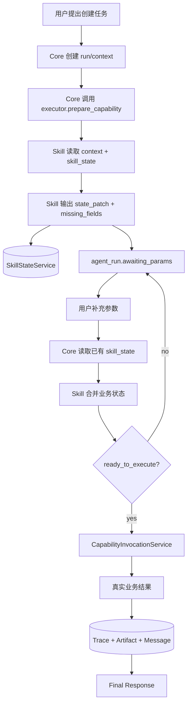

# Agent Runtime 标准服务设计

本文定义 PowerX Core 必须提供给 Agent、Skill、插件与 UI 的标准运行服务。核心原则是：Core 提供会话、上下文、状态、调用、观测和权限等通用服务；Skill/插件负责业务语义、业务参数、业务状态 schema、缺参规则和执行结果解释。Core 不得把某个业务 Skill 的字段、行业话术或参数抽取规则写死在 Runtime 通用代码里。

## 1. 设计边界

PowerX Agent Runtime 的职责不是替每个 Skill 写业务逻辑，而是提供一套受控、可观测、可审计、可复用的标准服务面。

职责划分：

| 模块 | 负责内容 | 不负责内容 |
| --- | --- | --- |
| PowerX Core | session/message、context、skill state、capability invocation、trace、artifact、progress event、tenant/authz、model policy | 模板、订单、视频、工单等业务字段含义 |
| Agent | persona、服务对象、默认回答策略、可绑定 Skill 范围 | 直接绕过 Core 调插件私有接口 |
| Skill | action、required args、slot mapping、业务状态 schema、缺参合并、执行就绪判断、结果展示元数据 | 租户隔离、权限绕过、全局会话存储 |
| Capability Handler | 真实业务执行、领域校验、领域数据落库 | 自己实现 Agent 会话系统 |
| UI/Framework Client | 渲染 run state、展示 trace/report、代理调用 Core API | 猜测 Runtime 状态或直接拼业务调用 |

强约束：

1. Core 可以缓存和持久化 Skill 的业务状态，但业务状态的 schema 与合并规则必须来自 Skill。
2. Core 可以给 Skill 提供上下文快照，但上下文不是业务任务状态的权威源。
3. Core 可以做通用结构化抽取节点，但抽取目标、字段名、必填项、状态转换必须来自 Skill manifest。
4. 没有真实 capability 执行结果时，Core 不得生成 `completed` 任务状态，也不得让最终回复声称业务已经完成。
5. 缺少 `tenant_uuid/session_id/message_id/agent_id/skill_id/trace_id` 等关键上下文时必须 fail-fast。

## 2. 标准服务清单

### 2.1 AgentSessionService

负责 Agent 会话与消息生命周期：

1. 创建、查询、关闭 Agent session。
2. 保存 user/assistant/system message。
3. 维护 `session_id/message_id/run_id/source/channel/user_uuid/tenant_uuid/agent_id`。
4. 为 Runtime、Skill、Trace 提供同一组稳定 ID。

权威存储：PostgreSQL `agent_chat_sessions`、`agent_chat_messages`。

### 2.2 ContextService

负责构建本轮可读上下文包：

1. 最近消息窗口。
2. 会话摘要。
3. 当前 Agent persona/prompt_seed。
4. 当前 Agent 已绑定 Skill 摘要。
5. ResponsePlanner 需要的 message meta。
6. 可选 knowledge/retrieval/artifact 引用。

上下文存储分层：

| 层 | 用途 | 权威性 |
| --- | --- | --- |
| Runtime memory | 本轮临时节点输出、ResponsePlan、执行状态 | 非权威 |
| PostgreSQL | session/message/meta/context summaries/registry/bindings | 权威 |
| Redis | recent window、planner cache、candidate snapshot | 缓存 |
| Local File/Loki/Object Storage | trace artifact、大 payload 引用 | 观测与审计 |

ContextService 输出的是 `context_ref/context_package`，Skill 可以读取，但不得把它当成业务状态唯一来源。

### 2.3 SkillStateService

负责保存 Skill 在某个 Agent session 内的工作状态。它是多轮任务参数收集、确认、恢复和执行状态的权威通用服务。

建议状态对象：

```json
{
  "tenant_uuid": "6b5d0240-9920-46da-b707-88200e0f51ea",
  "session_id": "994cb5f4-832a-4cfa-92ff-0b7194a9e4b7",
  "message_id": "190",
  "agent_id": "18",
  "skill_id": "powerxplugin.template.basic",
  "state_key": "template.create",
  "schema_version": "1.0",
  "status": "collecting",
  "state": {
    "action": "create",
    "collected": {
      "template.title": "测试模板"
    },
    "missing": [
      "template.description",
      "template.content"
    ],
    "last_user_message_id": "190"
  },
  "version": 3,
  "ttl_seconds": 86400
}
```

标准状态枚举：

```text
collecting | ready | awaiting_confirmation | executing | completed | failed | cancelled
```

服务能力：

1. `GetState(scope, session_id, agent_id, skill_id, state_key)`。
2. `UpsertState(..., state, version)`。
3. `PatchState(..., state_patch, expected_version)`。
4. `DeleteState(...)`。
5. `ListStates(session_id, agent_id)`。
6. `LockState(..., ttl)`，用于防止同一任务并发执行。

约束：

1. `state_key`、`schema_version`、`required fields`、`status transition` 必须来自 Skill manifest。
2. Core 只校验 envelope、权限、版本、TTL 和 schema 引用是否存在。
3. SkillStateService 必须按 `tenant_uuid + session_id + agent_id + skill_id + state_key` 隔离。
4. 状态更新必须写入 Agent Trace，便于复盘“为什么缺参/为什么执行”。
5. Redis 只能作为短 TTL 加速，PostgreSQL 才是权威状态源。

推荐落库表：`agent_session_skill_states`。如果后续需要跨 session 长期记忆，应另建 long-term memory，不得复用 session skill state。

### 2.4 CapabilityInvocationService

负责执行业务能力：

```text
Agent Runtime
  -> Skill action -> capability_id
  -> Capability Invocation
  -> Plugin capability adapter
  -> Plugin domain handler
```

请求必须携带：

```json
{
  "tenant_uuid": "tenant_xxx",
  "capability_id": "com.powerx.plugins.base.local.template.create",
  "preferred_protocol": "rest",
  "payload": {},
  "context": {
    "agent_id": "18",
    "session_id": "994cb5f4-832a-4cfa-92ff-0b7194a9e4b7",
    "message_id": "190",
    "skill_id": "powerxplugin.template.basic",
    "state_key": "template.create",
    "trace_id": "trace_xxx",
    "run_id": "run_xxx",
    "channel": "powerxplugin.local_chat"
  }
}
```

禁止路径：

1. 禁止恢复 `/api/v1/plugin/skills/invoke` 作为业务执行入口。
2. 禁止 Core 直连插件私有业务 URL。
3. 禁止 action 无映射时尝试猜测 capability。
4. 禁止 capability 失败后生成假成功 final response。

### 2.5 TraceService

负责记录 Agent 每轮运行的结构化过程：

1. Runtime intent。
2. Intent classifier。
3. Planner。
4. ResponsePlanner。
5. Context Builder。
6. Skill state get/patch。
7. Capability invocation。
8. Final response。
9. History persist。

Trace 必须能按 `tenant_uuid/session_id/message_id/run_id/trace_id/task_id` 精确定位，并支持 root/admin 下载报告。Trace 是调试与审计工具，不是业务状态源。

### 2.6 ArtifactService

负责保存业务执行产物与可见链接：

1. 文件、报告、导出结果。
2. 插件业务对象详情页链接。
3. 大 payload 的脱敏引用。
4. Capability result 中的 `artifact_refs`。

Skill 通过 `result_presentation` 指定哪些结果字段可展示。Core 只按协议渲染，不伪造业务链接。

### 2.7 ProgressEventService

负责把 Runtime 状态转成 UI 可消费的标准事件：

1. `agent_run.started`
2. `agent_run.response_plan`
3. `agent_run.plan_created`
4. `agent_run.task_status`
5. `agent_run.awaiting_params`
6. `agent_run.task_completed`
7. `agent_run.task_failed`
8. `agent_run.final`
9. `agent_run.ended`

完整协议见 [`agent_run_state_protocol.md`](./agent_run_state_protocol.md)。PowerX Web Admin 与 PowerXPlugin 调试页必须消费同一套 run state reducer。

### 2.8 ModelPolicyService

负责节点级模型选择：

1. `intent_classifier` 可用小模型。
2. `planner` 可用中/大模型。
3. `skill_param_extractor` 可用结构化抽取模型。
4. `final_response` 默认使用 Agent 配置模型。
5. `reviewer` 可使用审核模型。

首版可以全部继承 Agent 默认模型，但 Trace 必须记录节点模型选择结果。

### 2.9 PermissionTenantService

负责统一权限与租户隔离：

1. API Key / JWT / STS 身份。
2. tenant/user/agent 上下文。
3. Agent-Skill binding。
4. capability grant。
5. plugin instance availability。
6. source allowlist。

SkillState、CapabilityInvocation、Trace、Artifact 都必须经过同一套 tenant boundary。

### 2.10 MemorySummaryService

负责会话摘要和长期记忆：

1. `agent_chat_context_summaries` 保存压缩摘要。
2. session skill state 保存当前业务任务工作状态。
3. long-term memory 保存跨 session 偏好或可复用事实。

三者不能混用：

| 类型 | 生命周期 | 示例 | 是否业务任务权威 |
| --- | --- | --- | --- |
| Context Summary | 当前 session 长上下文压缩 | 前 80 条对话摘要 | 否 |
| Skill State | 当前 session 的某个 Skill 任务 | 正在创建模板，已收集 title | 是 |
| Long-term Memory | 跨 session 记忆 | 用户偏好中文回复 | 否 |

## 3. Skill 调用 Core 标准服务的协议

Skill 不应该直接访问数据库。Core 应该把标准服务能力注入到 Skill 执行上下文中。

### 3.1 Skill 输入

```json
{
  "tenant_uuid": "tenant_xxx",
  "agent": {
    "agent_id": "18",
    "agent_key": "powerxplugin.template_object.agent",
    "persona": "..."
  },
  "session": {
    "session_id": "994cb5f4-832a-4cfa-92ff-0b7194a9e4b7",
    "message_id": "190",
    "run_id": "run_xxx",
    "trace_id": "trace_xxx"
  },
  "user_message": "确认，继续创建",
  "context_ref": "ctx_xxx",
  "context_package": {
    "recent_messages": [],
    "summary": null
  },
  "skill_state": {
    "state_key": "template.create",
    "status": "collecting",
    "state": {}
  },
  "manifest": {
    "skill_id": "powerxplugin.template.basic",
    "action_required_args": {},
    "slot_mapping": {},
    "executor": {}
  }
}
```

### 3.2 Skill 输出

```json
{
  "skill_id": "powerxplugin.template.basic",
  "state_key": "template.create",
  "action": "create",
  "state_patch": {
    "collected": {
      "template.description": "用于测试"
    },
    "missing": [
      "template.content"
    ],
    "status": "collecting"
  },
  "ready_to_execute": false,
  "missing_fields": [
    {
      "field": "template.content",
      "label": "内容",
      "message": "请补充模板内容，可以直接用自然语言说明。"
    }
  ],
  "assistant_message": {
    "mode": "clarify_params",
    "summary": "还需要补充模板内容。"
  },
  "capability_request": null,
  "artifacts": []
}
```

当 `ready_to_execute=true` 时，Skill 必须返回标准 `capability_request`。这是执行阀门，且只能由 Skill/插件业务逻辑产生；Core 不根据模板字段、订单字段、工单字段等业务参数自行判断是否可执行。

```json
{
  "ready_to_execute": true,
  "capability_request": {
    "capability_id": "com.powerx.plugins.base.local.template.create",
    "preferred_protocol": "rest",
    "payload": {
      "method": "POST",
      "endpoint": "/api/v1/integration/capabilities/invoke",
      "body": {
        "capabilityId": "com.powerx.plugins.base.local.template.create",
        "action": "create",
        "payload": {
          "name": "测试模板",
          "description": "用于测试",
          "content": "模板内容"
        }
      }
    }
  }
}
```

Core 接收后负责：

1. 持久化 `state_patch` / SkillState。
2. 发出 `agent_run.task_status` / `agent_run.awaiting_params`。
3. 按 `capability_request.capability_id + payload` 调用 CapabilityInvocationService。
4. 保存结果和 artifact。
5. 生成 final response。

禁止行为：

1. Core 不允许根据 `action_required_args` 自己拼业务 payload 后直接执行。
2. Core 不允许在缺少 `capability_request` 时回退到 `executor.action_map` 自动执行。
3. Core 不允许把 LLM 的“看起来参数齐了”当作执行依据；LLM 只能辅助生成候选计划，最终是否执行以 Skill prepare 输出为准。

## 4. 多轮缺参与执行流程



关键点：

1. LLM 可以辅助抽取，但抽取目标来自 Skill manifest。
2. Core 不靠最近 N 条消息临时猜业务参数。
3. SkillState 是跨轮任务推进的权威数据。
4. 用户确认语义应由 Skill 结合当前 `skill_state.status` 判断。

## 5. 与 Codex/OpenAI 设计的参考关系

Codex 的可参考点：

1. Skill 使用渐进式披露：先用 name/description 选择，命中后再加载完整说明。
2. MCP 将模型连接到外部工具和上下文，并有 server instructions、权限、超时、工具 allow/deny。
3. Thread/session 用于保持连续对话。
4. Trace item 记录 agent message、tool call、reasoning、命令执行等过程。
5. Memory 是可选长期上下文，不是业务任务状态权威。

PowerX 的落地差异：

1. PowerX 必须有多租户、API Key、STS、Agent-Skill binding、capability grant。
2. PowerX Skill 业务执行统一进入 Capability Registry，不走私有 Skill invoke。
3. PowerX 需要把 SkillState 作为标准服务暴露给插件 Skill，支撑业务任务跨轮推进。
4. PowerX UI 必须用 `agent_run.*` 展示任务过程，而不是只展示最终文本。

## 6. 当前实现差距与落地顺序

已具备基础：

1. Agent session/message。
2. Context summary。
3. ResponsePlanner/Context Builder/Final Response 分层。
4. Agent Run Trace。
5. Agent Run State Protocol。
6. Capability Invocation。
7. Agent-Skill binding。

缺口：

1. 缺正式 `SkillStateService` 与 `agent_session_skill_states` 权威表。
2. Skill 输出 `state_patch/missing_fields/ready_to_execute/capability_request` 的标准协议尚未完全落地。
3. Core 中仍存在临时业务参数合并逻辑，后续必须迁移到 Skill 协议。
4. PowerXPlugin 模板 Skill 需要按该协议维护自身业务状态，不应依赖 Core 识别模板字段。

建议落地顺序：

1. 新增 `agent_session_skill_states` migration/model/repository/service。
2. Runtime 在 Skill 节点执行前读取 SkillState，并把它注入 Skill 上下文。
3. Runtime 接收 Skill 输出并持久化 `state_patch`。
4. `agent_run.task_status/awaiting_params` 从 Skill 输出生成。
5. Capability Invocation 使用 Skill 输出的 `capability_request`。
6. PowerXPlugin 模板 Skill 改造为维护 `template.create` 状态。
7. 删除 Core 中模板字段专用提取逻辑。

## 7. 验收标准

1. 同一 session 内，用户分多轮提供参数，SkillState 能累积业务状态。
2. 用户只说“确认/继续”时，Skill 能基于已有 state 判断是否可执行。
3. 参数不完整时，UI 显示 `awaiting_params`，不会调用 capability。
4. 参数完整后，Core 调用真实 capability，并展示真实结果或错误。
5. 刷新页面后，run state、message meta、skill state、trace 能恢复。
6. 失败报告中能看到 state 读取、patch、capability request、capability response。
7. Core 代码里不存在模板对象字段的硬编码业务规则。
