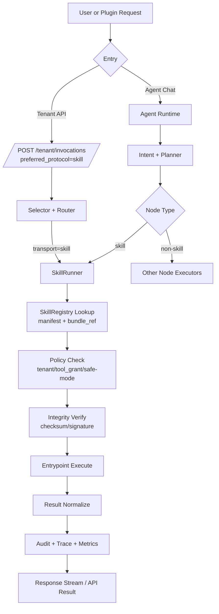

# Skill 标准定义与使用原理（含外部出处）

本文用于回答三个问题：

1. Skill 标准到底是什么  
2. Skill 的使用原理是什么  
3. PowerX 该如何对齐公开标准并做工程落地  

## 1. 什么是 Skill（标准定义）

从公开标准看，Skill 是“目录化的能力包”：

1. 最小单元是一个目录。
2. 目录至少包含 `SKILL.md`。
3. 可选包含 `scripts/`、`references/`、`assets/` 等辅助资源。

按 Agent Skills 规范，`SKILL.md` 需要：

- YAML frontmatter
- Markdown 正文说明
- 必填字段至少包括 `name` 与 `description`

这意味着 Skill 不是“单个 prompt”，而是“可复用、可版本化、可携带资源的任务能力包”。

## 2. Skill 的使用原理

### 2.1 发现与装载

Skill 的执行通常遵循“元数据先发现、正文后加载”的模式：

1. 先读取 `name/description` 等元数据做匹配。
2. 只有命中时才加载完整 `SKILL.md` 与其附属资源。

这就是公开文档中提到的 `progressive disclosure`（渐进式披露），目的就是降低上下文负担、提高匹配效率。

### 2.2 调用方式

公开产品文档显示一般有两种调用方式：

1. 显式调用：用户通过命令或明确指定 skill。
2. 隐式调用：模型根据任务语义与 `description` 自动命中。

因此，`description` 的质量是 Skill 命中率的核心因素之一。

### 2.3 执行边界

Skill 本质是“指令 + 资源 +（可选）脚本”：

1. 指令定义流程与约束。
2. 资源提供上下文与模板。
3. 脚本执行具体动作（在宿主工具权限范围内）。

## 3. 为什么这是“公开标准”

Agent Skills 网站给出的定位是“开放格式（open format）”，并提供：

1. 规范文档（Specification）
2. 参考实现与文档仓库（GitHub）
3. 客户端实现指南（如何在 agent 中支持 skills）

OpenAI Codex 文档与 `openai/skills` 仓库也明确指向同一个 open standard，这说明跨产品互通是现实目标，而不是私有格式。

## 4. 对 PowerX 的工程含义

结合当前 PowerX 架构（Agent + Capability Registry + Selector）：

1. Skill 应作为独立能力对象管理（注册、版本、发布、回滚）。
2. Skill 执行应支持双路径：
   - Agent 内部 SkillRunner
   - Capability 统一入口（`preferred_protocol=skill`）
3. Skill 元信息应至少覆盖公开标准必填字段，并扩展治理字段：
   - `source/checksum/signature/tenant_scope/tool_grants`

### 4.1 PowerX 与插件的双层 Skill 定义

PowerX 采用“双层 Skill”模型：

1. 插件侧 Skill：源定义态能力包，包含 `SKILL.md`、metadata、prompt 规范、schema、executor 声明、脚本和资源。
2. PowerX 侧 Skill：治理态平台能力，包含版本、状态、来源、审批、租户可见性、Agent 绑定、capability 绑定、审计与 trace。

插件可以定义自己的 Skill 目录，但只有被 PowerX 导入、校验、审批发布后的 Skill 才能进入 Agent 候选池。PowerX 不接受插件在运行时绕过 Registry 动态声明并立即执行未治理 Skill。

推荐插件侧目录：

```text
skills/<skill_id>/SKILL.md
skills/<skill_id>/schema.json
skills/<skill_id>/prompts/system.md
skills/<skill_id>/executor.yaml
skills/<skill_id>/scripts/
skills/<skill_id>/references/
skills/<skill_id>/assets/
```

`SKILL.md` 仍保持开放格式兼容；PowerX 扩展字段放在 manifest snapshot 或 `executor.yaml` 中，避免破坏标准正文语义。

### 4.2 PowerX Skill Package 标准源格式

PowerX 统一采用 `SKILL.md` 目录包作为 Skill 源格式。Go struct、HTTP DTO、数据库记录都只能是 `SKILL.md` 解析后的中间态或治理态，不得作为长期唯一源定义。

最小目录：

```text
skills/<skill_id>/
  SKILL.md
```

推荐目录：

```text
skills/<skill_id>/
  SKILL.md
  schema.input.json
  schema.output.json
  executor.yaml
  scripts/
  references/
  assets/
```

`SKILL.md` 必须包含 YAML frontmatter 与 Markdown 正文：

```md
---
id: powerxplugin.template_crud.basic
name: template-crud
title: 模板对象管理
provider: com.powerx.plugins.base
version: 1.0.0
description: 创建、查询、更新和删除插件模板对象
capability: powerxplugin.template.crud
visibility: tenant
status: active
executor:
  type: capability
  method: POSTinput_schema: ./schema.input.json
output_schema: ./schema.output.json
---

# 模板对象管理

## When To Use
当用户希望创建、查询、更新、删除模板对象时使用。

## Instructions
将自然语言意图转换为结构化 action，并调用插件 capability handler。
```

规则：

1. `id/name/description/version/provider/executor` 必填。
2. `description` 用于候选召回，必须可描述“何时使用此 Skill”。
3. Markdown 正文用于 prompt/instructions，不得只保存空壳 metadata。
4. schema 可内联在 frontmatter，也可引用相对路径；引用路径必须限制在 Skill 包目录内。
5. `scripts/references/assets` 可选，但必须纳入 checksum。
6. 导入数据库时必须保存 `raw_markdown/frontmatter_json/package_checksum/package_uri`，确保可审计、可导出、可漂移检测。
7. PowerX Agent Runtime 运行时读取数据库治理态记录，不直接依赖插件文件系统。

### 4.3 Agent Run State 展示元数据

Skill 包除了描述“什么时候用”和“怎么执行”，还必须能为 Agent Run State Protocol 和 SkillStateService 提供可展示、可持久化的任务语义。Core 不硬编码业务字段，缺参、补参、状态合并、执行就绪判断和结果链接来自 Skill manifest 与 Agent persona/prompt_seed。

推荐字段：

```yaml
action_required_args:
  create:
    - object.title
    - object.description
    - object.content

action_optional_args:
  list:
    - q
    - page
    - page_size

slot_mapping:
  object.title:
    labels: ["标题", "名称"]

pending_task_policy:
  enabled: true
  merge_window_messages: 6
  merge_window_seconds: 900

result_presentation:
  create:
    title: "对象已创建"
    primary_link: "object.detail_path"

executor:
  type: capability
  capability: object.management
  prepare_capability: com.example.object.prepare
  action_map:
    create: com.example.object.create
```

这些字段进入 PowerX 治理态后，由 Agent Runtime 用于：

1. 选择候选 Skill、构建 prepare 输入、限制可见能力范围。
2. 调用 `executor.prepare_capability`，由 Skill 自己合并业务状态、判断缺参、返回 `ready_to_execute`。
3. 根据 Skill 输出生成 `agent_run.awaiting_params` 与 `agent_run.task_status`。
4. 在 PowerX Web Admin 与 PowerXPlugin 调试页渲染统一任务卡片。
5. 约束 Final Response：没有真实 `task_completed/result` 时不得声称业务已完成。

Core 不把 `action_required_args` 当作业务执行引擎。它最多用于候选解释、提示构建和保护性校验；真正的执行请求必须来自 Skill prepare 输出的 `capability_request`。

完整协议见 [`agent_run_state_protocol.md`](./agent_run_state_protocol.md) 与 [`agent_runtime_standard_services.md`](./agent_runtime_standard_services.md)。

### 4.4 SkillState 协议字段

面向多轮任务的 Skill 必须声明可被 Core 持久化的状态协议。推荐字段：

```yaml
state_contract:
  schema_version: "1.0"
  state_keys:
    template.create:
      action: create
      status_enum:
        - collecting
        - ready
        - awaiting_confirmation
        - executing
        - completed
        - failed
      required_args:
        - template.title
        - template.description
        - template.content
      merge_policy:
        mode: skill_defined
        allow_cross_turn: true
        window_messages: 6
        window_seconds: 900
```

约束：

1. `state_key` 是业务任务状态的稳定键，不能由 Core 猜测。
2. `required_args` 是执行前参数完整性的权威。
3. `merge_policy.mode=skill_defined` 表示业务状态合并由 Skill 定义，Core 只保存 `state_patch`。
4. Core 可以用 LLM 做结构化抽取，但抽取 schema 必须来自 `state_contract/action_required_args/slot_mapping`。
5. Skill 未声明 `state_contract` 时，不允许跨轮补参；需要执行则必须在单轮 payload 中提供完整参数，否则 fail-fast 或进入普通追问。

## 5. Agent 如何调度 Skill（PowerX 调度原理）

这一节回答“Agent 在运行时到底怎么用 Skill”。

### 5.1 调度入口

PowerX 中 Skill 有两个入口：

1. `Agent 内入口`：Planner 命中 `skill` 节点后由 SkillRunner 执行。
2. `统一网关入口`：Tenant 调用 `/tenant/invocations`，并设置 `preferred_protocol=skill`。

### 5.2 Agent 内调度流程（推荐主路径）

1. 用户消息进入 Agent Runtime。
2. Intent/Planner 识别任务，生成执行计划。
3. 计划中某节点类型为 `skill`（携带 `skill_id/version/params`）。
4. SkillRunner 读取 SkillRegistry 获取 Manifest 与 BundleRef。
5. 执行前做安全校验（租户、ToolGrant、safe-mode、checksum/signature）。
6. 进入 entrypoint 执行（可读取 `references/assets/scripts`）。
7. 输出统一结果模型（status/output/artifacts/latency）。
8. 结果回流到 Agent Stream（token/log/state/final）并落审计。

### 5.3 调度流程图（Agent + Gateway 双入口）



### 5.4 关键实现要点

1. 调度与执行分离：Planner 负责“选 skill”，Runner 负责“跑 skill”。
2. 结果模型统一：Agent 路径与 Gateway 路径都返回统一结构，避免前端/插件分支处理。
3. 安全前置：校验在执行前完成，不允许“先执行后拒绝”。
4. 可观测闭环：每次调用必须有 `trace_id + skill_id + version`。

## 6. 开源 Skill 包如何安装到 PowerX

这一节回答“网上开源 Skill 包如何接入 PowerX”。

### 6.1 来源类型

1. GitHub 仓库（例如 `openai/skills`、`anthropics/skills`）
2. 组织内部镜像仓库
3. 插件发布系统产出的 Skill Bundle

### 6.2 标准安装流程

1. `发现`：选择目标 Skill（确定 `skill_id + version + source_url`）。
2. `拉取`：下载/镜像到 PowerX 托管存储（本地或 S3/MinIO）。
3. `解析`：读取 `SKILL.md`，映射为 `SkillManifest`。
4. `校验`：
   - 必填字段（`name/description/version/entrypoints`）
   - 完整性（`checksum`）
   - 可选可信性（`signature`）
5. `注册`：写入 SkillRegistry（状态 `draft`）。
6. `发布`：管理员审批后切换到 `published`。
7. `绑定`：可选绑定 capability（用于 `/tenant/invocations` 统一调用）。
8. `调用`：租户或 Agent 使用 skill。
9. `回滚`：版本异常时切换到上一个稳定版本。

### 6.3 安装流程图（开源仓库 -> PowerX）


### 6.4 PowerX 不建议的安装方式

1. 直接在生产环境执行任意外链脚本。
2. 无校验落库（不记录 checksum/source）。
3. 不经发布流程直接对租户可见。

### 6.5 最小安装元数据（建议）

至少记录：

- `skill_id`
- `version`
- `source_url`
- `source_commit_or_tag`
- `bundle_uri`
- `checksum`
- `imported_at`
- `imported_by`

## 7. 安装后如何使用 Skill（统一编排，不兼容 Flow-only）

这一节明确回答：安装第三方或自定义 Skill 后，怎么用。
PowerX 统一策略是：LLM 意图识别后，在 `workflow|skill|tooling|llm` 候选池中做计划编排；不再使用“先判定 flow，再决定是否能跑 skill”的旧路径。

### 7.1 模式 A：Agent 主入口自动编排（推荐）

适用场景：

1. 对话式任务，需要系统自动判断是否调用 workflow/skill/tooling。
2. 调用方不希望手工指定 `skill_id` 或 `flow_id`。

方式：

1. 调用 `POST /api/v1/agents/invoke` 或 `GET /api/v1/agents/stream/sse`
2. 只传自然语言请求与 `agent_id(+session_id)`

结果：

1. 命中意图时，系统自动执行 `workflow|skill|tooling|llm` 节点并返回统一结果。
2. 无意图命中时，系统直接返回普通上下文回答。

### 7.2 模式 B：统一能力网关执行（执行层）

适用场景：

1. 想快速验证某个 Skill 映射的 capability 是否可用。
2. 业务方明确知道要执行的 `capability_id`。
3. 希望复用 ToolGrant、租户授权、审计、路由和 trace。

方式：

1. 调用 `POST /api/v1/tenant/invocations`
2. 传入 `capability_id + payload`
3. 由 Capability Registry 解析绑定的 Skill/插件来源与 adapter

结果：

1. 返回统一执行结果（含 `trace_id/status/result`）。
2. 可直接做冒烟测试和联调。

### 7.3 非标准路径：直接 Skill invoke

`/api/v1/tenant/skills/invoke` 不再作为 PowerX Agent Skill Bridge 的标准业务执行路径。原因：

1. Skill 不能脱离 Agent binding、tenant grant 和 capability registry 独立执行业务。
2. 插件业务执行必须通过 `Skill action -> capability_id -> Capability Invocation`。
3. 新插件和新测试不得依赖直接 Skill invoke。

结果：

1. 走 Selector/Router 的统一治理链路。
2. 复用 ToolGrant、审计、策略能力。

### 7.4 推荐使用顺序

1. 先用模式 A 验证 Agent 主入口自动编排是否符合预期。
2. 再用模式 B/C 分别验证执行层接口与统一网关治理能力。

## 8. PowerX 推荐最小对齐清单（MVP）

1. 目录结构对齐：`<skill>/SKILL.md` + 可选资源目录。
2. 字段对齐：至少支持 `name`、`description` 必填校验。
3. 执行语义对齐：支持显式/隐式两种触发语义。
4. 上下文策略对齐：采用渐进式加载。
5. 治理增强：在不破坏标准前提下加上审计、安全、租户隔离。

## 9. 与本目录其他文档关系

- 插件桥接机制：`agent_skill_bridge.md`
- 规范映射细节：`standard_mapping.md`
- 运行时实现：`runtime_architecture.md`
- API 合同：`api_contracts.md`
- 安全治理：`security_and_governance.md`

## 10. 外部出处（官方/主源）

1. Agent Skills Overview（官方站点）  
https://agentskills.io/home

2. Agent Skills Specification（官方规范）  
https://agentskills.io/specification

3. Agent Skills GitHub（规范与文档仓库）  
https://github.com/agentskills/agentskills

4. OpenAI Codex Skills 文档（官方）  
https://developers.openai.com/codex/skills

5. OpenAI Skills 仓库（官方）  
https://github.com/openai/skills

6. Claude Code Skills 文档（官方）  
https://docs.claude.com/en/docs/claude-code/skills

7. Anthropic Skills 仓库（官方）  
https://github.com/anthropics/skills

> 访问与核对日期：2026-03-06
