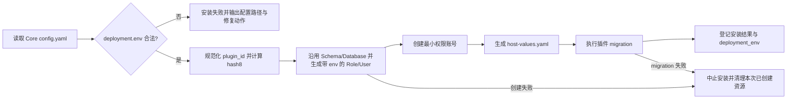

# 插件数据库部署环境隔离计划

> 权威契约：`deployment.env` 用于区分集群级 Role/User，不改变数据库名或插件 Schema 名称。

## 1. 背景与目标

当 dev、test、staging、prod 等 PowerX Core 实例使用同一 PostgreSQL 集群中的不同数据库时，PostgreSQL Role 是集群级对象；仅按插件 ID 生成 Role 会导致不同实例生成同名角色，产生密码轮换和授权互相覆盖风险。Schema 属于具体数据库，沿用现有插件 Schema 名称，不参与部署环境命名。`deployment.env` 不替代不同环境使用独立数据库的数据隔离要求。

本计划引入全局部署身份 `deployment.env`。它属于整套 PowerX 实例，不属于插件包，也不属于单次插件安装请求。插件安装、host-values、日志、metrics、trace 和部署诊断统一消费该值。

## 2. 权威配置契约

`config.yaml` 必须显式配置：

```yaml
deployment:
  env: prod
```

允许值固定为：

| 页面显示 | 配置值 |
| --- | --- |
| 开发环境 | `dev` |
| 测试环境 | `test` |
| 预发布环境 | `staging` |
| 生产环境 | `prod` |

约束：

- `deployment.env` 必填，且必须是上述枚举之一；底层格式同时满足 `[a-z0-9_]{1,16}`。
- 不得从 `version`、`plugin.dev_mode`、`server.mode`、`POWERX_ENV`、安装目录、域名或插件包元数据推导。
- setup 页面可以在本地安装场景预选 `dev`，但用户必须确认；后端不得在字段缺失时静默补值。
- 生产安装必须由用户明确选择 `prod`。
- 首期唯一配置来源为当前 Core 实际加载的 `config.yaml`；不得使用环境变量覆盖，也不得复用端口默认策略中的 `POWERX_ENV`。

## 3. 与插件安装元数据的边界

插件安装请求中的 `metadata.environment` 是旧的歧义字段，目标合同不再接受。发布渠道统一使用 `metadata.release_channel`。收到旧字段时必须返回明确的字段弃用错误，不能参与数据库对象命名、覆盖 `deployment.env` 或被静默翻译。

## 4. 数据库对象命名规范

插件 ID 先规范化为小写 slug；除 `[a-z0-9]` 外的分隔字符统一转为 `_`。Schema/Database 沿用现有命名；只有 Role/User 增加环境段。为避免 Role/User 截断碰撞，`hash8` 取规范化前稳定插件 ID 的 SHA-256 十六进制摘要前 8 位。

```text
PostgreSQL Schema / MySQL Database:
px_<plugin_slug>

PostgreSQL Role / MySQL User:
pxu_<deployment_env>_<plugin_slug>_<hash8>
```

示例：

```text
px_com_powerx_plugin_ai_craft
pxu_dev_com_powerx_plugin_ai_craft_a1b2c3d4

px_com_powerx_plugin_ai_craft
pxu_prod_com_powerx_plugin_ai_craft_a1b2c3d4
```

名称必须在数据库限制内保持稳定：Schema 保持现有裁剪规则；Role/User 裁剪时不得裁掉 `env` 或 `hash8`。

## 5. 安装与运行流程



安装顺序必须满足：

1. 在任何数据库 DDL 或插件目录写入前校验 `deployment.env`。
2. 使用当前 Core 的 `Config.Deployment.Env` 生成 Role/User 名称，不读取插件包字段；Schema/Database 名称不使用该字段。
3. Role/User 只授予对应 Schema/Database 所需权限。
4. `host-values.yaml` 记录 `deployment.env`，并注入明确的 `POWERX_DEPLOYMENT_ENV`；插件不得自行推导。
5. 数据库绑定是独立可审计对象，拥有 `binding_uuid`，通过 `plugin_uuid` 关联插件，同时记录用于命名的稳定 `plugin_key`、实际 `deployment_env`、schema/database 和 role/user；敏感密码不得进入日志或审计。
6. replace、enable 自修复、migration、uninstall/purge 必须读取安装记录中的对象名，并校验其环境与当前 Core 一致。

## 6. setup 与配置写入

首次安装向导必须新增“部署环境”必填选择项，并通过 locale key 提供页面文案。请求 DTO、草稿存储、配置校验和最终 YAML 写入均使用结构化字段：

```json
{
  "deployment": {
    "env": "prod"
  }
}
```

完成安装后，现有 setup 重入保护继续生效。不得通过普通 setup 写接口修改已安装实例的部署身份。

## 7. 变更与迁移边界

`deployment.env` 在首次插件安装后视为不可变部署身份。修改它不会自动重命名或复制现有数据库对象。

发现以下任一情况时必须阻断插件安装、恢复或清理：

- `deployment.env` 缺失或非法；
- 已安装记录缺少 `deployment_env`；
- 安装记录环境与当前 Core 配置不一致；
- 目标 Schema/Database 或 Role/User 名称不符合当前规范；
- 同名对象已存在但所有权或授权不符合预期。

同一部署环境下，重新安装同一插件且发现 Schema 内对象 owner 仍属于历史插件 Role 时，Core 使用数据库管理连接自动将 Schema、表、序列、视图和函数转给当前环境的目标 Role，并撤销历史插件 Role 对该 Schema 的显式权限；旧 Role 保留以便审计和回滚。数据库管理连接无权执行 owner-transfer 时，安装必须失败。

### 所有权收敛的范围与保护

这一步不复制、删除或修改业务行数据；它只修改 PostgreSQL 对象的 owner 与旧插件 Role 的显式 ACL。不过 owner 决定 DDL 权限，属于高影响的授权变更，因此安装器必须同时满足以下条件：

1. 目标 Schema 只能由插件 ID 计算得到的 `px_<plugin_slug>`，所有标识符均由数据库标识符引用，不能由请求字段拼接。
2. 只枚举该 Schema 的 Schema 本身、表、序列、视图、物化视图和函数；不使用跨库/跨 Schema 的 `REASSIGN OWNED`。
3. 旧 owner 只能是当前 Core 数据库管理账号，或该插件环境改造前的精确历史 Role `pxu_<plugin_slug>`；发现任何其他 owner 时 fail-fast，要求人工核验，不能自动接管。
4. 所有 `ALTER ... OWNER` 和旧 Role ACL 撤销在同一数据库事务中执行；任一步失败即回滚本次所有权变更，随后阻断插件迁移。
5. serial/identity 的从属 Sequence 不单独转移；先转移所属表，PostgreSQL 会连带更新它们的 owner。独立 Sequence 才单独处理。
6. 旧 Role 不自动删除，保留给审计与回滚窗口；只有明确审批的独立 repair/cleanup 才能删除。

运维前仍应保留数据库备份。若 Core 管理账号不是旧对象 owner、超级用户或没有相应角色成员关系，PostgreSQL 会拒绝 `ALTER ... OWNER`；这是预期的安全阻断，不得回退到旧插件 Role 运行迁移。

实例变更 `deployment.env`、跨数据库搬迁或清理旧 Role 仍必须使用独立、显式、可审计的 repair/migration 工具，并遵循：

1. 默认 dry-run，列出旧对象、新对象、所有权、授权和受影响插件。
2. 人工确认后执行，不由启动或普通安装流程自动执行环境变更。
3. 先备份并验证恢复路径，再迁移数据与授权。
4. 完成后验证新账号只能访问目标 Schema/Database，再更新 Registry。
5. 保留回滚窗口；清理旧对象必须单独审批。

## 8. 验收标准

- dev 与 prod Core 使用同一 PostgreSQL 集群中的不同数据库安装同一插件时，Schema 名称保持不变，生成不同的 Role/User。
- 缺少或传入非法 `deployment.env` 时，Core 配置校验或插件安装明确失败，且不会产生部分数据库对象。
- 安装请求携带旧 `metadata.environment` 时返回字段弃用错误；使用 `metadata.release_channel` 时数据库对象仍只由 `deployment.env` 决定。
- 插件账号无法读取宿主公共表或其他环境、其他插件的 Schema/Database。
- `host-values.yaml`、安装审计和结构化日志可关联到相同 `deployment_env`，但不暴露密码。
- 修改已安装实例的环境配置后，插件恢复/安装明确阻断并给出 migration/repair 指引。

## 9. 实现映射

| 责任 | 目标位置 |
| --- | --- |
| 全局配置结构与严格校验 | `backend/config/config.go`、新增 deployment 配置文件 |
| 配置示例 | `backend/etc/config_example.yaml`、`backend/etc/config_example.prod.yaml` |
| setup DTO、校验与 YAML 写入 | `backend/internal/transport/http/admin/system/setup_handler.go` |
| setup 页面与 i18n | `web-admin/app/pages/setup/index.vue`、`web-admin/i18n/locales/*.json` |
| DB 对象命名与创建 | `backend/internal/infra/plugin/manager/host_config.go` |
| migration 环境一致性 | `backend/internal/infra/plugin/manager/migrations.go` |
| Registry/审计 | plugin manager 安装、replace、restore、uninstall 路径 |
| 合同与集成测试 | `backend/tests/contract/system`、plugin manager 测试、`web-admin/tests/e2e/setup` |

## 10. 实施顺序

1. 配置结构、枚举校验、示例配置和启动诊断。
2. setup DTO、页面选择、i18n、草稿与最终 YAML 写入。
3. 数据库命名函数、Role/User 权限和 host-values 输出。
4. Registry/审计记录与 replace/restore/uninstall 一致性校验。
5. 旧 Schema 对象 owner 收敛、历史 Role 权限撤销与独立 dry-run repair 工具。
6. 合同、单元、集成和跨环境隔离测试。
