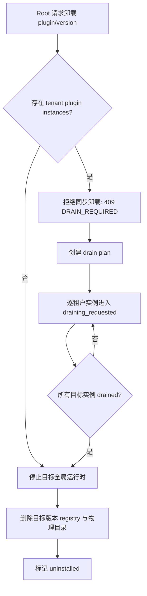

# SaaS 账号关系与插件租户隔离开发计划

> 状态：规划方案，目标是把 PowerX 从“平台后台 + 部分租户上下文”推进到真正可支撑 SaaS 的账号、租户、插件实例模型。

## 1. 目标

1. 明确 `User`、`Member`、`Tenant`、`Root`、`Owner/Admin/Member` 的边界。
2. 支持 SaaS 用户自助注册新租户，并成为该租户 owner/admin。
3. 支持同一个 user 在多个租户之间切换使用。
4. 将插件模型拆成“全局插件包”和“租户插件实例”，避免一个租户操作影响其他租户。
5. 明确 Root 默认只进入平台控制台，不默认进入租户业务控制台。
6. 让 AI Settings、插件启用、知识库、业务插件页面等租户功能只对当前租户 owner/admin/member 按权限开放。

## 2. 当前状态

### 2.1 已具备的基础

1. `User` 是全局账号，包含 `email`、`phone`、`is_root` 等字段。
2. `Member` 已按 `tenant_uuid + user_id` 表示用户在某个租户内的身份。
3. 登录 token 已包含 `tenant_uuid`、`user_id/user_uuid`、`member_id/member_uuid`、`is_root`。
4. `me/context` 已返回当前租户和用户加入过的租户成员列表。
5. 前端已有 `switchTenant` 流程，后端已有 `/api/v1/admin/user/auth/me/switch-tenant`。
6. 插件物理安装目录当前为全局维度：`plugins/installed/<plugin_id>/<version>`。
7. 已有 `plugin_instance_configs` 表，字段包含 `tenant_uuid + plugin_id + key + enabled`，可作为租户插件实例配置基础。

### 2.2 当前问题

1. 公开注册 `/user/auth/register` 当前语义是“在已有租户上下文下注册成员”，不是“创建新租户”。
2. Root 当前在前端经常被当成 `isCurrentTenantAdmin`，容易看到租户配置页面。
3. 菜单权限里 `admin:tenant` 暂时被限制为 root 可见，和 SaaS 目标相反。
4. 插件菜单聚合当前主要看全局插件 `StateEnabled`，未严格按当前租户启用状态过滤。
5. `/_p/<plugin_id>/admin` 和 `/_p/<plugin_id>/api` 路由入口未强制校验当前租户是否启用该插件。
6. 插件“安装”和“租户启用”语义还混在一起，不适合 SaaS 插件市场。

## 3. 账号与身份模型

### 3.1 User

`User` 表示全局自然人账号，不属于任何单一租户。

职责：

1. 承载全局登录凭证，例如 email、phone、password credential。
2. 承载全局账号状态，例如 active/disabled。
3. 承载平台级 Root 标识：`is_root`。
4. 记录最近使用租户：`last_tenant_uuid`。

约束：

1. `User` 不直接代表租户权限。
2. `User` 可以在多个租户中拥有多个 `Member`。
3. `User.is_root=true` 只表示平台 Root，不等于任何租户 admin。
4. `last_tenant_uuid` 只是登录默认租户偏好，不得绕过 active member 校验。
5. 手机号注册用户不得写入伪造默认邮箱；界面展示按真实 email、phone、`-` 的顺序选择。

### 3.2 Tenant

`Tenant` 表示 SaaS 客户空间。

职责：

1. 承载租户 key、name、plan、domain、status。
2. 作为数据隔离、插件实例、AI Settings、Knowledge Space、Scheduler、Event Fabric 的租户边界。

建议类型：

1. `system`：系统租户，仅用于平台初始化和内部资源。
2. `enterprise`：企业客户租户。
3. `personal`：个人或轻量租户。

### 3.3 Member

`Member` 表示某个 `User` 在某个 `Tenant` 内的身份。

职责：

1. 承载租户内用户名、显示名、头像、状态。
2. 作为租户 RBAC 绑定主体。
3. 作为租户内审计 actor。

约束：

1. 业务 API 必须依赖当前 `tenant_uuid + member_id/member_uuid`。
2. 普通用户只能切换到自己有 `Member` 的租户。
3. Root 若没有目标租户 `Member`，不能被当成该租户普通业务成员。

### 3.4 Root

Root 是平台级身份，来源于 `User.is_root=true`。

Root 可以并且应该保留 `system` 特殊租户下的 member/admin 记录。这个 member 是平台身份锚点，用于登录 token 中的 `tenant_uuid + member_id/member_uuid`、审计、STS、API Key Profile、setup 初始化和历史安装兼容；它不是普通业务租户成员，也不表示 root 是所有业务租户的 owner/admin。

Root 默认进入 Platform Console。

Root 负责：

1. 平台初始化。
2. 租户创建、禁用、套餐、域名和用量治理。
3. 全局插件包上传、审核、安装、版本治理。
4. 系统级 Gateway、STS、审计、监控、备份、部署。
5. 平台级默认 AI Provider 模板和套餐策略。

Root 默认不负责：

1. 某个租户的 AI Settings。
2. 某个租户的知识库和业务数据。
3. 某个租户的插件业务页面。
4. 某个租户的普通 Agent Workspace。

### 3.5 Tenant Owner / Admin / Member

租户身份来自 `Member + RoleBinding`。

建议角色：

1. `role_owner`：租户所有者，负责账单、套餐、插件启用、租户删除申请等。
2. `role_admin`：租户管理员，负责用户、角色、AI Settings、插件实例、API Key 等。
3. `role_user`：普通成员，按权限使用业务功能。

SaaS 自助注册创建的第一个成员必须绑定：

1. `role_owner`
2. `role_admin`
3. `role_user`

## 4. 控制台边界

### 4.1 Platform Console

Root 默认看到 Platform Console。

页面范围：

1. 租户管理。
2. 全局用户检索与封禁。
3. 全局插件包管理。
4. 插件市场治理和套餐可用范围。
5. Capability Registry 和 Gateway 全局治理。
6. Event Fabric / Scheduler / WS / Runtime 全局观测。
7. 部署、备份、日志、审计、告警。
8. 平台级 AI 模板和成本策略。

不默认展示：

1. `/settings/ai` 租户 AI Settings。
2. 租户知识库。
3. 租户插件业务页面。
4. 租户 API Key 详情。

### 4.2 Tenant Console

Tenant Owner/Admin/Member 进入 Tenant Console。

Owner/Admin 页面范围：

1. AI Settings。
2. 插件市场里的租户启用/停用。
3. 本租户用户、部门、角色。
4. 本租户 Integration Gateway API Key。
5. 本租户 Event Fabric topic/subscription。
6. 本租户 Runtime Scheduler jobs。
7. 本租户 Knowledge Space。
8. 本租户 Agent 设置和 Agent Workspace。
9. 本租户插件业务页面。

普通 Member 页面范围：

1. 已授权业务页面。
2. 已授权 Agent Workspace。
3. 自己相关通知、任务、资料。

### 4.3 Root 进入租户支持模式

Root 如需查看某租户，应进入显式 Support Session。

要求：

1. Root 必须选择目标租户。
2. 必须记录 reason。
3. 必须创建审计记录：`root_user_id + target_tenant_uuid + reason + started_at`。
4. 前端必须显示明显状态，例如“平台支持模式：正在查看 Acme Inc”。
5. 默认只读。
6. 写操作需要二次确认，并记录更强审计。

Root 支持模式不应绕过：

1. 租户插件是否启用。
2. 套餐限制。
3. 数据隔离。
4. 业务权限审计。

## 5. SaaS 自助注册

新增公开接口：

```text
POST /api/v1/public/saas/signup
```

请求字段：

```json
{
  "tenant_key": "acme",
  "tenant_name": "Acme Inc",
  "plan": "free",
  "owner_email": "owner@example.com",
  "owner_phone": "",
  "owner_password": "******",
  "owner_display_name": "Owner"
}
```

行为：

1. `tenant_key` 可由用户填写；未填写时按 `tenant_name` 自动生成唯一 key，例如 `acme-inc`、`acme-inc-2`。
2. 显式填写的 `tenant_key` 必须全局唯一；冲突时失败并回滚。
3. 租户名称可以重复；唯一性由 `tenant_key/domain` 保证。
4. 校验 email/phone 至少一个可作为登录 identifier。
5. 如果 user 不存在，创建全局 `User` 和 credential。
6. 如果 user 已存在，必须校验密码正确，才允许创建新租户成员。
7. 创建 `Tenant`，domain 按 `tenant_key` 派生。
8. 创建该 user 在新租户下的 `Member`。
9. 确保租户默认角色存在。
10. 绑定 `role_owner`、`role_admin`、`role_user`。
11. 初始化租户默认 API Key Profile。
12. 初始化 tenant keypair。
13. 初始化必要 tenant settings。
14. 更新 `User.last_tenant_uuid` 为新租户。
15. 签发 access token 和 refresh token，当前上下文指向新租户和新 member。

验证码策略：

1. 由 `feature_gate.enable_saas_signup_verification_code` 控制，默认关闭。
2. 关闭时前端不展示验证码字段，后端不要求 `verification_code`。
3. 开启时必须先调用 `/api/v1/public/saas/signup/verification-code`。
4. 当前本地开发驱动只把验证码写入日志；生产必须接入 SMTP/短信驱动后再开启。

失败策略：

1. 关键步骤必须事务化。
2. 不能出现 tenant 创建成功但 owner member 未创建的半成品状态。
3. 如果默认配置初始化失败，应回滚或明确标记 tenant provisioning failed，不允许静默成功。

## 6. 租户切换

保留接口：

```text
POST /api/v1/admin/user/auth/me/switch-tenant
```

建议调整为重新签发 token：

1. 输入 `tenant_uuid`。
2. 校验当前 user 是否拥有目标租户 active member。
3. 重新签发 access token，claims 指向目标 `tenant_uuid + member_id/member_uuid`。
4. 可选重新签发 refresh token，或要求 refresh token 仍绑定当前 member。
5. 返回新的 token 和 `me/context`。

原因：

1. 前端、HTTP API、WS、插件代理、后台任务都能拿到一致的 tenant/member claims。
2. 避免只更新前端 context 而 token 仍指向旧租户。
3. 插件 STS 和 Gateway 调用可直接依赖 token claims。

### 6.1 登录默认租户选择

登录入口只要求全局 user 凭证：

1. 邮箱或手机号。
2. 密码。

登录时不要求用户先选择组织。服务端按以下顺序确定当前租户：

1. 如果请求显式传入 `tenant_uuid`，且当前 user 拥有该租户 active member，则使用该租户。
2. 如果显式 `tenant_uuid` 无效或无权限，不得越权使用，继续回退到默认选择。
3. 如果 `User.last_tenant_uuid` 指向当前 user 的 active member，则使用最近租户。
4. 否则选择该 user 的第一个 active member。
5. 如果没有任何 active member，登录失败。

登录成功后必须：

1. 签发包含最终 `tenant_uuid + member_id/member_uuid` 的 token。
2. 更新 `User.last_tenant_uuid`。
3. 返回与 token claims 一致的 `me/context`。

Root 规则：

1. Root 默认不能切成无 member 的业务上下文。
2. Root 要跨租户查看必须走 Support Session。
3. Support Session token 应与普通 user token 区分，例如 `scope=support_session` 或 `actor_type=root_support`。

## 7. 插件 SaaS 隔离模型

### 7.1 Plugin Package

全局插件包。

字段来源：

1. JSON registry。
2. `plugins/installed/<plugin_id>/<version>`。

职责：

1. 管理物理包。
2. 管理全局可运行版本。
3. 管理插件 manifest、静态资源、后端进程和健康检查。

约束：

1. 全局安装不等于所有租户启用。
2. Force reinstall 不得删除租户实例配置。
3. 一个租户启用/停用不得影响其他租户。

### 7.2 Plugin Tenant Instance

租户插件实例。

首期可复用 `plugin_instance_configs`，但建议后续新增独立表：

```text
plugin_tenant_instances:
  tenant_uuid
  plugin_id
  version
  enabled
  config_json
  client_id
  secret_ref
  created_by_member_uuid
  updated_by_member_uuid
  created_at
  updated_at
```

职责：

1. 决定某租户是否启用某插件。
2. 决定某租户使用哪个插件版本。
3. 保存租户级插件配置和凭证引用。
4. 记录租户启用/停用审计。

### 7.3 租户启用插件

接口语义：

```text
POST /api/v1/admin/plugins/:id/tenant_enable
```

行为：

1. 校验当前用户是当前租户 owner/admin。
2. 校验插件 package 已全局安装且平台允许该租户套餐使用。
3. 写入或更新租户插件实例。
4. 初始化插件租户凭证。
5. seed 当前租户 Event Fabric topics。
6. 注册或激活当前租户 capability。
7. 如插件需要租户 schema/provisioning，只处理当前租户资源。

停用行为：

1. 只关闭当前租户实例。
2. 不停止全局插件进程。
3. 不删除插件包。
4. 不影响其他租户。

### 7.4 内存运行时生命周期

插件在内存里必须按“全局运行时 + 租户实例配置”理解，不能理解成“每个租户安装一份、启动一份”。

当前代码事实：

1. 插件物理包位于 `plugins/installed/<plugin_id>/<version>`。
2. JSON Registry 记录的是全局插件包、版本、current 指针和全局 enabled 状态。
3. Supervisor 进程 key 是 `plugin_id` 和 `plugin_id_admin`。
4. 因此同一个插件在一个 PowerX 节点内最多只有一组后端/admin 运行进程。
5. 多个租户启用同一插件时，共享同一组内存进程和动态路由。

目标语义：

1. `Plugin Package` 是平台级资源，决定物理包、版本、manifest、进程、路由、健康检查。
2. `Tenant Plugin Instance` 是租户级资源，决定该租户是否允许看到菜单、访问插件 admin/api、使用插件能力和保存租户级配置。
3. 租户启用插件只写租户实例配置，不启动新的插件进程。
4. 租户停用插件只关闭当前租户实例，不停止全局插件进程。
5. 全局插件进程只有在平台安装/启用/切版本/卸载插件包时启动、重启或停止。

请求隔离：

1. 浏览器访问 `/_p/<plugin_id>/admin` 或 `/_p/<plugin_id>/api` 时，PowerX 先根据当前 token/context 解析 `tenant_uuid + member_uuid`。
2. PowerX 再检查当前租户是否启用了该 `plugin_id`。
3. 未启用则拒绝，不进入插件进程。
4. 已启用则通过动态路由代理到全局插件进程。
5. 插件后端必须从每次请求的 Bearer claims 或网关上下文识别当前 tenant/member，不能依赖进程启动时固定的某个租户。

后台任务隔离：

1. Scheduler、Event Fabric、Queue 触发插件业务时，事件 payload 必须携带 `tenant_uuid`、`plugin_id`、业务 id 和幂等 key。
2. 插件处理任务时必须按事件里的 `tenant_uuid` 读取租户配置和业务数据。
3. 插件不能把内存里的全局变量当作当前租户状态。

当前需要收敛的问题：

1. 当前启用流程会在 `Enable(ctx, plugin_id)` 时根据上下文租户注入 STS/Gateway env。
2. 这对“单租户调试”可用，但和 SaaS 的“全局共享运行时”不一致。
3. SaaS 目标下，插件进程启动 env 只能包含平台级 runtime 配置，不应绑定某一个 tenant 的 STS client。
4. 租户级访问凭证应通过每次请求的 delegated token、STS exchange 或租户实例配置按需解析，不能在进程 env 中固定。
5. 因此后续需要把 `Enable` 阶段的 tenant-specific bootstrap 从全局进程启动路径中拆出去，改成租户实例启用/请求代理/后台任务触发时的按租户授权。

### 7.5 SaaS 租户资源与插件生命周期

SaaS 模型下必须把“租户资源生命周期”和“插件生命周期”拆开。

#### 7.5.1 租户生命周期

租户由 SaaS signup、Root 平台后台或企业开通流程创建。

状态建议：

```text
provisioning -> active -> suspended -> archived
```

创建租户时初始化：

1. `Tenant` 基础记录。
2. 首个 `Member`。
3. `role_owner`、`role_admin`、`role_user` 绑定。
4. 默认 API Key Profile。
5. 租户 keypair / STS client 基础材料。
6. 默认 AI Settings 模板引用或空配置。
7. 默认 Event Fabric / Scheduler / Notification 租户边界。

租户暂停时：

1. 禁止普通成员进入 Tenant Console。
2. 禁止插件业务 API 和插件后台任务继续执行业务写入。
3. 保留数据、插件实例配置、订阅记录。
4. Root 仍可在 Platform Console 查看和恢复。

租户归档时：

1. 停止该租户所有插件实例的业务入口。
2. 暂停该租户 Scheduler jobs。
3. 停止该租户 Event Fabric subscriber 消费。
4. 保留审计、账单、必要合规数据。
5. 不删除全局插件包和全局插件运行进程。

#### 7.5.2 插件包生命周期

插件包是平台级资源，只能由 Root/Platform 管理。

状态建议：

```text
uploaded -> installed -> enabled -> disabled -> deprecated -> uninstalled
```

Root 可执行：

1. 上传插件包。
2. 安装插件包到 `plugins/installed/<plugin_id>/<version>`。
3. 运行 migration。
4. 校验 manifest、capability、gateway contract、health check。
5. 启动或停止全局插件运行时。
6. 切换全局 current version。
7. 下架、废弃或卸载插件包。

租户不能执行：

1. 安装插件包。
2. 删除插件包。
3. 启动或停止全局插件进程。
4. 切换全局 current version。
5. 影响其他租户正在使用的插件运行时。

#### 7.5.3 租户插件实例生命周期

租户插件实例是租户级资源，由 Tenant Owner/Admin 管理。

状态建议：

```text
available -> subscribed -> enabled -> disabled -> expired
```

含义：

1. `available`：平台允许该租户套餐看到该插件。
2. `subscribed`：租户已订阅或购买插件使用权。
3. `enabled`：租户已启用插件，菜单和 API 可访问。
4. `disabled`：租户主动停用，配置保留。
5. `expired`：订阅过期或套餐不再允许使用。

启用租户插件实例时：

1. 校验当前 member 是租户 owner/admin。
2. 校验插件包已全局 installed/enabled。
3. 校验当前租户套餐、订阅、配额允许使用。
4. 写入或更新 `Tenant Plugin Instance`。
5. 初始化租户级插件配置和凭证引用。
6. seed 当前租户 Event Fabric topics。
7. 注册或激活当前租户 capability。
8. 不启动新的插件进程。

停用租户插件实例时：

1. 隐藏当前租户插件菜单。
2. 拒绝当前租户访问 `/_p/<plugin_id>/admin` 和 `/_p/<plugin_id>/api`。
3. 暂停当前租户插件 Scheduler jobs。
4. 暂停当前租户插件 Event Fabric subscriber。
5. 保留租户级配置和历史业务数据。
6. 不停止全局插件进程。
7. 不删除全局插件包。

#### 7.5.4 插件共享运行时生命周期

插件运行时是平台级内存资源，由 Root/Platform 管理。

状态建议：

```text
stopped -> starting -> running -> unhealthy -> stopped
```

生命周期规则：

1. 插件运行时按 `plugin_id` 管理，不按 `tenant_uuid` 管理。
2. 同一 PowerX 节点内，同一插件只有一组后端/admin 进程。
3. 1000 个租户启用同一插件，也共享同一组插件进程。
4. 租户维度隔离发生在 token/context、事件 payload、租户配置、DB 查询和权限判断层。
5. 插件进程不能缓存“当前租户”作为全局变量。
6. 插件所有请求必须按每次请求解析 `tenant_uuid + member_uuid`。
7. 插件所有后台任务必须按事件 payload 解析 `tenant_uuid` 和业务 id。

#### 7.5.5 插件 uninstall / drain / replace 语义

SaaS 模型下，插件删除不是“点一次按钮立即删除物理目录”。必须先区分四种动作：

1. `disable tenant instance`：租户 owner/admin 停用本租户插件实例，只影响当前 `tenant_uuid + plugin_id`。
2. `emergency disable`：Root 立即禁止目标插件继续被使用，保留租户实例、业务数据和物理包，用于安全事故或严重故障止血。
3. `uninstall`：Root 下架或删除全局插件包，最终会删除 `plugins/installed/<plugin_id>/<version>`，必须等所有受影响租户实例完成 drain。
4. `replace installed version`：Root 替换同一个 `plugin_id + version` 的物理包，用于本地开发或受控热修；不得删除租户实例、订阅、权限、配置和业务数据。

Root 发起的插件下架、删除、drain、replace 指令必须只作用于明确目标：

```text
plugin_id
plugin_id + version
plugin_id + tenant_uuid
plugin_id + version + tenant_uuid
```

禁止因为某个插件进入 drain 而影响其他插件、同租户其他业务、PowerX 底座能力或无关租户实例。

插件卸载不得被理解为 PowerX 底座重启。Root 对插件执行 drain、final uninstall 或 purge 时，生命周期边界如下：

1. 目标只允许是明确的 `plugin_id` 或 `plugin_id + version`。
2. PowerX 可以停止目标插件运行时、卸载目标插件动态路由、更新目标插件 registry 状态，并按 `purge` 清理目标版本物理目录。
3. PowerX backend、web-admin、数据库、Redis、Event Fabric、Scheduler、STS、Gateway 等底座服务不得因插件卸载而重启。
4. 其他插件的运行时、动态路由、菜单、租户实例、订阅、配置、凭证和业务数据不得被该插件卸载连带修改。
5. 前端全局 loading 只能表示卸载请求正在执行或等待响应，不得作为“系统正在重启”的状态表达。

##### 7.5.5.1 uninstall 主流程

普通 uninstall 必须先做影响检查：



当仍存在任意 `TenantPluginInstance` 时，同步 uninstall 必须失败并返回 `409 DRAIN_REQUIRED`，不得隐式删除租户实例，也不得绕过检查强删目录。

##### 7.5.5.2 drain plan

drain plan 是 Root 对目标插件或目标版本发起的可审计删除计划。

建议字段：

```yaml
plugin_drain_jobs:
  job_id
  plugin_id
  version
  scope: plugin | plugin_version
  status: requested | blocking_new_usage | draining | ready_to_uninstall | completed | failed | cancelled
  reason
  requested_by_root_user_id
  requested_at
  completed_at
```

drain plan 启动后，PowerX 必须对目标插件或版本关闭新增入口：

1. 不再允许新租户订阅或启用该插件。
2. 已进入 drain 的租户实例不再允许新的插件业务写入 API。
3. 不再创建该插件的新 scheduler job、queue task、workflow run、webhook delivery 或 Event Fabric subscription。
4. 已有菜单、插件 admin、插件 api 入口返回明确的 disabled/draining 错误。
5. 不影响其他插件，也不影响同租户非目标插件能力。

##### 7.5.5.3 per-tenant draining 判定

每个租户插件实例独立进入 drain，不按全局插件进程一次性判定。

建议 `TenantPluginInstance` 增加状态：

```text
available -> subscribed -> enabled -> disabled -> draining_requested -> disabled_by_platform -> drained -> expired
```

租户实例可从 `draining_requested` 进入 `drained`，必须同时满足：

1. 当前租户目标插件没有活跃 browser/admin/api session。
2. 当前租户目标插件没有进行中的业务写入请求。
3. 当前租户目标插件没有 active/running queue task、workflow run、scheduler job。
4. 当前租户目标插件没有未完成 webhook delivery、event subscriber offset 或补偿任务。
5. 插件提供的 `DrainStatus` hook 返回 `ready`，或该插件声明无额外业务 drain hook。
6. 目标插件实例已被平台标记为禁止新增使用，不能继续叠加新任务。

`idle` 不等于 `drained`：

1. `idle` 只表示当前暂时没有活跃任务，但入口仍开放，用户可以继续新增任务。
2. `drained` 表示入口已关闭，存量任务清零，插件确认可安全下架。

##### 7.5.5.4 emergency disable

Root 可对目标 `plugin_id` 或 `plugin_id + version` 执行 emergency disable。

语义：

1. 立即禁止目标插件菜单、admin/api 入口和新增后台任务。
2. 立即暂停目标插件的租户 scheduler jobs、queue consumers、webhook/event delivery。
3. 保留租户实例、订阅、配置、凭证引用和历史业务数据。
4. 不删除物理包。
5. 后续必须通过恢复、迁移、drain 或 final uninstall 处理。

emergency disable 是止血动作，不等于 uninstall。

##### 7.5.5.5 replace installed version

`replaceInstalledVersion` 只用于替换同一个全局版本包文件。

本地开发语义：

1. 停止目标 `plugin_id + version` 当前运行时和路由。
2. 移除该版本 registry。
3. 删除该版本物理目录。
4. 复制新的同版本 dist。
5. 重新注册、健康检查并启动目标版本。
6. 不删除租户实例，不撤销订阅，不清理租户配置，不变更业务数据。

生产语义不应依赖同版本 replace。生产升级必须走版本化 rolling upgrade：

1. 安装新版本到 `plugins/installed/<plugin_id>/<new_version>`。
2. 运行新版本 migration 和 healthcheck。
3. 按策略切换全局 current version 或按租户灰度切换。
4. 新版本就绪后停止旧版本运行时。
5. 失败时回滚 current version 和路由。

replace 和 rolling upgrade 都只能影响目标插件/版本，不得影响其他插件。

#### 7.5.6 权限矩阵

| 动作 | Root / Platform | Tenant Owner/Admin | Tenant Member |
|---|---:|---:|---:|
| 安装插件包 | 是 | 否 | 否 |
| 卸载插件包 | 是 | 否 | 否 |
| 启动/停止全局插件进程 | 是 | 否 | 否 |
| 切换插件全局版本 | 是 | 否 | 否 |
| 设置插件套餐可见范围 | 是 | 否 | 否 |
| 发起插件 drain plan | 是 | 否 | 否 |
| emergency disable 插件 | 是 | 否 | 否 |
| replace 同版本插件包 | 是 | 否 | 否 |
| 订阅/购买插件 | 可代操作 | 是 | 否 |
| 启用/停用本租户插件实例 | 可代操作或支持模式 | 是 | 否 |
| 配置本租户插件参数 | 支持模式 | 是 | 否 |
| 使用插件业务功能 | 支持模式或授权后 | 按权限 | 按权限 |

## 8. 访问控制改造

### 8.1 前端 Store

当前 `isCurrentTenantAdmin` 不应把 root 自动视作 tenant admin。

建议拆成：

```text
isPlatformRoot
isTenantOwner
isTenantAdmin
isTenantMember
isSupportSession
```

规则：

1. `isPlatformRoot = context.is_root`
2. `isTenantAdmin` 只来自当前 member 的 `role_admin`
3. `isTenantOwner` 只来自当前 member 的 `role_owner`
4. Root 没有当前租户 member 时，不是 tenant admin

### 8.2 菜单权限

建议菜单权限语义：

```text
admin:root      # Platform Console
admin:tenant    # Tenant owner/admin
admin:member    # Tenant member
```

调整：

1. `admin:root` 只对 Root 可见。
2. `admin:tenant` 对当前租户 owner/admin 可见。
3. `admin:member` 对当前租户 active member 可见。
4. AI Settings 使用 `admin:tenant`。
5. Platform AI 模板使用 `admin:root`，路径建议独立为 `/platform/ai-templates`。

### 8.3 插件菜单过滤

`BuildPluginMenusPublic` 必须加入当前 tenant 过滤：

1. 从 request context 读取 `tenant_uuid`。
2. 查询当前租户 enabled plugin IDs。
3. 只返回全局 package enabled 且当前租户 instance enabled 的插件菜单。
4. Root 默认 Platform Console 不展示租户插件菜单。
5. Support Session 中按目标租户 instance 过滤。

### 8.4 插件路由过滤

`/_p/<plugin_id>/admin/*` 和 `/_p/<plugin_id>/api/*` 必须在代理前校验：

1. 当前请求必须有 tenant context。
2. 当前租户必须启用该插件实例。
3. 未启用返回 403 或 404。
4. public route 只能绕过 user auth，不能绕过租户插件启用策略，除非 manifest 明确声明 platform public route。

### 8.5 AI Settings 访问控制

`/settings/ai` 和 `/api/v1/admin/agents/settings/*` 默认属于租户功能。

访问规则：

1. Tenant owner/admin 可管理本租户 AI Settings。
2. Tenant member 默认不可管理。
3. Root 默认不可进入租户 AI Settings。
4. Root 可管理平台 AI 模板，不直接写入租户 AI Settings。
5. Root Support Session 可只读查看租户 AI Settings；写操作必须审计。

## 9. 实施分期

### P0：账号边界收紧

1. 前端拆分 `isPlatformRoot` 和 `isTenantAdmin`。
2. 修改 `isCurrentTenantAdmin` 不再把 root 自动视作 tenant admin。
3. 菜单权限支持 `admin:root`、`admin:tenant`、`admin:member`。
4. AI Settings 从 Root 默认菜单中移除，改为 Tenant owner/admin 可见。
5. Root 默认进入 Platform Console。

### P1：数据语义迁移与兼容

1. 保留现有 root user、`system` tenant member、setup 完成记录。
2. 保留现有组织架构、成员、角色、部门关系数据。
3. 新增只读巡检命令或迁移预检，输出 root、system tenant、业务租户 owner/admin 缺失情况。
4. 对缺少 `role_owner` 但已有 `role_admin` 的租户，可自动把最早 admin 补为 owner，并写审计。
5. 对缺少 admin 的租户只报告，不自动猜测，交由 Root 在 Platform Console 修复。
6. 先调整代码语义，再做数据补齐，避免上线时破坏已有组织数据。

### P2：SaaS 自助注册

1. 新增 `POST /api/v1/public/saas/signup`。
2. 实现事务化创建 tenant、user、member、role binding。
3. 注册后直接签发当前租户 token。
4. 前端新增 SaaS 注册页或改造现有 register 页。
5. 增加重复 email、重复 tenant key、创建失败回滚测试。

### P3：租户插件实例隔离

1. 明确 `Plugin Package` 与 `Plugin Tenant Instance` 文案和 API。
2. 为插件菜单加入租户 enabled 过滤。
3. 为插件 admin/api 代理加入租户 enabled guard。
4. 租户启用插件时初始化凭证、Event Fabric topics、capability。
5. 插件停用只影响当前租户。

### P4：Root Support Session

1. 新增 support session 模型。
2. Root 进入租户时必须创建支持会话。
3. 前端显示支持模式状态。
4. 支持模式默认只读。
5. 所有写操作记录 root actor、target tenant、reason。

### P5：插件版本与套餐治理

1. 租户实例支持绑定版本。
2. 平台可限制某套餐可启用哪些插件。
3. 插件升级支持按租户灰度。
4. 插件包 force reinstall 不影响租户实例配置。

## 10. 数据影响与迁移策略

### 10.1 不做手动破坏性调整

服务器已有组织架构数据不应该手动删除或重建。

保留数据：

1. `iam_tenants`
2. `iam_users`
3. `iam_members`
4. `iam_roles`
5. `iam_role_bindings`
6. `iam_departments`
7. `iam_member_departments`
8. setup 完成记录

调整方式：

1. 先改代码语义，让 root 不再被当作任意租户 admin。
2. 再通过自动巡检确认历史数据是否满足新语义。
3. 只对明确可推导的数据做自动补齐。
4. 无法推导的异常数据只报告，不静默修复。

### 10.2 Root 兼容策略

现有 root 初始化逻辑已经把 root 账号落到 `system` tenant 中，这个设计可以保留。

兼容语义：

1. `iam_users.is_root = true` 表示平台 root 身份。
2. root 在 `system` tenant 下的 member/admin 是身份锚点，只用于登录上下文、审计、STS、API Key Profile、setup 初始化和系统历史兼容。
3. root 不是所有业务租户的 owner/admin。
4. root 默认进入 Platform Console。
5. root 需要进入业务租户时，后续必须通过 Support Session。

因此上线 SaaS 语义时，不需要删除 root user，也不需要删除 root 的 `system` member。

### 10.3 自动迁移/巡检

已提供只读巡检和受控补齐命令：

```bash
make iam-migration-report
make iam-migration-fix-owner
```

等价 CLI：

```bash
cd backend && go run ./cmd/database iam-report
cd backend && go run ./cmd/database iam-fix-owner
```

巡检内容：

1. root user 数量必须明确，正常只应有一个 active root。
2. `system` tenant 必须存在。
3. root 必须在 `system` tenant 下有 active member。
4. 每个 active 业务租户必须至少有一个 active `role_admin`。
5. 每个 active 业务租户建议至少有一个 active `role_owner`。
6. 业务租户的 owner/admin 必须通过 member 绑定，而不是直接依赖 user root。

自动补齐规则：

1. 如果业务租户缺少 `role_owner`，但存在 active `role_admin`，选择最早创建的 admin member 补 `role_owner`。
2. 如果业务租户没有 active admin，不自动指定 owner，只输出异常。
3. 所有自动补齐必须写审计日志，记录租户、member、原因和迁移版本。
4. 自动补齐不会删除或重建 root user、`system` tenant member、setup 完成记录、部门树和已有角色绑定。

### 10.4 建议巡检 SQL

检查 root user：

```sql
select id, uuid, email, phone, display_name, is_root, status
from public.iam_users
where is_root = true;
```

检查租户 owner/admin：

```sql
select t.key, t.name, m.id as member_id, u.email, r.code
from public.iam_members m
join public.iam_tenants t on t.uuid::text = m.tenant_uuid
join public.iam_users u on u.id = m.user_id
join public.iam_role_bindings rb on rb.subject_id = m.id
join public.iam_roles r on r.id = rb.role_id
where r.code in ('role_owner', 'role_admin')
order by t.key, r.code;
```

### 10.5 发布策略

发布顺序：

1. 先发布代码层身份语义收紧。
2. 执行只读巡检，生成异常报告。
3. 对缺少 owner 但有 admin 的租户执行自动补齐迁移。
4. 对缺少 admin 的租户，由 Root 在 Platform Console 手动指定管理员。
5. 再次执行只读巡检，确认 `auto_fix_candidates` 清空，`manual_fix_required` 已被人工处理。
6. 巡检通过后再开启 SaaS 自助注册和租户插件实例隔离。

这套策略不会破坏现有服务器组织架构数据，也不要求手动改 root 安装记录。

## 11. 验收用例

### 11.1 账号与注册

1. 新邮箱自助注册后，创建新 tenant、user、member，并绑定 owner/admin。
2. 已有邮箱用正确密码创建第二租户成功，同一 user 拥有两个 member。
3. 已有邮箱用错误密码创建租户失败。
4. tenant key 重复失败。
5. 注册链路任一步失败不得留下半成品 tenant。

### 11.2 租户切换

1. 普通用户只能切换到自己有 active member 的租户。
2. 切换后 token 或 context 中的 `tenant_uuid/member_uuid` 正确变化。
3. 切换后菜单、插件、AI Settings、通知、WS 订阅按新租户刷新。
4. Root 默认不被识别为目标租户 admin。

### 11.3 Root 边界

1. Root 登录默认看 Platform Console。
2. Root 默认看不到租户 AI Settings。
3. Root 默认看不到租户插件业务菜单。
4. Root 进入租户支持模式后有明显 UI 标识。
5. Root 支持模式操作写入审计。

### 11.4 插件隔离

1. 租户 A 启用插件，租户 B 未启用，B 看不到菜单。
2. 租户 B 直接访问 `/_p/<plugin>/admin` 被拒绝。
3. 租户 B 直接访问 `/_p/<plugin>/api` 被拒绝。
4. 租户 A 停用插件不影响租户 B。
5. 全局插件包升级不自动改变租户实例，除非执行升级策略。

### 11.5 数据迁移

1. 现有部门树和成员部门关系显示正常。
2. 现有租户成员可以继续登录和切换租户。
3. 现有 root user 可以继续登录 Platform Console。
4. root 的 `system` member 不被删除。
5. 巡检能识别缺少 owner/admin 的业务租户。
6. owner 自动补齐不破坏现有 role binding 和部门关系。

## 12. 代码映射

重点检查和改造路径：

1. 账号模型：`backend/pkg/corex/db/persistence/model/iam/user_gorm.go`
2. 成员模型：`backend/pkg/corex/db/persistence/model/iam/member_gorm.go`
3. 租户模型：`backend/pkg/corex/db/persistence/model/tenant/tenant_gorm.go`
4. 登录和注册：`backend/internal/service/auth/auth_service.go`
5. me/context 和租户切换：`backend/internal/service/auth/me_service.go`
6. 租户创建：`backend/internal/service/tenant/tenant_service.go`
7. root 初始化：`backend/cmd/database/seed/seed_admin.go`
8. setup 完成记录：`backend/internal/transport/http/admin/system/setup_handler.go`
9. 插件租户配置：`backend/pkg/corex/db/persistence/model/setting/plugin_instance_config_gorm.go`
10. 插件租户启用：`backend/internal/transport/http/admin/plugin/tenant_handler.go`
11. 插件菜单聚合：`backend/internal/transport/http/admin/plugin/menus_agg.go`
12. 插件代理路由：`backend/internal/infra/plugin/manager/router/router.go`
13. 前端用户上下文：`web-admin/app/stores/user.ts`
14. AI Settings 页面：`web-admin/app/pages/settings/ai/index.vue`

## 13. 默认决策

1. SaaS 注册采用自助开通模式。
2. 插件采用全局包 + 租户实例模式。
3. Root 不等于租户 admin。
4. AI Settings 属于租户配置，不属于 Root 默认平台后台。
5. Root 跨租户查看必须走 Support Session。
6. 租户启用插件不复制物理包，不删除其他租户资源。
7. 所有租户业务写操作必须具备明确 `tenant_uuid + member_uuid`。
8. 第一阶段保留现有 root user、`system` tenant member、组织架构数据和 setup 完成记录。
9. 历史数据补齐通过自动巡检/迁移完成，不要求人工直接改数据库。
10. Root 的 `system` tenant member/admin 是平台身份锚点，不参与普通业务租户成员列表和租户业务授权。
