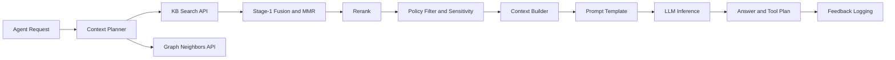

# 智能体集成（Agent_Integration）

> 文档状态：Final v1.0  
> 维护者：PowerX CoreX 团队  
> 上次更新：2025-10-13

---

## 1. 目标与原则

- **上下文即能力**：Agent 在推理/执行中，通过统一契约从知识库拉取可解释的上下文（文档片段、图谱扩展、结构化参数），增强回答质量与工具规划能力。
- **解耦**：Agent 不直接依赖底层存储与索引，实现仅面向 `/api/v1/knowledge/...` 与 `knowledge.v1` gRPC 契约。
- **可解释与可观测**：每次检索返回细粒度 `scores/explain` 字段；调用链贯穿 `trace_id / query_id`。
- **安全默认**：多租户、敏感级过滤、最小可引用单元（chunk 级）与审计全量落盘。
- **可回放与评测**：将「请求→候选池→最终注入」快照化，便于回放与离线评测。

---

## 2. 集成全景



> 说明：Agent 的 **Context Planner** 决定是否查询 KB/Graph、设置参数（`space_id/k/filters/profile_override`），并把返回的 Top-N 片段构造成**可插拔的 Prompt 块**（见 §4）。

---

## 3. Agent ⇄ 知识库：调用契约

### 3.1 HTTP（推荐给 PowerX Web Admin/前端 Agent 调试台）

- `GET /api/v1/knowledge/search`
  入参核心：`space_id`, `query`, `k`, `filters`, `rank_profile_override?`
  出参核心：`items[].{text_snippet, scores, explain, document_id, version_no, tags}`

- `GET /api/v1/knowledge/graph/neighbors`
  入参核心：`node_id`, `depth`, `limit`, `types[]?`
  出参核心：`center`, `neighbors[]`

> 统一请求头：`Authorization: Bearer <token>`，`X-Tenant-Id: <uuid>`。

### 3.2 gRPC（插件/服务侧 Agent）

- `knowledge.v1.KnowledgeService/Search`
- `knowledge.v1.KnowledgeService/GraphNeighbors`

> 认证与租户在拦截器注入：`authorization`, `x-tenant-id`。

---

## 4. 上下文注入（Context Injection）

### 4.1 标准上下文块（Context Block）

Agent 将从 KB 获得的候选组装为标准上下文块，**不强制格式**，推荐以下结构：

```json
{
  "context_id": "ctx_20251013_001",
  "space_id": "crm_docs",
  "query": "媒体存储如何配置",
  "top_n": 6,
  "chunks": [
    {
      "rank": 1,
      "document_id": "d_456",
      "version_no": 3,
      "snippet": "……（截断后的内容，避免超长）",
      "explain": "语义较强 + kb_spec 来源权重 + 近期更新",
      "scores": { "semantic": 0.91, "keyword": 0.62, "graph": 0.08, "rerank": 0.12 },
      "tags": ["media","config"],
      "source_link": "powerx://doc/d_456?v=3#c_123"  // 供 Admin/审计跳转
    }
  ]
}
```

> Agent 只应注入**必要的片段**（如 Top-6），并保留 `document_id/version_no` 以便审计与回放。

### 4.2 Prompt 片段拼装（建议）

- **Header**：任务说明 + 角色 + 风格
- **Context**：上述标准上下文块经格式化，强调“仅基于以下材料回答”
- **Constraints**：敏感级与禁止事项
- **Output Schema**：JSON 或 Markdown 结构
- **Reasoning Hints**：可选，避免过长

---

## 5. 查询策略与参数

### 5.1 基本策略

- **K 设置**：`k=8` 常用；开启 Rerank 时 `topk_rerank=20`，最终注入 6–8 条。
- **Hybrid 融合**：使用空间级 `rank_profile.semantic_weight`（默认 0.65）。
- **MMR 多样化**：开启文档级去冗余，避免同文档片段刷屏。
- **Graph Boost**：NER/规则识别到实体后，可 `graph_weight=0.15` 增益。

### 5.2 Profile 临时覆盖（高级）

如需在对话中临时调参（不修改空间默认 Profile）：

```
rank_profile_override:
  semantic_weight: 0.7
  mmr_beta: 0.6
  graph_weight: 0.2
  rerank: { enabled: true, topk: 20, provider: "cross-encoder/ms-marco-MiniLM-L-6-v2" }
```

> Planner 可根据用户问题类型（定义类/操作类/对比类）动态切换参数。

---

## 6. Workflow 集成（节点契约）

### 6.1 节点定义（YAML 示例）

```yaml
steps:
  - id: kb_prepare_context
    type: kb.search        # 内置节点类型：调用 /api/v1/knowledge/search
    inputs:
      space_id: "crm_docs"
      query: "{{inputs.user_query}}"
      k: 12
      filters:
        tags: ["media","config"]
    outputs:
      context: "$.items[0:8]"   # 选前 8 条

  - id: agent_answer
    type: agent.run
    inputs:
      prompt_template: "builtin:qa_with_context"
      context_blocks:
        - "@steps.kb_prepare_context.outputs.context"

  - id: kb_feedback
    type: kb.feedback      # 将用户“有用/无用”反馈回写
    when: "{{steps.agent_answer.outputs.need_feedback}}"
    inputs:
      query_id: "{{steps.kb_prepare_context.meta.query_id}}"
      chosen_chunk_ids: "{{steps.kb_prepare_context.outputs.context | map: 'chunk_id'}}"
      rating: "{{inputs.user_rating}}"
```

### 6.2 节点类型（建议）

- `kb.search`：封装搜索 + 记录 `query_id`、候选池
- `kb.graph`：按 `node_id/depth/limit` 获取邻居
- `kb.feedback`：把交互信号写回 `/feedback`
- `agent.run`：模型推理，接收 `context_blocks` 与工具计划

> 所有节点自动继承 `trace_id`，并把 `space_id/query_id` 透传至日志。

---

## 7. 解释性与可观测

### 7.1 Explain 字段

- `scores`：`semantic/keyword/recency/source_boost/sensitivity_penalty/feedback/rerank/graph`
- `explain`：人类可读摘要（面向 Admin/调参）
- Agent 可将 `explain` 压缩为审计日志项，而不必全部注入 Prompt。

### 7.2 遥测指标（建议）

- `agent_kb_hit_rate`：存在上下文注入的会话占比
- `agent_kb_tokens_ctx`：上下文 token 使用量分布
- `agent_kb_latency_ms{stage=search|rerank|graph}`
- `agent_answer_quality`：人工评分或用户反馈聚合（Top@3 命中率、CTR）

### 7.3 日志与回放

- 统一记录：`trace_id`, `query_id`, `space_id`, `profile_id/override`, 候选池快照、最终注入集合
- 回放命令（示例）：`px kb replay --query-id <id> --profile <ver>`
- 支持将同一 `query_id` 的不同注入策略离线对比。

---

## 8. 安全与合规

- **租户与空间隔离**：Agent 调用必须携带 `X-Tenant-Id`，并指明 `space_id`。
- **敏感级**：设置 `filters.sensitivity_max`；对高敏感内容启用**片段级脱敏**。
- **最小可引用**：仅注入必要片段，避免原文大段搬运。
- **可追溯**：保留 `document_id + version_no + chunk_id`；回答中可附“来源引用（可选）”。

---

## 9. 失败与降级策略

- **向量库不可用**：降级至关键词检索；`semantic_weight` 临时下调。
- **Rerank 超时**：使用 Stage-1 结果返回，并打降级标记。
- **结果为空**：启用 Query Rewriting（同义词/放宽过滤）重试一次；仍为空则返回「未找到」标准回答模版。
- **Graph 超时**：跳过增益，仅使用检索结果。

---

## 10. 评测与优化

### 10.1 数据集

- 业务种子集（FAQ/工单/政策问答）、人工标注 Top@K、对照答案。

### 10.2 离线评测

- 指标：Top@3/Top@5 命中率、MRR、nDCG、覆盖率、平均延迟。
- 配置：遍历 `semantic_weight / mmr_beta / graph_weight / rerank` 网格搜索。

### 10.3 在线 A/B

- 切流：按 `space_id/tenant_id`；周期 1–2 周。
- 观测：用户点击/评分、客服二次追问率、会话平均轮次。

---

## 11. 最佳实践清单

- ✅ 在 Planner 阶段将用户问题**类型化**（定义/流程/对比/定位），按类型选择召回与重排参数。
- ✅ 始终保留 6–8 条**短片段**（每条 ≤ ~350 tokens），并去重同文档相邻段。
- ✅ Prompt 中明确「仅基于上下文回答；如无依据请说明『未在知识库中找到』」。
- ✅ 对最后回答附带**可选来源列表**（文档标题与锚点），便于追溯。
- ✅ 使用 `rank_profile_override` 做**临时调参**，避免污染空间默认策略。
- ✅ 记录 `query_id` 与候选池，确保能回放与比较不同策略。

---

## 12. 附：Agent Prompt 模版（示例）

```text
# 角色
你是 PowerX 的企业知识助手。仅可基于“上下文材料”回答。

# 任务
回答用户问题；若上下文不足以支持，请明确说明“未在知识库中找到依据”。

# 上下文材料（只阅读，不要逐字复制）
{{#each context_blocks.chunks as |c i|}}
[{{inc i}}] 文档: {{c.document_id}}@v{{c.version_no}}  分数: {{c.scores.semantic}} / 解释: {{c.explain}}
片段:
{{c.snippet}}
---
{{/each}}

# 约束
- 严禁杜撰；引用事实需来自以上片段
- 如有冲突，以版本号较大的为准
- 不输出敏感数据（超出 sensitivity_max 的内容）

# 输出
- 简洁回答（最多 8 行）
- 如需要，可给出“建议下一步”与“可参考的文档锚点”
```

> 注：此模版仅示意，实际项目可用 JSON Schema 规定输出结构。

---

## 13. 参考接口（便于对照）

- 搜索：`GET /api/v1/knowledge/search`
- 图谱邻居：`GET /api/v1/knowledge/graph/neighbors`
- 反馈：`POST /api/v1/knowledge/feedback`
- gRPC：`knowledge.v1.KnowledgeService/{Search,GraphNeighbors}`
