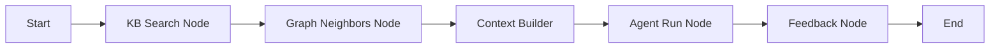
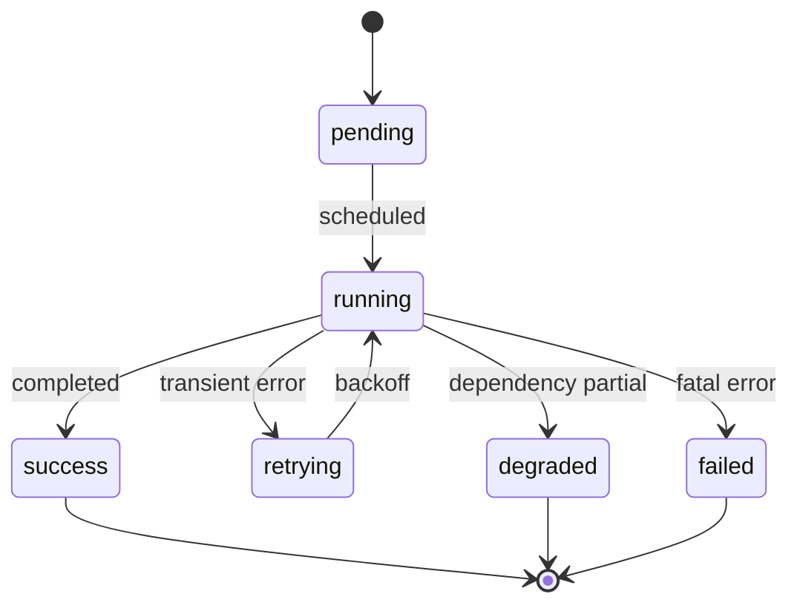

# 工作流上下文注入 Workflow_Context_Injection

> 文档状态：Final v1.0  
> 维护者：PowerX CoreX 团队  
> 上次更新：2025-10-13

---

## 1. 目标与原则

- **一等公民**：把知识检索與图谱扩展变成标准工作流节点，统一编排与审计。  
- **可解释与可回放**：所有节点产出带 `scores` 与 `explain` 字段，生成 `query_id` 用于回放。  
- **最小依赖**：仅依赖 `/api/v1/knowledge/...` 与 `knowledge.v1` 协议，解耦底层存储。  
- **幂等与降级**：节点支持幂等键、超时与降级策略，保障流程稳定。

---

## 2. 编排总览



> 说明：典型流程为 搜索 → 图谱拓展 → 合成上下文 → Agent 推理 → 反馈回写。各节点可按需裁剪或重排。

---

## 3. 节点类型与职责

| 节点类型  | 类型标识               | 主要职责              | 关键输出                                   |
| ----- | ------------------ | ----------------- | -------------------------------------- |
| 知识检索  | `kb.search`        | 调用 Hybrid 检索生成候选池 | `query_id`, `items[]`, `meta`          |
| 图谱邻居  | `kb.graph`         | 基于实体或概念拓展相关节点     | `center`, `neighbors[]`                |
| 上下文构建 | `kb.context.build` | 合并候选与图谱为注入块       | `context_blocks[]`                     |
| 智能体运行 | `agent.run`        | 以模板与上下文调用模型       | `answer`, `tool_plan`, `need_feedback` |
| 反馈回写  | `kb.feedback`      | 将评分与点击上报 KB       | `ack`                                  |

---

## 4. 节点契约

### 4.1 `kb.search`

**入参**

```yaml
space_id: string
query: string
k: int            # 默认 8
filters:
  tags: [string]?           # 可选
  source_types: [string]?   # 可选
  sensitivity_max: string?  # normal|high|critical
rank_profile_override: {}?   # 可选
timeout_ms: int?             # 默认 3000
```

**出参 `outputs`**

```yaml
query: string
query_id: string
top_n: int
items:
  - chunk_id: string
    document_id: string
    version_no: int
    text_snippet: string
    highlights: [string]
    score: float
    scores:
      semantic: float
      keyword: float
      recency: float
      source_boost: float
      sensitivity_penalty: float
      feedback: float
      rerank: float
      graph: float?
    explain: string
    tags: [string]
meta:
  space_id: string
  profile_id: string
  override_applied: bool
```

**行为**

- 调用：`GET /api/v1/knowledge/search`
- 失败降级：返回空集合并标记 `degraded=true`；可在后续节点判断。

---

### 4.2 `kb.graph`

**入参**

```yaml
node_id: string
depth: int          # 默认 1
limit: int          # 默认 50
types: [string]?    # entity|concept|document
timeout_ms: int?    # 默认 1500
```

**出参**

```yaml
center:
  id: string
  type: string
  name: string
  properties: {}
neighbors:
  - id: string
    type: string
    name: string
    weight: float?
    properties: {}
meta:
  used_depth: int
  used_limit: int
```

**行为**

- 调用：`GET /api/v1/knowledge/graph/neighbors`
- 失败降级：输出 `neighbors=[]`，不阻断流程。

---

### 4.3 `kb.context.build`

**入参**

```yaml
from_search: "$.steps.kb_search.outputs.items"     # 引用
from_graph:  "$.steps.kb_graph.outputs.neighbors"  # 引用，可为空
max_blocks:  6
max_tokens_per_block: 350
merge_policy:
  by_document: true          # 同文档多片段合并
  mmr_beta: 0.7              # 去冗余权衡
  graph_weight: 0.15         # 图谱增益
```

**出参**

```yaml
context_blocks:
  - rank: int
    document_id: string
    version_no: int
    snippet: string
    scores: {}
    explain: string
    tags: [string]
    source_link: string   # powerx://doc/<id>?v=<no>#<chunk>
stats:
  blocks: int
  tokens_est: int
```

**行为**

- 仅做组合与裁剪，不发起网络调用。
- 失败策略：若输入为空，返回 `context_blocks=[]` 并置 `stats.blocks=0`。

---

### 4.4 `agent.run`

**入参**

```yaml
model: string                 # 模型名或路由名
prompt_template: string       # 模板标识
context_blocks: "$.steps.kb_context.outputs.context_blocks"
system_vars: {}?              # 业务上下文变量
output_schema: string?        # 可选 JSON Schema
timeout_ms: int?              # 默认 6000
```

**出参**

```yaml
answer: string
tool_plan:
  - tool: string
    args: {}
    priority: int
need_feedback: bool
diagnostics:
  tokens_input: int
  tokens_output: int
  latency_ms: int
```

**行为**

- 将 `context_blocks` 作为独立段注入模板。
- 建议模板遵循 Agent_Integration 中的“仅基于上下文回答”约束。

---

### 4.5 `kb.feedback`

**入参**

```yaml
query_id: "$.steps.kb_search.outputs.query_id"
chosen_chunk_ids: "$.steps.kb_context.outputs.context_blocks | map: 'chunk_id'"
rating: int       # -1/0/1
comment: string?
user_id: string?
```

**出参**

```yaml
ack: true
```

**行为**

- 调用：`POST /api/v1/knowledge/feedback`
- 失败策略：不中断主流程，记录告警。

---

## 5. 节点状态机与重试



- **退避策略**：指数退避三次，适用于 429 和 5xx；4xx 直接失败。
- **幂等键**：对 `kb.search` 与 `kb.feedback` 可设置 `Idempotency-Key` 以去重。
- **降级标记**：`degraded=true` 时，后续节点可调整策略（如跳过 Rerank）。

---

## 6. 标准编排示例

```yaml
name: kb_enhanced_qa
steps:
  - id: kb_search
    type: kb.search
    inputs:
      space_id: "crm_docs"
      query: "{{inputs.user_query}}"
      k: 12
      filters: { tags: ["media","config"] }
      rank_profile_override:
        semantic_weight: 0.7
        mmr_beta: 0.6
        graph_weight: 0.15

  - id: kb_graph
    type: kb.graph
    when: "{{detect_entity(inputs.user_query)}}"
    inputs:
      node_id: "{{extract_entity_id(inputs.user_query)}}"
      depth: 1
      limit: 30

  - id: kb_context
    type: kb.context.build
    inputs:
      from_search: "$.steps.kb_search.outputs.items"
      from_graph: "$.steps.kb_graph.outputs.neighbors"
      max_blocks: 8
      max_tokens_per_block: 320

  - id: agent_answer
    type: agent.run
    inputs:
      model: "px.chat.default"
      prompt_template: "builtin:qa_with_context"
      context_blocks: "$.steps.kb_context.outputs.context_blocks"
      system_vars:
        locale: "zh-CN"

  - id: kb_fb
    type: kb.feedback
    when: "{{inputs.enable_feedback}}"
    inputs:
      query_id: "$.steps.kb_search.outputs.query_id"
      chosen_chunk_ids: "$.steps.kb_context.outputs.context_blocks | map: 'chunk_id'"
      rating: "{{inputs.user_rating}}"
```

---

## 7. 错误码对照与故障处理

| 场景   | HTTP 码 | 平台码示例  | 处理建议                              |
| ---- | ------ | ------ | --------------------------------- |
| 未认证  | 401    | 401001 | 终止，提示登录                           |
| 权限不足 | 403    | 403001 | 终止，提示权限                           |
| 速率限制 | 429    | 429000 | 重试退避；必要时降级                        |
| 参数错误 | 400    | 400xxx | 终止，回显参数                           |
| 依赖失败 | 5xx    | 500xxx | 重试退避；若搜索失败可返回空候选并 `degraded=true` |

---

## 8. 观测与审计

- **指标建议**

  - `wf_kb_search_latency_ms`、`wf_kb_graph_latency_ms`、`wf_agent_latency_ms`
  - `wf_kb_degraded_total`、`wf_kb_retry_total`
  - `wf_kb_topk_hit_rate`、`wf_agent_feedback_rate`
- **日志字段**

  - `trace_id`, `workflow_run_id`, `query_id`, `space_id`, `profile_id`, `override_hash`
  - 候选池快照与最终注入集合摘要（避免落敏感原文）
- **审计**

  - 记录操作者、输入概要、输出摘要与影响范围（命中文档计数）

---

## 9. 安全与合规

- 强制在所有外呼时携带 `JWT claims（tid/tenant_uuid）` 与细粒度权限。
- 对上限 `sensitivity_max` 之外的片段做截断或隐藏。
- 上下文注入仅包含必要最小片段，遵循最小可引用单元。
- 对外呈现可选“来源列表”（文档 ID 与锚点），便于审计追溯。

---

## 10. FAQ

- **Q：检索为空时要不要调用 Agent？**
  A：可调用模板的“未命中回答”分支，明确告知未在知识库找到依据，并建议用户补充信息。

- **Q：什么时候启用图谱增益？**
  A：当 Query 命中实体或概念时；或当语义召回分布稀薄、主题不明确时。

- **Q：如何控制上下文长度？**
  A：`max_blocks` 与 `max_tokens_per_block` 双阈控制；优先保留高分且互异的片段。

- **Q：如何做在线调参？**
  A：优先使用 `rank_profile_override`，不要修改空间默认配置；与 A/B 结合观察指标。

---

## 11. 参考接口

- 搜索：`GET /api/v1/knowledge/search`
- 图谱邻居：`GET /api/v1/knowledge/graph/neighbors`
- 反馈：`POST /api/v1/knowledge/feedback`
- gRPC：`knowledge.v1.KnowledgeService/{Search,GraphNeighbors}`
